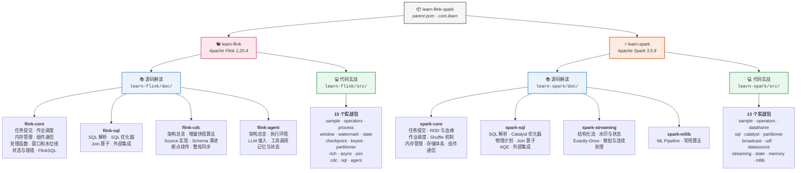
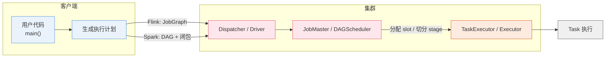

<div align="center">


&nbsp;&nbsp;&nbsp;&nbsp;&nbsp;&nbsp;


# learn-flink-spark

**Flink / Spark 源码研读与实战学习工程**

<p>
  
  
  
  
  
</p>

</div>

---

## 📖 这是什么

一个用于**系统学习大数据计算引擎**的 Maven 多模块工程。两条主线并行推进：

- **源码研读** —— 以 Flink 1.20 源码为主线，逐模块拆解内核机制，笔记沉淀在 `learn-flink/doc/`；
- **动手实战** —— 每个模块提供最小可运行示例，方便打断点、改代码、验证猜想。

> 设计原则：**每个结论都要能在源码里指到具体类和方法**，不写"大概是这样"的笔记。

---

## 🗂 项目图

每个引擎都沿**两条轴**推进：`doc/` 做**源码解读**，`src/` 做**代码实战**。
源码结论落到笔记，笔记结论用代码验证——两条轴互相咬合。

### 总览



### 双轴规模

| 引擎 | 源码解读 `doc/` | 代码实战 `src/` |
|---|---|---|
| **Apache Flink** | 4 个分层 · **23** 个主题 | **15** 个实战包 |
| **Apache Spark** | 4 个分层 · **19** 个主题 | **13** 个实战包 |

---

### 🐿️ Apache Flink

#### 源码解读 —— `learn-flink/doc/`

| 分层 | 主题 |
|---|---|
| **[`flink-core/`](./learn-flink/doc/flink-core/)** | 任务提交 ✅ · 作业调度 · 内存管理 · 组件通信 · 处理函数 · 窗口和水位线 · 状态与容错 · FlinkSQL |
| **[`flink-sql/`](./learn-flink/doc/flink-sql/)** | SQL 解析 · SQL 优化器 · Join 算子 · 外部集成 |
| **[`flink-cdc/`](./learn-flink/doc/flink-cdc/)** | 架构总览 · 增量快照算法 · Source 实现 · Schema 演进 · 断点续传与容错 · 整库同步 |
| **[`flink-agent/`](./learn-flink/doc/flink-agent/)** | 架构总览 · 执行环境 · LLM 接入 · 工具调用 · 记忆与状态 |

<details>
<summary><b>各主题的源码切入点</b></summary>

| 分层 | 主题 | 源码切入点 |
|---|---|---|
| flink-core | 任务提交 | `CliFrontend` → `PipelineExecutor` → `Dispatcher` → `JobMaster` |
| flink-core | 作业调度 | `DefaultScheduler`、`PipelinedRegionSchedulingStrategy`、`SlotPool` |
| flink-core | 内存管理 | `MemoryManager`、`NetworkBufferPool`、`TaskManagerMemorySpec` |
| flink-core | 组件通信 | `flink-rpc`（`RpcEndpoint` / `RpcGateway` / Pekko 实现） |
| flink-core | 处理函数 | `StreamOperator`、`OperatorChain`、`OneInputStreamTask` |
| flink-core | 窗口和水位线 | `WindowOperator`、`WindowAssigner`、`WatermarkOutput` |
| flink-core | 状态与容错 | `KeyedStateBackend`、`CheckpointCoordinator`、`StateBackendLoader` |
| flink-core | FlinkSQL | `TableEnvironmentImpl`、`StreamGraph` 衔接、`flink-table-runtime` |
| flink-sql | SQL 解析 | `flink-sql-parser`、`SqlNode`、Calcite `Parser.jj` |
| flink-sql | SQL 优化器 | `flink-table-planner`、`RelOptRule`、`FlinkRelOptTable` |
| flink-sql | Join 算子 | `StreamingJoinOperator`、`LookupJoinRunner`、`IntervalJoinOperator` |
| flink-sql | 外部集成 | `DynamicTableFactory`、`Catalog`、`flink-connector-*` |
| flink-cdc | 架构总览 | `flink-cdc` 仓库：`Source` / `Event` / `Split` 模型 |
| flink-cdc | 增量快照算法 | 无锁快照、chunk 切分与并行快照 |
| flink-cdc | Source 实现 | FLIP-27 `SplitEnumerator` / `SourceReader` 拆分 |
| flink-cdc | Schema 演进 | DDL 变更捕获与下游兼容 |
| flink-cdc | 断点续传与容错 | offset 持久化、重启恢复 |
| flink-cdc | 整库同步 | Pipeline Connector |
| flink-agent | 架构总览 | Agent / Event / Action / Channel / Runner |
| flink-agent | 执行环境 | `AgentsExecutionEnvironment` 与 Flink 作业的映射 |
| flink-agent | LLM 接入 | `ChatModel` / `ChatSetup` |
| flink-agent | 工具调用 | `Tool` 定义与参数绑定 |
| flink-agent | 记忆与状态 | Agent 记忆与 Flink State 的结合 |

</details>

#### 代码实战 —— `learn-flink/src/main/java/com/learn/flink/`

每个包下都有 `package-info.java` 写明练习要点。

| 包 | 内容 | 对应笔记 | 状态 |
|---|---|---|---|
| `sample/` | 快速开始：最小可运行作业 | `flink-core/job-submit` | ✅ 已实现 |
| `operators/` | 基础算子 | `flink-core/functions` | ⬜ |
| `process/` | ProcessFunction：定时器、侧输出流 | `flink-core/functions` | ⬜ |
| `window/` | WindowFunction | `flink-core/window-watermark` | ⬜ |
| `watermark/` | WaterMark 与事件时间 | `flink-core/window-watermark` | ⬜ |
| `state/` | State：Keyed / Operator State、TTL | `flink-core/state-fault-tolerance` | ⬜ |
| `checkpoint/` | CheckPoint 与 Savepoint | `flink-core/state-fault-tolerance` | ⬜ |
| `keyed/` | KeyedFunction | `flink-core/functions` | ⬜ |
| `partitioner/` | Partitioner 与重分区 | `flink-core/scheduling` | ⬜ |
| `rich/` | RichFunction 生命周期 | `flink-core/functions` | ⬜ |
| `async/` | AsyncFunction 异步 IO | `flink-core/functions` | ⬜ |
| `join/` | 双流 Join | `flink-sql/join` | ⬜ |
| `cdc/` | Flink CDC 接入 | `flink-cdc/architecture` | ⬜ |
| `sql/` | Flink SQL 实战 | `flink-sql/optimizer` | ⬜ |
| `agent/` | Flink Agent 实战 | `flink-agent/architecture` | ⬜ |

---

### ⚡ Apache Spark

#### 源码解读 —— `learn-spark/doc/`

| 分层 | 主题 |
|---|---|
| **[`spark-core/`](./learn-spark/doc/spark-core/)** | 任务提交 · RDD 与血缘 · 作业调度 · Shuffle 机制 · 内存管理 · 存储体系 · 组件通信 |
| **[`spark-sql/`](./learn-spark/doc/spark-sql/)** | SQL 解析 · Catalyst 优化器 · 物理计划 · Join 算子 · 自适应执行 · 外部集成 |
| **[`spark-streaming/`](./learn-spark/doc/spark-streaming/)** | 结构化流 · 水印与状态 · Exactly-Once · 微批与连续处理 |
| **[`spark-mllib/`](./learn-spark/doc/spark-mllib/)** | ML Pipeline · 常用算法 |

<details>
<summary><b>各主题的源码切入点</b></summary>

| 分层 | 主题 | 源码切入点 |
|---|---|---|
| spark-core | 任务提交 | `spark-submit` → `SparkSubmit` → `SparkContext` → `CoarseGrainedSchedulerBackend` |
| spark-core | RDD 与血缘 | `RDD`、`Dependency`（窄/宽）、`checkpoint` 与重算 |
| spark-core | 作业调度 | `DAGScheduler`、`TaskSchedulerImpl`、`Stage` 切分 |
| spark-core | Shuffle 机制 | `SortShuffleManager`、`ShuffleWriter`、`ShuffleBlockFetcherIterator` |
| spark-core | 内存管理 | `UnifiedMemoryManager`、`MemoryStore`、Tungsten 序列化 |
| spark-core | 存储体系 | `BlockManager`、`StorageLevel`、`Broadcast` |
| spark-core | 组件通信 | `RpcEnv`、Netty 实现、Driver/Executor 心跳 |
| spark-sql | SQL 解析 | ANTLR 语法 → `Unresolved Logical Plan` |
| spark-sql | Catalyst 优化器 | `Analyzer`、`Optimizer`、`Rule` / `RuleExecutor`、`Strategy` |
| spark-sql | 物理计划 | `SparkPlanner`、`WholeStageCodegenExec`、`Tungsten` |
| spark-sql | Join 算子 | `BroadcastHashJoin`、`SortMergeJoin`、`ShuffledHashJoin` |
| spark-sql | 自适应执行 | `AdaptiveSparkPlanExec`、`CoalesceShufflePartitions` |
| spark-sql | 外部集成 | `DataSourceV2`、`TableProvider`、`Catalog` |
| spark-streaming | 结构化流 | `StreamExecution`、`IncrementalExecution` |
| spark-streaming | 水印与状态 | `EventTimeWatermark`、`StateStore` |
| spark-streaming | Exactly-Once | `OffsetLog`、`CommitLog`、幂等 Sink |
| spark-streaming | 微批与连续处理 | `MicroBatchExecution`、`ContinuousExecution` |
| spark-mllib | ML Pipeline | `Transformer` / `Estimator` / `Pipeline` |
| spark-mllib | 常用算法 | 分类、回归、聚类、协同过滤 |

</details>

#### 代码实战 —— `learn-spark/src/main/java/com/learn/spark/`

| 包 | 内容 | 对应笔记 | 状态 |
|---|---|---|---|
| `sample/` | 快速开始：RDD + SQL 最小作业 | `spark-core/job-submit` | ✅ 已实现 |
| `operators/` | 基础算子：transformation / action | `spark-core/rdd-lineage` | ⬜ |
| `dataframe/` | DataFrame / Dataset 与 Encoder | `spark-sql/planner` | ⬜ |
| `sql/` | Spark SQL：DDL/DML、窗口函数 | `spark-sql/catalyst` | ⬜ |
| `catalyst/` | 执行计划四阶段对照 | `spark-sql/catalyst` | ⬜ |
| `partitioner/` | 分区与 Shuffle 调优 | `spark-core/shuffle` | ⬜ |
| `broadcast/` | 广播变量与累加器 | `spark-core/storage` | ⬜ |
| `udf/` | UDF / UDAF / Pandas UDF | `spark-sql/planner` | ⬜ |
| `datasource/` | 数据源集成 | `spark-sql/datasource` | ⬜ |
| `streaming/` | Structured Streaming | `spark-streaming/structured-streaming` | ⬜ |
| `state/` | 状态与水印 | `spark-streaming/watermark-state` | ⬜ |
| `memory/` | 内存管理与调优 | `spark-core/memory` | ⬜ |
| `mllib/` | MLlib 实战 | `spark-mllib/pipelines` | ⬜ |

---

### 目录结构

```
learn-flink-spark/
├── pom.xml                          # 父 POM：模块聚合 + 版本集中管理
├── README.md
├── assets/                          # Apache Flink / Spark 官方 logo
│
├── learn-flink/                     # ══ Apache Flink 1.20.4 ══
│   ├── pom.xml
│   ├── doc/                         # ── 轴一：源码解读 ──
│   │   ├── README.md                #    笔记总索引
│   │   ├── assets/                  #    ── 图仓库：所有 drawio 源文件 + PNG 导出 ──
│   │   │   ├── job-submission-flow.drawio / .png      # 任务提交全流程图
│   │   │   └── three-graphs-comparison.drawio / .png  # 三张图并排对照
│   │   ├── flink-core/              #    内核（7 主题）
│   │   │   ├── README.md            #      组成说明 + 各文件作用 + 源码入口
│   │   │   ├── job-submit/          #      ✅ 任务提交（已完成，只放 .md）
│   │   │   │   ├── job-submission-yarn-per-job.md     # 主线文档
│   │   │   │   ├── three-graphs-wordcount.md          # 三张图对照
│   │   │   │   └── job-submission-all-modes.md        # 早期笔记
│   │   │   ├── scheduling/          #      ✅ 作业调度 + Slot 分配 + failover（已完成）
│   │   │   ├── memory/              #      内存管理
│   │   │   ├── rpc/                 #      组件通信
│   │   │   ├── functions/           #      处理函数
│   │   │   ├── window-watermark/    #      窗口和水位线
│   │   │   └── state-fault-tolerance/ #    状态与容错
│   │   ├── flink-sql/               #    SQL 层（4 主题）
│   │   ├── flink-cdc/               #    CDC（6 主题）
│   │   └── flink-agent/             #    Agent（5 主题）
│   └── src/main/                    # ── 轴二：代码实战 ──
│       ├── java/com/learn/flink/    #    15 个实战包（每个含 package-info.java）
│       │   ├── sample/              #      ✅ 快速开始（已实现）
│       │   ├── operators/  process/  window/  watermark/
│       │   ├── state/  checkpoint/  keyed/  partitioner/
│       │   ├── rich/  async/  join/  cdc/  sql/  agent/
│       └── resources/log4j2.properties
│
└── learn-spark/                     # ══ Apache Spark 3.5.8 ══
    ├── pom.xml
    ├── doc/                         # ── 轴一：源码解读 ──
    │   ├── README.md
    │   ├── spark-core/              #    内核（7 主题）
    │   │   ├── job-submit/  rdd-lineage/  scheduler/
    │   │   └── shuffle/  memory/  storage/  rpc/
    │   ├── spark-sql/               #    SQL 层（6 主题）
    │   ├── spark-streaming/         #    流处理（4 主题）
    │   └── spark-mllib/             #    机器学习（2 主题）
    └── src/main/                    # ── 轴二：代码实战 ──
        ├── java/com/learn/spark/    #    13 个实战包
        │   ├── sample/              #      ✅ 快速开始（已实现）
        │   ├── operators/  dataframe/  sql/  catalyst/
        │   ├── partitioner/  broadcast/  udf/  datasource/
        │   └── streaming/  state/  memory/  mllib/
        └── resources/log4j2.properties
```

> 每个 `doc/<分层>/<主题>/` 下的 `.gitkeep` 只是占位，动手写第一篇笔记时替换成 `.md` 即可。
> 每个 Java 包的 `package-info.java` 里写了该包的练习要点与对应笔记路径。

---

## 🏗 架构图

两个引擎在**分层结构上高度同构**，对照着看能更快建立全局认知：

<table>
  <thead>
    <tr>
      <th width="16%">层次</th>
      <th width="42%">
        
        Apache Flink 1.20
      </th>
      <th width="42%">
        
        Apache Spark 3.5
      </th>
    </tr>
  </thead>
  <tbody>
    <tr>
      <td><b>API 层</b></td>
      <td>DataStream API<br/>Table API &amp; SQL</td>
      <td>RDD API<br/>DataFrame / Dataset &amp; Spark SQL</td>
    </tr>
    <tr>
      <td><b>执行计划</b></td>
      <td>
        Transformation<br/>
        → StreamGraph<br/>
        → <b>JobGraph</b>（算子链在此生成）<br/>
        → ExecutionGraph
      </td>
      <td>
        RDD lineage（血缘）<br/>
        → DAG Scheduler<br/>
        → <b>Stage</b>（按宽/窄依赖切分）<br/>
        → TaskSet
      </td>
    </tr>
    <tr>
      <td><b>运行时</b></td>
      <td>
        Dispatcher<br/>
        JobMaster（调度 + checkpoint）<br/>
        TaskExecutor（执行 Task）
      </td>
      <td>
        Driver（调度 + 血缘恢复）<br/>
        Executor（执行 Task）<br/>
        <i>无内置 checkpoint 协调器</i>
      </td>
    </tr>
    <tr>
      <td><b>数据交换</b></td>
      <td>算子链内直传 + 网络栈（ResultPartition / InputGate）</td>
      <td>Stage 内 pipeline + shuffle（宽依赖）</td>
    </tr>
    <tr>
      <td><b>资源管理</b></td>
      <td>ResourceManager<br/><i>YARN / K8s / Standalone</i></td>
      <td>Cluster Manager<br/><i>YARN / K8s / Standalone</i></td>
    </tr>
    <tr>
      <td><b>容错</b></td>
      <td>Checkpoint / Savepoint<br/>（Chandy-Lamport 变体 + 状态后端）</td>
      <td>RDD 血缘重算<br/>（Checkpoint / WAL 可选）</td>
    </tr>
  </tbody>
</table>

### 一次作业的提交链路（并行对照）



> ⚠️ 上图是**概念对照**，两者细节差异很大（例如 Flink 的 JobGraph 在客户端生成，Spark 的 stage 切分由 Driver 的 DAGScheduler 完成）。详细差异见 `learn-flink/doc/job-submit/`。

---

## 📦 模块说明

| 模块 | 引擎 | 版本 | 内容 |
|---|---|---|---|
| `learn-flink` | Apache Flink | 1.20.4 | 源码研读笔记（`doc/`）+ DataStream 示例（`src/`） |
| `learn-spark` | Apache Spark | 3.5.8 | RDD / Spark SQL 示例（`src/`） |

### 版本矩阵

| 组件 | 版本 | 说明 |
|---|---|---|
| Apache Flink | `1.20.4` | 1.x 最后一个稳定系列，与所研读的源码分支 `release-1.20` 对应 |
| Apache Spark | `3.5.8` | 3.5 LTS 系列 |
| Scala | `2.12` | Spark 3.5 的默认发行版 |
| JDK | `11`（编译目标） | 本地 JDK 17 亦可运行，但 Spark 需要 `--add-opens`，见下文 |
| Maven | `3.8+` | 实测 3.9.16 |

---

## 🚀 快速开始

### 1. 编译整个工程

```bash
mvn clean compile
```

### 2. 运行 Flink 示例

```bash
mvn -pl learn-flink compile exec:exec
```

> ⚠️ 必须用 `exec:exec`，**不能用 `exec:java`**。
> Flink 本地执行会自建 `FlinkUserCodeClassLoader` 做 child-first 类加载，
> 而 `exec:java` 跑在 Maven 自己的 JVM / 插件类加载器里，
> 会报 `ClassNotFoundException: org.apache.flink.api.common.ExecutionConfig`。
> `exec:exec` 会派生一个独立的真实 JVM。

预期输出（WordCount 是增量输出的，所以同一个单词会打印多次）：

```
(flink,1)
(spark,1)
(flink,2)
(spark,2)
(flink,3)
(flink,4)
(hello,1)
(big,1)
(data,1)
(flink,5)
(and,1)
(spark,3)
```

最终结果：`flink=5`、`spark=3`，其余各 1。

> 日志里会出现一段 `Matching resource requirements against available resources. / Missing resources: ...`
> 这是 `FineGrainedSlotManager` 的 INFO 级诊断输出（TaskManager 注册 slot 前的瞬间快照），
> **不是错误**。它正好对应研读笔记中「slot 分配」那一节。

### 3. 运行 Spark 示例

```bash
mvn -pl learn-spark compile exec:exec
```

JDK 17 需要的 `--add-opens` 参数已经写在 `learn-spark/pom.xml` 里，**无需手工设置 `MAVEN_OPTS`**。

预期输出：

```
========== RDD WordCount ==========
data -> 1
flink -> 5
hello -> 1
spark -> 3
big -> 1
and -> 1
========== Spark SQL WordCount ==========
+-----+-----+
| word|total|
+-----+-----+
|flink|    4|
|spark|    2|
+-----+-----+
```

同时会打印 DataFrame 的 Parsed / Analyzed / Optimized / **Physical Plan**，方便对照 Catalyst 优化器的四个阶段。

### 4. 只构建某个模块

```bash
mvn -pl learn-flink clean compile     # 只构建 Flink 模块
mvn -pl learn-spark  clean compile    # 只构建 Spark 模块
mvn -pl learn-flink -am clean compile # 连同父 POM 一起构建
```

### 5. 在 IDE 里调试

直接用 IDE 运行两个 `main` 方法即可。Flink 示例会自动起本地 MiniCluster
（client 与 JM/TM 同 JVM），是跟提交链路断点最方便的方式。

---

## 📚 学习路线

### ✅ 已完成

| 内容 | 位置 |
|---|---|
| **Flink 任务提交全流程**（per-job 为主线，端到端） | [`learn-flink/doc/flink-core/job-submit/`](./learn-flink/doc/flink-core/job-submit/) |
| **Flink 作业调度与执行全流程**（DefaultScheduler / Slot 分配 / TaskExecutor） | [`learn-flink/doc/flink-core/scheduling/`](./learn-flink/doc/flink-core/scheduling/) |
| Flink 最小可运行作业 | `learn-flink/src/main/java/com/jiaqiz/flink/sample/WordCountJob.java` |
| Spark RDD + SQL 最小可运行作业 | `learn-spark/src/main/java/com/jiaqiz/spark/sample/WordCountApp.java` |

### 🐿️ Flink 推进顺序

按「**提交 → 调度 → 运行 → 状态**」的依赖顺序推进，每一步都能接上前一步：

- [x] `flink-core/job-submit` —— 任务提交
- [x] `flink-core/scheduling` —— 作业调度（ExecutionGraph、Slot 分配、failover）
- [ ] `flink-core/rpc` —— 组件通信（JobManager / TaskManager 之间怎么说话）
- [ ] `flink-core/memory` —— 内存管理（托管内存与网络缓冲）
- [ ] `flink-core/functions` —— 处理函数（StreamOperator 与算子链）
- [ ] `flink-core/window-watermark` —— 窗口和水位线
- [ ] `flink-core/state-fault-tolerance` —— 状态与容错（Checkpoint / Savepoint）
- [ ] `flink-core/sql` —— FlinkSQL 与 DataStream 的衔接
- [ ] `flink-sql/*` —— 解析 → 优化器 → Join → 外部集成
- [ ] `flink-cdc/*` —— CDC 架构、增量快照、容错
- [ ] `flink-agent/*` —— Agent 框架

### ⚡ Spark 推进顺序

- [ ] `spark-core/job-submit` —— 任务提交与 Driver/Executor 角色
- [ ] `spark-core/rdd-lineage` —— RDD 与血缘（Spark 容错的根基）
- [ ] `spark-core/scheduler` —— DAGScheduler 与 Stage 切分
- [ ] `spark-core/shuffle` —— Shuffle 机制
- [ ] `spark-core/memory` / `storage` —— 内存管理与存储体系
- [ ] `spark-sql/*` —— 解析 → Catalyst → 物理计划 → Join → AQE
- [ ] `spark-streaming/*` —— 结构化流与状态
- [ ] `spark-mllib/*` —— 机器学习（可选）

### 🔀 对照专题

两条线推进到一定深度后，做横向对比会很有收获：

- [ ] Flink Checkpoint（Chandy-Lamport 变体） **vs** Spark 血缘重算 —— 两种容错哲学
- [ ] Flink JobGraph 算子链 **vs** Spark Stage 内 pipeline —— 两种减少 shuffle 的思路
- [ ] Flink SQL 优化器 **vs** Spark Catalyst —— 都是 Calcite 血统，规则集与代价模型的差异
- [ ] Flink 背压（credit-based） **vs** Spark 内存溢出 —— 流式与微批的压力反馈机制

---

## 🛠 常见问题

<details>
<summary><b>Flink 报 <code>ClassNotFoundException: org.apache.flink.api.common.ExecutionConfig</code></b></summary>

用了 `exec:java`。它跑在 Maven 自己的 JVM / 插件类加载器里，与 Flink 的 child-first
类加载机制冲突。改用 `exec:exec`（已在本工程配置好）：

```bash
mvn -pl learn-flink compile exec:exec
```
</details>

<details>
<summary><b>Spark 启动报 <code>IllegalAccessError</code> / <code>InaccessibleObjectException</code></b></summary>

JDK 17 的模块强封装导致。本工程已把官方要求的 13 个 `--add-opens` 写进
`learn-spark/pom.xml` 的 `exec:exec` 配置，正常无需处理。

若你在 IDE 里直接运行，需要在 Run Configuration 的 VM options 里补上同一组参数
（可从 pom 里直接复制）。
</details>

<details>
<summary><b>Spark 报 <code>SLF4J: Failed to load class "org.slf4j.impl.StaticMDCBinder"</code></b></summary>

`spark-core` 的传递依赖 `avro:1.11.5` 会带入 `slf4j-api:1.7.36`，
而 Spark 3.5 用的是面向 slf4j 2.x 的 `log4j-slf4j2-impl`。
本工程已在 `learn-spark/pom.xml` 中显式声明 `slf4j-api:2.0.7` 覆盖传递版本。
</details>

<details>
<summary><b>Flink 日志太多，看不到关键信息</b></summary>

改 `learn-flink/src/main/resources/log4j2.properties` 的 `rootLogger.level`。
调成 `DEBUG` 可以看到完整提交链路日志。
</details>

<details>
<summary><b>IDE 里直接 run 和 <code>mvn exec:exec</code> 行为不一致</b></summary>

两者都会走本地执行路径，但 `StreamExecutionEnvironment.getExecutionEnvironment()`
在不同上下文返回的实例不同（CLI 下是 `StreamContextEnvironment`，IDE 下是本地环境）。
详见研读笔记中「上下文环境注入」一节。
</details>

---

## 📄 关于 Logo

`assets/` 下的 Apache Flink、Apache Spark 图标来自两个项目的官方网站，
版权归 Apache 软件基金会所有，此处仅用于标识所学习的技术，遵循各自项目的商标使用规范：

- Apache Flink® 是 Apache 软件基金会的注册商标 — <https://flink.apache.org/>
- Apache Spark® 是 Apache 软件基金会的注册商标 — <https://spark.apache.org/>

---

<div align="center">
<sub>Built for learning · 每个结论都能指到源码的具体类和方法</sub>
</div>
