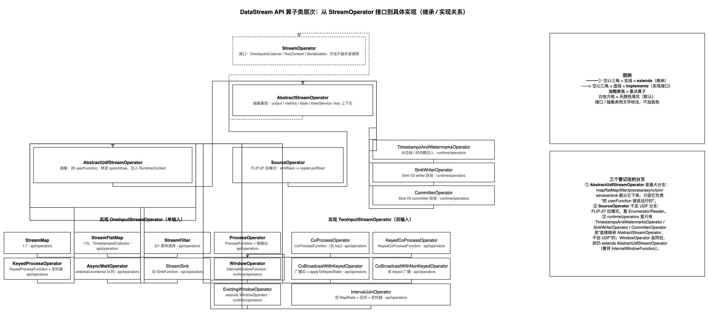
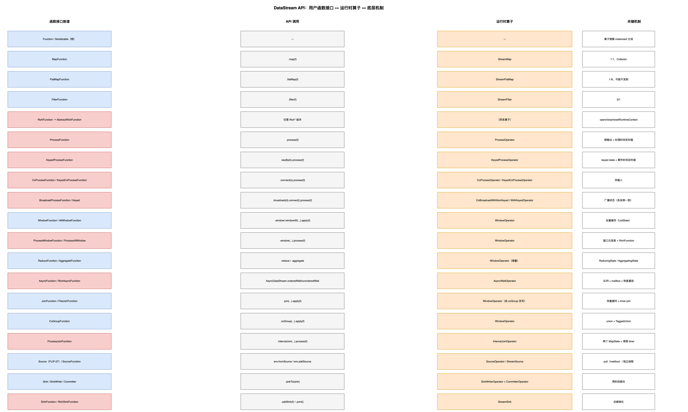

# DataStream API 总体架构：从一次算子调用到 TM 上的执行

> **代码基线**：Apache Flink 1.20.4　**源码位置**：仓库根目录 `flink-1.20-source/`
> **配套图**：[`datastream-api-architecture.drawio`](../../assets/datastream-api-architecture.drawio) · [`function-operator-mapping.drawio`](../../assets/function-operator-mapping.drawio) · [`source-sink-architecture.drawio`](../../assets/source-sink-architecture.drawio)
> **导航**：[`README.md`](./README.md)　**原始清单**：[`todolist`](./todolist)

---

# 一、一句话界定

> **你在 `DataStream` 上调用的每一个算子，都只是在往一张"逻辑 DAG"（`Transformation`）上加节点；这张 DAG 再被翻译成 `StreamGraph`、合并成 `JobGraph`、展开成 `ExecutionGraph`，最终在 TM 上变成一个个 `StreamOperator`，由 `StreamTask` 的 mailbox 线程驱动。**

本篇讲清**这条链路上每一步的对象形态与职责边界**，并给出"函数接口 → 运行时算子"的总映射；每个算子大类的实现细节见各自的子文档。

## 1.1 五层结构

```
① API 层（本主题的主体）
   DataStream / SingleOutputStreamOperator / KeyedStream / WindowedStream
   ConnectedStreams / BroadcastConnectedStream / JoinedStreams / CoGroupedStreams / AsyncDataStream
   └─ 每次算子调用 → 注册一个 Transformation
        ↓
② 逻辑图（Transformation DAG，客户端）
   OneInputTransformation / TwoInputTransformation / PartitionTransformation /
   SourceTransformation / SinkTransformation / LegacySourceTransformation / LegacySinkTransformation …
        ↓  StreamGraphGenerator（含算子链的**前置**处理）
③ StreamGraph（客户端，仍是"逻辑图 + 虚拟分区节点"）
        ↓  StreamingJobGraphGenerator（**算子链在这里合并**）
④ JobGraph（客户端产出 → 作为提交信封送到集群）
        ↓  DefaultExecutionGraphBuilder.buildGraph（AM 侧）
⑤ ExecutionGraph（JobMaster 内）→ ExecutionVertex/Execution
        ↓  调度（见 doc/flink-core/scheduling/）
⑥ 运行时：StreamTask 的 mailbox 线程
   OperatorChain → 每个算子一个 StreamOperator（StreamMap/StreamFilter/ProcessOperator/WindowOperator/…）
```

| 层 | 谁创建 | 生命周期 | 关键类 |
|---|---|---|---|
| ① API | 用户代码 | 客户端 JVM | `DataStream` 及其子类 |
| ② Transformation | API 层内部 | 客户端 JVM | `Transformation`（`flink-core/.../api/dag/Transformation.java`） |
| ③ `StreamGraph` | `StreamGraphGenerator` | 客户端 JVM | `StreamGraph`、`StreamNode`、`StreamEdge` |
| ④ `JobGraph` | `StreamingJobGraphGenerator` | 客户端 → AM | `JobGraph`、`JobVertex`、`JobEdge` |
| ⑤ `ExecutionGraph` | `DefaultExecutionGraphBuilder` | **仅 AM** | `ExecutionJobVertex` / `ExecutionVertex` / `Execution` |
| ⑥ 运行时算子 | 各 `createStreamOperator` 工厂 | **仅 TM** | `StreamOperator` 实现类 |

> ⚠️ **三个最常混淆的点**：
> ① **`DataStream` 不是"数据"，是"图的句柄"** —— 它持有 `Transformation`，本身不存任何数据。
> ② **算子链在 ④ 的生成过程中合并**（`StreamingJobGraphGenerator`），所以 `JobVertex` 数 ≠ 算子数。
> ③ **`ExecutionGraph` 在 1.20 是接口**，实现是 `DefaultExecutionGraph`；运行时算子与它完全不同层。


## 1.2 算子类层次架构图（抽象 → 实现）



> 图源文件：[`datastream-api-architecture.drawio`](../../assets/datastream-api-architecture.drawio)（改图后重新导出同名 PNG 即可）
>
> **这张图回答「运行时算子到底怎么分层、谁继承谁」**，而不是"把名字堆成一层"：
> - **实线空心三角 = `extends`（继承）**，**虚线空心三角 = `implements`（实现接口）**；`StreamOperator` 是接口、`AbstractStreamOperator` / `AbstractUdfStreamOperator` 是抽象类（用文字标注区分，不加底色）；
> - **加粗类名 = 重点算子**；所有方框**无颜色填充**（白底黑框）。
> - **三个分叉**：① `AbstractUdfStreamOperator`（最大分支：map/flatMap/filter/process/async/join/window/sink 都从它下来）；② `SourceOperator`（FLIP-27，**不走 UDF 分支**，拉模式）；③ `runtime/operators` 下直接继承 `AbstractStreamOperator` 的 `TimestampsAndWatermarksOperator` / `SinkWriterOperator` / `CommitterOperator`。
> - 具体算子按**输入接口**分列（`OneInputStreamOperator` 单输入 / `TwoInputStreamOperator` 双输入），类名后标注所属包（`api/operators` vs `runtime/operators`）。
>
> 而"一次算子调用从 API 层走到 TM"的五层旅程（`DataStream` → `Transformation` DAG → `StreamGraph` → `JobGraph` → `ExecutionGraph` → 运行时）见 §1.1 的文字版。

---

# 二、API 层的对象谱系

## 2.1 六个"流对象"

| 对象 | 由谁产生 | 含义 | 能调什么 |
|---|---|---|---|
| `DataStream<T>` | `env.fromData/fromSource/addSource` 或上一个算子 | 普通流 | 所有 transformation + `keyBy` + `windowAll` + `join`/`coGroup`/`connect` |
| `SingleOutputStreamOperator<T>` | **任何会产生算子的 transformation**（`map`/`flatMap`/`filter`/`process`/…） | 带"算子"的流，能读侧输出 | 同上 + `getSideOutput(tag)`（`SingleOutputStreamOperator.java#L402`） |
| `KeyedStream<T,K>` | `keyBy(...)`（`DataStream.java#L293`） | 已按 key 分区 | `reduce`/`aggregate`/`process(KeyedProcessFunction)`（`KeyedStream.java#L386`）+ `window`（`#L773`）+ `intervalJoin`（`#L440`） |
| `WindowedStream<T,K,W>` / `AllWindowedStream<T,W>` | `window(...)` / `windowAll(...)`（`DataStream.java#L848`） | 已按 (key, window) 分组 | `reduce`/`aggregate`/`process`/`apply` |
| `ConnectedStreams<IN1,IN2>` | `connect(...)` | 两条流共享一个算子 | `process`（`ConnectedStreams.java#L309` / `#L373`） |
| `BroadcastConnectedStream` / `JoinedStreams` / `CoGroupedStreams` | `connect(broadcastStream)` / `join(...)`（`#L749`）/ `coGroup(...)`（`#L741`） | 特定双流语义 | 各自的 `process` / `apply` |

## 2.2 一次算子调用发生了什么（以 `map` 为例）

```java
// 概念链路（每一步都会往 DAG 里加/改东西）
stream.map(f)
  → DataStream.transform(name, outType, operatorFactory)      // 建 SingleOutputStreamOperator
    → new OneInputTransformation<>(this.transformation, name, operatorFactory, outType, parallelism)
      → 返回 new SingleOutputStreamOperator<>(env, transformation)   // 只是句柄
```

**关键认识**：`map` 阶段**没有任何数据流动、没有算子实例化**（算子实例是 TM 侧才创建的），客户端只是登记了"这里有个 `StreamMap` 工厂 + 用户函数 + 输出类型 + 并行度"。

`keyBy` 更特别 —— 它连算子都不产生，只加一个**虚拟分区节点**：

```java
// KeyedStream.java#L128
    public KeyedStream(
            DataStream<T> dataStream,
            KeySelector<T, KEY> keySelector,
            TypeInformation<KEY> keyType) {
        this(
                dataStream,
                new PartitionTransformation<>(
                        dataStream.getTransformation(),
                        new KeyGroupStreamPartitioner<>(
                                keySelector,
                                StreamGraphGenerator.DEFAULT_LOWER_BOUND_MAX_PARALLELISM)),
                keySelector,
                keyType);
    }
```

---

# 三、三大部分：Source / Operator / Sink

**任何 DataStream 作业都是这三段的组合**，而且三者在架构上是**同构的**——都是 `StreamOperator`，只是链式策略与 Task 类型不同。

## 3.1 Source

| | 新 API（FLIP-27） | 旧 API |
|---|---|---|
| 接口 | `Source` + `SplitEnumerator` + `SourceReader` | `SourceFunction` / `RichParallelSourceFunction` |
| 运行时算子 | `SourceOperator` | `StreamSource` |
| Task | `SourceOperatorStreamTask` | `SourceStreamTask` |
| 线程模型 | mailbox 线程内 pull（`emitNext` → `reader.pollNext`） | 独立线程 push（用户 `run(ctx)`） |

详见 [`sources-and-sinks.md`](./sources-and-sinks.md)。

## 3.2 Operator（中间算子）

| 家族 | 运行时算子 | 文档 |
|---|---|---|
| 基础算子（map/flatMap/filter） | `StreamMap` / `StreamFlatMap` / `StreamFilter` | [`basic-functions.md`](./basic-functions.md) |
| Process 家族 | `ProcessOperator` / `KeyedProcessOperator` / `CoProcessOperator` / `CoBroadcastWith*Operator` | [`process-functions.md`](./process-functions.md) |
| 窗口 | `WindowOperator` / `EvictingWindowOperator` | [`window-functions.md`](./window-functions.md) |
| Join | `IntervalJoinOperator` + 窗口 join（走 `WindowOperator`） | [`join-functions.md`](./join-functions.md) |
| 异步 | `AsyncWaitOperator` | [`async-io.md`](./async-io.md) |
| 分区（非算子） | 无算子，只有 `PartitionTransformation` + `StreamPartitioner` | [`keyby-and-partitioners.md`](./keyby-and-partitioners.md) |

## 3.3 Sink

| | 新 API（Sink V2） | 旧 API |
|---|---|---|
| 接口 | `Sink` + `SinkWriter`（+ `StatefulSink` / `TwoPhaseCommittingSink` / `Committer`） | `SinkFunction` / `RichSinkFunction` |
| 运行时算子 | writer 阶段 `SinkWriterOperator` + committer 阶段 `CommitterOperator` | `StreamSink` |
| 入口 | `sinkTo(Sink)`（`DataStream.java#L1308`） | `addSink(SinkFunction)`（`#L1255`）、`print()`（`#L956`） |

详见 [`sources-and-sinks.md`](./sources-and-sinks.md) 与 [`connectors.md`](./connectors.md)。

---

# 四、函数族谱：`Function` → 富函数 → 运行时算子

## 4.1 根接口与"富"化

```
Function（Serializable 标记）
├── RichFunction（+ open/close/getRuntimeContext）→ AbstractRichFunction
│     ├── RichMapFunction / RichFlatMapFunction / RichFilterFunction / RichReduceFunction / RichAggregateFunction
│     ├── RichSourceFunction / RichParallelSourceFunction / RichSinkFunction
│     ├── RichAsyncFunction
│     ├── RichWindowFunction / RichAllWindowFunction / RichProcessWindowFunction / RichProcessAllWindowFunction
│     └── ProcessFunction 家族（都直接 extends AbstractRichFunction）
├── MapFunction / FlatMapFunction / FilterFunction / ReduceFunction / AggregateFunction / KeySelector / Partitioner
└── SourceFunction（旧）/ SinkFunction（旧）
```

生命周期由 `FunctionUtils` 按 `instanceof` 分派（`FunctionUtils.java#L31`），算子侧转发（`AbstractUdfStreamOperator.java#L99`）。详见 [`rich-functions.md`](./rich-functions.md)。

## 4.2 函数 → 运行时算子（总映射）



> 图源文件：[`function-operator-mapping.drawio`](../../assets/function-operator-mapping.drawio)

| 用户写法 | 函数接口 | 运行时算子 | 关键机制 |
|---|---|---|---|
| `.map(f)` | `MapFunction` | `StreamMap` | 1:1，`Collector` |
| `.flatMap(f)` | `FlatMapFunction` | `StreamFlatMap` | 1:N，`Collector` |
| `.filter(f)` | `FilterFunction` | `StreamFilter` | 0/1，`Collector` |
| `.process(f)` | `ProcessFunction` | `ProcessOperator` | 侧输出、处理时间定时器 |
| `.keyBy(k).process(f)` | `KeyedProcessFunction` | `KeyedProcessOperator` | keyed state + 事件时间定时器 |
| `.connect(s).process(f)` | `CoProcessFunction` / `KeyedCoProcessFunction` | `CoProcessOperator` / `KeyedCoProcessOperator` | 双输入 |
| `.connect(bs).process(f)` | `BroadcastProcessFunction` / `KeyedBroadcastProcessFunction` | `CoBroadcastWithNonKeyedOperator` / `CoBroadcastWithKeyedOperator` | 广播状态 |
| `.window(...).apply(f)` / `.process(f)` | `WindowFunction` / `ProcessWindowFunction` | `WindowOperator`（+ `EvictingWindowOperator`） | `(key, window)` 状态 + timer |
| `.windowAll(...).process(f)` | `ProcessAllWindowFunction` | `WindowOperator`（`keyBy(常量)` + 非并行） | 并行度恒 1 |
| `AsyncDataStream.orderedWait/unorderedWait` | `AsyncFunction` / `RichAsyncFunction` | `AsyncWaitOperator` | 队列 + mailbox + 重放 |
| `.join(...).apply(f)` | `JoinFunction` / `FlatJoinFunction` | `WindowOperator`（由 coGroup 改写） | 双重循环 |
| `.coGroup(...).apply(f)` | `CoGroupFunction` | `WindowOperator` | union + tag |
| `.intervalJoin(...).process(f)` | `ProcessJoinFunction` | `IntervalJoinOperator` | 两个 `MapState` + 清理 timer |
| `env.fromSource(s,...)` | `Source`（FLIP-27） | `SourceOperator` | pull 模式 |
| `env.addSource(sf)` | `SourceFunction` | `StreamSource` | 独立线程 |
| `.sinkTo(sink)` | `Sink` / `SinkWriter` | `SinkWriterOperator` + `CommitterOperator` | 两阶段提交 |
| `.addSink(sf)` / `.print()` | `SinkFunction` | `StreamSink` | 总被链化 |

---

# 五、运行时：`StreamTask` + `OperatorChain` + `StreamOperator`

## 5.1 一个 Task 里有什么

```
StreamTask（mailbox 线程，一个 Task 一个）
 └── OperatorChain
      ├── StreamOperator 1（如 StreamMap）   ← 用户函数在这里被调
      ├── StreamOperator 2（如 StreamFilter）  ← 链内直传，不过网络
      └── RecordWriterOutput → ResultPartition（断链处才写网络）
```

算子链的合并规则（详见 [`scheduling`](../scheduling/job-scheduling-and-execution.md) 2.2 与 [`job-submit/three-graphs-wordcount.md`](../job-submit/three-graphs-wordcount.md)）：

```java
// StreamingJobGraphGenerator.java#L1758
        // 条件 3（partitioner 层面）：只有 ForwardPartitioner 能链。
        // 其余 partitioner —— hash / rebalance / rescale / broadcast / custom ——
        // 都意味着"按某种规则把数据分发到下游不同 subtask"，
        // 这必须经由 ResultPartition/InputChannel 的网络栈，链内直传无法表达。
        if (partitioner instanceof ForwardForConsecutiveHashPartitioner) {
            checkState(isDynamicGraph);
            return true;
        } else if ((partitioner instanceof ForwardPartitioner)
                && exchangeMode != StreamExchangeMode.BATCH) {
            return true;
        } else {
            return false;
        }
```

**链内一条记录怎么走**（无序列化、无网络）：

```
上游算子.collect(record)
  → ChainingOutput.collect
    → pushToOperator(record)                    // ChainingOutput.java#L100
      → recordProcessor.accept(record)          // 无 key context 时就是 input::processElement
        → 下游算子.processElement(record)
```

## 5.2 mailbox：所有算子共享一条线程

```java
// StreamTask.java#L414（构造期把 processInput 作为默认动作）
            this.mailboxProcessor =
                    new MailboxProcessor(
                            this::processInput, mailbox, actionExecutor, mailboxMetricsControl);
```

```java
// StreamTask.java#L637（默认动作：拉一批数据处理）
    protected void processInput(MailboxDefaultAction.Controller controller) throws Exception {
        DataInputStatus status = inputProcessor.processInput();
        switch (status) {
            case MORE_AVAILABLE:
                if (taskIsAvailable()) {
                    return;
                }
                break;
```

**为什么重要**：定时器触发（`tryAdvanceWatermark`）、异步结果回填（`AsyncWaitOperator` 的 `processInMailbox`）、网络邮件、checkpoint 邮件**全部排在一条 mailbox 队列**上，靠 `shouldInterrupt` 互相让位。这解释了：

- 为什么异步 I/O 的 `capacity` 满了要 `mailboxExecutor.yield()` 而不是阻塞线程；
- 为什么"定时器风暴"不会饿死网络；
- 为什么 `SourceReader` 里**不能**另起线程 collect。

## 5.3 数据交换：从 `Partitioner` 到 channel

```
StreamPartitioner（API 层声明）
  → StreamGraph 的虚拟分区节点（StreamGraph.java#L570 addVirtualPartitionNode）
    → JobGraph 的 JobEdge + DistributionPattern（isPointwise() 决定 POINTWISE / ALL_TO_ALL）
      → 运行时：StreamTask 把 partitioner 装进 RecordWriter 当 ChannelSelector
        → RecordWriter.emit(record) → channelSelector.selectChannel(record)   // ChannelSelectorRecordWriter.java#L42
          → targetPartition.emitRecord(..., targetSubpartition)                // RecordWriter.java#L105
```

未指定分区器时的默认规则：

```java
// StreamGraph.java#L684
        if (partitioner == null
                && upstreamNode.getParallelism() == downstreamNode.getParallelism()) {
            partitioner =
                    dynamic ? new ForwardForUnspecifiedPartitioner<>() : new ForwardPartitioner<>();
        } else if (partitioner == null) {
            partitioner = new RebalancePartitioner<Object>();
        }
```

详见 [`keyby-and-partitioners.md`](./keyby-and-partitioners.md)。

---

# 六、三条贯穿全篇的机制

## 6.1 类型信息：为什么 lambda 常常"退化"

- API 层的每个算子都要推断**输出类型**（决定序列化器）；lambda 在泛型擦除后常退化成 `GenericType`，于是运行期用 Kryo 序列化（慢、且某些类型不支持）。
- 解决办法：`.returns(Types.TUPLE(Types.STRING, Types.INT))`、`.returns(MyPojo.class)`，或让函数是具名类（`TypeExtractor` 能拿到泛型实参）。

| 场景 | 后果 |
|---|---|
| 返回 `Tuple2` 但没 `returns` | 退化成 `GenericType` → Kryo |
| 返回 POJO（public 字段 + 无参构造） | `TypeExtractor` 可识别为 `PojoTypeInfo` |
| `flatMap` 输出多类型 | 必须显式 `returns`，否则运行期才报错 |

## 6.2 Keyed state 与定时器

| 机制 | 入口 | 底层 |
|---|---|---|
| keyed state | `getRuntimeContext().getState(...)`（`StreamingRuntimeContext.java#L245` 有前置校验） | `KeyedStateStore` → `(key, namespace)` 结构 |
| 定时器（Process） | `ctx.timerService().registerEventTimeTimer(t)` | `InternalTimerServiceImpl`：key group 分片优先队列 + 水位线推进触发 |
| 定时器（Window） | 由 `WindowOperator` 自己注册 | 同一个 `InternalTimerService`（名 `"window-timers"`） |
| 侧输出 | `ctx.output(tag, v)` | `OutputTag` 相等的 `RecordWriterOutput` 认领 |

> ⚠️ **非 keyed 流上注册定时器会抛 `UnsupportedOperationException`**（`ProcessOperator.java#L117`）；窗口/Process 的定时器都需要 key 上下文。

## 6.3 并行度与 key group 解耦

```
key → murmurHash(hashCode) % maxParallelism = keyGroup        // KeyGroupRangeAssignment.java#L50
keyGroup → keyGroup * parallelism / maxParallelism = subtask
```

`maxParallelism` 定了不能改（改了 state 恢复不了），`parallelism` 随便调 —— 这是 rescale 恢复的前提。

---

# 七、易错点小结（跨子文档）

| # | 易错点 | 正解 |
|---|---|---|
| 1 | 在非 keyed 流上用 `getState` / 注册定时器 | 抛异常；必须 `keyBy` |
| 2 | 以为 `windowAll` 能并行 | 内部 `keyBy(常量)` + `forceNonParallel()`，并行度恒 1 |
| 3 | 以为 `join` 有独立算子 | 是 `coGroup` + 双重循环（inner join 来自"空集合不执行循环体"） |
| 4 | 以为异步 I/O 必须先 `keyBy` | 误传；`AsyncDataStream` 只接受 `DataStream` |
| 5 | 在 `AsyncFunction` 里用状态/累加器 | `RichAsyncFunction` 的 context 把它们全抛 `UnsupportedOperationException` |
| 6 | 同时覆写 `open(Configuration)` 与 `open(OpenContext)` | 两者都会被调用；只覆写 `open(OpenContext)` |
| 7 | 用 `Sink.createWriter(InitContext)` | 1.20 已弃用且不会被调用，改 `createWriter(WriterInitContext)` |
| 8 | 用 Kafka/JDBC 连接器时忘了 `flink-connector-base` | 官方连接器把它声明为 `provided`，须显式引入 |
| 9 | 以为 HBase 连接器支持 1.20 | 官方版本止于 `4.0.0-1.19`（基于 Flink 1.18.1） |
| 10 | `keyBy(...)` 之后再 `rebalance()` | 抛 `Cannot override partitioning for KeyedStream.` |

---

# 八、配套 demo 总览

所有 demo 都可用同一种方式运行：

```bash
mvn -o -pl learn-flink exec:exec -Dmain.class=com.jiaqiz.flink.<pkg>.<Demo>
```

| 包 | demo | 覆盖 |
|---|---|---|
| `operators/` | `BasicFunctionsDemo`、`DataStreamStructureDemo` | 三个基本函数；API 对象结构（`DataStream` → `KeyedStream` → `WindowedStream` → `DataStreamSink`） |
| `process/` | `ProcessFunctionDemo`、`CoProcessFunctionDemo`、`BroadcastProcessFunctionDemo` | Process / CoProcess / 广播状态 |
| `window/` | `WindowFunctionsDemo`、`WindowAssignersDemo`、`WindowAggregateDemo` | 四个函数接口、分配器/触发器/驱逐器、增量聚合 |
| `rich/` | `RichFunctionDemo` | `open`/`close`、`RuntimeContext`、状态、累加器与指标 |
| `async/` | `AsyncFunctionDemo`、`RichAsyncFunctionDemo` | ordered vs unordered、线程池复用 |
| `join/` | `WindowJoinDemo`、`CoGroupDemo`、`IntervalJoinDemo` | 三类 join 对照 |
| `keyed/` `partitioner/` | `KeyedStreamDemo`、`PartitionerDemo` | keyBy 三种写法、keyGroup、七种分区器 |
| `source/` `sink/` | `CustomSourceDemo`、`LegacySourceFunctionDemo`、`CustomSinkDemo`、`LegacySinkFunctionDemo`、`JdbcSourceSinkDemo`、`KafkaConnectorDemo` | FLIP-27 Source 三段式、旧 Source/Sink、Sink V2、FileSink、JDBC 闭环、Kafka 配置 |

真实运行输出见各子文档的最后一节。

## 8.1 demo 验证状态总表（诚实标注）

本主题每个算子都有配套可运行 demo。**下表是按真实执行结果填写的**，不是"设计目标"：

| demo | 覆盖 | 验证级别 |
|---|---|---|
| `operators/BasicFunctionsDemo` | `map` / `flatMap` / `filter` × 三种写法、flatMap 当 filter、类型推断对照 | ✅ **实跑通过**（exit 0） |
| `operators/DataStreamStructureDemo` | `DataStream` → `KeyedStream` → `WindowedStream` → `DataStreamSink` 对象链 | ✅ **实跑通过** |
| `rich/RichFunctionDemo` | `open`/`close` per subtask、`RuntimeContext`、keyed `ValueState`、累加器 | ✅ **实跑通过** |
| `process/ProcessFunctionDemo` | 侧输出、非 keyed 注册定时器被拒、事件时间/处理时间定时器 | ✅ **实跑通过** |
| `process/CoProcessFunctionDemo` | 双流 `ValueState` 关联 + 超时清理 | ✅ **实跑通过** |
| `process/BroadcastProcessFunctionDemo` | `MapStateDescriptor` 广播维表补全 | ✅ **实跑通过** |
| `window/WindowAssignersDemo` | 滚动/滑动/会话/`windowAll` + `Trigger` + `Evictor` | ✅ **实跑通过** |
| `window/WindowFunctionsDemo` | `WindowFunction` / `AllWindowFunction` / `ProcessWindowFunction` + 迟到数据 | ✅ **实跑通过** |
| `window/WindowAggregateDemo` | `reduce` / `aggregate` / `aggregate+Functions` | ✅ **实跑通过** |
| `async/AsyncFunctionDemo` | `orderedWait` vs `unorderedWait`、timeout、capacity | ✅ **实跑通过** |
| `async/RichAsyncFunctionDemo` | `RichAsyncFunction` 线程池 `open` 建 / `close` 关 | ✅ **实跑通过** |
| `join/WindowJoinDemo` | `JoinFunction` / `FlatJoinFunction`（inner 语义、笛卡尔积） | ✅ **实跑通过** |
| `join/CoGroupDemo` | `CoGroupFunction` 的 left/right/full outer | ✅ **实跑通过** |
| `join/IntervalJoinDemo` | `intervalJoin` + `ProcessJoinFunction`、跨窗口边界 | ✅ **实跑通过** |
| `keyed/KeyedStreamDemo` | 四种 `keyBy` 重载、keyGroup 三跳、`reduce`/`sum`/`max`/POJO 字段 | ✅ **实跑通过** |
| `partitioner/PartitionerDemo` | 八个分区器分布对照（**跑两遍**区分确定/随机） | ✅ **实跑通过** |
| `source/CustomSourceDemo` | 从零实现 FLIP-27 `Source` + `SplitEnumerator` + `SourceReader` | ✅ **实跑通过** |
| `source/LegacySourceFunctionDemo` | `RichParallelSourceFunction` 旧 API | ✅ **实跑通过** |
| `sink/CustomSinkDemo` | Sink V2 `Sink`/`SinkWriter` + `FileSink` 真落盘 | ✅ **实跑通过** |
| `sink/LegacySinkFunctionDemo` | `RichSinkFunction` 旧 API | ✅ **实跑通过** |
| `source/JdbcSourceSinkDemo` | 原生 JDBC + SQLite，写入→读回闭环 | ✅ **实跑通过** |
| `source/KafkaConnectorDemo` | `KafkaSource` / `KafkaSink` builder 链 | ✅ 编译 + 跳过模式运行（**未连 broker**） |
| Kafka / HBase / MySQL 连接器代码 | 见 [`connectors.md`](./connectors.md) | 📄 文档级（**未验证**） |

**本机跑不了的，以及原因**（不掩饰）：

| 缺什么 | 影响 |
|---|---|
| Kafka broker（本机无、无 Docker） | `KafkaConnectorDemo` 只走到"依赖与 builder 链解析成功" |
| MySQL 实例 + **Maven 离线**（拉不到 `flink-connector-jdbc`） | MySQL 连接器只有文档级代码 |
| **Flink 1.20 根本没有 HBase 连接器**（止于 `4.0.0-1.19`） | HBase 只有"用原生 Client 自写"的路线，无官方 jar |
| Docker 未安装 | 无法用 testcontainers 起外部系统 |

统一的运行方式：

```bash
mvn -o -pl learn-flink exec:exec -Dmain.class=com.jiaqiz.flink.<pkg>.<Demo>
```
