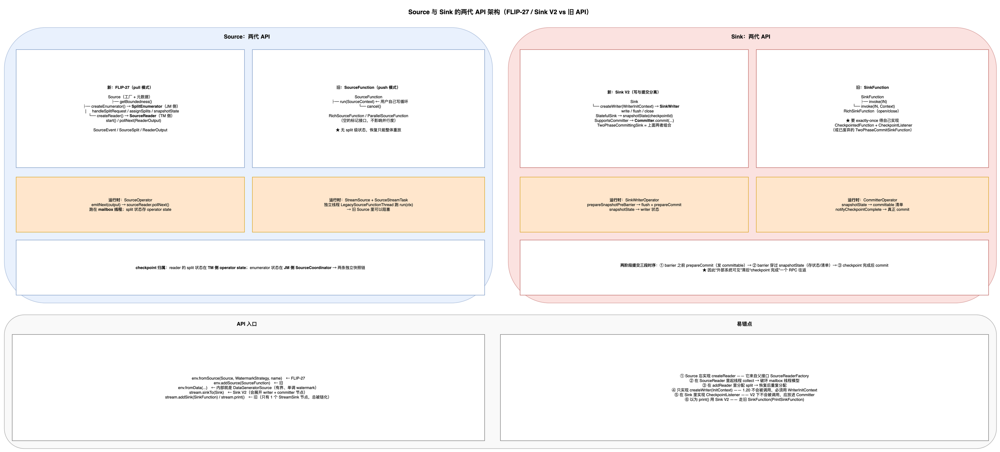

# Source 与 Sink 的架构与底层实现（FLIP-27 · Sink V2 · 旧 API）

> **代码基线**：Apache Flink 1.20.4　**源码位置**：仓库根目录 `flink-1.20-source/`
> **配套 demo**：`learn-flink/src/main/java/com/jiaqiz/flink/source/`、`.../sink/`
> **上级文档**：[`datastream-api-architecture.md`](./datastream-api-architecture.md)　**导航**：[`README.md`](./README.md)




> 图源文件：[`source-sink-architecture.drawio`](../../assets/source-sink-architecture.drawio)

---

# 一、Source：两代 API 的分野

| | FLIP-27 新 API | 旧 API（`SourceFunction`） |
|---|---|---|
| 入口 | `env.fromSource(source, watermarkStrategy, name)` | `env.addSource(sourceFunction)` |
| 拆分 | **三段式**：`Source`（工厂）+ `SplitEnumerator`（JM 侧切分分配）+ `SourceReader`（TM 侧拉取） | 一个函数里自己写 `while` 循环 |
| 分片状态 | split 级快照，可做分片重分配 | 无（只能整体重放） |
| 线程模型 | 全程在 **mailbox 线程**内（pull 模式） | 独立线程跑用户 `run()` |
| 运行时算子 | `SourceOperator`（`SJ/operators/SourceOperator.java#L101`） | `StreamSource` + `SourceStreamTask`（`SJ/runtime/tasks/SourceStreamTask.java#L67`） |

> ⚠️ **三个不存在的类名**（全树 `find` 核实）：`SourceReaderOperator`（实物 `SourceOperator`）、`SourceFunctionStreamTask`（实物 `SourceStreamTask`）、`LegacySinkFunction`（旧 Sink 直接用 `StreamSink` 包装）。

## 1.1 FLIP-27 的核心接口

```java
// Source.java#L33 与 #L41/#L51/#L77/#L85
public interface Source<T, SplitT extends SourceSplit, EnumChkT> extends SourceReaderFactory<T, SplitT>
    Boundedness getBoundedness();
    SplitEnumerator<SplitT, EnumChkT> createEnumerator(SplitEnumeratorContext<SplitT> enumContext) throws Exception;
    SplitEnumerator<SplitT, EnumChkT> restoreEnumerator(SplitEnumeratorContext<SplitT> enumContext, EnumChkT checkpoint) throws Exception;
    SimpleVersionedSerializer<SplitT> getSplitSerializer();
    SimpleVersionedSerializer<EnumChkT> getEnumeratorCheckpointSerializer();
```

```java
// SourceReaderFactory.java#L25
    SourceReader<T, SplitT> createReader(SourceReaderContext readerContext) throws Exception;
```

```java
// SourceReader.java#L56
public interface SourceReader<T, SplitT extends SourceSplit>
        extends AutoCloseable, CheckpointListener {
    /**
     * Start the reader.
     */
    void start();

    /**
     * Poll the next available record into the {@link ReaderOutput}.
     *
     * <p>The implementation must make sure this method is called from a single thread.
     */
    InputStatus pollNext(ReaderOutput<T> output) throws Exception;
```

| 接口 | 位置 | 关键方法 |
|---|---|---|
| `SplitEnumerator<SplitT, CheckpointT>` | `#L34` | `start()` `#L42`、`handleSplitRequest(int, String)` `#L52`、`addSplitsBack(...)` `#L61`、`addReader(int)` `#L68`、`snapshotState(long)` `#L90` |
| `SplitEnumeratorContext<SplitT>` | `#L42` | `currentParallelism()` `#L79`、`assignSplits(SplitsAssignment)` `#L107`、`signalNoMoreSplits(int)` `#L128`、`callAsync(...)` `#L145`、`runInCoordinatorThread(...)` `#L184` |
| `SourceReaderContext` | `#L28` | `getIndexOfSubtask()` `#L43`、`sendSplitRequest()` `#L50`、`sendSourceEventToCoordinator(...)` `#L57` |
| `ReaderOutput<T>` | `#L42` | 继承 `SourceOutput`（→ `WatermarkOutput`）；`createOutputForSplit(String)` `#L109`、`releaseOutputForSplit(String)` `#L116` |
| `SourceSplit` / `Boundedness` / `SourceEvent` | `#L25` / `#L28` / `#L27` | `splitId()`；`BOUNDED`（`#L42`）/ `CONTINUOUS_UNBOUNDED`（`#L54`） |

> ⚠️ **`Source` 本身没有 `createReader`** —— 它来自父接口 `SourceReaderFactory`。写自定义 Source 时**必须把这套方法集全部实现**（`DataGeneratorSource` 就是这么做的）。
>
> ⚠️ **`SourceReader` 必须按 split 建输出**（`createOutputForSplit`）：否则 checkpoint 时 split 边界与 record 对不上。

## 1.2 旧 `SourceFunction` 家族

| 类型 | 位置 | 方法 |
|---|---|---|
| `SourceFunction<T>` | `SJ/api/functions/source/SourceFunction.java#L103` | `run(SourceContext<T>)` `#L120`、`cancel()` `#L152`；`SourceContext` `#L164`（`collect` `#L178`、`collectWithTimestamp` `#L187`、`emitWatermark` `#L197`、`getCheckpointLock` `#L218`） |
| `RichSourceFunction<OUT>` | `#L51` | 富版本 |
| `ParallelSourceFunction<OUT>` | `#L38` | **空标记接口**，不参与运行时分派（1.20 里所有 `SourceFunction` 都跑在 `SourceStreamTask` 上） |
| `RichParallelSourceFunction<OUT>` | `#L40` | 富版本 + 可并行标记 |

---

# 二、Source 如何变成运行时算子

## 2.1 三段链路

```java
// DataStreamSource.java#L91 / #L58
// FLIP-27 构造器 → new SourceTransformation<>(sourceName, source, watermarkStrategy, outTypeInfo, ...)   // L99
// 旧构造器     → new LegacySourceTransformation<>(sourceName, operator, outTypeInfo, ..., boundedness, false) // L67
```

```java
// StreamGraphGenerator.java#L187
        tmp.put(SourceTransformation.class, new SourceTransformationTranslator<>());
        ...
        tmp.put(LegacySourceTransformation.class, new LegacySourceTransformationTranslator<>());
```

```java
// SourceTransformationTranslator.java#L73 / #L82
        new SourceOperatorFactory<>(transformation.getSource(), transformation.getWatermarkStrategy(), emitProgressiveWatermarks)
        streamGraph.addSource(transformationId, slotSharingGroup, ..., operatorFactory, null, transformation.getOutputType(), "Source: " + transformation.getName())
```

```java
// StreamGraph.java#L308 / #L370
//   addSource(...)      → addOperator(..., SourceOperatorStreamTask.class)   // L324
//   addLegacySource(...) → addOperator(...)                                   // L336：不传 task 类
        Class<? extends TaskInvokable> invokableClass = operatorFactory.isStreamSource() ? SourceStreamTask.class : OneInputStreamTask.class;
```

Task 类型分派只看 `operatorFactory.isStreamSource()`：FLIP-27 的 `SourceOperatorFactory#L154` 恒 `true`；旧路径靠 `SimpleOperatorFactory#L101` 判断 `operator instanceof StreamSource`。

## 2.2 `SourceOperator` 是"拉模式"算子

```java
// SourceOperator.java#L427
    @Override
    public DataInputStatus emitNext(DataOutput<OUT> output) throws Exception {
        // guarding an assumptions we currently make due to the fact that certain classes
        // assume a constant output, this assumption does not need to stand if we emitted all
        // records. In that case the output will change to FinishedDataOutput
        assert lastInvokedOutput == output
                || lastInvokedOutput == null
                || this.operatingMode == OperatingMode.DATA_FINISHED;

        // short circuit the hot path. Without this short circuit (READING handled in the
        // switch/case) InputBenchmark.mapSink was showing a performance regression.
        if (operatingMode != OperatingMode.READING) {
            return emitNextNotReading(output);
        }

        InputStatus status;
        do {
            status = sourceReader.pollNext(currentMainOutput);
        } while (status == InputStatus.MORE_AVAILABLE
                && canEmitBatchOfRecords.check()
                && !shouldWaitForAlignment());
        return convertToInternalStatus(status);
    }
```

| 环节 | 说明 |
|---|---|
| `initReader()`（`#L259`） | 匿名实现 `SourceReaderContext`（`#L266`）：`sendSplitRequest` → `RequestSplitEvent`，`sendSourceEventToCoordinator` → `SourceEventWrapper`；最后 `sourceReader = readerFactory.apply(context)`（`#L323`） |
| `open()`（`#L331`） | 重启时 `sourceReader.addSplits(splits)`，然后 `registerReader()`（`#L366`）、`sourceReader.start()`（`#L370`） |
| checkpoint | split 状态存在 SourceOperator 的 **operator state**（`SPLITS_STATE_DESC`，`#L570`）；`snapshotState`（`#L546`）→ `sourceReader.snapshotState`；`notifyCheckpointComplete`（`#L578`）转发给 reader |
| 线程模型 | 全程在 mailbox 线程（`StreamTask.processInput` `#L637` 的默认 action 反复调 `emitNext`）；`SourceOperatorStreamTask`（`#L60`）把 `SourceOperator` 包成 `StreamTaskSourceInput`（`StreamTaskSourceInput#L68` 直接返回 `operator.emitNext(output)`） |

## 2.3 旧 API 是"推模式 + 独立线程"

```java
// StreamSource.java#L100
        this.ctx =
                StreamSourceContexts.getSourceContext(
                        timeCharacteristic,
                        getProcessingTimeService(),
                        lockingObject,
                        collector,
                        watermarkInterval,
                        -1,
                        emitProgressiveWatermarks);

        try {
            userFunction.run(ctx);
        } finally {
            if (latencyEmitter != null) {
                latencyEmitter.close();
            }
        }
```

`SourceStreamTask.processInput`（`#L185`）先 `controller.suspendDefaultAction()`，再在**独立线程** `LegacySourceFunctionThread`（`#L71`）里跑用户 `run(ctx)`（`#L195`）—— 所以旧 Source 里可以阻塞。

> ⚠️ **不要在 `SourceReader` 里另起线程 `collect`**：FLIP-27 source 的产出必须发生在 mailbox 线程（`pollNext` 内），否则破坏 mailbox 模型与 checkpoint 对齐。

## 2.4 Enumerator 侧的协调器

`SourceCoordinator`（`SourceCoordinator.java#L98`）实现 `OperatorCoordinator`：`start()` `#L212`、`notifyCheckpointComplete` → `enumerator.notifyCheckpointComplete`（`#L446`）、`enumerator.snapshotState`（`#L577`）；`SourceCoordinatorContext`（`#L101`）实现 `SplitEnumeratorContext`（`assignSplits` `#L283`、`callAsync` `#L335`、`runInCoordinatorThread` `#L350`）。

> **checkpoint 归属**：reader 的 split 状态在 **TM 侧 operator state**；enumerator 状态在 **JobManager 侧**（`SourceCoordinator`）。两条独立快照链。

---

# 三、Sink：Sink V2 与旧 `SinkFunction`

## 3.1 Sink V2 的接口拆分

| 接口 | 位置 | 关键方法 |
|---|---|---|
| `Sink<InputT>` | `flink-core/.../connector/sink2/Sink.java#L52` | `createWriter(InitContext)` `#L68`（**已弃用**）、`createWriter(WriterInitContext)` `#L77` |
| `SinkWriter<InputT>` | `SinkWriter.java#L32` | `write(InputT, Context)` `#L41`、`flush(boolean)` `#L47`、`close()` |
| `StatefulSink<InputT, WriterStateT>` | `StatefulSink.java#L39` | `restoreWriter(...)` `#L64`；`StatefulSinkWriter.snapshotState(long)`（`StatefulSinkWriter.java#L38`） |
| `SupportsCommitter<CommittableT>` | `SupportsCommitter.java#L41` | `createCommitter(CommitterInitContext)` `#L51`、`getCommittableSerializer()` `#L54` |
| `TwoPhaseCommittingSink<InputT, CommT>` | `TwoPhaseCommittingSink.java#L42` | 组合上面两个 |
| `Committer<CommT>` | `Committer.java#L39` | `commit(Collection<CommitRequest<CommT>>)` `#L46`、`signalFailedWithKnownReason` `#L72` |
| `CommittingSinkWriter<InputT, CommittableT>` | `CommittingSinkWriter.java#L28` | `prepareCommit()` `#L38` |

旧 API：`SinkFunction<IN>`（`SJ/api/functions/sink/SinkFunction.java#L35`，`invoke(IN)` `#L39` / `invoke(IN, Context)` `#L52`）、`RichSinkFunction<IN>`（`#L31`）、已 `@Deprecated` 的 `TwoPhaseCommitSinkFunction`（`#L78`）。

> ⚠️ **`createWriter(InitContext)`（`#L68`）在 1.20 已弃用且不会被调用**，必须实现 `createWriter(WriterInitContext)`。`FileSink` 干脆在旧方法里 `throw new UnsupportedOperationException("Not supported")`（`FileSink.java#L148`）。
>
> ⚠️ **Sink V2 不再继承 `CheckpointedFunction`**：writer 状态由运行时 `StatefulSinkWriterStateHandler`（`.../runtime/operators/sink/StatefulSinkWriterStateHandler.java#L46`）用 `ListState` 管；committer 状态由 `CommitterOperator` 自己管。

## 3.2 两阶段提交的三段时序

```java
// SinkWriterOperator.java#L156
    public void snapshotState(StateSnapshotContext context) throws Exception {
        super.snapshotState(context);
        writerStateHandler.snapshotState(context.getCheckpointId());
    }

    public void processElement(StreamRecord<InputT> element) throws Exception {
        checkState(!endOfInput, "Received element after endOfInput: %s", element);
        context.element = element;
        sinkWriter.write(element.getValue(), context);
    }

    @Override
    public void prepareSnapshotPreBarrier(long checkpointId) throws Exception {
        super.prepareSnapshotPreBarrier(checkpointId);
        if (!endOfInput) {
            sinkWriter.flush(false);
            emitCommittables(checkpointId);
        }
        // no records are expected to emit after endOfInput
    }
```

```java
// CommitterOperator.java#L155
    @Override
    public void notifyCheckpointComplete(long checkpointId) throws Exception {
        super.notifyCheckpointComplete(checkpointId);
        commitAndEmitCheckpoints(Math.max(lastCompletedCheckpointId, checkpointId));
    }
```

| 阶段 | 时机 | 动作 |
|---|---|---|
| ① | barrier **之前**（`prepareSnapshotPreBarrier`） | `flush(false)` + `prepareCommit()` + 把 committable 发给下游 |
| ② | barrier 穿过（`snapshotState`） | writer 存 writer 状态；committer 存 committable 清单 |
| ③ | checkpoint **完成**（`notifyCheckpointComplete`） | committer 才真正 `commit(...)` |

> ⚠️ 因此"**数据在外部系统可见**"滞后"checkpoint 完成"一个 RPC 往返。
>
> ⚠️ **在 Sink 里实现 `CheckpointListener` 在 Sink V2 下不会被调用** —— 必须放进 `Committer`。

## 3.3 Sink 的链路

```java
// DataStream.java#L1255 / #L1276 / #L1308 / #L956
    addSink(SinkFunction<T>)          → DataStreamSink.forSinkFunction(this, clean(sinkFunction))
    sinkTo(org.apache.flink.api.connector.sink.Sink<T,?,?,?>)   // Sink V1
    sinkTo(Sink<T>)                   → DataStreamSink.forSink(this, sink, customSinkOperatorUidHashes)
    print()                           → PrintSinkFunction + addSink(...).name("Print to Std. Out")
```

| 类型 | 位置 | 说明 |
|---|---|---|
| `DataStreamSink.forSinkFunction` | `DataStreamSink.java#L53` | `new StreamSink<>(sinkFunction)` + `LegacySinkTransformation` |
| `DataStreamSink.forSink` | `#L70` | `new SinkTransformation<T, T>(...)` |
| `SinkV1Adapter` | `SinkV1Adapter.java#L58` | 把 V1 `Sink` 适配成 V2 |
| `SinkTransformationTranslator` | `#L175` / `#L291` | 展开成 **writer 阶段**（`SinkWriterOperatorFactory`）+ **committer 阶段**（`CommitterOperatorFactory`） |
| `StreamSink` | `SJ/api/operators/StreamSink.java#L29` | `extends AbstractUdfStreamOperator<Object, SinkFunction<IN>>`，`chainingStrategy = ALWAYS`（`#L43`） |

> ⚠️ `sinkTo(Sink)` 会插入 writer/committer/global-committer 节点；`addSink(SinkFunction)` 只有 1 个 `StreamSink` 节点且**总被链进上游**。
>
> ⚠️ **`print()` 走的是旧 `SinkFunction` 路径**（`PrintSinkFunction extends RichSinkFunction`，`functions/sink/PrintSinkFunction.java#L41`）；`functions/sink/PrintSink.java#L44`（`implements Sink<IN>`）是另一套实现，`print()` **不用**它。

---

# 四、可直接照抄的内置实现

## 4.1 有界 FLIP-27 Source 的"三件套"

```java
// flink-core/.../source/lib/util/IteratorSourceEnumerator.java#L64 / #L79 / #L84
//   handleSplitRequest: remainingSplits.poll() → context.assignSplit(nextSplit, subtaskId) : context.signalNoMoreSplits(subtaskId)
//   snapshotState(checkpointId): return remainingSplits
//   addReader(subtaskId) 空实现（关键：只在 reader 显式请求时分配）
```

| 可复用骨架 | 位置 |
|---|---|
| `IteratorSourceEnumerator<SplitT>` | `flink-core/.../source/lib/util/IteratorSourceEnumerator.java#L42` |
| `IteratorSourceReaderBase` / `IteratorSourceReader` | 同目录 `#L53` / `#L41`（`start()` → `context.sendSplitRequest()` `#L89`；`pollNext` `#L100`；`snapshotState` `#L167`） |
| `IteratorSourceSplit<E, IterT>` | `#L33`（`getIterator()` `#L36`） |

> ⚠️ **`IteratorSourceEnumerator.addReader` 故意留空**（源码 `#L84` 注释）：**不要**在 `addReader` 里分配 split，否则重启后会重复分配。

## 4.2 `DataGeneratorSource`

```java
// NumberSequenceSource.java#L110
    @Override
    public SourceReader<Long, NumberSequenceSplit> createReader(SourceReaderContext readerContext) {
        return new IteratorSourceReader<>(readerContext);
    }

    @Override
    public SplitEnumerator<NumberSequenceSplit, Collection<NumberSequenceSplit>> createEnumerator(
            final SplitEnumeratorContext<NumberSequenceSplit> enumContext) {

        final List<NumberSequenceSplit> splits =
                splitNumberRange(from, to, enumContext.currentParallelism());
        return new IteratorSourceEnumerator<>(enumContext, splits);
    }

    @Override
    public SplitEnumerator<NumberSequenceSplit, Collection<NumberSequenceSplit>> restoreEnumerator(
            final SplitEnumeratorContext<NumberSequenceSplit> enumContext,
            Collection<NumberSequenceSplit> checkpoint) {
        return new IteratorSourceEnumerator<>(enumContext, checkpoint);
    }
```

> 💡 **`env.fromData(...)` 内部就是 `DataGeneratorSource` + `FromElementsGeneratorFunction`**（`StreamExecutionEnvironment.java#L1237`），并配 `WatermarkStrategy.forMonotonousTimestamps()` —— 这解释了"为什么 `fromData` 出来的流带单调 watermark"。

## 4.3 `FileSink`

`FileSink<IN> implements Sink<IN>, SupportsWriterState<IN, FileWriterBucketState>, SupportsCommitter<FileSinkCommittable>`（`flink-connector-files/.../FileSink.java#L133`）：`createWriter(WriterInitContext)` `#L153`、`createCommitter(CommitterInitContext)` `#L179`；`FileWriter`（`writer/FileWriter.java#L63`）：`write` `#L189`、`prepareCommit` `#L208`、`snapshotState` `#L229`。

滚动策略来自 `BucketAssigner`（默认 `DateTimeBucketAssigner`）+ `RollingPolicy`，提交策略是 `OnCheckpointRollingPolicy`。

---

# 五、易错点小结

| # | 易错点 | 正解 |
|---|---|---|
| 1 | 自定义 `Source` 忘实现 `createReader` | 它来自父接口 `SourceReaderFactory`，必须一起实现 |
| 2 | 在 `SourceReader` 里起线程 `collect` | 破坏 mailbox 线程模型；只能在 `pollNext` 里 `output.collect` |
| 3 | 在 `addReader` 里分配 split | 恢复后会重复分配 |
| 4 | Sink 只实现 `createWriter(InitContext)` | 1.20 不会被调用，必须实现 `createWriter(WriterInitContext)` |
| 5 | 在 Sink 里实现 `CheckpointListener` | V2 下不会被调用，应放进 `Committer` |
| 6 | 以为 `print()` 用的是 Sink V2 | 走旧 `SinkFunction`（`PrintSinkFunction`），且总被链进上游 |
| 7 | 找不到 `SourceReaderOperator` / `SourceFunctionStreamTask` | 不存在；实物是 `SourceOperator` / `SourceStreamTask` |
| 8 | 以为 `ParallelSourceFunction` 会影响并行度 | 它是空标记接口；并行度由 `setParallelism` 决定 |

---

# 六、配套 demo 与真实输出

| demo | 覆盖 | 运行 |
|---|---|---|
| `source/CustomSourceDemo` | **从零实现有界 FLIP-27 Source**（`Source` + `SplitEnumerator` + `SourceReader` + `SourceSplit`） | `mvn -o -pl learn-flink exec:exec -Dmain.class=com.jiaqiz.flink.source.CustomSourceDemo` |
| `source/LegacySourceFunctionDemo` | `RichParallelSourceFunction`（旧 API，独立线程模型） | `... -Dmain.class=com.jiaqiz.flink.source.LegacySourceFunctionDemo` |
| `sink/CustomSinkDemo` | Sink V2（`Sink` + `SinkWriter`）+ `FileSink` | `... -Dmain.class=com.jiaqiz.flink.sink.CustomSinkDemo` |
| `sink/LegacySinkFunctionDemo` | `RichSinkFunction`（旧 API） | `... -Dmain.class=com.jiaqiz.flink.sink.LegacySinkFunctionDemo` |
| `source/JdbcSourceSinkDemo` | 原生 JDBC + SQLite 的 Source/Sink 闭环（真跑） | `... -Dmain.class=com.jiaqiz.flink.source.JdbcSourceSinkDemo` |
| `source/KafkaConnectorDemo` | `KafkaSource` / `KafkaSink` 配置（**仅编译**，需 broker） | 见 [`connectors.md`](./connectors.md) |

> **实跑状态**：下面 5 个 demo 中，`CustomSourceDemo`、`LegacySourceFunctionDemo`、`CustomSinkDemo`、`LegacySinkFunctionDemo`、`JdbcSourceSinkDemo` **全部在 JDK 17 + Flink 1.20.4 本地 MiniCluster 实跑通过，退出码 0**。输出已剔除 Flink 的 `WARN` 日志行。

### 6.1

> 📌 **关于输出中的可变数值**：本文引用的 demo 输出取自**某一次真实运行**。其中`CustomSourceDemo` 的 split→reader 分配顺序、`CustomSinkDemo` / `LegacySinkFunctionDemo` 的 subtask 归属与 `1>`/`2>` 前缀交错、`JdbcSourceSinkDemo` 的 `created_at` 毫秒值 **每次运行都不同**，因此你重跑时这些数字不会逐字一致 —— 这是并发/时序/墙钟的自然结果，不是文档与代码不一致。**结构性结论（条数、顺序关系、状态名、算子类名）是稳定可复现的。**
 `CustomSourceDemo`：从零实现 FLIP-27 Source，完整生命周期可见

```
[enumerator] start, parallelism=2, pending splits=[NumberRangeSplit{split-0, [0, 2]}, NumberRangeSplit{split-1, [3, 5]}, NumberRangeSplit{split-2, [6, 8]}, NumberRangeSplit{split-3, [9, 11]}]
[reader#1] start, request a split
[reader#0] start, request a split
[enumerator] reader#1 registered
[enumerator] reader#0 registered
[enumerator] assign NumberRangeSplit{split-0, [0, 2]} -> reader#1
[enumerator] assign NumberRangeSplit{split-1, [3, 5]} -> reader#0
[reader#0] addSplits [NumberRangeSplit{split-1, [3, 5]}]
[reader#1] addSplits [NumberRangeSplit{split-0, [0, 2]}]
1> split=split-1 reader=0 value=3
1> split=split-1 reader=0 value=4
1> split=split-1 reader=0 value=5
2> split=split-0 reader=1 value=0
2> split=split-0 reader=1 value=1
2> split=split-0 reader=1 value=2
[enumerator] assign NumberRangeSplit{split-2, [6, 8]} -> reader#0
[enumerator] assign NumberRangeSplit{split-3, [9, 11]} -> reader#1
[reader#0] addSplits [NumberRangeSplit{split-2, [6, 8]}]
1> split=split-2 reader=0 value=6
1> split=split-2 reader=0 value=7
1> split=split-2 reader=0 value=8
[reader#1] addSplits [NumberRangeSplit{split-3, [9, 11]}]
2> split=split-3 reader=1 value=9
2> split=split-3 reader=1 value=10
2> split=split-3 reader=1 value=11
[enumerator] no more splits -> reader#0
[enumerator] no more splits -> reader#1
[reader#0] notifyNoMoreSplits
[reader#1] notifyNoMoreSplits
[reader#1] END_OF_INPUT
[reader#0] END_OF_INPUT
```

**这张输出把 FLIP-27 的三段式协议完整跑了一遍**，对照 §二 的组件职责表：

| 输出行 | 对应协议环节 |
|---|---|
| `[enumerator] start, parallelism=2, pending splits=[...]` | `SplitEnumerator.start()` —— **枚举器先算出全部 split**（这里 4 个 `NumberRangeSplit`） |
| `[reader#0] start, request a split` | `SourceReader.start()` → reader 主动**反向注册 + 请求分配** |
| `[enumerator] reader#1 registered` | `SplitEnumerator.addReader(ReaderInfo)` —— **注册是 reader 发起的，不是枚举器主动发现的** |
| `[enumerator] assign split-0 -> reader#1` | `SplitEnumerator.assignSplits(SplitAssignment)` |
| `[reader#0] addSplits [...]` | `SourceReader.addSplits(List<SplitT>)` |
| `1> split=split-1 reader=0 value=3` | `SourceReader.pollNext(ReaderOutput)` → `output.collect(...)`，**前缀 `1>`/`2>` 是 subtask 下标** |
| 第二批 `assign split-2/split-3` | **流式分配**：第一批跑完才分配第二批，证明"分配"不是一次性动作 |
| `[enumerator] no more splits -> reader#0` | `SplitEnumerator.handleSplitRequest` 时**没有待分配 split**，返回空列表 = "我这边没了" |
| `[reader#1] END_OF_INPUT` | reader 收到"无更多 split"且自己手上的 split 都读完 → 发 `END_OF_INPUT`，**任务正常结束** |

**三条关键结论**：

1. **`parallelism=2` 但 split 数是 4** —— split 数与并行度**完全解耦**。这是 FLIP-27 相对旧 API 最重要的能力：读 Kafka 时可以"10 个 partition 交给 3 个 reader"，而旧 `SourceFunction` 只能"一个 subtask 一个 partition"。
2. **分配是流式的**：`split-0/split-1` 先分配、跑完后才分配 `split-2/split-3`。生产上这叫"增量分配"，能避免"启动时就把所有 split 一次性发给 reader 导致内存爆掉"。
3. **`END_OF_INPUT` 是 reader 自己判断并发出的**，不是枚举器命令 reader 停 —— 所以一个**有界** Source 会自己结束；无界 Source 永远不发它。

### 6.2 `LegacySourceFunctionDemo`：旧 API 的独立线程模型

```
[legacy-source] open on subtask#0
[legacy-source] open on subtask#1
2> legacy-record-1-0
1> legacy-record-0-0
2> legacy-record-1-1
1> legacy-record-0-1
2> legacy-record-1-2
1> legacy-record-0-2
[legacy-source] subtask#0 run() returns -> task ends
[legacy-source] subtask#1 run() returns -> task ends
```

**与 6.1 对照，旧 API 的差异一目了然**：

| 维度 | `SourceFunction`（旧） | `Source`（FLIP-27，6.1） |
|---|---|---|
| 并行度与分片 | **无 split 概念**：每个 subtask 各跑一个 `run()`，靠 `getRuntimeContext().getIndexOfThisSubtask()` 自己算该读哪段 | 由 `SplitEnumerator` 统一切分、动态分配 |
| 线程模型 | `run()` 在**独立线程**里跑，通过 `ctx.collect()` 发数据，`ctx.getCheckpointLock()` 手动加锁做 checkpoint 一致性 | 跑在 **mailbox 线程**里，`pollNext` 主动拉，**不需要手动 lock** |
| 结束信号 | `run()` **返回**（或不返回） | 显式 `END_OF_INPUT` |
| 数据分布 | `subtask#0` 读 `record-0-*`、`subtask#1` 读 `record-1-*` —— **自己按 subtask 下标切** | 枚举器统一裁量 |

**为什么旧 API 必须手工加锁**：`run()` 在独立线程、checkpoint 在 mailbox 线程做，两者并发访问"已发射但未确认"的位置，所以旧 API 要求把所有状态变更 + `collect` 包在 `synchronized (ctx.getCheckpointLock())` 里。FLIP-27 把 reader 拉回 mailbox 线程，**这个锁连同它带来的一整类竞态 bug 一起消失了**——这是新 API 最实质的收益。

### 6.3 `CustomSinkDemo`：Sink V2 的 `write` / `flush` / `close` + `FileSink` 真落盘

```
[custom-sink subtask#1] writer created
[custom-sink subtask#0] writer created
2> alpha
2> gamma
2> epsilon
1> beta
1> delta
1> zeta
[custom-sink subtask#0] write('alpha') buffer=1 currentWatermark=-9223372036854775808 timestamp=null
[custom-sink subtask#0] write('gamma') buffer=2 currentWatermark=-9223372036854775808 timestamp=null
[custom-sink subtask#1] write('beta') buffer=1 currentWatermark=-9223372036854775808 timestamp=null
[custom-sink subtask#0] write('epsilon') buffer=3 currentWatermark=-9223372036854775808 timestamp=null
[custom-sink subtask#1] write('delta') buffer=2 currentWatermark=-9223372036854775808 timestamp=null
[custom-sink subtask#1] write('zeta') buffer=3 currentWatermark=-9223372036854775808 timestamp=null
[custom-sink subtask#0] flush(endOfInput=true) 发送 3 条 -> [alpha, gamma, epsilon]
[custom-sink subtask#1] flush(endOfInput=true) 发送 3 条 -> [beta, delta, zeta]
[custom-sink subtask#0] close() 累计写入 3 条，剩余未发送 0 条
[custom-sink subtask#1] close() 累计写入 3 条，剩余未发送 0 条
========== FileSink 结果 ==========
文件: /tmp/flink-demo-sink/demo-part-5b1808ae-bb50-4779-8d1f-ceb22d4871fa-0.txt
  行数: 6, 内容: [alpha, beta, gamma, delta, epsilon, zeta]
文件数: 1, 总行数: 6
```

| 观察 | 说明 |
|---|---|
| `writer created` 每个 subtask 一行 | `Sink.createWriter(WriterInitContext)` **per subtask 各建一个 writer** |
| `flush(endOfInput=true)` | 输入结束触发的 flush：`SinkWriter` 必须在这里把残留缓冲**全部发出**，否则丢数据 |
| `close()` 里 `剩余未发送 0 条` | 证明 `flush` 真的清空了缓冲（这里能验证是因为 demo 自己数了） |
| `FileSink` 落 1 个文件、6 行 | `FileSink` 是 Sink V2 的官方实现；`demo-part-<uuid>-0.txt` 里的 `-0` 是 **subtask 下标**，`part` 前缀来自默认 `DefaultRollingPolicy` + `part` 文件命名 |

> ⚠️ **状态名/缓冲的语义**：`write()` 返回后数据**并未落盘**，只是进了 writer 的缓冲。`flush(endOfInput)` 才是"必须发出"的时刻。**任何 Sink V2 实现的正确性底线就是：`flush` 必须把缓冲全发完。** 漏掉这一点会造成"作业成功但数据丢了"的静默故障。
>
> ⚠️ **`currentWatermark=-9223372036854775808`**：`WriterInitContext` 暴露的 watermark 在无 watermark 输入下就是 `Long.MIN_VALUE`，用之前必须判空（同 6.5 的 `timestamp`）。

### 6.4 `LegacySinkFunctionDemo`：`RichSinkFunction` 的 `open` / `invoke` / `close`

```
[legacy-sink subtask#0] open(): 建立连接/资源
[legacy-sink subtask#1] open(): 建立连接/资源
[legacy-sink subtask#0] invoke('one') 本条时间戳=-9223372036854775808 buffer=1
[legacy-sink subtask#1] invoke('two') 本条时间戳=-9223372036854775808 buffer=1
[legacy-sink subtask#0] invoke('three') 本条时间戳=-9223372036854775808 buffer=2
[legacy-sink subtask#0] invoke('five') 本条时间戳=-9223372036854775808 buffer=3
[legacy-sink subtask#1] invoke('four') 本条时间戳=-9223372036854775808 buffer=2
[legacy-sink subtask#1] invoke('six') 本条时间戳=-9223372036854775808 buffer=3
[legacy-sink subtask#1] 手动刷批 -> [two, four, six]
[legacy-sink subtask#0] 手动刷批 -> [one, three, five]
[legacy-sink subtask#1] close(): 累计 invoke 3 条，残留未刷 0 条 -> []
[legacy-sink subtask#0] close(): 累计 invoke 3 条，残留未刷 0 条 -> []
```

**与 6.3 的关键差别**：

| 维度 | `SinkFunction`（旧，本 demo） | `Sink` V2（6.3） |
|---|---|---|
| 核心方法 | `invoke(value, Context)` —— **一条一个调用** | `write(element)` + `flush(endOfInput)` —— **有显式批语义** |
| 生命周期 | `open` / `invoke` / `close` | `createWriter` / `write` / `flush` / `close` |
| 两阶段提交 | **不支持**（只能自己在 `invoke` 里手工做） | `Committer` + `Committable` 内建 |
| `close()` 里刷缓冲 | **只能手工做**：本 demo 在 `close()` 里刷尾批 | `flush(endOfInput=true)` 是**协议保证**的回调 |

**注意 `invoke` 收到的时间戳同样是 `Long.MIN_VALUE`**（`-9223372036854775808`），来自 `SinkFunction.Context.timestamp()`。旧 `SinkFunction` 的 `invoke` 是逐条调用、**没有批量概念**，所以"批"完全是用户自己攒的——demo 的 `buffer` 计数就是这个意思。这也是 Sink V2 要引入 `flush(endOfInput)` 的原因：把"尾批必须刷"从"用户记得写"变成"框架强制调"。

### 6.5 `JdbcSourceSinkDemo`：JDBC 闭环真跑（SQLite，写入后读回校验）

```
[main] 已删除旧文件 /tmp/flink-jdbc-demo.db
[main] ===== 作业 1：JDBC Sink 写入 jdbc:sqlite:/tmp/flink-jdbc-demo.db =====
[jdbc-sink subtask#0] open(): 驱动已加载、连接已建立、表 demo_records 就绪
[jdbc-sink] executeBatch() 提交 3 条（累计 3 条）
[jdbc-sink] executeBatch() 提交 2 条（累计 5 条）
[jdbc-sink] close(): 尾批已刷 + commit()，本次共写入 5 条
[main] 作业 1 结束：env.execute() 返回意味着 open/invoke/close 已全部走完，数据已经 commit 落盘
[main] ===== 作业 2：JDBC Source 从 jdbc:sqlite:/tmp/flink-jdbc-demo.db 读回 =====
[jdbc-source] open(): sqlite 驱动已加载
row{id=1, content=hello-flink, created_at=1789727065220}
row{id=2, content=hello-spark, created_at=1789727065220}
row{id=3, content=hello-jdbc, created_at=1789727065220}
row{id=4, content=hello-sqlite, created_at=1789727065222}
row{id=5, content=hello-sink-v2, created_at=1789727065222}
[jdbc-source] run(): SELECT 结束，共读回 5 行
[main] 直接查库 SELECT COUNT(*) = 5
[main] 闭环校验 OK：写入 5 条，读回 5 条
```

**这是本主题唯一的"端到端真闭环"**：作业 1 写库 → 作业 2 读回 → 主程序再直连数据库 `SELECT COUNT(*)` 三方对账，**5 = 5 = 5**。它验证了三件容易出错的事：

1. **`RichSinkFunction` 的 `close()` 必须刷尾批 + `commit()`**：`executeBatch()` 提交了 3 + 2 两批（**不是逐条提交**，说明批大小配置生效），最后 `close()` 里还有尾批要刷。如果漏掉 `close()` 的 flush，**最后不足一批的数据会静默丢失**——这正是 JDBC sink 最经典的丢数据原因。
2. **`env.execute()` 返回 ⇒ `open`/`invoke`/`close` 全部走完**：输出里作业 1 的那句注释就是这个意思。所以"execute 返回后立刻查库"是安全的，不需要额外等待。
3. **`RichSourceFunction` 是有界 vs 无界的陷阱**：本 demo 的 source 读完 `SELECT` 结果就 `run()` 返回（有界行为），所以作业 2 能自己结束。如果把 source 写成**永远循环**的（无界），那么在 **BATCH 执行模式下会被直接拒绝**——这是 SQLite/JDBC source 最先撞上的坑。

> ⚠️ **SQLite 的两个实操坑（本 demo 都绕过了）**：
> - **source 与 sink 共用同一个 SQLite 文件会报 `[SQLITE_BUSY]`**（文件锁）。demo 的解法是**分成两个作业串行执行**，且作业 2 在作业 1 完全结束后才开始。
> - **JDK 17 跑需要 `--add-opens java.base/java.util=ALL-UNNAMED`**（Flink 反射访问 JDK 内部），否则某些路径会抛 `InaccessibleObjectException`。`exec-maven-plugin` 配的 `java` 命令在本机已验证可用。
>
> **Kafka 的诚实标注**：`source/KafkaConnectorDemo` **只做了编译验证**（`mvn -o compile` 通过），**未实跑**——本机无 Kafka broker、无 Docker。它的完整代码与依赖坐标见 [`connectors.md`](./connectors.md)。
