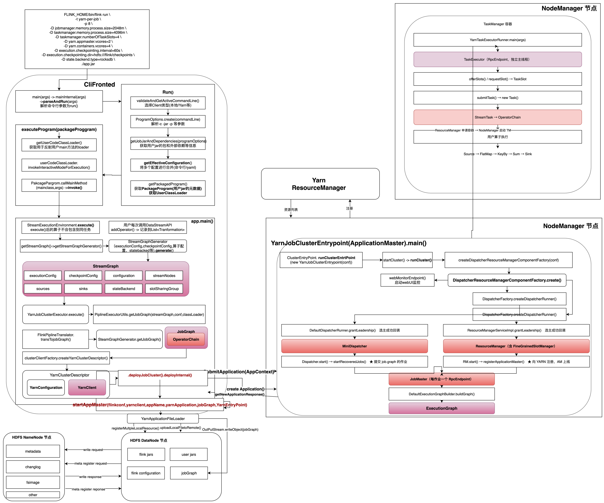

# Flink 任务提交全流程解析（YARN per-job 模式）

> **代码基线**：Apache Flink 1.20.4
> **源码位置**：仓库根目录 `flink-1.20-source/`（与 `learn-flink` 并列）
> **阅读方式**：文中**蓝色**的类名与方法名均可点击，直接跳到源码对应行；代码块均为**从源码实际抽取**
> **配套图**：`doc/assets/` 下的 [`job-submission-flow.drawio`](../../assets/job-submission-flow.drawio)（源文件） · [`job-submission-flow.png`](../../assets/job-submission-flow.png)（图片）
> **验证环境**：JDK 17 + 本地 MiniCluster / YARN per-job



*▲ 全流程图：客户端解析命令 → 生成 StreamGraph / JobGraph → 部署 YARN 集群 → AM 容器读回 `job.graph` → Dispatcher / ResourceManager / JobMaster → ExecutionGraph → TaskManager 执行 Task。*
*图中**曲边方框**表示对象 / 组件，**直角方框**表示方法调用。点击图片可放大。*

---

# 一、提交流程的界限

## 1.1 一句话界定

> **从用户在终端敲下 `bin/flink run`，到 `ExecutionGraph` 构建完成、第一个 `Task` 在 TaskManager 上开始执行。**
>
> 中间跨越 **3 个 JVM 进程**、经历 **2 次 `JobGraph` 序列化**、**3 次异步选主**。

## 1.2 起点与终点

| | 位置 | 标志性动作 | 源码入口 |
|---|---|---|---|
| **起点** | 客户端 JVM | shell 脚本 `exec java ... CliFrontend "$@"` | <a href="../../../../flink-1.20-source/flink-clients/src/main/java/org/apache/flink/client/cli/CliFrontend.java#L238" style="color:#0969da"><code style="color:#0969da;background:transparent;border:none">CliFrontend.run()</code></a> |
| **终点** | TaskManager 容器 | `submitTask()` → `new Task()` | <a href="../../../../flink-1.20-source/flink-runtime/src/main/java/org/apache/flink/runtime/taskexecutor/TaskExecutor.java#L660" style="color:#0969da"><code style="color:#0969da;background:transparent;border:none">TaskExecutor.submitTask()</code></a> |

**终点的精确含义**：`ExecutionGraph` 已在 JobMaster 里构建完毕，`PipelinedRegionSchedulingStrategy` 完成 slot 分配，`Task` 对象在 TaskManager 上被创建。**此后数据怎么流、怎么 checkpoint，不属于"提交"范畴。**

## 1.3 三个 JVM 边界（理解全局的关键）

```
① 客户端 JVM                ② AM 容器（= JobManager）        ③ TM 容器
   flink run                   YarnJobClusterEntrypoint        YarnTaskExecutorRunner
   ├─ 用户 main() ✱            ├─ Dispatcher                   ├─ TaskExecutor
   ├─ StreamGraph              ├─ ResourceManager              ├─ TaskSlot
   ├─ JobGraph ✱               ├─ WebMonitorEndpoint           └─ Task → 用户算子
   └─ YarnClusterDescriptor    ├─ JobMaster
        ↓                      └─ ExecutionGraph ✱
   JobGraph → job.graph 文件         ↑
   经 YARN local resource ───────────┘
                                     └── 申请容器 ──→ ③
```

✱ 标记的对象**只存在于某一个 JVM**，这是最容易混淆之处：

| 对象 | 存在于 | 说明 |
|---|---|---|
| `StreamGraph` | 仅客户端 | 逻辑图 |
| `JobGraph` | 客户端生成 → AM 读回 | 提交信封，Java 序列化传输 |
| `ExecutionGraph` | **仅 AM** | 执行图，客户端完全拿不到 |

## 1.4 明确不包含什么

| 不属于本文范围 | 属于哪个主题 |
|---|---|
| 算子内部数据处理、序列化 | 处理函数 / 类型系统 |
| 网络栈、反压、buffer 管理 | 网络栈 |
| Checkpoint / Savepoint 的实际执行 | 状态与容错 |
| 故障恢复、failover 重调度 | 调度与容错 |
| SQL 解析与优化 | Flink SQL |

> **为什么要先划界限**：Flink 源码里"提交"这条线其实很短（约 10 个关键类），但它前后接的东西极多。不划界限，就会在读 <a href="../../../../flink-1.20-source/flink-runtime/src/main/java/org/apache/flink/runtime/dispatcher/Dispatcher.java" style="color:#0969da"><code style="color:#0969da;background:transparent;border:none">Dispatcher</code></a> 时被 `CheckpointCoordinator` 带跑偏。

## 1.5 全流程鸟瞰

| 阶段 | 所在 JVM | 关键动作 | 关键类 |
|---|---|---|---|
| ① 解析命令 | 客户端 | 选 CustomCommandLine，合并配置 | <a href="../../../../flink-1.20-source/flink-clients/src/main/java/org/apache/flink/client/cli/CliFrontend.java" style="color:#0969da"><code style="color:#0969da;background:transparent;border:none">CliFrontend</code></a> / <a href="../../../../flink-1.20-source/flink-clients/src/main/java/org/apache/flink/client/cli/ProgramOptions.java" style="color:#0969da"><code style="color:#0969da;background:transparent;border:none">ProgramOptions</code></a> |
| ② 装载程序 | 客户端 | 构造 `PackagedProgram` | <a href="../../../../flink-1.20-source/flink-clients/src/main/java/org/apache/flink/client/program/PackagedProgram.java" style="color:#0969da"><code style="color:#0969da;background:transparent;border:none">PackagedProgram</code></a> |
| ③ 跑用户 main | **客户端** | 注入 `StreamContextEnvironment` | <a href="../../../../flink-1.20-source/flink-clients/src/main/java/org/apache/flink/client/ClientUtils.java" style="color:#0969da"><code style="color:#0969da;background:transparent;border:none">ClientUtils</code></a> |
| ④ 选执行器 | 客户端 | SPI 命中 `yarn-per-job` | <a href="../../../../flink-1.20-source/flink-core/src/main/java/org/apache/flink/core/execution/DefaultExecutorServiceLoader.java" style="color:#0969da"><code style="color:#0969da;background:transparent;border:none">DefaultExecutorServiceLoader</code></a> |
| ⑤ 生成两图 | 客户端 | `StreamGraph` → `JobGraph`（算子链） | <a href="../../../../flink-1.20-source/flink-streaming-java/src/main/java/org/apache/flink/streaming/api/graph/StreamingJobGraphGenerator.java" style="color:#0969da"><code style="color:#0969da;background:transparent;border:none">StreamingJobGraphGenerator</code></a> |
| ⑥ 部署集群 | 客户端 | 序列化 `job.graph` + YARN local resource | <a href="../../../../flink-1.20-source/flink-yarn/src/main/java/org/apache/flink/yarn/YarnClusterDescriptor.java" style="color:#0969da"><code style="color:#0969da;background:transparent;border:none">YarnClusterDescriptor</code></a> |
| ⑦ AM 启动 | **AM 容器** | 装安全上下文、起基础设施 | <a href="../../../../flink-1.20-source/flink-runtime/src/main/java/org/apache/flink/runtime/entrypoint/ClusterEntrypoint.java" style="color:#0969da"><code style="color:#0969da;background:transparent;border:none">ClusterEntrypoint</code></a> |
| ⑧ 起三组件 | AM 容器 | WebMonitor 同步 / Dispatcher、RM 异步 | <a href="../../../../flink-1.20-source/flink-runtime/src/main/java/org/apache/flink/runtime/entrypoint/component/DefaultDispatcherResourceManagerComponentFactory.java" style="color:#0969da"><code style="color:#0969da;background:transparent;border:none">DefaultDispatcherResourceManagerComponentFactory</code></a> |
| ⑨ 读回作业 | AM 容器 | `job.graph` → `recoveredJobs` | <a href="../../../../flink-1.20-source/flink-runtime/src/main/java/org/apache/flink/runtime/entrypoint/component/FileJobGraphRetriever.java" style="color:#0969da"><code style="color:#0969da;background:transparent;border:none">FileJobGraphRetriever</code></a> |
| ⑩ 提交作业 | AM 容器 | `startRecoveredJobs()` | <a href="../../../../flink-1.20-source/flink-runtime/src/main/java/org/apache/flink/runtime/dispatcher/Dispatcher.java" style="color:#0969da"><code style="color:#0969da;background:transparent;border:none">Dispatcher</code></a> |
| ⑪ 建执行图 | AM 容器 | `JobMaster` → `ExecutionGraph` | <a href="../../../../flink-1.20-source/flink-runtime/src/main/java/org/apache/flink/runtime/executiongraph/DefaultExecutionGraphBuilder.java" style="color:#0969da"><code style="color:#0969da;background:transparent;border:none">DefaultExecutionGraphBuilder</code></a> |
| ⑫ 分配资源 | AM → TM | 申请容器、启动 TM | <a href="../../../../flink-1.20-source/flink-yarn/src/main/java/org/apache/flink/yarn/YarnResourceManagerDriver.java" style="color:#0969da"><code style="color:#0969da;background:transparent;border:none">YarnResourceManagerDriver</code></a> |
| ⑬ 跑 Task | **TM 容器** | `submitTask()` → `new Task()` | <a href="../../../../flink-1.20-source/flink-runtime/src/main/java/org/apache/flink/runtime/taskexecutor/TaskExecutor.java" style="color:#0969da"><code style="color:#0969da;background:transparent;border:none">TaskExecutor</code></a> |

---

# 二、核心源码解析

## 2.1 客户端：命令行 → 用户 `main()`

### 关键类

| 类 | 职责 |
|---|---|
| <a href="../../../../flink-1.20-source/flink-clients/src/main/java/org/apache/flink/client/cli/CliFrontend.java" style="color:#0969da"><code style="color:#0969da;background:transparent;border:none">CliFrontend</code></a> | CLI 总入口，`run`/`list`/`cancel`/`savepoint` 等 action |
| <a href="../../../../flink-1.20-source/flink-clients/src/main/java/org/apache/flink/client/cli/ProgramOptions.java" style="color:#0969da"><code style="color:#0969da;background:transparent;border:none">ProgramOptions</code></a> | `-c` / `-p` / `-d` / `-s` 等参数解析 |
| <a href="../../../../flink-1.20-source/flink-clients/src/main/java/org/apache/flink/client/program/PackagedProgram.java" style="color:#0969da"><code style="color:#0969da;background:transparent;border:none">PackagedProgram</code></a> | 用户 jar 封装 + child-first 类加载器 |
| <a href="../../../../flink-1.20-source/flink-clients/src/main/java/org/apache/flink/client/ClientUtils.java" style="color:#0969da"><code style="color:#0969da;background:transparent;border:none">ClientUtils</code></a> | 注入执行环境并调用用户 main |

### 步骤 1：<a href="../../../../flink-1.20-source/flink-clients/src/main/java/org/apache/flink/client/cli/CliFrontend.java#L238" style="color:#0969da"><code style="color:#0969da;background:transparent;border:none">CliFrontend.run()</code></a> —— `run` 子命令主流程

```java
protected void run(String[] args) throws Exception {
    LOG.info("Running 'run' command.");

    final Options commandOptions = CliFrontendParser.getRunCommandOptions();
    final CommandLine commandLine = getCommandLine(commandOptions, args, true);

    // evaluate help flag
    if (commandLine.hasOption(HELP_OPTION.getOpt())) {
        CliFrontendParser.printHelpForRun(customCommandLines);
        return;
    }

    // 选择cli类型
    final CustomCommandLine activeCommandLine =
            validateAndGetActiveCommandLine(checkNotNull(commandLine));

    // 解析 -c、-p、-s、jar 路径、程序参数
    final ProgramOptions programOptions = ProgramOptions.create(commandLine);

    // 获取用户提交的jar和依赖的列表 programOptions 从参数中解析获得
    final List<URL> jobJars = getJobJarAndDependencies(programOptions);

    // 多配置源合并：flink-conf.yaml < 命令行 -D/-yD < ProgramOptions 合并多个配置来源的参数 形成最终的配置 Configuration
    final Configuration effectiveConfiguration =
            getEffectiveConfiguration(activeCommandLine, commandLine, programOptions, jobJars);

    LOG.debug("Effective executor configuration: {}", effectiveConfiguration);

    // 参数解析完成 获取用户jar的一些元信息PackagedProgram，并获取一个class loader 用户执行用户main()
    try (PackagedProgram program = getPackagedProgram(programOptions, effectiveConfiguration)) {

        // 准备执行用户main() 并初始化JobManager
        executeProgram(effectiveConfiguration, program);
    }
}
```

### 步骤 2：<a href="../../../../flink-1.20-source/flink-clients/src/main/java/org/apache/flink/client/cli/CliFrontend.java#L303" style="color:#0969da"><code style="color:#0969da;background:transparent;border:none">getEffectiveConfiguration()</code></a> —— 三段配置合并

```java
private <T> Configuration getEffectiveConfiguration(
        final CustomCommandLine activeCustomCommandLine, final CommandLine commandLine)
        throws FlinkException {

    final Configuration effectiveConfiguration = new Configuration(configuration);

    final Configuration commandLineConfiguration =
            checkNotNull(activeCustomCommandLine).toConfiguration(commandLine);

    effectiveConfiguration.addAll(commandLineConfiguration);

    return effectiveConfiguration;
}
```

配置优先级（后者覆盖前者）：

```
flink-conf.yaml  <  -t / -D / -m / -z  <  -p / -d / -s / -C / -sae
```

所以 `-p 4 -Dparallelism.default=2` 的结果是 **4**，不是 2。

### 步骤 3：<a href="../../../../flink-1.20-source/flink-clients/src/main/java/org/apache/flink/client/ClientUtils.java#L77" style="color:#0969da"><code style="color:#0969da;background:transparent;border:none">ClientUtils.executeProgram()</code></a> —— 注入上下文并反射调用 main

```java
public static void executeProgram(
        PipelineExecutorServiceLoader executorServiceLoader,
        Configuration configuration,
        PackagedProgram program,
        boolean enforceSingleJobExecution,
        boolean suppressSysout)
        throws ProgramInvocationException {
    checkNotNull(executorServiceLoader);
    final ClassLoader userCodeClassLoader = program.getUserCodeClassLoader(); // 获取class lader
    final ClassLoader contextClassLoader = Thread.currentThread().getContextClassLoader();
    try {
        Thread.currentThread().setContextClassLoader(userCodeClassLoader); //装配

        LOG.info(
                "Starting program (detached: {})",
                !configuration.get(DeploymentOptions.ATTACHED));

        ContextEnvironment.setAsContext(
                executorServiceLoader,
                configuration,
                userCodeClassLoader,
                enforceSingleJobExecution,
                suppressSysout);

        StreamContextEnvironment.setAsContext(
                executorServiceLoader,
                configuration,
                userCodeClassLoader,
                enforceSingleJobExecution,
                suppressSysout);

        // For DataStream v2.
        ExecutionContextEnvironment.setAsContext(
                executorServiceLoader, configuration, userCodeClassLoader);

        try {
            program.invokeInteractiveModeForExecution(); //反射执行用户的main()
        } finally {
            ContextEnvironment.unsetAsContext();
            StreamContextEnvironment.unsetAsContext();
            // For DataStream v2.
            ExecutionContextEnvironment.unsetAsContext();
        }
    } finally {
        Thread.currentThread().setContextClassLoader(contextClassLoader);
    }
}
```

**关键点**：用户代码里的 `getExecutionEnvironment()` 拿到的不是本地环境，而是**携带 `PipelineExecutorServiceLoader` 的 `StreamContextEnvironment`**。这就是「CLI 能决定用户程序怎么提交」的机制。

### 步骤 4：进入用户 `main()`

```java
public void invokeInteractiveModeForExecution() throws ProgramInvocationException {
    FlinkSecurityManager.monitorUserSystemExitForCurrentThread();
    try {
        callMainMethod(mainClass, args);
    } finally {
        FlinkSecurityManager.unmonitorUserSystemExitForCurrentThread();
    }
}
```

### 补充：`-t` 决定了后面的一切分支

<a href="../../../../flink-1.20-source/flink-clients/src/main/java/org/apache/flink/client/cli/CliFrontend.java#L1449" style="color:#0969da"><code style="color:#0969da;background:transparent;border:none">loadCustomCommandLines()</code></a> 按固定顺序注册三个 CustomCommandLine，<a href="../../../../flink-1.20-source/flink-clients/src/main/java/org/apache/flink/client/cli/CliFrontend.java#L1494" style="color:#0969da"><code style="color:#0969da;background:transparent;border:none">validateAndGetActiveCommandLine()</code></a> 取**第一个 `isActive()` 为 true 的**：

| 顺序 | 实现 | 激活条件 |
|---|---|---|
| 1 | `GenericCLI` | 传了 `-t`/`-e`，或配置里已有 `execution.target` |
| 2 | `FlinkYarnSessionCli` | 传了 `-y*` 或 `-m yarn-cluster` |
| 3 | `DefaultCLI` | **永远 true**（兜底，所以必须放最后） |

⚠️ 忘了写 `-t yarn-per-job`，兜底的 `DefaultCLI` 会**无条件设置 `execution.target=remote`** → 静默变成 session 提交。

---

## 2.2 客户端：`PipelineExecutor` 的选择

### 关键类

| 类 | 职责 |
|---|---|
| <a href="../../../../flink-1.20-source/flink-streaming-java/src/main/java/org/apache/flink/streaming/api/environment/StreamExecutionEnvironment.java" style="color:#0969da"><code style="color:#0969da;background:transparent;border:none">StreamExecutionEnvironment</code></a> | `executeAsync()` → `getPipelineExecutor()` |
| <a href="../../../../flink-1.20-source/flink-core/src/main/java/org/apache/flink/core/execution/DefaultExecutorServiceLoader.java" style="color:#0969da"><code style="color:#0969da;background:transparent;border:none">DefaultExecutorServiceLoader</code></a> | SPI 加载 `PipelineExecutorFactory` |
| <a href="../../../../flink-1.20-source/flink-yarn/src/main/java/org/apache/flink/yarn/executors/YarnJobClusterExecutor.java" style="color:#0969da"><code style="color:#0969da;background:transparent;border:none">YarnJobClusterExecutor</code></a> | `target=yarn-per-job` 对应的执行器 |

### 步骤 1：<a href="../../../../flink-1.20-source/flink-streaming-java/src/main/java/org/apache/flink/streaming/api/environment/StreamExecutionEnvironment.java#L2469" style="color:#0969da"><code style="color:#0969da;background:transparent;border:none">executeAsync(StreamGraph)</code></a>

```java
public JobClient executeAsync(StreamGraph streamGraph) throws Exception {
    checkNotNull(streamGraph, "StreamGraph cannot be null.");
    final PipelineExecutor executor = getPipelineExecutor();

    CompletableFuture<JobClient> jobClientFuture =
            executor.execute(streamGraph, configuration, userClassloader);

    try {
        JobClient jobClient = jobClientFuture.get();
        jobListeners.forEach(jobListener -> jobListener.onJobSubmitted(jobClient, null));
        collectIterators.forEach(iterator -> iterator.setJobClient(jobClient));
        collectIterators.clear();
        return jobClient;
    } catch (ExecutionException executionException) {
        final Throwable strippedException =
                ExceptionUtils.stripExecutionException(executionException);
        jobListeners.forEach(
                jobListener -> jobListener.onJobSubmitted(null, strippedException));

        throw new FlinkException(
                String.format("Failed to execute job '%s'.", streamGraph.getJobName()),
                strippedException);
    }
}
```

### 步骤 2：<a href="../../../../flink-1.20-source/flink-streaming-java/src/main/java/org/apache/flink/streaming/api/environment/StreamExecutionEnvironment.java#L2991" style="color:#0969da"><code style="color:#0969da;background:transparent;border:none">getPipelineExecutor()</code></a>

```java
private PipelineExecutor getPipelineExecutor() throws Exception {
    checkNotNull(
            configuration.get(DeploymentOptions.TARGET),
            "No execution.target specified in your configuration file.");

    final PipelineExecutorFactory executorFactory =
            executorServiceLoader.getExecutorFactory(configuration);

    checkNotNull(
            executorFactory,
            "Cannot find compatible factory for specified execution.target (=%s)",
            configuration.get(DeploymentOptions.TARGET));

    return executorFactory.getExecutor(configuration);
}
```

### 步骤 3：<a href="../../../../flink-1.20-source/flink-core/src/main/java/org/apache/flink/core/execution/DefaultExecutorServiceLoader.java#L54" style="color:#0969da"><code style="color:#0969da;background:transparent;border:none">getExecutorFactory()</code></a> —— SPI 匹配

```java
public PipelineExecutorFactory getExecutorFactory(final Configuration configuration) {
    checkNotNull(configuration);

    final ServiceLoader<PipelineExecutorFactory> loader =
            ServiceLoader.load(PipelineExecutorFactory.class);

    final List<PipelineExecutorFactory> compatibleFactories = new ArrayList<>();
    final Iterator<PipelineExecutorFactory> factories = loader.iterator();
    while (factories.hasNext()) {
        try {
            final PipelineExecutorFactory factory = factories.next();
            if (factory != null && factory.isCompatibleWith(configuration)) {
                compatibleFactories.add(factory);
            }
        } catch (Throwable e) {
            if (e.getCause() instanceof NoClassDefFoundError) {
                LOG.info("Could not load factory due to missing dependencies.");
            } else {
                throw e;
            }
        }
    }

    if (compatibleFactories.size() > 1) {
        final String configStr =
                configuration.toMap().entrySet().stream()
                        .map(e -> e.getKey() + "=" + e.getValue())
                        .collect(Collectors.joining("\n"));

        throw new IllegalStateException(
                "Multiple compatible client factories found for:\n" + configStr + ".");
    }

    if (compatibleFactories.isEmpty()) {
        throw new IllegalStateException("No ExecutorFactory found to execute the application.");
    }

    return compatibleFactories.get(0);
}
```

`YarnJobClusterExecutorFactory.isCompatibleWith()` 的判定就是一行：

```java
return "yarn-per-job".equalsIgnoreCase(configuration.get(DeploymentOptions.TARGET));
```

### 继承关系是分水岭

```
AbstractSessionClusterExecutor（"集群已存在，我去连它"）
├─ RemoteExecutor                     remote
├─ YarnSessionClusterExecutor         yarn-session
└─ KubernetesSessionClusterExecutor   kubernetes-session

AbstractJobClusterExecutor（"为我新建一个集群"）—— 只有这一个子类
└─ YarnJobClusterExecutor             yarn-per-job   ← 本次主线
```

---

## 2.3 客户端：`StreamGraph` → `JobGraph`

### 关键类

| 类 | 职责 |
|---|---|
| <a href="../../../../flink-1.20-source/flink-streaming-java/src/main/java/org/apache/flink/streaming/api/graph/StreamGraphGenerator.java" style="color:#0969da"><code style="color:#0969da;background:transparent;border:none">StreamGraphGenerator</code></a> | `Transformation` → `StreamGraph` |
| <a href="../../../../flink-1.20-source/flink-streaming-java/src/main/java/org/apache/flink/streaming/api/graph/StreamingJobGraphGenerator.java" style="color:#0969da"><code style="color:#0969da;background:transparent;border:none">StreamingJobGraphGenerator</code></a> | `StreamGraph` → `JobGraph`，**算子链在此合并** |
| <a href="../../../../flink-1.20-source/flink-clients/src/main/java/org/apache/flink/client/deployment/executors/PipelineExecutorUtils.java" style="color:#0969da"><code style="color:#0969da;background:transparent;border:none">PipelineExecutorUtils</code></a> | 补挂 jar / classpath / savepoint 设置 |

### 步骤 1：<a href="../../../../flink-1.20-source/flink-clients/src/main/java/org/apache/flink/client/deployment/executors/PipelineExecutorUtils.java#L50" style="color:#0969da"><code style="color:#0969da;background:transparent;border:none">PipelineExecutorUtils.getJobGraph()</code></a> —— 翻译入口

```java
public static JobGraph getJobGraph(
        @Nonnull final Pipeline pipeline, // streamGraph
        @Nonnull final Configuration configuration,
        @Nonnull ClassLoader userClassloader)
        throws MalformedURLException {
    checkNotNull(pipeline);
    checkNotNull(configuration);

    final ExecutionConfigAccessor executionConfigAccessor =
            ExecutionConfigAccessor.fromConfiguration(configuration);
    final JobGraph jobGraph =
            FlinkPipelineTranslationUtil.getJobGraph(
                    userClassloader,
                    pipeline,
                    configuration,
                    executionConfigAccessor.getParallelism());

    configuration
            .getOptional(PipelineOptionsInternal.PIPELINE_FIXED_JOB_ID)
            .ifPresent(strJobID -> jobGraph.setJobID(JobID.fromHexString(strJobID)));

    if (configuration.get(DeploymentOptions.ATTACHED)
            && configuration.get(DeploymentOptions.SHUTDOWN_IF_ATTACHED)) {
        jobGraph.setInitialClientHeartbeatTimeout(
                configuration.get(ClientOptions.CLIENT_HEARTBEAT_TIMEOUT).toMillis());
    }

    jobGraph.addJars(executionConfigAccessor.getJars());
    jobGraph.setClasspaths(executionConfigAccessor.getClasspaths());
    jobGraph.setSavepointRestoreSettings(executionConfigAccessor.getSavepointRestoreSettings());

    return jobGraph;
}
```

### 步骤 2：<a href="../../../../flink-1.20-source/flink-streaming-java/src/main/java/org/apache/flink/streaming/api/graph/StreamGraphGenerator.java#L310" style="color:#0969da"><code style="color:#0969da;background:transparent;border:none">StreamGraphGenerator.generate()</code></a>

```java
public StreamGraph generate() {
    // ① 先造一个"空壳" StreamGraph：此刻图里没有任何节点，
    //    只是把 ExecutionEnvironment 的环境级配置接手过来：
    //      configuration            —— 作业级配置，最终会变成 JobGraph 的 jobConfiguration
    //      executionConfig          —— 并行度 / 序列化器 / 重启策略 / maxParallelism 等
    //      checkpointConfig         —— CheckpointConfig（间隔、模式、超时…）
    //      savepointRestoreSettings —— CLI 的 -s / -n / -cm 所对应的恢复设置
    streamGraph =
            new StreamGraph(
                    configuration, executionConfig, checkpointConfig, savepointRestoreSettings);

    // ② 先给这次作业定性：STREAMING 还是 BATCH。判定逻辑见 shouldExecuteInBatchMode()：
    //      - execution.runtime-mode 显式配了 STREAMING/BATCH → 听配置的；
    //      - 配成 AUTOMATIC → 存在无界源就 STREAMING，全是有界源就 BATCH。
    //    结果要存成字段，因为后面的 configureStreamGraph、setDynamic、
    //    setFineGrainedGlobalStreamExchangeMode 都要反复读它。
    //    这里还会顺带 checkState 掉一个非法组合：BATCH 模式 + 存在无界源，直接报错拒绝执行。
    shouldExecuteInBatchMode = shouldExecuteInBatchMode();

    // ③ 依据 ② 的结论，把作业级属性刷进空壳。内部是 batch / streaming 二选一：
    //      streaming: jobName("Flink Streaming Job")、JobType.STREAMING、
    //                 stateBackend、checkpointStorage、全局 StreamExchangeMode
    //      batch    : jobName("Flink Batch Job")、JobType.BATCH、关闭 checkpointing、
    //                 批量 state backend、batch shuffle mode、且默认不在同一 slot sharing group
    //    注意 batch 分支还有个副作用：configuration.set(BUFFER_TIMEOUT_ENABLED, false)。
    configureStreamGraph(streamGraph);

    // ④ 递归遍历的"记忆化"表，用来去重。
    //    用 IdentityHashMap 而非 HashMap 是刻意的：Transformation 没有重写 equals/hashCode，
    //    这里要的正是"同一个对象实例"的语义。
    //    为什么必须去重：图里可能存在环（feedback edge / 迭代流），
    //    没有这张表就会无限递归；同时它保证被多个下游共享的节点只翻译一次。
    alreadyTransformed = new IdentityHashMap<>();

    // ⑤ 真正干活的一步。从用户登记过的每个 Transformation（"根"）出发，
    //    向 input 方向深度优先递归：transform() 内部先递归处理完所有上游，
    //    再为当前节点创建 StreamNode，并把上游节点连成本节点的入边。
    //    注意：只保证"根"能被走到就够了。中间节点（keyBy 产生的 PartitionTransformation、
    //    union 产生的 UnionTransformation 等）并不登记，靠递归被发现。
    for (Transformation<?> transformation : transformations) {
        transform(transformation);
    }

    // ⑥ 回填细粒度资源。⑤ 的递归过程中，每遇到一个携带 ResourceSpec 的 SlotSharingGroup，
    //    就会往 slotSharingGroupResources 里累积 (组名 -> ResourceProfile)，
// ...（省略部分代码，完整实现见源码）
```

### 步骤 3：<a href="../../../../flink-1.20-source/flink-streaming-java/src/main/java/org/apache/flink/streaming/api/graph/StreamingJobGraphGenerator.java#L245" style="color:#0969da"><code style="color:#0969da;background:transparent;border:none">StreamingJobGraphGenerator.createJobGraph()</code></a> —— 核心转换

```java
private JobGraph createJobGraph() {
    // ① 提交前的合法性校验（只在开启 checkpointing 时才做实际检查）：
    //      - 迭代作业默认不支持 checkpoint（无法保证 exactly-once）；
    //      - 迭代作业 + 非对齐 checkpoint 不支持；
    //      - 自定义 partitioner + 非对齐 checkpoint 不支持（rescale 无法保证正确）；
    //      - 实现 InputSelectable 的算子不支持 checkpoint；
    //      - 非对齐 checkpoint 只支持 EXACTLY_ONCE，否则**静默降级并告警**
    //        （注意这里会就地改写 checkpointConfig，不只是抛异常）。
    preValidate();

    // ② 作业级属性：JobType(STREAMING/BATCH) 和是否 dynamic（batch 自适应调度）。
    //    这两个值来自 StreamGraph，而 StreamGraph 的值在 StreamGraphGenerator
    //    的 configureStreamGraph() 里已按 runtime-mode 定好。
    jobGraph.setJobType(streamGraph.getJobType());
    jobGraph.setDynamic(streamGraph.isDynamic());

    // 近似本地恢复（approximate local recovery）：失败时优先在原 TM 上恢复，
    // 省掉从远端拉状态的开销。
    jobGraph.enableApproximateLocalRecovery(
            streamGraph.getCheckpointConfig().isApproximateLocalRecoveryEnabled());

    // ③ ★ 生成"确定性哈希"，这是算子链和 savepoint 的共同前置条件。
    //    defaultStreamGraphHasher 会遍历整个 StreamGraph，为每个 StreamNode 算一个 hash。
    //    两个用途：
    //      (a) 作为 JobVertexID 的来源（见 createJobVertex()）；
    //      (b) 建立 savepoint 里状态 与 算子 的对应关系。
    //    "确定性"是关键：只要算子没变，重新提交时算出的 hash 就一样，
    //    从而能从 savepoint 恢复。反过来，改了算子结构（或调了影响 hash 的配置）
    //    → hash 变 → 恢复时报"找不到对应状态"，除非显式允许 skip。
    // Generate deterministic hashes for the nodes in order to identify them across
    // submission iff they didn't change.
    Map<Integer, byte[]> hashes =
            defaultStreamGraphHasher.traverseStreamGraphAndGenerateHashes(streamGraph);

    // 同时生成历史版本的 hash，用于兼容老版本 savepoint
    // （新版 hasher 一旦上线就不能再改算法，只能新增，否则老 savepoint 全部失效）。
    // Generate legacy version hashes for backwards compatibility
    List<Map<Integer, byte[]>> legacyHashes = new ArrayList<>(legacyStreamGraphHashers.size());
    for (StreamGraphHasher hasher : legacyStreamGraphHashers) {
        legacyHashes.add(hasher.traverseStreamGraphAndGenerateHashes(streamGraph));
    }

    // ④ ★★ 本方法的核心：算子链（operator chaining）在这里产生。
    //    setChaining() 会消费 ③ 生成的 hash，把 StreamGraph 的 StreamNode/StreamEdge
    //    合并成 JobGraph 的 JobVertex/JobEdge —— 这是"逻辑图 → 物理图"的关键一步，
    //    也是 JobVertex 数量少于 StreamNode 数量的原因。
    //
    //    详细算法与判定规则见下面 setChaining() / createChain() 的注释。
    setChaining(hashes, legacyHashes);

    // ⑤ dynamic graph（batch 自适应调度/自动并行度）的并行度回填。
    //    必须在 ④ 之后：它需要先知道链的划分，才能把同一个 forward group 内
    //    的 JobVertex 并行度对齐。
    if (jobGraph.isDynamic()) {
        setVertexParallelismsForDynamicGraphIfNecessary();
    }

    // ⑥ 设置所有"非链式输出"（需要过网络的那些输出）的配置。
    //    源码注释点明了顺序约束：必须在 ⑤ 之后，
    //    因为 setVertexParallelismsForDynamicGraphIfNecessary() 会影响
    //    JobVertex 的并行度，进而影响 partition reuse 的判定。
    // Note that we set all the non-chainable outputs configuration here because the
    // "setVertexParallelismsForDynamicGraphIfNecessary" may affect the parallelism of job
    // vertices and partition-reuse
    final Map<Integer, Map<StreamEdge, NonChainedOutput>> opIntermediateOutputs =
            new HashMap<>();
    setAllOperatorNonChainedOutputsConfigs(opIntermediateOutputs);
    setAllVertexNonChainedOutputsConfigs(opIntermediateOutputs);

    // ⑦ 建立 JobGraph 层面的边：把断链处的 StreamEdge 转成
// ...（省略部分代码，完整实现见源码）
```

### 步骤 4：<a href="../../../../flink-1.20-source/flink-streaming-java/src/main/java/org/apache/flink/streaming/api/graph/StreamingJobGraphGenerator.java#L718" style="color:#0969da"><code style="color:#0969da;background:transparent;border:none">setChaining()</code></a> —— 算子链入口

```java
private void setChaining(Map<Integer, byte[]> hashes, List<Map<Integer, byte[]>> legacyHashes) {
    // ★ 第一步：区分两类 source。
    //   同一个 source 有两种命运：
    //     a) 作为「链头」(head operator) —— 自己开一条链，是 JobVertex 的起点；
    //     b) 作为「chained input」被塞进下游算子的链内 ——
    //        此时它在链里的位置是 0（chainIndex=0），
    //        所以下面 createChain 的 chainIndex 从 1 开始，把 0 留给它。
    //   只有下游的 ChainingStrategy == HEAD_WITH_SOURCES 时才会走 b)（目前仅 N-ary 算子支持），
    //   具体逻辑见 buildChainedInputsAndGetHeadInputs()。
    //   返回 Map<链头节点id, OperatorChainInfo>，OperatorChainInfo 是一条链的"账本"
    //   （记录链内节点、各自的 hash、资源规格、算子 ID 等）。
    // we separate out the sources that run as inputs to another operator (chained inputs)
    // from the sources that needs to run as the main (head) operator.
    final Map<Integer, OperatorChainInfo> chainEntryPoints =
            buildChainedInputsAndGetHeadInputs(hashes, legacyHashes);

    // ★ 第二步：按节点 id 排序后再遍历，保证生成顺序**确定**。
    //   如果不排序，HashMap 的遍历顺序不稳定，同一份程序每次生成的
    //   JobVertex 添加顺序可能不同，影响可复现性（也难以对比两次构建的差异）。
    final Collection<OperatorChainInfo> initialEntryPoints =
            chainEntryPoints.entrySet().stream()
                    .sorted(Comparator.comparing(Map.Entry::getKey))
                    .map(Map.Entry::getValue)
                    .collect(Collectors.toList());

    // ★ 第三步：对每个链头做一次 DFS。
    //   注意这里遍历的是 initialEntryPoints 这个**副本**，而不是 chainEntryPoints 本身：
    //   因为 createChain 在遇到断链时会往 chainEntryPoints 里塞新链
    //   （见 createChain 里的 chainEntryPoints.computeIfAbsent(...)），
    //   直接遍历原 map 会触发 ConcurrentModificationException。
// ...（省略部分代码，完整实现见源码）
```

### 步骤 5：<a href="../../../../flink-1.20-source/flink-streaming-java/src/main/java/org/apache/flink/streaming/api/graph/StreamingJobGraphGenerator.java#L758" style="color:#0969da"><code style="color:#0969da;background:transparent;border:none">createChain()</code></a> —— DFS 分链 + 建边

```java
private List<StreamEdge> createChain(
        final Integer currentNodeId,
        final int chainIndex,
        final OperatorChainInfo chainInfo,
        final Map<Integer, OperatorChainInfo> chainEntryPoints) {

    Integer startNodeId = chainInfo.getStartNodeId();

    // ★ 链头已经建过 JobVertex 就直接返回（返回空表示"没有新的传递性出边要上报"）。
    //   这是 DFS 的终止条件之一：同一条链的链头只会被创建一次。
    if (!builtVertices.contains(startNodeId)) {

        // ★★ 传递性出边（transitiveOutEdges）：本次 DFS 收集到的所有"断链处"的边。
        //    它最终会被设到链头所属的 OperatorChainInfo 上
        //    （见下面 chainInfo.setTransitiveOutEdges(...)），
        //    再由 setPhysicalEdges() 转成 JobGraph 里 JobVertex 之间的 JobEdge。
        //    为什么叫"传递性"：链内中间断链的边要一路冒泡到链头，
        //    因为 JobEdge 的起点必须是最外层 JobVertex，而不是链内某个算子。
        List<StreamEdge> transitiveOutEdges = new ArrayList<StreamEdge>();

        // ★★ 核心：把当前节点的出边分成两组。
        //   chainable    —— 可以并入**同一条链**（同一个 JobVertex、同一个线程）
        //   nonChainable —— 必须断链，开启**新的链**（新的 JobVertex），数据过网络
        //   判定规则全在 isChainable(edge, streamGraph) 里。
        List<StreamEdge> chainableOutputs = new ArrayList<StreamEdge>();
        List<StreamEdge> nonChainableOutputs = new ArrayList<StreamEdge>();

        StreamNode currentNode = streamGraph.getStreamNode(currentNodeId);

        // "只允许在流结束后才输出"的算子（需要先缓存全部数据、最后统一输出的算子）：
        // 它的输出必须走 BLOCKING 边且禁用 buffer timeout。
        // 这里把整条链的节点都登记进 outputBlockingNodesID（下面还有两处 add），
        // 该集合会在 determineUndefinedResultPartitionType() 里被消费，
        // 决定边的 ResultPartitionType。
        boolean isOutputOnlyAfterEndOfStream = currentNode.isOutputOnlyAfterEndOfStream();
        if (isOutputOnlyAfterEndOfStream) {
            outputBlockingNodesID.add(currentNode.getId());
        }

        for (StreamEdge outEdge : currentNode.getOutEdges()) {
            if (isChainable(outEdge, streamGraph)) {
                chainableOutputs.add(outEdge);
            } else {
                nonChainableOutputs.add(outEdge);
            }
        }

        // ★ 分支一：可链出边 —— 递归下去，但**沿用同一个 chainInfo**
        //   （仍属同一条链、最终同一个 JobVertex），且 chainIndex + 1
        //   （在链里的位置往后挪一位）。
        //   递归返回的出边会被合并进本层的 transitiveOutEdges，
        //   这样断链边就能一路冒泡到链头。
        for (StreamEdge chainable : chainableOutputs) {
            // Mark downstream nodes in the same chain as outputBlocking
            if (isOutputOnlyAfterEndOfStream) {
                outputBlockingNodesID.add(chainable.getTargetId());
            }
            transitiveOutEdges.addAll(
                    createChain(
                            chainable.getTargetId(),
// ...（省略部分代码，完整实现见源码）
```

### 步骤 6：<a href="../../../../flink-1.20-source/flink-streaming-java/src/main/java/org/apache/flink/streaming/api/graph/StreamingJobGraphGenerator.java#L1720" style="color:#0969da"><code style="color:#0969da;background:transparent;border:none">isChainable()</code></a> —— 可链性判定

```java
public static boolean isChainable(StreamEdge edge, StreamGraph streamGraph) {
    StreamNode downStreamVertex = streamGraph.getTargetVertex(edge);

    // 条件 1：下游只能有这一个输入
    return downStreamVertex.getInEdges().size() == 1 && isChainableInput(edge, streamGraph);
}
```

一条边要可链，必须**同时**满足：

| # | 规则 | WordCount 例子 |
|---|---|---|
| 1 | 下游只有 1 条入边 | — |
| 2 | `pipeline.operator-chaining.enabled` 开启 | ✅ |
| 3 | 上下游同一 `SlotSharingGroup` | ✅ |
| 4 | `ChainingStrategy` 组合允许 | ✅ |
| 5 | **并行度相同** | source(1)→flatmap(2) ❌ 断链 |
| — | **必须是 `ForwardPartitioner`** | flatmap→sum 是 hash 分区 ❌ 断链 |
| — | 非 union | ✅ |

> 实测：`source(1) → flatmap(2) → sum(2) → sink(2)` 中**只有 `sum + sink` 合并**，`JobVertex` 从 4 个 `StreamNode` 变成 3 个。
> 完整对照见 [`three-graphs-wordcount.md`](./three-graphs-wordcount.md) 与 [`three-graphs-comparison.png`](../../assets/three-graphs-comparison.png)。

### `JobGraph` 不只是图，它是"提交信封"

```java
public static JobGraph getJobGraph(
        @Nonnull final Pipeline pipeline, // streamGraph
        @Nonnull final Configuration configuration,
        @Nonnull ClassLoader userClassloader)
        throws MalformedURLException {
    checkNotNull(pipeline);
    checkNotNull(configuration);

    final ExecutionConfigAccessor executionConfigAccessor =
            ExecutionConfigAccessor.fromConfiguration(configuration);
    final JobGraph jobGraph =
            FlinkPipelineTranslationUtil.getJobGraph(
                    userClassloader,
                    pipeline,
                    configuration,
                    executionConfigAccessor.getParallelism());

    configuration
            .getOptional(PipelineOptionsInternal.PIPELINE_FIXED_JOB_ID)
            .ifPresent(strJobID -> jobGraph.setJobID(JobID.fromHexString(strJobID)));

    if (configuration.get(DeploymentOptions.ATTACHED)
            && configuration.get(DeploymentOptions.SHUTDOWN_IF_ATTACHED)) {
        jobGraph.setInitialClientHeartbeatTimeout(
                configuration.get(ClientOptions.CLIENT_HEARTBEAT_TIMEOUT).toMillis());
    }

    jobGraph.addJars(executionConfigAccessor.getJars());
    jobGraph.setClasspaths(executionConfigAccessor.getClasspaths());
    jobGraph.setSavepointRestoreSettings(executionConfigAccessor.getSavepointRestoreSettings());

    return jobGraph;
}
```

**`JobVertexID` 来自算子的确定性 hash** —— 这是「改算子结构 → savepoint 恢复失败」的根源。

---

## 2.4 客户端 → YARN：`deployJobCluster`

### 关键类

| 类 | 职责 |
|---|---|
| <a href="../../../../flink-1.20-source/flink-clients/src/main/java/org/apache/flink/client/deployment/executors/AbstractJobClusterExecutor.java" style="color:#0969da"><code style="color:#0969da;background:transparent;border:none">AbstractJobClusterExecutor</code></a> | per-job 提交主流程 |
| <a href="../../../../flink-1.20-source/flink-yarn/src/main/java/org/apache/flink/yarn/YarnClusterDescriptor.java" style="color:#0969da"><code style="color:#0969da;background:transparent;border:none">YarnClusterDescriptor</code></a> | YARN 部署描述符（约 2000 行） |
| <a href="../../../../flink-1.20-source/flink-yarn/src/main/java/org/apache/flink/yarn/YarnClusterClientFactory.java" style="color:#0969da"><code style="color:#0969da;background:transparent;border:none">YarnClusterClientFactory</code></a> | 创建 `YarnClusterDescriptor` + `YarnClient` |
| `YarnClient`（Hadoop） | YARN 的**客户端侧** API |

### 步骤 1：<a href="../../../../flink-1.20-source/flink-clients/src/main/java/org/apache/flink/client/deployment/executors/AbstractJobClusterExecutor.java#L66" style="color:#0969da"><code style="color:#0969da;background:transparent;border:none">AbstractJobClusterExecutor.execute()</code></a> —— per-job 提交六步

```java
public CompletableFuture<JobClient> execute(
        @Nonnull final Pipeline pipeline,
        @Nonnull final Configuration configuration,
        @Nonnull final ClassLoader userCodeClassloader)
        throws Exception {
    // 获取jobGraph
    final JobGraph jobGraph = PipelineExecutorUtils.getJobGraph(pipeline, configuration, userCodeClassloader); // streamGraph

    //YarnClusterDescriptor
    try (final ClusterDescriptor<ClusterID> clusterDescriptor =
            clusterClientFactory.createClusterDescriptor(configuration)) {
        final ExecutionConfigAccessor configAccessor =
                ExecutionConfigAccessor.fromConfiguration(configuration);

        final ClusterSpecification clusterSpecification =
                clusterClientFactory.getClusterSpecification(configuration);

        final ClusterClientProvider<ClusterID> clusterClientProvider =
                clusterDescriptor.deployJobCluster(
                        clusterSpecification, jobGraph, configAccessor.getDetachedMode());
        LOG.info("Job has been submitted with JobID " + jobGraph.getJobID());

        // 提交job
        return CompletableFuture.completedFuture(
                new ClusterClientJobClientAdapter<>(
                        clusterClientProvider, jobGraph.getJobID(), userCodeClassloader));
    }
}
```

**与 session 模式的结构差异**：

| | per-job | session |
|---|---|---|
| 集群获取 | `deployJobCluster(...)` **新建** | `retrieve(clusterId)` **连已有** |
| 提交方式 | 集群创建时把 `JobGraph` 一起交出去 | `clusterClient.submitJob(jobGraph)` 走 REST |
| 等初始化 | **不等**，直接 `completedFuture(...)` | attached 时 `waitUntilJobInitializationFinished(...)` |
| 关闭 client | 不关（集群归作业所有） | `whenCompleteAsync((i1,i2) -> clusterClient.close())` |

### 步骤 2：<a href="../../../../flink-1.20-source/flink-yarn/src/main/java/org/apache/flink/yarn/YarnClusterClientFactory.java#L77" style="color:#0969da"><code style="color:#0969da;background:transparent;border:none">getClusterDescriptor()</code></a> —— `YarnClient` 在这里诞生

```java
private YarnClusterDescriptor getClusterDescriptor(Configuration configuration) {
    final YarnClient yarnClient = YarnClient.createYarnClient();
    final YarnConfiguration yarnConfiguration =
            Utils.getYarnAndHadoopConfiguration(configuration);

    yarnClient.init(yarnConfiguration);
    yarnClient.start();

    return new YarnClusterDescriptor(
            configuration,
            yarnConfiguration,
            yarnClient,
            YarnClientYarnClusterInformationRetriever.create(yarnClient),
            false);
}
```

### ★ `YarnClient` 跑在客户端，与 AM 用的不是同一套 API

这是最容易混的点。YARN 提供两套**完全不同**的客户端：

| API | 谁用 | 跑在哪 | 典型方法 |
|---|---|---|---|
| **`YarnClient`** | Flink 客户端 | **客户端机器** | `createApplication` / `submitApplication` / `getApplicationReport` |
| **`AMRMClientAsync`** | Flink 的 ResourceManager | **AM 容器** | `registerApplicationMaster` / `allocate` |
| **`NMClientAsync`** | 同上 | **AM 容器** | 启动 / 停止 TM 容器 |

**全仓库 `YarnClient.createYarnClient()` 只有 2 处，都在客户端**：

- <a href="../../../../flink-1.20-source/flink-yarn/src/main/java/org/apache/flink/yarn/YarnClusterClientFactory.java#L77" style="color:#0969da"><code style="color:#0969da;background:transparent;border:none">YarnClusterClientFactory.getClusterDescriptor()</code></a> —— 主实例
- `YarnClusterDescriptor` 的 `DeploymentFailureHook` —— 兜底实例（注释说明了"因为描述符持有的那个可能已被 close()"）

### 步骤 3：<a href="../../../../flink-1.20-source/flink-yarn/src/main/java/org/apache/flink/yarn/YarnClusterDescriptor.java#L553" style="color:#0969da"><code style="color:#0969da;background:transparent;border:none">deployJobCluster()</code></a> 与 <a href="../../../../flink-1.20-source/flink-yarn/src/main/java/org/apache/flink/yarn/YarnClusterDescriptor.java#L600" style="color:#0969da"><code style="color:#0969da;background:transparent;border:none">deployInternal()</code></a>

```java
public ClusterClientProvider<ApplicationId> deployJobCluster(
        ClusterSpecification clusterSpecification, JobGraph jobGraph, boolean detached)
        throws ClusterDeploymentException {

    LOG.warn(
            "Job Clusters are deprecated since Flink 1.15. Please use an Application Cluster/Application Mode instead.");
    try {
        return deployInternal(
                clusterSpecification,
                "Flink per-job cluster",
                getYarnJobClusterEntrypoint(),
                jobGraph,
                detached);
    } catch (Exception e) {
        throw new ClusterDeploymentException("Could not deploy Yarn job cluster.", e);
    }
}
```

---

## 2.5 `JobGraph` 的跨进程传输：不走 REST

### 关键类

| 类 | 位置 |
|---|---|
| <a href="../../../../flink-1.20-source/flink-yarn/src/main/java/org/apache/flink/yarn/YarnClusterDescriptor.java#L891" style="color:#0969da"><code style="color:#0969da;background:transparent;border:none">YarnClusterDescriptor.startAppMaster()</code></a> | 序列化 JobGraph + 注册 local resource |
| `YarnApplicationFileUploader` | 统一管理"本地文件 → HDFS staging → local resource" |

### 序列化 + 注册 local resource

```java
// Setup jar for ApplicationMaster
final YarnLocalResourceDescriptor localResourceDescFlinkJar =
        fileUploader.uploadFlinkDist(flinkJarPath);
classPathBuilder
        .append(localResourceDescFlinkJar.getResourceKey())
        .append(File.pathSeparator);

// ★★ session 模式的 jobGraph 是 null，整段跳过 —— 这也是"session 集群起来时是空的"
// 在代码上的落点。per-job 模式才会走到下面。
// 传输方式是 Java 序列化到临时文件，再注册为 local resource；
// 最后一个参数传 false，表示不放进 _FLINK_SHIP_* 环境变量（只给 AM 用，不必分发给 TM）。
// 那句 TODO 是 application 模式（FLIP-85）的由来：让服务端用用户 main() 生成 JobGraph。
// write job graph to tmp file and add it to local resource
// TODO: server use user main method to generate job graph
if (jobGraph != null) {
    File tmpJobGraphFile = null;
    try {
        tmpJobGraphFile = File.createTempFile(appId.toString(), null);
        try (FileOutputStream output = new FileOutputStream(tmpJobGraphFile);
                ObjectOutputStream obOutput = new ObjectOutputStream(output)) {
            obOutput.writeObject(jobGraph); //上传jobGraph 到hdfs
        }

        final String jobGraphFilename = "job.graph";
        configuration.set(JOB_GRAPH_FILE_PATH, jobGraphFilename);

        fileUploader.registerSingleLocalResource(
                jobGraphFilename,
                new Path(tmpJobGraphFile.toURI()),
                "",
                LocalResourceType.FILE,
                true,
                false);
        classPathBuilder.append(jobGraphFilename).append(File.pathSeparator);
    } catch (Exception e) {
        LOG.warn("Add job graph to local resource fail.");
        throw e;
    } finally {
        if (tmpJobGraphFile != null && !tmpJobGraphFile.delete()) {
            LOG.warn("Fail to delete temporary file {}.", tmpJobGraphFile.toPath());
        }
    }
}
```

**三个要点**：

1. **Java 序列化**（`ObjectOutputStream.writeObject`）—— Flink 内部唯一允许用 Java 序列化的场景
2. **走 YARN local resource**，不用 HTTP、不用 BlobServer 上传
3. **最后一个参数 `false`**：`whetherToAddToEnvShipResourceList`，表示不把 `job.graph` 放进 `_FLINK_SHIP_*` 环境变量（只给 AM 用，不必分发给 TM）

### 上传 flink-conf.yaml 时的对比

```java
// Upload the flink configuration
// 把（已在客户端合并好的）有效配置写成一个 flink-conf.yaml 传给集群。
// 这一步很关键：AM 和后续拉起的 TM 容器都靠它拿到最终的集群配置。
// write out configuration file
File tmpConfigurationFile = null;
try {
    String flinkConfigFileName = GlobalConfiguration.getFlinkConfFilename();
    tmpConfigurationFile = File.createTempFile(appId + "-" + flinkConfigFileName, null);

    // 去掉 localhost 的 bind-host：这是本地开发配置，带到生产集群会导致
    // JobManager/TaskManager 只绑定回环地址，别的节点连不上。
    // remove localhost bind hosts as they render production clusters unusable
    removeLocalhostBindHostSetting(configuration, JobManagerOptions.BIND_HOST);
    removeLocalhostBindHostSetting(configuration, TaskManagerOptions.BIND_HOST);
    // taskmanager.host 反正会被每个 TM 容器覆盖，删掉以免误导
    // this setting is unconditionally overridden anyway, so we remove it for clarity
    configuration.removeConfig(TaskManagerOptions.HOST);

    BootstrapTools.writeConfiguration(configuration, tmpConfigurationFile);

    // ★ 注意最后两个布尔参数，和上面 job.graph 的写法形成对比：
    //   第 5 个 whetherToAddToRemotePaths            = true  （两者都是 true）
    //   第 6 个 whetherToAddToEnvShipResourceList    = true  ← job.graph 传的是 false
    // 含义：flink-conf.yaml 还要放进 _FLINK_SHIP_* 环境变量，
    // 这样 TM 容器也能拿到它；而 job.graph 只给 AM 用，不必再分发。
    fileUploader.registerSingleLocalResource(
            flinkConfigFileName,
            new Path(tmpConfigurationFile.toURI()),
            "",
            LocalResourceType.FILE,
            true,
            true);
    classPathBuilder.append(flinkConfigFileName).append(File.pathSeparator);
} finally {
    if (tmpConfigurationFile != null && !tmpConfigurationFile.delete()) {
        LOG.warn("Fail to delete temporary file {}.", tmpConfigurationFile.toPath());
    }
}
```

注意这里最后两个参数是 `true, true` —— 与 `job.graph` 的 `true, false` 形成对比：**`flink-conf.yaml` 还要分发给 TM 容器**。

### 三种模式的传输方式对照

| 模式 | JobGraph 如何到集群 |
|---|---|
| **per-job** | Java 序列化 → `job.graph` 文件 → **YARN local resource** |
| session | Java 序列化 → 临时文件 → **REST `POST /jobs`**（multipart） |
| application | **不传**，进程内 `dispatcherGateway.submitJob()` |

> 源码里那句 `TODO: server use user main method to generate job graph` 后来被 FLIP-85 实现了 —— 就是今天的 application 模式。

### 同一时刻还上传了什么

| 文件 | 用途 |
|---|---|
| Flink 发行版 jar | `fileUploader.uploadFlinkDist(flinkJarPath)` |
| `flink-conf.yaml` | AM / TM 容器的配置来源 |
| 用户 jar + usrlib | `userJarInclusion` 决定放 classpath 前 / 后 |
| `yarn-site.xml` / `krb5.conf` / keytab | 安全相关 |

---

## 2.6 AM 启动：读回 `JobGraph`

### 关键类

| 类 | 职责 |
|---|---|
| <a href="../../../../flink-1.20-source/flink-yarn/src/main/java/org/apache/flink/yarn/entrypoint/YarnJobClusterEntrypoint.java" style="color:#0969da"><code style="color:#0969da;background:transparent;border:none">YarnJobClusterEntrypoint</code></a> | **AM 容器的启动类** |
| <a href="../../../../flink-1.20-source/flink-runtime/src/main/java/org/apache/flink/runtime/entrypoint/ClusterEntrypoint.java" style="color:#0969da"><code style="color:#0969da;background:transparent;border:none">ClusterEntrypoint</code></a> | 所有 entrypoint 的公共启动骨架 |
| <a href="../../../../flink-1.20-source/flink-runtime/src/main/java/org/apache/flink/runtime/entrypoint/component/FileJobGraphRetriever.java" style="color:#0969da"><code style="color:#0969da;background:transparent;border:none">FileJobGraphRetriever</code></a> | 反序列化 `job.graph` |

### ★ `YarnJobClusterEntrypoint` 就是 AM

**一个 JVM 进程 = YARN 的 AM = Flink 的 JobManager。** 不是"AM 里的一个线程"。

证据链：<a href="../../../../flink-1.20-source/flink-yarn/src/main/java/org/apache/flink/yarn/entrypoint/YarnJobClusterEntrypoint.java#L88" style="color:#0969da"><code style="color:#0969da;background:transparent;border:none">YarnJobClusterEntrypoint.main()</code></a> → <a href="../../../../flink-1.20-source/flink-runtime/src/main/java/org/apache/flink/runtime/entrypoint/ClusterEntrypoint.java#L836" style="color:#0969da"><code style="color:#0969da;background:transparent;border:none">ClusterEntrypoint.runClusterEntrypoint()</code></a> → 启动 ResourceManager → <a href="../../../../flink-1.20-source/flink-yarn/src/main/java/org/apache/flink/yarn/YarnResourceManagerDriver.java#L583" style="color:#0969da"><code style="color:#0969da;background:transparent;border:none">YarnResourceManagerDriver.registerApplicationMaster()</code></a>。

**谁调用 `registerApplicationMaster`，谁就是 AM。**

### 步骤 1：<a href="../../../../flink-1.20-source/flink-yarn/src/main/java/org/apache/flink/yarn/entrypoint/YarnJobClusterEntrypoint.java#L88" style="color:#0969da"><code style="color:#0969da;background:transparent;border:none">main(args)</code></a> —— AM 容器入口

```java
public static void main(String[] args) {

    LOG.warn(
            "Job Clusters are deprecated since Flink 1.15. Please use an Application Cluster/Application Mode instead.");

    // ==================== 第 1 步：进程级初始化（与 Flink 无关的通用准备）====================
    // startup checks and logging
    // 打印 JVM/OS/版本等环境信息，出问题时第一眼就能看到运行环境
    EnvironmentInformation.logEnvironmentInfo(
            LOG, YarnJobClusterEntrypoint.class.getSimpleName(), args);
    // 注册信号处理器，让 SIGTERM/SIGINT 能被优雅处理而不是直接杀进程
    SignalHandler.register(LOG);
    // JVM 被强制终止时给一点时间做清理，避免状态写坏
    JvmShutdownSafeguard.installAsShutdownHook(LOG);

    // ==================== 第 2 步：从 YARN 环境变量拿容器工作目录 ====================
    Map<String, String> env = System.getenv();

    // PWD 是 YARN 注入的环境变量，指向容器的工作目录——所有 local resource
    // （flink dist、job.graph、flink-conf.yaml）都被解压到这里。
    // 拿不到它说明不是在 YARN 容器里跑，直接失败。
    final String workingDirectory = env.get(ApplicationConstants.Environment.PWD.key());
    Preconditions.checkArgument(
            workingDirectory != null,
            "Working directory variable (%s) not set",
            ApplicationConstants.Environment.PWD.key());

    // 把 YARN 相关的环境信息打进日志，方便排查容器侧问题
    try {
        YarnEntrypointUtils.logYarnEnvironmentInformation(env, LOG);
    } catch (IOException e) {
        LOG.warn("Could not log YARN environment information.", e);
    }

    // ==================== 第 3 步：解析配置 ====================
    // 配置来自两个地方，这里做合并：
    //   ① 命令行 -D 参数（由客户端在 AM 启动命令里生成，即 JobManagerProcessUtils
    //      产出的 dynamicParameterListStr）
    //   ② flink-conf.yaml（客户端上传到容器工作目录的那个文件）
    final Configuration dynamicParameters =
            ClusterEntrypointUtils.parseParametersOrExit(
                    args,
                    new DynamicParametersConfigurationParserFactory(),
                    YarnJobClusterEntrypoint.class);
    final Configuration configuration =
            YarnEntrypointUtils.loadConfiguration(workingDirectory, dynamicParameters, env);

    // ==================== 第 4 步：交给基类启动 ====================
    YarnJobClusterEntrypoint yarnJobClusterEntrypoint =
            new YarnJobClusterEntrypoint(configuration);

    // ★★★ 本方法到此为止，剩下的全在基类里。
    // runClusterEntrypoint 内部会依次完成：
    //   startCluster()  → 安全上下文 + 文件系统 + runCluster()
    //     runCluster()  → initializeServices()（RPC/HA/BlobServer/指标/GraphStore）
    //                   → createDispatcherResourceManagerComponentFactory()  ← 子类多态点
    //                   → factory.create() 启动 WebMonitor + ResourceManager + Dispatcher
    //   getTerminationFuture().get()  → 阻塞等待集群终止，然后 System.exit(returnCode)
    //
    // 也就是说：这一行之后的代码永远不会执行——本方法以 JVM 退出收场。
// ...（省略部分代码，完整实现见源码）
```

### 步骤 2：<a href="../../../../flink-1.20-source/flink-runtime/src/main/java/org/apache/flink/runtime/entrypoint/ClusterEntrypoint.java#L836" style="color:#0969da"><code style="color:#0969da;background:transparent;border:none">runClusterEntrypoint()</code></a> —— 启动骨架

```java
public static void runClusterEntrypoint(ClusterEntrypoint clusterEntrypoint) {

    final String clusterEntrypointName = clusterEntrypoint.getClass().getSimpleName();

    // ---- 阶段一：启动集群 ----
    try {
        clusterEntrypoint.startCluster();
    } catch (ClusterEntrypointException e) {
        // 启动阶段失败：打印并直接以指定退出码结束进程。
        // 这个退出码会被 YARN 看到，进而决定 Application 的最终状态。
        LOG.error(
                String.format("Could not start cluster entrypoint %s.", clusterEntrypointName),
                e);
        System.exit(STARTUP_FAILURE_RETURN_CODE);
    }

    // ---- 阶段二：等待终止 ----
    int returnCode;
    Throwable throwable = null;

    try {
        // ★ 关键：这里阻塞住，直到集群决定终止。
        //   终止可能来自：作业跑完（per-job 模式）、收到关闭信号、或发生不可恢复错误。
        //   注意这行之前，AM 已经完成了向 YARN 的注册，作业也可能早就跑完了。
        returnCode = clusterEntrypoint.getTerminationFuture().get().processExitCode();
    } catch (Throwable e) {
        throwable = ExceptionUtils.stripExecutionException(e);
        returnCode = RUNTIME_FAILURE_RETURN_CODE;
    }

    LOG.info(
            "Terminating cluster entrypoint process {} with exit code {}.",
            clusterEntrypointName,
            returnCode,
            throwable);

    // ★ 显式退出：AM 容器进程到此结束，YARN 随后回收整个 Application 的资源。
    System.exit(returnCode);
}
```

> ⚠️ 这个方法**永远不会正常返回** —— 它最后阻塞在 `getTerminationFuture().get()` 再 `System.exit()`。所以 `main()` 里这一行之后的代码不会执行。

### 步骤 3：<a href="../../../../flink-1.20-source/flink-runtime/src/main/java/org/apache/flink/runtime/entrypoint/ClusterEntrypoint.java#L232" style="color:#0969da"><code style="color:#0969da;background:transparent;border:none">startCluster()</code></a> —— 安全上下文 + 文件系统

```java
public void startCluster() throws ClusterEntrypointException {
    LOG.info("Starting {}.", getClass().getSimpleName());

    try {
        // 按配置设置 Java 安全管理器（默认不启用）
        FlinkSecurityManager.setFromConfiguration(configuration);

        // 插件（plugins/ 目录）加载器——连接器、格式、文件系统都靠它
        PluginManager pluginManager =
                PluginUtils.createPluginManagerFromRootFolder(configuration);

        // 初始化 Flink 的文件系统抽象（HDFS/S3/OSS 等）
        configureFileSystems(configuration, pluginManager);

        // ★ 安装安全上下文：Kerberos 登录、Hadoop UGI 设置等都在这里完成。
        //   没有它，后面访问 HDFS / YARN 都会因权限失败。
        SecurityContext securityContext = installSecurityContext(configuration);

        // 配置未捕获异常处理器，避免线程悄悄死掉导致"作业卡住没日志"
        ClusterEntrypointUtils.configureUncaughtExceptionHandler(configuration);

        // ★ runSecured：把 runCluster() 跑在刚装好的安全上下文里，
        //   保证其中创建的所有线程都继承该登录用户（Hadoop UGI 是 ThreadLocal 语义）。
        securityContext.runSecured(
                (Callable<Void>)
                        () -> {
                            runCluster(configuration, pluginManager);

                            return null;
                        });
    } catch (Throwable t) {
        final Throwable strippedThrowable =
                ExceptionUtils.stripException(t, UndeclaredThrowableException.class);

        try {
            // 启动失败时清理已经起来的半成品组件，避免留下"僵尸"RPC 端点/端口占用
            // clean up any partial state
            shutDownAsync(
                            ApplicationStatus.FAILED,
                            ShutdownBehaviour.GRACEFUL_SHUTDOWN,
                            ExceptionUtils.stringifyException(strippedThrowable),
                            false)
                    .get(
                            INITIALIZATION_SHUTDOWN_TIMEOUT.toMilliseconds(),
                            TimeUnit.MILLISECONDS);
        } catch (InterruptedException | ExecutionException | TimeoutException e) {
            strippedThrowable.addSuppressed(e);
        }

        throw new ClusterEntrypointException(
                String.format(
                        "Failed to initialize the cluster entrypoint %s.",
                        getClass().getSimpleName()),
                strippedThrowable);
    }
}
```

### 步骤 4：<a href="../../../../flink-1.20-source/flink-runtime/src/main/java/org/apache/flink/runtime/entrypoint/ClusterEntrypoint.java#L314" style="color:#0969da"><code style="color:#0969da;background:transparent;border:none">runCluster()</code></a> —— 起基础设施 + 创建三大组件

```java
private void runCluster(Configuration configuration, PluginManager pluginManager)
        throws Exception {
    synchronized (lock) {
        // ---- 第 1 步：基础设施（RPC / HA / BlobServer / 指标 / ExecutionGraphInfoStore）----
        initializeServices(configuration, pluginManager);

        // 把 RPC 的实际地址端口回写进配置，后续组件（以及传给 TM 的配置）都用它，
        // 否则可能出现"绑定了随机端口但别人还按配置里的端口去连"的问题。
        // write host information into configuration
        configuration.set(JobManagerOptions.ADDRESS, commonRpcService.getAddress());
        configuration.set(JobManagerOptions.PORT, commonRpcService.getPort());

        // ★★ 多态分派点：子类决定"搭出什么样的 JobManager"
        //     YarnSessionClusterEntrypoint   → createSessionComponentFactory（StandaloneDispatcher）
        //     YarnJobClusterEntrypoint       → createJobComponentFactory（MiniDispatcher + 单作业）
        //     YarnApplicationClusterEntryPoint→ ApplicationDispatcher

        // factory 模式
        final DispatcherResourceManagerComponentFactory
                dispatcherResourceManagerComponentFactory =
                        createDispatcherResourceManagerComponentFactory(configuration);

        // ---- 第 2 步：创建并启动三大组件 ----
        // create() 内部会依次启动 WebMonitorEndpoint → ResourceManager → Dispatcher，
        // 其中 ResourceManager 的启动过程里会向 YARN 注册 AM（详见该方法注释）。
        clusterComponent =
                dispatcherResourceManagerComponentFactory.create(
                        configuration,
                        resourceId.unwrap(),
                        ioExecutor,
                        commonRpcService,
                        haServices,
                        blobServer,
                        heartbeatServices,
                        delegationTokenManager,
                        metricRegistry,
                        executionGraphInfoStore,
                        new RpcMetricQueryServiceRetriever(
                                metricRegistry.getMetricQueryServiceRpcService()),
                        failureEnrichers,
                        this);

        // ---- 第 3 步：挂关机钩子 ----
        // 三大组件里任何一个决定关闭（作业跑完、收到 stop、致命错误），
        // 都会通过 getShutDownFuture() 冒泡到这里，进而触发整个集群的优雅关闭。
        // 这个 future 最终会让 runClusterEntrypoint() 里的
        // getTerminationFuture().get() 返回，进程随之退出。
        clusterComponent
                .getShutDownFuture()
                .whenComplete(
                        (ApplicationStatus applicationStatus, Throwable throwable) -> {
                            if (throwable != null) {
                                shutDownAsync(
                                        ApplicationStatus.UNKNOWN,
                                        ShutdownBehaviour.GRACEFUL_SHUTDOWN,
                                        ExceptionUtils.stringifyException(throwable),
                                        false);
                            } else {
                                // This is the general shutdown path. If a separate more
                                // specific shutdown was
                                // already triggered, this will do nothing
                                shutDownAsync(
                                        applicationStatus,
                                        ShutdownBehaviour.GRACEFUL_SHUTDOWN,
                                        null,
                                        true);
                            }
                        });
    }
}
```

### 步骤 5：<a href="../../../../flink-1.20-source/flink-runtime/src/main/java/org/apache/flink/runtime/entrypoint/ClusterEntrypoint.java#L394" style="color:#0969da"><code style="color:#0969da;background:transparent;border:none">initializeServices()</code></a> —— 备齐基础设施

```java
protected void initializeServices(Configuration configuration, PluginManager pluginManager)
        throws Exception {

    LOG.info("Initializing cluster services.");

    synchronized (lock) {
        // JDK 自带的命令行管理接口，用于暴露 JVM 指标
        // JMX 端口等由 JMXServerOptions 配置——注意这是 JVM 层的，不是 Flink 的 RPC
        resourceId =
                configuration
                        .getOptional(JobManagerOptions.JOB_MANAGER_RESOURCE_ID)
                        .map(
                                value ->
                                        DeterminismEnvelope.deterministicValue(
                                                new ResourceID(value)))
                        .orElseGet(
                                () ->
                                        DeterminismEnvelope.nondeterministicValue(
                                                ResourceID.generate()));

        LOG.debug(
                "Initialize cluster entrypoint {} with resource id {}.",
                getClass().getSimpleName(),
                resourceId);

        // 每个 JobManager 一个工作目录，存放 blob 存储、临时文件等。
        // 用 resourceId 隔离，保证同一台机器上多个 JM 实例互不干扰。
        workingDirectory =
                ClusterEntrypointUtils.createJobManagerWorkingDirectory(
                        configuration, resourceId);

        LOG.info("Using working directory: {}.", workingDirectory);

        // ★ RPC 框架从 SPI 加载（默认 Pekko 实现），并创建一个对外服务端点。
        //   这个 commonRpcService 是 JM 上所有 RpcEndpoint（Dispatcher/ResourceManager/...）
        //   的宿主，也是 TM 能连上 JobManager 的入口。
        rpcSystem = RpcSystem.load(configuration);

        commonRpcService =
                RpcUtils.createRemoteRpcService(
                        rpcSystem,
                        configuration,
                        configuration.get(JobManagerOptions.ADDRESS),
                        // ★ 端口范围是子类多态的：YARN 用 yarn.application-master.port，
                        //   standalone 用 jobmanager.rpc.port，ZK HA 模式用 HA_JOB_MANAGER_PORT_RANGE
                        getRPCPortRange(configuration),
                        configuration.get(JobManagerOptions.BIND_HOST),
                        configuration.getOptional(JobManagerOptions.RPC_BIND_PORT));

        JMXService.startInstance(configuration.get(JMXServerOptions.JMX_SERVER_PORT));

        // 这里拿到的可能是实际绑定的地址（比如配的是 0.0.0.0 或端口是范围时），
        // 所以要把真实值回写进配置，后面创建 HA 服务时才能用对。
        // update the configuration used to create the high availability services
        configuration.set(JobManagerOptions.ADDRESS, commonRpcService.getAddress());
        configuration.set(JobManagerOptions.PORT, commonRpcService.getPort());

        // 统一的 IO 线程池：blob 读写、HA 操作、历史归档等阻塞型操作都丢给它，
        // 避免阻塞 RPC 线程。
        ioExecutor =
                Executors.newFixedThreadPool(
                        ClusterEntrypointUtils.getPoolSize(configuration),
                        new ExecutorThreadFactory("cluster-io"));
        delegationTokenManager =
                DefaultDelegationTokenManagerFactory.create(
                        configuration,
                        pluginManager,
                        commonRpcService.getScheduledExecutor(),
                        ioExecutor);
        // Obtaining delegation tokens and propagating them to the local JVM receivers in a
// ...（省略部分代码，完整实现见源码）
```

### 步骤 6：<a href="../../../../flink-1.20-source/flink-yarn/src/main/java/org/apache/flink/yarn/entrypoint/YarnJobClusterEntrypoint.java#L60" style="color:#0969da"><code style="color:#0969da;background:transparent;border:none">createDispatcherResourceManagerComponentFactory()</code></a> —— ★ 多态分派点

```java
protected DefaultDispatcherResourceManagerComponentFactory
        createDispatcherResourceManagerComponentFactory(Configuration configuration)
                throws IOException {
    return DefaultDispatcherResourceManagerComponentFactory.createJobComponentFactory(
            YarnResourceManagerFactory.getInstance(),

            // 创建一个 JobGraphRetriever
            FileJobGraphRetriever.createFrom(
                    configuration,
                    YarnEntrypointUtils.getUsrLibDir(configuration).orElse(null)));
}
```

### 步骤 7：<a href="../../../../flink-1.20-source/flink-runtime/src/main/java/org/apache/flink/runtime/entrypoint/component/FileJobGraphRetriever.java#L71" style="color:#0969da"><code style="color:#0969da;background:transparent;border:none">retrieveJobGraph()</code></a> —— 反序列化 `job.graph`

```java
public JobGraph retrieveJobGraph(Configuration configuration) throws FlinkException {
    final File fp = new File(jobGraphFile);

    try (FileInputStream input = new FileInputStream(fp);
            ObjectInputStream obInput = new ObjectInputStream(input)) {
        final JobGraph jobGraph = (JobGraph) obInput.readObject(); // 反序列化
        addUserClassPathsToJobGraph(jobGraph);
        return jobGraph;
    } catch (FileNotFoundException e) {
        throw new FlinkException("Could not find the JobGraph file.", e);
    } catch (ClassNotFoundException | IOException e) {
        throw new FlinkException("Could not load the JobGraph from file.", e);
    }
}
```

注意 `addUserClassPathsToJobGraph()`：把容器 `usrlib` 的路径合并进 `JobGraph.classpaths` —— 因为 `JobGraph` 是**在客户端生成**的，那时还不知道集群侧的 `usrlib` 在哪。

### ★★ `JobGraph` 不走 `submitJob()` RPC

```java
protected void onStart() {
    final DispatcherGatewayService dispatcherService =
            dispatcherGatewayServiceFactory.create(
                    DispatcherId.fromUuid(getLeaderSessionId()),
                    // ★ JobGraph 在这里"变成" recoveredJobs
                    CollectionUtil.ofNullable(jobGraph),
                    CollectionUtil.ofNullable(recoveredDirtyJobResult),
                    ThrowingJobGraphWriter.INSTANCE,
                    jobResultStore);

    completeDispatcherSetup(dispatcherService);
}
```

它被当成 **`recoveredJobs`** 传下去，最终进入：

```java
public MiniDispatcher createDispatcher(
        RpcService rpcService,
        DispatcherId fencingToken,
        Collection<JobGraph> recoveredJobs,
        Collection<JobResult> recoveredDirtyJobResults,
        DispatcherBootstrapFactory dispatcherBootstrapFactory,
        PartialDispatcherServicesWithJobPersistenceComponents
                partialDispatcherServicesWithJobPersistenceComponents)
        throws Exception {
    final JobGraph recoveredJobGraph = Iterables.getOnlyElement(recoveredJobs, null);
    final JobResult recoveredDirtyJob =
            Iterables.getOnlyElement(recoveredDirtyJobResults, null);

    Preconditions.checkArgument(
            recoveredJobGraph == null ^ recoveredDirtyJob == null,
            "Either the JobGraph or the recovered JobResult needs to be specified.");

    final Configuration configuration =
            partialDispatcherServicesWithJobPersistenceComponents.getConfiguration();
    final String executionModeValue = configuration.get(INTERNAL_CLUSTER_EXECUTION_MODE);
    final ClusterEntrypoint.ExecutionMode executionMode =
            ClusterEntrypoint.ExecutionMode.valueOf(executionModeValue);

    return new MiniDispatcher(
            rpcService,
            fencingToken,
            DispatcherServices.from(
                    partialDispatcherServicesWithJobPersistenceComponents,
                    JobMasterServiceLeadershipRunnerFactory.INSTANCE,
                    CheckpointResourcesCleanupRunnerFactory.INSTANCE),
// ...（省略部分代码，完整实现见源码）
```

→ `new ` <a href="../../../../flink-1.20-source/flink-runtime/src/main/java/org/apache/flink/runtime/dispatcher/MiniDispatcher.java" style="color:#0969da"><code style="color:#0969da;background:transparent;border:none">MiniDispatcher</code></a>` (..., recoveredJobGraph, ...)`

> <a href="../../../../flink-1.20-source/flink-runtime/src/main/java/org/apache/flink/runtime/dispatcher/MiniDispatcher.java" style="color:#0969da"><code style="color:#0969da;background:transparent;border:none">MiniDispatcher</code></a> 的 javadoc：*"initialized with a **single JobGraph** which it runs."*
> **全程没有 `JobSubmitHandler` / REST 参与。**

---

## 2.7 `Dispatcher` / `ResourceManager` 的异步创建

### 关键类

| 类 | 职责 |
|---|---|
| <a href="../../../../flink-1.20-source/flink-runtime/src/main/java/org/apache/flink/runtime/entrypoint/component/DefaultDispatcherResourceManagerComponentFactory.java" style="color:#0969da"><code style="color:#0969da;background:transparent;border:none">DefaultDispatcherResourceManagerComponentFactory</code></a> | 创建并启动三大组件 |
| <a href="../../../../flink-1.20-source/flink-runtime/src/main/java/org/apache/flink/runtime/dispatcher/runner/DefaultDispatcherRunner.java" style="color:#0969da"><code style="color:#0969da;background:transparent;border:none">DefaultDispatcherRunner</code></a> | Dispatcher 的领导权管理 |
| <a href="../../../../flink-1.20-source/flink-runtime/src/main/java/org/apache/flink/runtime/resourcemanager/ResourceManagerServiceImpl.java" style="color:#0969da"><code style="color:#0969da;background:transparent;border:none">ResourceManagerServiceImpl</code></a> | RM 的领导权管理 |
| <a href="../../../../flink-1.20-source/flink-runtime/src/main/java/org/apache/flink/runtime/leaderelection/LeaderContender.java" style="color:#0969da"><code style="color:#0969da;background:transparent;border:none">LeaderContender</code></a> | 选主回调接口 |

### 步骤 1：<a href="../../../../flink-1.20-source/flink-runtime/src/main/java/org/apache/flink/runtime/entrypoint/component/DefaultDispatcherResourceManagerComponentFactory.java#L133" style="color:#0969da"><code style="color:#0969da;background:transparent;border:none">factory.create()</code></a> —— 创建三大组件

```java
public DispatcherResourceManagerComponent create(
        Configuration configuration,
        ResourceID resourceId,
        Executor ioExecutor,
        RpcService rpcService,
        HighAvailabilityServices highAvailabilityServices,
        BlobServer blobServer,
        HeartbeatServices heartbeatServices,
        DelegationTokenManager delegationTokenManager,
        MetricRegistry metricRegistry,
        ExecutionGraphInfoStore executionGraphInfoStore,
        MetricQueryServiceRetriever metricQueryServiceRetriever,
        Collection<FailureEnricher> failureEnrichers,
        FatalErrorHandler fatalErrorHandler)
        throws Exception {

    LeaderRetrievalService dispatcherLeaderRetrievalService = null;
    LeaderRetrievalService resourceManagerRetrievalService = null;
    WebMonitorEndpoint<?> webMonitorEndpoint = null;
    ResourceManagerService resourceManagerService = null;
    DispatcherRunner dispatcherRunner = null;

    try {
        // LeaderRetrievalService：用于"订阅"某个组件的当前领导节点。
        // 这里先拿到句柄，最后才 start()（见方法末尾）。
        dispatcherLeaderRetrievalService =
                highAvailabilityServices.getDispatcherLeaderRetriever();

        resourceManagerRetrievalService =
                highAvailabilityServices.getResourceManagerLeaderRetriever();

        final LeaderGatewayRetriever<DispatcherGateway> dispatcherGatewayRetriever =
                new RpcGatewayRetriever<>(
                        rpcService,
                        DispatcherGateway.class,
                        DispatcherId::fromUuid,
                        new ExponentialBackoffRetryStrategy(
                                12, Duration.ofMillis(10), Duration.ofMillis(50)));

        final LeaderGatewayRetriever<ResourceManagerGateway> resourceManagerGatewayRetriever =
                new RpcGatewayRetriever<>(
                        rpcService,
                        ResourceManagerGateway.class,
                        ResourceManagerId::fromUuid,
                        new ExponentialBackoffRetryStrategy(
                                12, Duration.ofMillis(10), Duration.ofMillis(50)));

        final ScheduledExecutorService executor =
                WebMonitorEndpoint.createExecutorService(
                        configuration.get(RestOptions.SERVER_NUM_THREADS),
                        configuration.get(RestOptions.SERVER_THREAD_PRIORITY),
                        "DispatcherRestEndpoint");

        final long updateInterval =
                configuration.get(MetricOptions.METRIC_FETCHER_UPDATE_INTERVAL).toMillis();
        final MetricFetcher metricFetcher =
                updateInterval == 0
                        ? VoidMetricFetcher.INSTANCE
                        : MetricFetcherImpl.fromConfiguration(
                                configuration,
                                metricQueryServiceRetriever,
                                dispatcherGatewayRetriever,
                                executor);

        webMonitorEndpoint =
                restEndpointFactory.createRestEndpoint(
                        configuration,
                        dispatcherGatewayRetriever,
                        resourceManagerGatewayRetriever,
                        blobServer,
                        executor,
                        metricFetcher,
                        highAvailabilityServices.getClusterRestEndpointLeaderElection(),
                        fatalErrorHandler);

        // 【组件 1/3】先起 REST 端点。
        // 它负责把 Web UI、REST API（含 /jobs 提交、/jars 上传等）挂起来。
        // 必须最先启动：紧接着创建 ResourceManager 时要把 Web URL 报给 YARN。
        log.debug("Starting Dispatcher REST endpoint.");
        webMonitorEndpoint.start();

        final String hostname = RpcUtils.getHostname(rpcService); // 如本地 localhost:8081

        // create resourceManagerService
        resourceManagerService =
                ResourceManagerServiceImpl.create(
                        resourceManagerFactory,
                        configuration,
                        resourceId,
                        rpcService,
                        highAvailabilityServices,
                        heartbeatServices,
                        delegationTokenManager,
                        fatalErrorHandler,
                        new ClusterInformation(hostname, blobServer.getPort()),
                        webMonitorEndpoint.getRestBaseUrl(),
                        metricRegistry,
                        hostname,
                        ioExecutor);

        final HistoryServerArchivist historyServerArchivist =
                HistoryServerArchivist.createHistoryServerArchivist(
                        configuration, webMonitorEndpoint, ioExecutor);

        final DispatcherOperationCaches dispatcherOperationCaches =
                new DispatcherOperationCaches(
                        configuration.get(RestOptions.ASYNC_OPERATION_STORE_DURATION));

        final PartialDispatcherServices partialDispatcherServices =
                new PartialDispatcherServices(
                        configuration,
                        highAvailabilityServices,
                        resourceManagerGatewayRetriever,
                        blobServer,
                        heartbeatServices,
                        () ->
                                JobManagerMetricGroup.createJobManagerMetricGroup(
                                        metricRegistry, hostname),
                        executionGraphInfoStore,
                        fatalErrorHandler,
                        historyServerArchivist,
                        metricRegistry.getMetricQueryServiceGatewayRpcAddress(),
                        ioExecutor,
                        dispatcherOperationCaches,
                        failureEnrichers);

        // 【组件 2/3】创建 DispatcherRunner —— 注意是【异步】的。
        // createDispatcherRunner() 内部只做了 leaderElection.startLeaderElection(this)，
        // 即"登记参选"后立刻返回。此时 Dispatcher 实例还不存在。
        // 选主成功后的异步链路：
        //   grantLeadership → JobDispatcherLeaderProcess.onStart()
        //     → JobDispatcherFactory.createDispatcher(recoveredJobs=[jobGraph])
        //       → new MiniDispatcher(...) → dispatcher.start() → startRecoveredJobs()
        // ★ per-job 的作业就是在这条异步链上被提交的。
        log.debug("Starting Dispatcher.");
        dispatcherRunner =
                dispatcherRunnerFactory.createDispatcherRunner(
                        highAvailabilityServices.getDispatcherLeaderElection(),
                        fatalErrorHandler,
                        new HaServicesJobPersistenceComponentFactory(highAvailabilityServices),
                        ioExecutor,
                        rpcService,
                        partialDispatcherServices);

        // 【组件 3/3】启动 ResourceManagerService —— 同样是【异步】的。
        // start() 内部也只做 leaderElection.startLeaderElection(this)。
        // 选主成功后的异步链路：
        //   grantLeadership → startNewLeaderResourceManager()
        //     → resourceManagerFactory.createResourceManager(...) → new YarnResourceManager(...)
        //     → resourceManager.start() → startResourceManagerServices()
        //       → initialize() → ResourceManagerDriver.initializeInternal()
        //         → registerApplicationMaster()   ★★ 到这里 AM 才正式注册到 YARN
        // 注意它和上面 Dispatcher 那条线互不等待，并行推进。
        log.debug("Starting ResourceManagerService.");
        resourceManagerService.start();

        // 最后启动两个"领导节点发现"服务：让外部（REST 网关 / 其他组件）
        // 能订阅到当前的 Dispatcher / ResourceManager 领导地址。
        // HA 切换时，领导节点变了，订阅者会自动收到新地址并重新绑定。
        resourceManagerRetrievalService.start(resourceManagerGatewayRetriever);
        dispatcherLeaderRetrievalService.start(dispatcherGatewayRetriever);

        return new DispatcherResourceManagerComponent(
                dispatcherRunner,
                resourceManagerService,
                dispatcherLeaderRetrievalService,
                resourceManagerRetrievalService,
                webMonitorEndpoint,
                fatalErrorHandler,
                dispatcherOperationCaches);

    } catch (Exception exception) {
        // clean up all started components
        if (dispatcherLeaderRetrievalService != null) {
            try {
                dispatcherLeaderRetrievalService.stop();
            } catch (Exception e) {
                exception = ExceptionUtils.firstOrSuppressed(e, exception);
            }
        }
// ...（省略部分代码，完整实现见源码）
```

### ★ 只有 WebMonitor 是同步启动的

两者的 `start()` 内部都只有一行：

```java
void start() throws Exception {
    leaderElection.startLeaderElection(this);
}
```

```java
public void start() throws Exception {
    synchronized (lock) {
        if (running) {
            LOG.debug("Resource manager service has already started.");
            return;
        }
        running = true;
    }

    LOG.info("Starting resource manager service.");

    // ★ 异步：登记为 LeaderContender，选主成功后回调 grantLeadership()
    leaderElection.startLeaderElection(this);
}
```

```java
leaderElection.startLeaderElection(this);   // 登记为 LeaderContender，立即返回
```

**真正的实例创建发生在选主成功的异步回调 `grantLeadership()` 里。**
所以 `create()` 返回时，Dispatcher 和 RM **可能还没被创建出来**，AM 也还没向 YARN 注册。

### 步骤 2：谁调用 `grantLeadership`

```java
void grantLeadership(UUID leaderSessionID);

/**
 * Callback method which is called by the {@link LeaderElectionService} upon revoking the
```

它是 <a href="../../../../flink-1.20-source/flink-runtime/src/main/java/org/apache/flink/runtime/leaderelection/LeaderContender.java" style="color:#0969da"><code style="color:#0969da;background:transparent;border:none">LeaderContender</code></a> 的**回调方法**，全仓库的调用点只有 3 处，全在选主服务内部：

| 调用点 | 场景 | 是否同步 |
|---|---|---|
| `StandaloneLeaderElection:53` | 非 HA 简化版 | ❌ 同步（就地调用） |
| `EmbeddedLeaderService$GrantLeadershipCall:573` | **非 HA（per-job 默认走这条）** | ✅ 异步（丢到 `notificationExecutor`） |
| `DefaultLeaderElectionService:456` | ZK HA | ✅ 异步（等 zk 选主） |

非 HA 的"选举"其实就是 `allLeaderContenders.iterator().next()` —— 只有一个参选者，必然当选。

### 步骤 3：Dispatcher 线

```java
public void grantLeadership(UUID leaderSessionID) {
    runActionIfRunning(
            () -> {
                LOG.info(
                        "{} was granted leadership with leader id {}. Creating new {}.",
                        getClass().getSimpleName(),
                        leaderSessionID,
                        DispatcherLeaderProcess.class.getSimpleName());
                startNewDispatcherLeaderProcess(leaderSessionID);
            });
}
```

```java
public void onStart() throws Exception {
    try {
        startDispatcherServices();
    } catch (Throwable t) {
        final DispatcherException exception =
                new DispatcherException(
                        String.format("Could not start the Dispatcher %s", getAddress()), t);
        onFatalError(exception);
        throw exception;
    }

    startCleanupRetries();
    startRecoveredJobs();

    this.dispatcherBootstrap =
            this.dispatcherBootstrapFactory.create(
                    getSelfGateway(DispatcherGateway.class),
                    this.getRpcService().getScheduledExecutor(),
                    this::onFatalError);
}
```

```java
private void runRecoveredJob(final JobGraph recoveredJob) {
    checkNotNull(recoveredJob);

    initJobClientExpiredTime(recoveredJob);

    try (MdcCloseable ignored =
            MdcUtils.withContext(MdcUtils.asContextData(recoveredJob.getJobID()))) {
        runJob(createJobMasterRunner(recoveredJob), ExecutionType.RECOVERY);
    } catch (Throwable throwable) {
        onFatalError(
                new DispatcherException(
                        String.format(
                                "Could not start recovered job %s.", recoveredJob.getJobID()),
                        throwable));
    }
}
```

⚠️ per-job 首次提交的 `ExecutionType` 就是 **`RECOVERY`** —— 因为没有经过 <a href="../../../../flink-1.20-source/flink-runtime/src/main/java/org/apache/flink/runtime/dispatcher/Dispatcher.java#L518" style="color:#0969da"><code style="color:#0969da;background:transparent;border:none">Dispatcher.submitJob()</code></a>，也就**没有 session 模式那条 `jobGraphWriter.putJobGraph()` 落盘路径**。

### 步骤 4：ResourceManager 线

```java
private void startNewLeaderResourceManager(UUID newLeaderSessionID) throws Exception {
    // 停掉上一个（如果还在跑）
    stopLeaderResourceManager();

    this.leaderSessionID = newLeaderSessionID;
    this.leaderResourceManager =
            resourceManagerFactory.createResourceManager(rmProcessContext, newLeaderSessionID);

    final ResourceManager<?> newLeaderResourceManager = this.leaderResourceManager;

    // 先等旧 RM 终止，再启动新 RM（同样是"先停干净再起新的"）
    previousResourceManagerTerminationFuture
            .thenComposeAsync(
                    (ignore) -> {
                        synchronized (lock) {
                            return startResourceManagerIfIsLeader(newLeaderResourceManager);
                        }
                    },
                    handleLeaderEventExecutor)
            .thenAcceptAsync(
                    (isStillLeader) -> {
                        if (isStillLeader) {
                            // 确认任期，让 LeaderRetrievalService 的订阅者能发现这个 RM
                            leaderElection.confirmLeadershipAsync(
                                    newLeaderSessionID, newLeaderResourceManager.getAddress());
                        }
                    },
                    ioExecutor);
}
```

```java
private void startResourceManagerServices() throws Exception {
    try {
        // 跟踪 JobMaster 的心跳与存活
        jobLeaderIdService.start(new JobLeaderIdActionsImpl());

        registerMetrics();

        startHeartbeatServices();

        // ★ SlotManager：负责"哪个 slot 给哪个作业"的账本。
        //   1.20 只有 FineGrainedSlotManager 一个实现。
        //   它启动后才会开始响应 JobMaster 的资源声明（declareRequiredResources）。
        slotManager.start(
                getFencingToken(),
                getMainThreadExecutor(),
                resourceAllocator,
                new ResourceEventListenerImpl(),
                blocklistHandler::isBlockedTaskManager);

        delegationTokenManager.start(this);

        // ★ 多态点：ActiveResourceManager 覆盖此方法去初始化 ResourceManagerDriver，
        //   进而触发向 YARN 注册 AM（详见方法注释）
        initialize();
    } catch (Exception e) {
        handleStartResourceManagerServicesException(e);
    }
}
```

```java
protected void initializeInternal() throws Exception {
    isRunning = true;
    final YarnContainerEventHandler yarnContainerEventHandler = new YarnContainerEventHandler();
    try {
        resourceManagerClient =
                yarnResourceManagerClientFactory.createResourceManagerClient(
                        yarnHeartbeatIntervalMillis, yarnContainerEventHandler);
        resourceManagerClient.init(yarnConfig);
        resourceManagerClient.start();

        final RegisterApplicationMasterResponse registerApplicationMasterResponse =
                registerApplicationMaster();
        getContainersFromPreviousAttempts(registerApplicationMasterResponse);
        taskExecutorProcessSpecContainerResourcePriorityAdapter =
                new TaskExecutorProcessSpecContainerResourcePriorityAdapter(
                        registerApplicationMasterResponse.getMaximumResourceCapability(),
                        ExternalResourceUtils.getExternalResourceConfigurationKeys(
                                flinkConfig,
                                YarnConfigOptions.EXTERNAL_RESOURCE_YARN_CONFIG_KEY_SUFFIX));
    } catch (Exception e) {
        throw new ResourceManagerException("Could not start resource manager client.", e);
    }

    nodeManagerClient =
            yarnNodeManagerClientFactory.createNodeManagerClient(yarnContainerEventHandler);
    nodeManagerClient.init(yarnConfig);
    nodeManagerClient.start();
}
```

```java
private RegisterApplicationMasterResponse registerApplicationMaster() throws Exception {
    return resourceManagerClient.registerApplicationMaster(
            configuration.getRpcAddress(),
            ResourceManagerUtils.parseRestBindPortFromWebInterfaceUrl(
                    configuration.getWebInterfaceUrl()),
            configuration.getWebInterfaceUrl());
}
```

### 两条异步线对照

| | Dispatcher 线 | ResourceManager 线 |
|---|---|---|
| 登记参选 | <a href="../../../../flink-1.20-source/flink-runtime/src/main/java/org/apache/flink/runtime/dispatcher/runner/DefaultDispatcherRunner.java#L85" style="color:#0969da"><code style="color:#0969da;background:transparent;border:none">DefaultDispatcherRunner.start()</code></a> | <a href="../../../../flink-1.20-source/flink-runtime/src/main/java/org/apache/flink/runtime/resourcemanager/ResourceManagerServiceImpl.java#L142" style="color:#0969da"><code style="color:#0969da;background:transparent;border:none">ResourceManagerServiceImpl.start()</code></a> |
| 选主回调 | <a href="../../../../flink-1.20-source/flink-runtime/src/main/java/org/apache/flink/runtime/dispatcher/runner/DefaultDispatcherRunner.java#L129" style="color:#0969da"><code style="color:#0969da;background:transparent;border:none">grantLeadership()</code></a> | <a href="../../../../flink-1.20-source/flink-runtime/src/main/java/org/apache/flink/runtime/resourcemanager/ResourceManagerServiceImpl.java#L221" style="color:#0969da"><code style="color:#0969da;background:transparent;border:none">grantLeadership()</code></a> |
| 创建领导进程 | <a href="../../../../flink-1.20-source/flink-runtime/src/main/java/org/apache/flink/runtime/dispatcher/runner/JobDispatcherLeaderProcess.java#L79" style="color:#0969da"><code style="color:#0969da;background:transparent;border:none">JobDispatcherLeaderProcess.onStart()</code></a> | <a href="../../../../flink-1.20-source/flink-runtime/src/main/java/org/apache/flink/runtime/resourcemanager/ResourceManagerServiceImpl.java#L298" style="color:#0969da"><code style="color:#0969da;background:transparent;border:none">startNewLeaderResourceManager()</code></a> |
| 创建实例 | <a href="../../../../flink-1.20-source/flink-runtime/src/main/java/org/apache/flink/runtime/dispatcher/JobDispatcherFactory.java#L40" style="color:#0969da"><code style="color:#0969da;background:transparent;border:none">JobDispatcherFactory.createDispatcher()</code></a> | `resourceManagerFactory.createResourceManager(...)` |
| 启动 | <a href="../../../../flink-1.20-source/flink-runtime/src/main/java/org/apache/flink/runtime/dispatcher/Dispatcher.java#L349" style="color:#0969da"><code style="color:#0969da;background:transparent;border:none">Dispatcher.onStart()</code></a> → <a href="../../../../flink-1.20-source/flink-runtime/src/main/java/org/apache/flink/runtime/dispatcher/Dispatcher.java#L397" style="color:#0969da"><code style="color:#0969da;background:transparent;border:none">startRecoveredJobs()</code></a> | <a href="../../../../flink-1.20-source/flink-runtime/src/main/java/org/apache/flink/runtime/resourcemanager/ResourceManager.java#L278" style="color:#0969da"><code style="color:#0969da;background:transparent;border:none">startResourceManagerServices()</code></a> |
| 终点 | ★★ **作业开始提交** | ★★ <a href="../../../../flink-1.20-source/flink-yarn/src/main/java/org/apache/flink/yarn/YarnResourceManagerDriver.java#L583" style="color:#0969da"><code style="color:#0969da;background:transparent;border:none">registerApplicationMaster()</code></a> **AM 注册** |

**两条线互不等待** → 作业有可能先于"AM 注册完成"就开始调度。

---

## 2.8 `JobMaster` 与 `ExecutionGraph`

### 关键类

| 类 | 职责 |
|---|---|
| <a href="../../../../flink-1.20-source/flink-runtime/src/main/java/org/apache/flink/runtime/jobmaster/JobMaster.java" style="color:#0969da"><code style="color:#0969da;background:transparent;border:none">JobMaster</code></a> | 单作业运行期的"大脑" |
| <a href="../../../../flink-1.20-source/flink-runtime/src/main/java/org/apache/flink/runtime/scheduler/DefaultSchedulerFactory.java" style="color:#0969da"><code style="color:#0969da;background:transparent;border:none">DefaultSchedulerFactory</code></a> | 创建 `SchedulerNG` |
| <a href="../../../../flink-1.20-source/flink-runtime/src/main/java/org/apache/flink/runtime/scheduler/DefaultScheduler.java" style="color:#0969da"><code style="color:#0969da;background:transparent;border:none">DefaultScheduler</code></a> | 调度实现 |
| <a href="../../../../flink-1.20-source/flink-runtime/src/main/java/org/apache/flink/runtime/executiongraph/DefaultExecutionGraphBuilder.java" style="color:#0969da"><code style="color:#0969da;background:transparent;border:none">DefaultExecutionGraphBuilder</code></a> | **`JobGraph` → `ExecutionGraph`** |
| <a href="../../../../flink-1.20-source/flink-runtime/src/main/java/org/apache/flink/runtime/scheduler/strategy/PipelinedRegionSchedulingStrategy.java" style="color:#0969da"><code style="color:#0969da;background:transparent;border:none">PipelinedRegionSchedulingStrategy</code></a> | 默认调度策略 |

### ★ `ExecutionGraph` 在 `JobMaster` 构造期间就建好了

```java
private SchedulerNG createScheduler(
        SlotPoolServiceSchedulerFactory slotPoolServiceSchedulerFactory,
        ExecutionDeploymentTracker executionDeploymentTracker,
        JobManagerJobMetricGroup jobManagerJobMetricGroup,
        JobStatusListener jobStatusListener)
        throws Exception {
    final SchedulerNG scheduler =
            slotPoolServiceSchedulerFactory.createScheduler(
                    log,
                    jobGraph,
                    ioExecutor,
                    jobMasterConfiguration.getConfiguration(),
                    slotPoolService,
                    futureExecutor,
                    userCodeLoader,
                    highAvailabilityServices.getCheckpointRecoveryFactory(),
                    rpcTimeout,
                    blobWriter,
                    jobManagerJobMetricGroup,
                    jobMasterConfiguration.getSlotRequestTimeout(),
                    shuffleMaster,
                    partitionTracker,
                    executionDeploymentTracker,
                    initializationTimestamp,
                    getMainThreadExecutor(),
                    fatalErrorHandler,
                    jobStatusListener,
                    failureEnrichers,
                    blocklistHandler::addNewBlockedNodes);

    return scheduler;
}
```

```java
public SchedulerNG createInstance(
        final Logger log,
        final JobGraph jobGraph,
        final Executor ioExecutor,
        final Configuration jobMasterConfiguration,
        final SlotPoolService slotPoolService,
        final ScheduledExecutorService futureExecutor,
        final ClassLoader userCodeLoader,
        final CheckpointRecoveryFactory checkpointRecoveryFactory,
        final Time rpcTimeout,
        final BlobWriter blobWriter,
        final JobManagerJobMetricGroup jobManagerJobMetricGroup,
        final Time slotRequestTimeout,
        final ShuffleMaster<?> shuffleMaster,
        final JobMasterPartitionTracker partitionTracker,
        final ExecutionDeploymentTracker executionDeploymentTracker,
        long initializationTimestamp,
        final ComponentMainThreadExecutor mainThreadExecutor,
        final FatalErrorHandler fatalErrorHandler,
        final JobStatusListener jobStatusListener,
        final Collection<FailureEnricher> failureEnrichers,
        final BlocklistOperations blocklistOperations)
        throws Exception {

    final SlotPool slotPool =
            slotPoolService
                    .castInto(SlotPool.class)
                    .orElseThrow(
                            () ->
                                    new IllegalStateException(
                                            "The DefaultScheduler requires a SlotPool."));

    final DefaultSchedulerComponents schedulerComponents =
            createSchedulerComponents(
                    jobGraph.getJobType(),
                    jobGraph.isApproximateLocalRecoveryEnabled(),
                    jobMasterConfiguration,
                    slotPool,
                    slotRequestTimeout);
    final RestartBackoffTimeStrategy restartBackoffTimeStrategy =
            RestartBackoffTimeStrategyFactoryLoader.createRestartBackoffTimeStrategyFactory(
                            jobGraph.getSerializedExecutionConfig()
                                    .deserializeValue(userCodeLoader)
                                    .getRestartStrategy(),
                            jobGraph.getJobConfiguration(),
                            jobMasterConfiguration,
                            jobGraph.isCheckpointingEnabled())
                    .create();
    log.info(
            "Using restart back off time strategy {} for {} ({}).",
            restartBackoffTimeStrategy,
            jobGraph.getName(),
            jobGraph.getJobID());

    final ExecutionGraphFactory executionGraphFactory =
            new DefaultExecutionGraphFactory(
                    jobMasterConfiguration,
                    userCodeLoader,
                    executionDeploymentTracker,
                    futureExecutor,
                    ioExecutor,
                    rpcTimeout,
                    jobManagerJobMetricGroup,
                    blobWriter,
                    shuffleMaster,
                    partitionTracker);

    final CheckpointsCleaner checkpointsCleaner =
            new CheckpointsCleaner(
                    jobMasterConfiguration.get(CheckpointingOptions.CLEANER_PARALLEL_MODE));

    return new DefaultScheduler(
            log,
            jobGraph,
            ioExecutor,
            jobMasterConfiguration,
            schedulerComponents.getStartUpAction(),
            new ScheduledExecutorServiceAdapter(futureExecutor),
            userCodeLoader,
            checkpointsCleaner,
            checkpointRecoveryFactory,
            jobManagerJobMetricGroup,
            schedulerComponents.getSchedulingStrategyFactory(),
            FailoverStrategyFactoryLoader.loadFailoverStrategyFactory(jobMasterConfiguration),
            restartBackoffTimeStrategy,
// ...（省略部分代码，完整实现见源码）
```

```java
public static DefaultExecutionGraph buildGraph(
        JobGraph jobGraph,
        Configuration jobManagerConfig,
        ScheduledExecutorService futureExecutor,
        Executor ioExecutor,
        ClassLoader classLoader,
        CompletedCheckpointStore completedCheckpointStore,
        CheckpointsCleaner checkpointsCleaner,
        CheckpointIDCounter checkpointIdCounter,
        Time rpcTimeout,
        BlobWriter blobWriter,
        Logger log,
        ShuffleMaster<?> shuffleMaster,
        JobMasterPartitionTracker partitionTracker,
        TaskDeploymentDescriptorFactory.PartitionLocationConstraint partitionLocationConstraint,
        ExecutionDeploymentListener executionDeploymentListener,
        ExecutionStateUpdateListener executionStateUpdateListener,
        long initializationTimestamp,
        VertexAttemptNumberStore vertexAttemptNumberStore,
        VertexParallelismStore vertexParallelismStore,
        Supplier<CheckpointStatsTracker> checkpointStatsTrackerFactory,
        boolean isDynamicGraph,
        ExecutionJobVertex.Factory executionJobVertexFactory,
        MarkPartitionFinishedStrategy markPartitionFinishedStrategy,
        boolean nonFinishedHybridPartitionShouldBeUnknown,
        JobManagerJobMetricGroup jobManagerJobMetricGroup)
        throws JobExecutionException, JobException {

    checkNotNull(jobGraph, "job graph cannot be null");

    final String jobName = jobGraph.getName();
    final JobID jobId = jobGraph.getJobID();
    final JobType jobType = jobGraph.getJobType();

    final JobInformation jobInformation =
            new JobInformation(
                    jobId,
                    jobType,
                    jobName,
                    jobGraph.getSerializedExecutionConfig(),
// ...（省略部分代码，完整实现见源码）
```

**`start()` 只是启动服务与调度，`ExecutionGraph` 早已存在。**

### `ExecutionGraph` 里生成了什么

| 层 | 说明 |
|---|---|
| `ExecutionJobVertex` | 每个 `JobVertex` 一个 |
| `ExecutionVertex` | **按并行度展开**，每个子任务一个 |
| `Execution` | 每个 `ExecutionVertex` 的一次尝试（attempt），失败重试递增 |
| `IntermediateResult(Partition)` | 按并行度展开的具体产物 |

三层都带状态机：`INITIALIZING → CREATED → SCHEDULED → DEPLOYING → RUNNING → FINISHED`

### 开始调度

```java
private void startJobExecution() throws Exception {
    validateRunsInMainThread();

    JobShuffleContext context = new JobShuffleContextImpl(jobGraph.getJobID(), this);
    shuffleMaster.registerJob(context);

    startJobMasterServices();

    log.info(
            "Starting execution of job '{}' ({}) under job master id {}.",
            jobGraph.getName(),
            jobGraph.getJobID(),
            getFencingToken());

    startScheduling();
}
```

```java
private void startScheduling() {
    schedulerNG.startScheduling();
}
```

```java
protected void startSchedulingInternal() {
    log.info(
            "Starting scheduling with scheduling strategy [{}]",
            schedulingStrategy.getClass().getName());
    transitionToRunning();
    schedulingStrategy.startScheduling();
}
```

```java
public void allocateSlotsAndDeploy(final List<ExecutionVertexID> verticesToDeploy) {
    final Map<ExecutionVertexID, ExecutionVertexVersion> requiredVersionByVertex =
            executionVertexVersioner.recordVertexModifications(verticesToDeploy);

    final List<Execution> executionsToDeploy =
            verticesToDeploy.stream()
                    .map(this::getCurrentExecutionOfVertex)
                    .collect(Collectors.toList());

    executionDeployer.allocateSlotsAndDeploy(executionsToDeploy, requiredVersionByVertex);
}
```

```java
public void startScheduling() {
    final Set<SchedulingPipelinedRegion> sourceRegions =
            IterableUtils.toStream(schedulingTopology.getAllPipelinedRegions())
                    .filter(this::isSourceRegion)
                    .collect(Collectors.toSet());
    maybeScheduleRegions(sourceRegions);
}
```

默认策略是 **pipelined region 调度**：把 `ExecutionGraph` 切成若干流水线区域，**region 内 all-or-nothing 一起调度**，而不是一个 vertex 一个 vertex 地调度。

---

## 2.9 `TaskManager` 拉起与 `Task` 执行

### 关键类

| 类 | 职责 |
|---|---|
| <a href="../../../../flink-1.20-source/flink-yarn/src/main/java/org/apache/flink/yarn/YarnResourceManagerDriver.java" style="color:#0969da"><code style="color:#0969da;background:transparent;border:none">YarnResourceManagerDriver</code></a> | 向 YARN 申请容器、启动 TM |
| <a href="../../../../flink-1.20-source/flink-runtime/src/main/java/org/apache/flink/runtime/taskexecutor/TaskExecutor.java" style="color:#0969da"><code style="color:#0969da;background:transparent;border:none">TaskExecutor</code></a> | TM 侧收 slot 请求、提交 Task |
| `YarnTaskExecutorRunner` | TM 容器的启动类 |

### 链路

| # | 组件 / 方法 | 做什么 |
|---|---|---|
| 1 | `ExecutionSlotAllocator` | 按 SlotSharingGroup 分配逻辑 slot |
| 2 | `PhysicalSlotProviderImpl.allocatePhysicalSlots()` | 请求物理 slot |
| 3 | `SlotPool` / `DeclarativeSlotPoolBridge` | JobMaster 侧 slot 账本 |
| 4 | <a href="../../../../flink-1.20-source/flink-runtime/src/main/java/org/apache/flink/runtime/resourcemanager/ResourceManager.java" style="color:#0969da"><code style="color:#0969da;background:transparent;border:none">ResourceManager</code></a> | 声明资源需求 |
| 5 | `FineGrainedSlotManager` | 1.20 唯一的 `SlotManager` 实现 |
| 6 | `YarnResourceManagerDriver.requestNewWorker(...)` | 向 YARN 要容器 |
| 7 | `YarnTaskExecutorRunner` | TM 容器启动类 |
| 8 | <a href="../../../../flink-1.20-source/flink-runtime/src/main/java/org/apache/flink/runtime/taskexecutor/TaskExecutor.java#L1183" style="color:#0969da"><code style="color:#0969da;background:transparent;border:none">TaskExecutor.requestSlot()</code></a> | 接受 slot 请求 |
| 9 | <a href="../../../../flink-1.20-source/flink-runtime/src/main/java/org/apache/flink/runtime/taskexecutor/TaskExecutor.java#L660" style="color:#0969da"><code style="color:#0969da;background:transparent;border:none">TaskExecutor.submitTask()</code></a> | ★★ **流程终点** |

### 流程终点：<a href="../../../../flink-1.20-source/flink-runtime/src/main/java/org/apache/flink/runtime/taskexecutor/TaskExecutor.java#L660" style="color:#0969da"><code style="color:#0969da;background:transparent;border:none">submitTask()</code></a>

```java
public CompletableFuture<Acknowledge> submitTask(
        TaskDeploymentDescriptor tdd, JobMasterId jobMasterId, Time timeout) {

    final JobID jobId = tdd.getJobId();
    // todo: consider adding task info
    try (MdcCloseable ignored = MdcUtils.withContext(MdcUtils.asContextData(jobId))) {

        final ExecutionAttemptID executionAttemptID = tdd.getExecutionAttemptId();

        final JobTable.Connection jobManagerConnection =
                jobTable.getConnection(jobId)
                        .orElseThrow(
                                () -> {
                                    final String message =
                                            "Could not submit task because there is no JobManager "
                                                    + "associated for the job "
                                                    + jobId
                                                    + '.';

                                    log.debug(message);
                                    return new TaskSubmissionException(message);
                                });

        if (!Objects.equals(jobManagerConnection.getJobMasterId(), jobMasterId)) {
            final String message =
                    "Rejecting the task submission because the job manager leader id "
                            + jobMasterId
                            + " does not match the expected job manager leader id "
                            + jobManagerConnection.getJobMasterId()
                            + '.';

            log.debug(message);
            throw new TaskSubmissionException(message);
        }

        if (!taskSlotTable.tryMarkSlotActive(jobId, tdd.getAllocationId())) {
            final String message =
                    "No task slot allocated for job ID "
                            + jobId
                            + " and allocation ID "
                            + tdd.getAllocationId()
                            + '.';
            log.debug(message);
            throw new TaskSubmissionException(message);
        }

        // re-integrate offloaded data and deserialize shuffle descriptors
        try {
            tdd.loadBigData(
                    taskExecutorBlobService.getPermanentBlobService(),
                    jobInformationCache,
                    taskInformationCache,
                    shuffleDescriptorsCache);
        } catch (IOException | ClassNotFoundException e) {
            throw new TaskSubmissionException(
                    "Could not re-integrate offloaded TaskDeploymentDescriptor data.", e);
        }

        // deserialize the pre-serialized information
        final JobInformation jobInformation;
// ...（省略部分代码，完整实现见源码）
```

### AM 与 TM 的客户端分工

| | 用什么 | 干什么 |
|---|---|---|
| AM | `AMRMClientAsync` | `registerApplicationMaster` / `allocate`（要容器） |
| AM | `NMClientAsync` | 启动 / 停止 TM 容器 |
| 客户端 | `YarnClient` | `submitApplication` / `getApplicationReport` |

---

# 三、总结

## 3.1 全流程关键结论（12 条）

| # | 结论 | 为什么重要 |
|---|---|---|
| 1 | **`main()` 和 `JobGraph` 都在客户端** | per-job 与 application 的根本分野 |
| 2 | **`JobGraph` 不走 HTTP**，是 Java 序列化 → `job.graph` → YARN local resource | 决定排错方向：看 AM 容器日志，不是 REST 日志 |
| 3 | **per-job 的 `JobGraph` 不走 `submitJob()`**，而是作为 `recoveredJobs` 喂给 <a href="../../../../flink-1.20-source/flink-runtime/src/main/java/org/apache/flink/runtime/dispatcher/MiniDispatcher.java" style="color:#0969da"><code style="color:#0969da;background:transparent;border:none">MiniDispatcher</code></a> | 全程没有 `JobSubmitHandler` |
| 4 | **首次提交的 `ExecutionType` 是 `RECOVERY`** | 因此没有 `jobGraphWriter.putJobGraph()` 落盘路径 |
| 5 | **<a href="../../../../flink-1.20-source/flink-yarn/src/main/java/org/apache/flink/yarn/entrypoint/YarnJobClusterEntrypoint.java" style="color:#0969da"><code style="color:#0969da;background:transparent;border:none">YarnJobClusterEntrypoint</code></a> 就是 AM**（同一进程，不是 AM 里的线程） | 判断依赖链的基准 |
| 6 | **只有 WebMonitorEndpoint 同步启动**，Dispatcher / RM 都是异步选主后创建 | `create()` 返回 ≠ JobManager 就绪 |
| 7 | **两条异步线互不等待** | 作业可能先于 AM 注册完成就开始调度 |
| 8 | **`ExecutionGraph` 在 `JobMaster` 构造期间就建好了** | `start()` 时才建就晚了 |
| 9 | **算子链在客户端合并**，`JobVertex` 数 ≠ 算子数 | 读 `JobGraph` 时别按算子数推断 |
| 10 | **`JobVertexID` 来自算子 hash** | 「改算子 → savepoint 恢复失败」的根源 |
| 11 | **`YarnClient`（客户端）与 `AMRMClientAsync`（AM）是两套 API** | 同一个"YARN 客户端"的误解源头 |
| 12 | **`maxParallelism = -1` 表示未设置**，到 `ExecutionGraph` 才解析为 128 | 影响 savepoint 兼容性 |

## 3.2 一句话记忆

> **客户端负责"翻译 + 上传"，AM 负责"还原 + 调度"，TM 负责"执行"。**
>
> 而 per-job 模式的特殊性在于：**它把 `JobGraph` 当成一个"已存在的作业"塞给 <a href="../../../../flink-1.20-source/flink-runtime/src/main/java/org/apache/flink/runtime/dispatcher/MiniDispatcher.java" style="color:#0969da"><code style="color:#0969da;background:transparent;border:none">MiniDispatcher</code></a>，而不是通过提交接口送进去。**

## 3.3 最易踩的 5 个坑

| # | 坑 | 表现 | 正解 |
|---|---|---|---|
| 1 | 忘记 `-t yarn-per-job` | 静默提交到 session 集群 | 兜底的 `DefaultCLI` 会设 `execution.target=remote` |
| 2 | 以为 `JobGraph` 走 REST | 翻 REST 日志找不到 | 它是 YARN local resource |
| 3 | 以为 <a href="../../../../flink-1.20-source/flink-runtime/src/main/java/org/apache/flink/runtime/dispatcher/runner/DefaultDispatcherRunner.java#L85" style="color:#0969da"><code style="color:#0969da;background:transparent;border:none">createDispatcherRunner()</code></a> 是同步的 | 调试时 `Dispatcher` 为 null | 它是异步选主 |
| 4 | 把 `YarnClusterEntrypoint` 当成一个类 | 编译找不到 | 实际是 `YarnJobClusterEntrypoint` / `YarnSessionClusterEntrypoint` / `YarnApplicationClusterEntryPoint` 三个 |
| 5 | 在 session 集群上用 `-D` 调 TM 内存 | 静默无效 | 集群侧参数只在 per-job / application 模式生效 |

## 3.4 延伸阅读

| 主题 | 文档 |
|---|---|
| 三张图（StreamGraph / JobGraph / ExecutionGraph）差异 | [`three-graphs-wordcount.md`](./three-graphs-wordcount.md) |
| 三张图对比图 | [`three-graphs-comparison.drawio`](../../assets/three-graphs-comparison.drawio) · [`three-graphs-comparison.png`](../../assets/three-graphs-comparison.png) |
| 全部提交模式对照（session / application） | [`job-submission-all-modes.md`](./job-submission-all-modes.md) |
| 本流程图 | [`job-submission-flow.drawio`](../../assets/job-submission-flow.drawio) · [`job-submission-flow.png`](../../assets/job-submission-flow.png) |
| 源码（含本地注释） | 仓库根目录 `flink-1.20-source/` |
