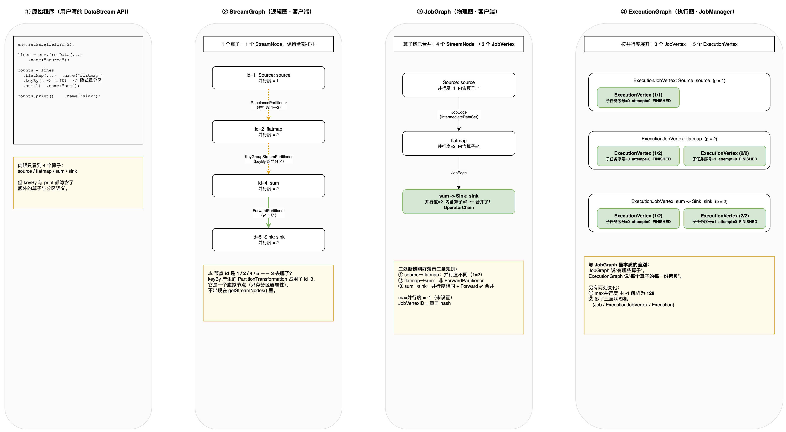

# 一个 WordCount 看懂 Flink 的三张图：StreamGraph / JobGraph / ExecutionGraph

> 配套代码：`learn-flink/src/main/java/com/learn/flink/sample/GraphComparisonJob.java`
> 配套图：`doc/assets/` 下的 [`three-graphs-comparison.drawio`](../../assets/three-graphs-comparison.drawio)（源文件） · [`three-graphs-comparison.png`](../../assets/three-graphs-comparison.png)（图片）
> 环境：Flink 1.20.4 · JDK 17 · 本地 MiniCluster

---

## 0. 一句话区分

| 图 | 是什么 | 在哪生成 | 由谁持有 | 节点粒度 |
|---|---|---|---|---|
| **StreamGraph** | 逻辑图 | **客户端** | `StreamExecutionEnvironment` | 1 个算子 = 1 个 <a href="../../../../flink-1.20-source/flink-streaming-java/src/main/java/org/apache/flink/streaming/api/graph/StreamNode.java#L55" style="color:#0969da"><code style="color:#0969da;background:transparent;border:none">StreamNode</code></a> |
| **JobGraph** | 物理图 / 提交信封 | **客户端** | <a href="../../../../flink-1.20-source/flink-core/src/main/java/org/apache/flink/core/execution/PipelineExecutor.java#L29" style="color:#0969da"><code style="color:#0969da;background:transparent;border:none">PipelineExecutor</code></a> | **算子链合并后**的 <a href="../../../../flink-1.20-source/flink-runtime/src/main/java/org/apache/flink/runtime/jobgraph/JobVertex.java#L47" style="color:#0969da"><code style="color:#0969da;background:transparent;border:none">JobVertex</code></a> |
| **ExecutionGraph** | 执行图 | **JobManager** | <a href="../../../../flink-1.20-source/flink-runtime/src/main/java/org/apache/flink/runtime/jobmaster/JobMaster.java#L170" style="color:#0969da"><code style="color:#0969da;background:transparent;border:none">JobMaster</code></a> | 按并行度**展开**的 <a href="../../../../flink-1.20-source/flink-runtime/src/main/java/org/apache/flink/runtime/executiongraph/ExecutionVertex.java#L60" style="color:#0969da"><code style="color:#0969da;background:transparent;border:none">ExecutionVertex</code></a> |

一次转换就是一次「**信息补全 + 结构重组**」：

```
用户程序（DataStream API 调用）
    ↓ StreamGraphGenerator.generate()
StreamGraph          4 个 StreamNode，保留全部拓扑与分区方式
    ↓ StreamingJobGraphGenerator.createJobGraph()   ← 算子链在此合并
JobGraph             3 个 JobVertex（sum + sink 合并了），带 jar/classpath
    ↓ 提交到 JobManager → DefaultExecutionGraphBuilder.buildGraph()
ExecutionGraph       3 个 ExecutionJobVertex → 5 个 ExecutionVertex（按并行度展开）
```

---

## 1. 原始程序

```java
StreamExecutionEnvironment env = StreamExecutionEnvironment.getExecutionEnvironment();
env.setParallelism(2);

DataStream<String> lines = env.fromData("hello flink", "hello spark", "flink and spark")
        .name("source");

DataStream<Tuple2<String, Integer>> counts = lines
        .flatMap((String line, Collector<Tuple2<String, Integer>> out) -> {
            for (String w : line.split("\\s+")) if (!w.isEmpty()) out.collect(Tuple2.of(w, 1));
        })
        .returns(Types.TUPLE(Types.STRING, Types.INT))
        .name("flatmap")
        .keyBy(t -> t.f0)      // ← 隐式产生一个重分区
        .sum(1)
        .name("sum");

counts.print().name("sink");   // ← 隐式产生一个 Sink 算子
```

**肉眼只看到 4 个算子**，但 Flink 内部要处理的分区、链、并行度展开远不止这些。

---

## 2. StreamGraph（逻辑图）

### 2.1 从哪来

```
env.execute() / env.getStreamGraph()
  → StreamGraphGenerator(transformations, executionConfig, checkpointConfig, configuration)
        .generate()
      → 遍历 StreamExecutionEnvironment.transformations 里的每个 Transformation
        （递归向 input 方向走），逐个翻译成 StreamNode / StreamEdge
```

关键输入是 `StreamExecutionEnvironment.transformations` —— 用户每调一次 DataStream API，就 `addOperator()` 记一条。

### 2.2 真实输出

```
算子节点数 = 4，Source = [1]，Sink = [5]，并行度=1

-- 节点（StreamNode）--
  id=1   Source: source 并行度=1  in=0  out=1   slotSharingGroup=default
  id=2   flatmap        并行度=2  in=1  out=1   slotSharingGroup=default
  id=4   sum            并行度=2  in=1  out=1   slotSharingGroup=default
  id=5   Sink: sink     并行度=2  in=1  out=0   slotSharingGroup=default

-- 边（StreamEdge）--
  1(Source: source) --[RebalancePartitioner]--> 2
  2(flatmap) --[KeyGroupStreamPartitioner]--> 4
  4(sum) --[ForwardPartitioner]--> 5
```

### 2.3 三个值得注意的点

**① 节点 id 是 1、2、4、5 —— `3` 去哪了？**

`keyBy` 产生的是一个 `PartitionTransformation`。`StreamGraphGenerator` 的类注释说得很清楚：

> Partitioning, split/select and union don't create actual nodes in the <a href="../../../../flink-1.20-source/flink-streaming-java/src/main/java/org/apache/flink/streaming/api/graph/StreamGraph.java#L89" style="color:#0969da"><code style="color:#0969da;background:transparent;border:none">StreamGraph</code></a>. For these, we create a **virtual node** ...

也就是说 id=3 被分配给了那个**虚拟分区节点**，它持有"用什么分区器"这个属性，但**不出现在 `getStreamNodes()` 里**。所以遍历节点会看到 id 空洞——这不是 bug。

**② `env.setParallelism(2)` 没作用到 Source**

Source 的并行度是 **1**。因为 `env.fromData(...)` 是集合 Source，它显式用并行度 1（否则空集合的切片没有意义）。这个差异后面会直接导致"Source 和 flatmap 断链"。

**③ 三种分区器已经确定**

| 边 | 分区器 | 含义 |
|---|---|---|
| source → flatmap | `RebalancePartitioner` | 轮询，因为下游并行度(2) > 上游(1) |
| flatmap → sum | `KeyGroupStreamPartitioner` | keyBy 的哈希分区 |
| sum → sink | <a href="../../../../flink-1.20-source/flink-streaming-java/src/main/java/org/apache/flink/streaming/runtime/partitioner/ForwardPartitioner.java#L31" style="color:#0969da"><code style="color:#0969da;background:transparent;border:none">ForwardPartitioner</code></a> | 一对一，**这条边可以被链合并** |

### 2.4 打印 API

```java
StreamGraph streamGraph = env.getStreamGraph(false);   // false = 不清空 transformations
streamGraph.getStreamNodes();                          // 遍历 StreamNode
streamGraph.getStreamingPlanAsJSON();                  // Web UI 上看到的那份 JSON
env.getExecutionPlan();                                // 等价于上一行的便捷方法
```

---

## 3. JobGraph（物理图 / 提交信封）

### 3.1 从哪来

```
StreamGraph.getJobGraph(userClassLoader, jobID)
  → StreamingJobGraphGenerator.createJobGraph()
        ├─ 生成确定性 hash（作为 JobVertexID 来源）
        ├─ setChaining(hashes, legacyHashes)      ★ 算子链在这里合并
        ├─ setPhysicalEdges()                     ← 断链处生成 IntermediateDataSet + JobEdge
        ├─ setSlotSharingAndCoLocation()
        └─ configureCheckpointing() / setJobConfiguration() ...
```

### 3.2 真实输出

```
JobVertex 数量 = 3

-- 顶点（JobVertex，已合并算子链）--
  Source: source           并行度=1  max并行度=-1  是Source=true   内含算子数=1
      JobVertexID = bc764cd8ddf7a0cff126f51c16239658
      产出中间结果 = 1 个
  flatmap                  并行度=2  max并行度=-1  是Source=false  内含算子数=1
      JobVertexID = 0a448493b4782967b150582570326227
      产出中间结果 = 1 个
  sum -> Sink: sink        并行度=2  max并行度=-1  是Source=false  内含算子数=2   ← 合并了！
      JobVertexID = e70bbd798b564e0a50e10e343f1ac56b
      产出中间结果 = 0 个

-- 边（JobEdge，只存在于断链处）--
  Source: source(产出集) --> flatmap
  flatmap(产出集) --> sum -> Sink: sink

-- 提交信封里挂了什么 --
  userJars         = []
  classpaths       = []
  savepoint恢复     = SavepointRestoreSettings.none()
  jobConfiguration 条目数 = 3
```

### 3.3 相比 StreamGraph 变了什么

**① 4 个节点 → 3 个节点**：`sum` 和 `Sink: sink` 被合并成一个 <a href="../../../../flink-1.20-source/flink-runtime/src/main/java/org/apache/flink/runtime/jobgraph/JobVertex.java#L47" style="color:#0969da"><code style="color:#0969da;background:transparent;border:none">JobVertex</code></a>（名字变成 `sum -> Sink: sink`，`内含算子数=2`）。

**② 三处断链，正好把 `isChainable()` 的三种规则各演示了一遍**：

| 边 | 结果 | 断链原因 |
|---|---|---|
| source(1) → flatmap(2) | ❌ 断链 | **并行度不同**（1 ≠ 2） |
| flatmap(2) → sum(2) | ❌ 断链 | **非 <a href="../../../../flink-1.20-source/flink-streaming-java/src/main/java/org/apache/flink/streaming/runtime/partitioner/ForwardPartitioner.java#L31" style="color:#0969da"><code style="color:#0969da;background:transparent;border:none">ForwardPartitioner</code></a>**（keyBy 是哈希分区，必须过网络） |
| sum(2) → sink(2) | ✅ **合并** | 并行度相同 + <a href="../../../../flink-1.20-source/flink-streaming-java/src/main/java/org/apache/flink/streaming/runtime/partitioner/ForwardPartitioner.java#L31" style="color:#0969da"><code style="color:#0969da;background:transparent;border:none">ForwardPartitioner</code></a> |

**③ 出现 <a href="../../../../flink-1.20-source/flink-runtime/src/main/java/org/apache/flink/runtime/jobgraph/IntermediateDataSet.java#L35" style="color:#0969da"><code style="color:#0969da;background:transparent;border:none">IntermediateDataSet</code></a>**：`StreamEdge` 是逻辑边，而 <a href="../../../../flink-1.20-source/flink-runtime/src/main/java/org/apache/flink/runtime/jobgraph/JobEdge.java#L30" style="color:#0969da"><code style="color:#0969da;background:transparent;border:none">JobEdge</code></a> 只在**断链处**存在，它连接的是「上游的中间结果产出集」→「下游顶点」。所以 3 个顶点只有 2 条 <a href="../../../../flink-1.20-source/flink-runtime/src/main/java/org/apache/flink/runtime/jobgraph/JobEdge.java#L30" style="color:#0969da"><code style="color:#0969da;background:transparent;border:none">JobEdge</code></a>。

**④ <a href="../../../../flink-1.20-source/flink-runtime/src/main/java/org/apache/flink/runtime/jobgraph/JobVertexID.java#L28" style="color:#0969da"><code style="color:#0969da;background:transparent;border:none">JobVertexID</code></a> 是 hash**：`bc764cd8...` 这种 32 位十六进制串来自算子的确定性 hash。**改算子结构 → hash 变 → ID 变 → savepoint 恢复失败**，这条运维规则的根源就在这里。

**⑤ `max并行度 = -1`**：此时还没解析，`-1` 表示"未设置"（常量 `JobVertex.MAX_PARALLELISM_DEFAULT`）。它的解析**不在 ExecutionGraph 的构建过程里**，而在建图之前的 <a href="../../../../flink-1.20-source/flink-runtime/src/main/java/org/apache/flink/runtime/scheduler/SchedulerBase.java#L316" style="color:#0969da"><code style="color:#0969da;background:transparent;border:none">SchedulerBase.computeVertexParallelismStore()</code></a>（见下一节）。

**⑥ 它还是「提交信封」**：`userJars`、`classpaths`、`SavepointRestoreSettings`、`jobConfiguration` 全挂在 <a href="../../../../flink-1.20-source/flink-runtime/src/main/java/org/apache/flink/runtime/jobgraph/JobGraph.java#L67" style="color:#0969da"><code style="color:#0969da;background:transparent;border:none">JobGraph</code></a> 上——它不只是图，而是整个作业提交的载体。

### 3.4 打印 API

```java
JobGraph jobGraph = streamGraph.getJobGraph();

jobGraph.getVerticesSortedTopologicallyFromSources();  // 拓扑序遍历 JobVertex
v.getOperatorIDs().size();                             // 内含几个算子（>1 说明发生了链合并）
v.getProducedDataSets();                               // 产出的 IntermediateDataSet
v.getInputs();                                         // 入边 JobEdge

JsonPlanGenerator.generatePlan(jobGraph);              // 转成 JSON
```

---

## 4. ExecutionGraph（执行图）

### 4.1 从哪来

```
JobMaster 构造
  → DefaultSchedulerFactory.createInstance()
      → new DefaultScheduler(...) → SchedulerBase
          → DefaultExecutionGraphFactory.createAndRestoreExecutionGraph(jobGraph, ...)
              → DefaultExecutionGraphBuilder.buildGraph(...)
```

**注意：<a href="../../../../flink-1.20-source/flink-runtime/src/main/java/org/apache/flink/runtime/executiongraph/ExecutionGraph.java#L89" style="color:#0969da"><code style="color:#0969da;background:transparent;border:none">ExecutionGraph</code></a> 只存在于 JobManager 进程里**，客户端拿不到。所以要观察它，必须真的把作业跑起来（本例用 MiniCluster 把 JM/TM 拉进同一个 JVM）。

### 4.2 真实输出

```
作业 = Flink Streaming Job (eb564a87...)  状态 = FINISHED

-- ExecutionJobVertex（每个 JobVertex 一个）--
  Source: source           并行度=1  max并行度=128  聚合状态=FINISHED  子任务数=1
  flatmap                  并行度=2  max并行度=128  聚合状态=FINISHED  子任务数=2
  sum -> Sink: sink        并行度=2  max并行度=128  聚合状态=FINISHED  子任务数=2

-- ExecutionVertex（按并行度展开！这是与 JobGraph 最大的差别）--
  Source: source (1/1)            子任务序号=0  当前 attempt=0  状态=FINISHED
  flatmap (1/2)                   子任务序号=0  当前 attempt=0  状态=FINISHED
  flatmap (2/2)                   子任务序号=1  当前 attempt=0  状态=FINISHED
  sum -> Sink: sink (1/2)         子任务序号=0  当前 attempt=0  状态=FINISHED
  sum -> Sink: sink (2/2)         子任务序号=1  当前 attempt=0  状态=FINISHED
```

### 4.3 相比 JobGraph 变了什么

**① 结构被「展开」了**：<a href="../../../../flink-1.20-source/flink-runtime/src/main/java/org/apache/flink/runtime/jobgraph/JobVertex.java#L47" style="color:#0969da"><code style="color:#0969da;background:transparent;border:none">JobVertex</code></a> 只有 3 个，但它们**共有 5 个并行子任务**。<a href="../../../../flink-1.20-source/flink-runtime/src/main/java/org/apache/flink/runtime/executiongraph/ExecutionGraph.java#L89" style="color:#0969da"><code style="color:#0969da;background:transparent;border:none">ExecutionGraph</code></a> 为每个子任务都建了一个 <a href="../../../../flink-1.20-source/flink-runtime/src/main/java/org/apache/flink/runtime/executiongraph/ExecutionVertex.java#L60" style="color:#0969da"><code style="color:#0969da;background:transparent;border:none">ExecutionVertex</code></a>：

```
JobGraph                     ExecutionGraph
─────────────                ──────────────────────────────────
JobVertex "flatmap"    →     ExecutionJobVertex "flatmap"
 (并行度=2, 1个对象)            ├─ ExecutionVertex (1/2)  ← 子任务 0
                               └─ ExecutionVertex (2/2)  ← 子任务 1
```

这是三张图里**最本质的差别**：JobGraph 描述"有哪些算子"，ExecutionGraph 描述"**每个算子的每一份拷贝**"。

**② 多了一层 <a href="../../../../flink-1.20-source/flink-runtime/src/main/java/org/apache/flink/runtime/executiongraph/Execution.java#L115" style="color:#0969da"><code style="color:#0969da;background:transparent;border:none">Execution</code></a>（attempt）**：每个 <a href="../../../../flink-1.20-source/flink-runtime/src/main/java/org/apache/flink/runtime/executiongraph/ExecutionVertex.java#L60" style="color:#0969da"><code style="color:#0969da;background:transparent;border:none">ExecutionVertex</code></a> 可以有一次或多次 <a href="../../../../flink-1.20-source/flink-runtime/src/main/java/org/apache/flink/runtime/executiongraph/Execution.java#L115" style="color:#0969da"><code style="color:#0969da;background:transparent;border:none">Execution</code></a> 尝试（失败重试会产生 attempt=1、2...）。本例全部一次成功，所以 `当前 attempt=0`。

**③ 出现状态机**：`INITIALIZING → CREATED → SCHEDULED → DEPLOYING → RUNNING → FINISHED`。每层都有状态：
- `Execution`（单个子任务尝试）的状态
- `ExecutionJobVertex.getAggregateState()`（整组子任务的聚合状态）
- 作业级 `JobStatus`

**④ `max并行度` 从 `-1` 变成了 `128`**：`-1` 只是"未设置"。真正的解析发生在建图**之前**——<a href="../../../../flink-1.20-source/flink-runtime/src/main/java/org/apache/flink/runtime/scheduler/SchedulerBase.java#L316" style="color:#0969da"><code style="color:#0969da;background:transparent;border:none">SchedulerBase.computeVertexParallelismStore()</code></a> 发现等于 `JobVertex.MAX_PARALLELISM_DEFAULT`，就交给 <a href="../../../../flink-1.20-source/flink-runtime/src/main/java/org/apache/flink/runtime/state/KeyGroupRangeAssignment.java" style="color:#0969da"><code style="color:#0969da;background:transparent;border:none">KeyGroupRangeAssignment.computeDefaultMaxParallelism()</code></a>。

⚠️ **128 是下界，不是恒定默认值**：`DEFAULT_LOWER_BOUND_MAX_PARALLELISM = 1 << 7`，实际取 `min(max(roundUpToPowerOfTwo(p + p/2), 128), UPPER_BOUND)`。并行度很大时会按 1.5 倍向上取 2 的幂放大——所以并行度 1~170 时是 128，再大就不是了。maxParallelism 决定 key group 数量，**改它会让旧 savepoint 无法恢复**。

**⑤ 多了 `IntermediateResult` / `IntermediateResultPartition`**：<a href="../../../../flink-1.20-source/flink-runtime/src/main/java/org/apache/flink/runtime/jobgraph/JobGraph.java#L67" style="color:#0969da"><code style="color:#0969da;background:transparent;border:none">JobGraph</code></a> 的 <a href="../../../../flink-1.20-source/flink-runtime/src/main/java/org/apache/flink/runtime/jobgraph/IntermediateDataSet.java#L35" style="color:#0969da"><code style="color:#0969da;background:transparent;border:none">IntermediateDataSet</code></a> 是"抽象的产出集"，到 ExecutionGraph 才按并行度展开成一个个具体的 partition（供下游拉取）。

### 4.4 打印 API

ExecutionGraph 在 JobManager 里，本地示例通过 MiniCluster 取：

```java
MiniCluster miniCluster = new MiniCluster(new MiniClusterConfiguration.Builder()
        .setNumTaskManagers(2).setNumSlotsPerTaskManager(2).build());
miniCluster.start();
JobID jobId = miniCluster.submitJob(jobGraph).get().getJobID();

ArchivedExecutionGraph g = miniCluster.getArchivedExecutionGraph(jobId).get();
g.getVerticesTopologically();     // ExecutionJobVertex，拓扑序
g.getState();                     // JobStatus
g.getJsonPlan();                  // ★ 注意：这份 JSON 来自 JobGraph，不是 ExecutionGraph 自己生成的

for (AccessExecutionJobVertex ejv : g.getVerticesTopologically()) {
    ejv.getParallelism();              // 并行度
    ejv.getMaxParallelism();           // 解析后的 maxParallelism
    ejv.getAggregateState();           // 聚合状态
    for (AccessExecutionVertex ev : ejv.getTaskVertices()) {
        ev.getParallelSubtaskIndex();  // 子任务序号
        ev.getCurrentExecutionAttempt().getState();     // 该 attempt 的状态
        ev.getCurrentExecutionAttempt().getAttemptNumber();
    }
}
```

> 生产环境上观察 ExecutionGraph 更方便的方式是 **Web UI** 或 REST API：
> `GET /jobs/:jobId/plan`、`GET /jobs/:jobId/vertices/:vertexId/subtasks`。

---

## 5. 三张图对照总表

| 维度 | StreamGraph | JobGraph | ExecutionGraph |
|---|---|---|---|
| 中文叫法 | 逻辑图 | 物理图 / 作业图 | 执行图 |
| 节点类型 | <a href="../../../../flink-1.20-source/flink-streaming-java/src/main/java/org/apache/flink/streaming/api/graph/StreamNode.java#L55" style="color:#0969da"><code style="color:#0969da;background:transparent;border:none">StreamNode</code></a> | <a href="../../../../flink-1.20-source/flink-runtime/src/main/java/org/apache/flink/runtime/jobgraph/JobVertex.java#L47" style="color:#0969da"><code style="color:#0969da;background:transparent;border:none">JobVertex</code></a> | <a href="../../../../flink-1.20-source/flink-runtime/src/main/java/org/apache/flink/runtime/executiongraph/ExecutionJobVertex.java#L86" style="color:#0969da"><code style="color:#0969da;background:transparent;border:none">ExecutionJobVertex</code></a> + <a href="../../../../flink-1.20-source/flink-runtime/src/main/java/org/apache/flink/runtime/executiongraph/ExecutionVertex.java#L60" style="color:#0969da"><code style="color:#0969da;background:transparent;border:none">ExecutionVertex</code></a> + <a href="../../../../flink-1.20-source/flink-runtime/src/main/java/org/apache/flink/runtime/executiongraph/Execution.java#L115" style="color:#0969da"><code style="color:#0969da;background:transparent;border:none">Execution</code></a> |
| 边类型 | `StreamEdge` | <a href="../../../../flink-1.20-source/flink-runtime/src/main/java/org/apache/flink/runtime/jobgraph/JobEdge.java#L30" style="color:#0969da"><code style="color:#0969da;background:transparent;border:none">JobEdge</code></a> + <a href="../../../../flink-1.20-source/flink-runtime/src/main/java/org/apache/flink/runtime/jobgraph/IntermediateDataSet.java#L35" style="color:#0969da"><code style="color:#0969da;background:transparent;border:none">IntermediateDataSet</code></a> | `ExecutionEdge` + `IntermediateResult(Partition)` |
| 本案例节点数 | **4** | **3** | **3 / 5 / 5** |
| 算子链 | ❌ 未合并 | ✅ **已合并** | 沿用 JobGraph 的合并结果 |
| 并行度展开 | ❌ | ❌（只记并行度数值） | ✅ **展开成 ExecutionVertex** |
| 状态机 | ❌ | ❌ | ✅ 三层状态 |
| 失败重试 | ❌ | ❌ | ✅ attempt 维度 |
| 生成位置 | 客户端 | **客户端** | **JobManager** |
| 序列化 | 不序列化 | **Java 序列化**（提交时） | 不序列化（本进程内） |
| 生命周期 | 一次 `execute()` | 一次提交 | 一次作业执行（含所有 failover） |
| 能否用于 savepoint 映射 | ❌ | ✅ JobVertexID / OperatorID | ✅（运行时状态） |

### 一句话记忆

- **StreamGraph** = 用户写了什么（**1 算子 = 1 节点**）
- **JobGraph** = 要提交什么（**能合并的合并，能省的省**）
- **ExecutionGraph** = 实际跑什么（**按并行度铺开，带上状态**）

---

## 6. 自己动手

```bash
cd learn-flink-spark
mvn -pl learn-flink compile exec:exec -Dmain.class=com.learn.flink.sample.GraphComparisonJob
```

### 配套的三张图



*▲ 把「原始程序 → StreamGraph → JobGraph → ExecutionGraph」并排画出，标出了下面三件事：*

- 哪几个算子被链合并（颜色标记）
- 哪几条边断链、为什么断
- 并行度如何从 1 个 JobVertex 展开成 2 个 ExecutionVertex

> 图源文件见 [`three-graphs-comparison.drawio`](../../assets/three-graphs-comparison.drawio)。图中**曲边方框**表示对象 / 组件，**直角方框**表示方法调用。点击图片可放大。

### 可以自己改着玩的实验

| 改什么 | 观察哪张图 | 预期 |
|---|---|---|
| 去掉 `keyBy`，改成 `flatMap().sum()` | JobGraph | 全部算子可能链成一个 JobVertex（并行度一致时） |
| 把 `env.setParallelism(2)` 改成 1 | 全部 | StreamGraph 4 节点 → JobGraph 可能只剩 1 个 JobVertex |
| 加 `.disableChaining()` | JobGraph | 每个算子各占一个 JobVertex |
| 加 `.startNewChain()` | JobGraph | 在此处强制断开 |
| `env.setMaxParallelism(64)` | ExecutionGraph | `max并行度` 从 128 变 64 |
| 提交后用 Web UI 看 | ExecutionGraph | 能看到每个子任务的实际部署节点 |

---

## 7. 易错点

1. **`env.getStreamGraph()` 默认会清空 transformations**。想拿完 StreamGraph 再转 JobGraph，必须用 `getStreamGraph(false)`。
2. **StreamGraph 的节点 id 有空洞是正常的**（`keyBy` 等虚拟节点占了号但不入列）。
3. **`env.setParallelism()` 不一定对所有算子生效**（如集合 Source 固定为 1），这会直接影响断链结果。
4. **<a href="../../../../flink-1.20-source/flink-runtime/src/main/java/org/apache/flink/runtime/jobgraph/JobGraph.java#L67" style="color:#0969da"><code style="color:#0969da;background:transparent;border:none">JobGraph</code></a> 的 `maxParallelism = -1` 不代表 1**，它表示"未设置"。解析不在 ExecutionGraph 构造里，而在建图之前的 `SchedulerBase.computeVertexParallelismStore()`（默认下界 128，并行度大时会放大）。
5. **`ArchivedExecutionGraph.getJsonPlan()` 返回的是 JobGraph 的 JSON**（在 `DefaultExecutionGraphBuilder` 里 `setJsonPlan(JsonPlanGenerator.generatePlan(jobGraph))`），不是 ExecutionGraph 特有的结构。
6. **MiniCluster 关闭时会打印若干 `TaskExecutor is shutting down` 异常**，属于正常噪音，不是作业失败。
