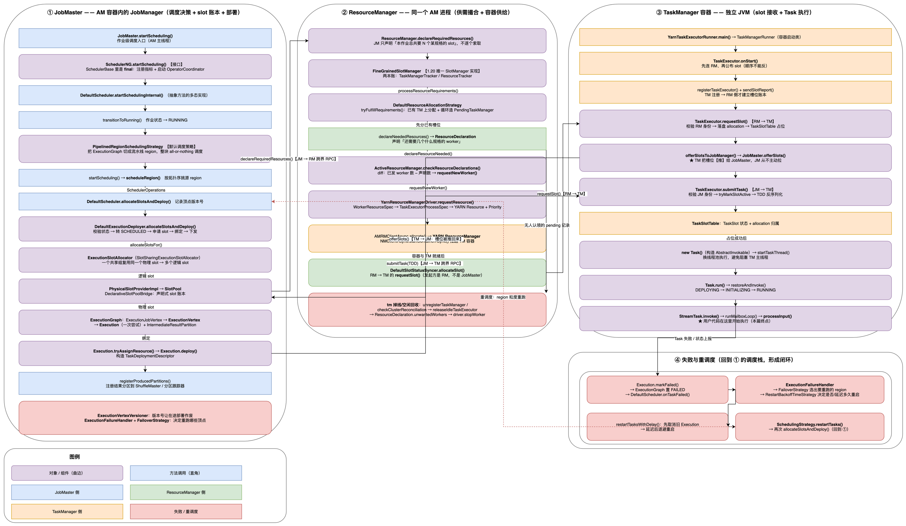
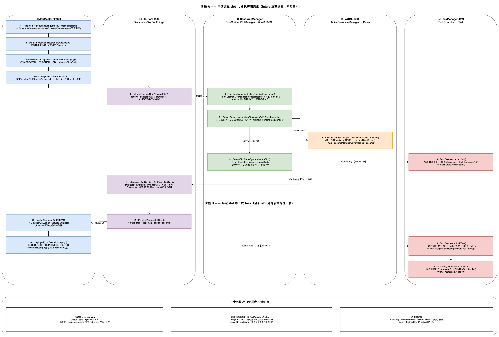

# Flink 作业调度与执行全流程解析（DefaultScheduler · Slot 分配 · TaskExecutor）

> **代码基线**：Apache Flink 1.20.4
> **源码位置**：仓库根目录 `flink-1.20-source/`（与 `learn-flink` 并列）
> **阅读方式**：文中**蓝色**的类名与方法名均可点击，直接跳到源码对应行；代码块均为**从源码实际抽取**
> **配套图**：
> [`job-scheduling-flow.drawio`](../../assets/job-scheduling-flow.drawio)（源文件） · [`job-scheduling-flow.png`](../../assets/job-scheduling-flow.png)（图片）
> [`slot-allocation-deploy-flow.drawio`](../../assets/slot-allocation-deploy-flow.drawio)（源文件） · [`slot-allocation-deploy-flow.png`](../../assets/slot-allocation-deploy-flow.png)（图片）
> **验证环境**：JDK 17 + 本地 MiniCluster / YARN per-job
> **衔接上一篇**：[`job-submission-yarn-per-job.md`](../job-submit/job-submission-yarn-per-job.md) 停在 <a href="../../../../flink-1.20-source/flink-runtime/src/main/java/org/apache/flink/runtime/taskexecutor/TaskExecutor.java#L721" style="color:#0969da"><code style="color:#0969da;background:transparent;border:none">TaskExecutor.submitTask()</code></a> → `new Task()`。**本篇从"`ExecutionGraph` 已经建好、但还没有任何顶点被调度"处接力往下走。**



*▲ 总览图：`JobMaster` 的调度栈（`SchedulerNG` → `DefaultScheduler` → `SchedulingStrategy` → `ExecutionDeployer`）如何把一批 `ExecutionVertex` 变成 `Execution`，再经由两层 slot（逻辑 slot / 物理 slot）与三套 RPC 落到 `TaskManager` 上执行。*
*图中**曲边方框**表示对象 / 组件，**直角方框**表示方法调用。点击图片可放大。*

> 若图片未渲染，直接打开：[`job-scheduling-flow.png`](../../assets/job-scheduling-flow.png) · 源文件 [`job-scheduling-flow.drawio`](../../assets/job-scheduling-flow.drawio)



*▲ 时序图：一次 `allocateSlotsAndDeploy()` 内部的完整往返 —— JobMaster 声明资源需求 → ResourceManager 撮合 → TaskManager 推回槽位 → JobMaster 绑定逻辑 slot → `submitTask` 下发 TDD → `Task.run()`。*

> 若图片未渲染，直接打开：[`slot-allocation-deploy-flow.png`](../../assets/slot-allocation-deploy-flow.png) · 源文件 [`slot-allocation-deploy-flow.drawio`](../../assets/slot-allocation-deploy-flow.drawio)

---

# 一、调度与执行的界限

## 1.1 一句话界定

> **从 `JobMaster` 决定"现在该调度哪些顶点"，到这些顶点对应的 `Task` 在 `TaskManager` 上真正开始执行用户代码；以及失败之后，同一批顶点被重新调度回来的那条回路。**

用一句话概括本篇与前一篇的分工：

| | 前一篇（job-submit） | 本篇（scheduling） |
|---|---|---|
| 回答的问题 | 作业**怎么被送进集群**、`JobGraph` 怎么变成 `ExecutionGraph` | `ExecutionGraph` 里的顶点**什么时候、按什么顺序、被放到哪个 slot 上跑** |
| 主角 | `CliFrontend` / `ClusterDescriptor` / `Dispatcher` / `JobMaster` 构造期 | `SchedulerNG` / `ExecutionDeployer` / `SlotPool` / `SlotManager` / `TaskExecutor` |
| 失败后 | 不涉及 | **重调度**（region failover）是本篇的一部分 |

## 1.2 起点与终点

| | 位置 | 标志性动作 | 源码入口 |
|---|---|---|---|
| **起点** | AM 容器的 JobMaster 主线程 | `onStart()` → `startJobExecution()` → `startScheduling()` | <a href="../../../../flink-1.20-source/flink-runtime/src/main/java/org/apache/flink/runtime/jobmaster/JobMaster.java#L1215" style="color:#0969da"><code style="color:#0969da;background:transparent;border:none">JobMaster.startJobExecution()</code></a> → <a href="../../../../flink-1.20-source/flink-runtime/src/main/java/org/apache/flink/runtime/jobmaster/JobMaster.java#L1321" style="color:#0969da"><code style="color:#0969da;background:transparent;border:none">startScheduling()</code></a> |
| **调度入口** | 同上 | `SchedulerNG.startScheduling()`（`final`，骨架方法） | <a href="../../../../flink-1.20-source/flink-runtime/src/main/java/org/apache/flink/runtime/scheduler/SchedulerBase.java#L675" style="color:#0969da"><code style="color:#0969da;background:transparent;border:none">SchedulerBase.startScheduling()</code></a> |
| **终点** | TM 容器的 Task 线程 | `Task.run()` → `restoreAndInvoke()` → `invokable.invoke()` → `StreamTask.invoke()` → `runMailboxLoop()` | <a href="../../../../flink-1.20-source/flink-runtime/src/main/java/org/apache/flink/runtime/taskmanager/Task.java#L613" style="color:#0969da"><code style="color:#0969da;background:transparent;border:none">Task.run()</code></a> → <a href="../../../../flink-1.20-source/flink-streaming-java/src/main/java/org/apache/flink/streaming/runtime/tasks/StreamTask.java#L903" style="color:#0969da"><code style="color:#0969da;background:transparent;border:none">StreamTask.invoke()</code></a> |
| **回路**（本篇独有） | AM 容器 | 失败 → `onTaskFailed()` → `FailoverStrategy` 选 region → `restartTasks()` → 再次 `allocateSlotsAndDeploy()` | <a href="../../../../flink-1.20-source/flink-runtime/src/main/java/org/apache/flink/runtime/scheduler/DefaultScheduler.java#L281" style="color:#0969da"><code style="color:#0969da;background:transparent;border:none">DefaultScheduler.onTaskFailed()</code></a> |

**起点的精确含义**：这一行代码被执行时，`ExecutionGraph` 已经存在（在 `JobMaster` 构造期由 `SchedulerBase` 建好并完成恢复，见上一篇 2.9 节），所有 `ExecutionVertex` 处于 `CREATED` 状态，**但还没有任何一个 slot 被申请**。

**终点的精确含义**：`Task` 对象的构造只是"拿到执行权"，真正的用户代码要等 `restoreAndInvoke()` 里状态推到 `RUNNING` 之后由 `invokable.invoke()` 触发。**此后算子怎么读数据、怎么写状态、怎么做 checkpoint，不属于本篇范畴。**

## 1.3 参与者和边界

调度与执行横跨 **3 个进程 / 4 个组件**，比提交流程少一个（客户端已经退出）：

```
① AM 容器（一个 JVM 里两个组件）                    ② YARN ResourceManager        ③ TM 容器
   JobMaster                ResourceManager               （Hadoop 侧）              TaskExecutor
   ├─ SchedulerNG              ├─ SlotManager              ├─ 维护集群资源             ├─ TaskSlotTable
   │   └─ DefaultScheduler     │   └─ FineGrained…        └─ 分配 Container           ├─ Task 线程
   ├─ ExecutionDeployer        └─ ActiveResourceManager         ↑                     └─ StreamTask
   ├─ SlotPoolService              └─ YarnResourceManagerDriver ┘                          ↑
   └─ ExecutionGraph                    │                                                  │
        ↑                               └──────────── 申请容器 / 启动 TM ───────────────────┘
        └──── ① SlotPool ←────── offerSlots ──────── TaskExecutor
              requestSlot ──────→ ② TaskExecutor
              submitTask ───────→ ③ TaskExecutor
```

三套 RPC 是理解本篇的关键（源码里就有一段注释把它们列全了，见 <a href="../../../../flink-1.20-source/flink-runtime/src/main/java/org/apache/flink/runtime/taskexecutor/TaskExecutor.java#L214" style="color:#0969da"><code style="color:#0969da;background:transparent;border:none">TaskExecutor</code></a> 类注释）：

| # | 方向 | 消息 | 语义 |
|---|---|---|---|
| 1 | RM → TM | `TaskExecutorGateway.requestSlot()` | "这次 allocation 落到你机器上的某个 slot" |
| 2 | TM → JM | `JobMasterGateway.offerSlots()` | **TM 把槽位推给 JobMaster**（不是 JM 来拉） |
| 3 | JM → TM | `TaskExecutorGateway.submitTask()` | 下发 `TaskDeploymentDescriptor`，TM 建 `Task` 起线程 |

> ⚠️ 第 2 条是本节最反直觉的地方：**JobMaster 从不主动"拉"槽位**。声明式 slot 池（`DeclarativeSlotPool`）只在需求侧记账，槽位由 TM 主动推回来。详见 2.6 节。

## 1.4 明确不包含什么

| 不属于本篇范围 | 属于哪个主题 |
|---|---|
| `JobGraph` → `ExecutionGraph` 的建图细节 | 任务提交（[`job-submit/`](../job-submit/)） |
| 算子内部数据处理、序列化、`OperatorChain` 内的转发细节 | 处理函数（`functions/`） |
| 网络栈、反压、buffer 管理 | 内存管理（`memory/`） |
| Checkpoint / Savepoint 的**执行过程** | 状态与容错（`state-fault-tolerance/`） |
| RPC 框架本身（Pekko）如何投递消息 | 组件通信（`rpc/`） |
| SQL 解析与优化 | Flink SQL |

> **为什么还是要先划界限**：调度这条线**极易被 `ExecutionGraph` 的体量带偏** —— `ExecutionGraph` 有 1700+ 行、`Execution` 有 1680 行，但调度真正做决策的代码只有 `DefaultScheduler`（608 行）与一个策略类（427 行）。**先记住"决策 / 分配 / 部署"三层，再往里看。**
>
> ⚠️ 另一条界限：**失败恢复的"重调度"在本篇，但"状态怎么恢复"不在**。也就是说本篇讲 `FailoverStrategy` 决定"重跑哪些顶点"，但不讲 `restore()` 里状态怎么读回来。

## 1.5 全流程鸟瞰：三层 + 11 步

调度与执行可以切成**三层**，这是本篇全部内容的骨架：

| 层 | 回答什么 | 主角 | 关键方法 |
|---|---|---|---|
| **① 决策层** | 现在该调度**哪些**顶点？ | <a href="../../../../flink-1.20-source/flink-runtime/src/main/java/org/apache/flink/runtime/scheduler/strategy/PipelinedRegionSchedulingStrategy.java#L52" style="color:#0969da"><code style="color:#0969da;background:transparent;border:none">PipelinedRegionSchedulingStrategy</code></a> | `startScheduling()` / `onExecutionStateChange()` / `restartTasks()` |
| **② 分配层** | 这些顶点放**哪个** slot？ | <a href="../../../../flink-1.20-source/flink-runtime/src/main/java/org/apache/flink/runtime/scheduler/SlotSharingExecutionSlotAllocator.java" style="color:#0969da"><code style="color:#0969da;background:transparent;border:none">SlotSharingExecutionSlotAllocator</code></a> → <a href="../../../../flink-1.20-source/flink-runtime/src/main/java/org/apache/flink/runtime/jobmaster/slotpool/DeclarativeSlotPoolBridge.java#L69" style="color:#0969da"><code style="color:#0969da;background:transparent;border:none">DeclarativeSlotPoolBridge</code></a> → <a href="../../../../flink-1.20-source/flink-runtime/src/main/java/org/apache/flink/runtime/resourcemanager/slotmanager/FineGrainedSlotManager.java#L82" style="color:#0969da"><code style="color:#0969da;background:transparent;border:none">FineGrainedSlotManager</code></a> | `allocateSlotsFor()` / `allocatePhysicalSlots()` / `declareNeededResources()` |
| **③ 部署层** | 怎么把 Task **送过去**并跑起来？ | <a href="../../../../flink-1.20-source/flink-runtime/src/main/java/org/apache/flink/runtime/scheduler/DefaultExecutionDeployer.java#L55" style="color:#0969da"><code style="color:#0969da;background:transparent;border:none">DefaultExecutionDeployer</code></a> → <a href="../../../../flink-1.20-source/flink-runtime/src/main/java/org/apache/flink/runtime/executiongraph/Execution.java#L561" style="color:#0969da"><code style="color:#0969da;background:transparent;border:none">Execution.deploy()</code></a> → <a href="../../../../flink-1.20-source/flink-runtime/src/main/java/org/apache/flink/runtime/taskexecutor/TaskExecutor.java#L721" style="color:#0969da"><code style="color:#0969da;background:transparent;border:none">TaskExecutor.submitTask()</code></a> | `allocateSlotsAndDeploy()` / `assignResource()` / `deployTaskSafe()` |

按时间顺序展开成 11 步（每一步都在后文有对应小节）：

| # | 所在进程 | 关键动作 | 关键类 | 对应小节 |
|---|---|---|---|---|
| 1 | AM | `startScheduling()` 注册指标、启动 OperatorCoordinator，再交给子类 | <a href="../../../../flink-1.20-source/flink-runtime/src/main/java/org/apache/flink/runtime/scheduler/SchedulerBase.java#L141" style="color:#0969da"><code style="color:#0969da;background:transparent;border:none">SchedulerBase</code></a> | 2.1 |
| 2 | AM | `transitionToRunning()` + 委托策略决定"调度哪些 region" | <a href="../../../../flink-1.20-source/flink-runtime/src/main/java/org/apache/flink/runtime/scheduler/DefaultScheduler.java#L88" style="color:#0969da"><code style="color:#0969da;background:transparent;border:none">DefaultScheduler</code></a> | 2.1 |
| 3 | AM | 找出源 region，按拓扑序逐个 `scheduleRegion()` | <a href="../../../../flink-1.20-source/flink-runtime/src/main/java/org/apache/flink/runtime/scheduler/strategy/PipelinedRegionSchedulingStrategy.java#L199" style="color:#0969da"><code style="color:#0969da;background:transparent;border:none">PipelinedRegionSchedulingStrategy</code></a> | 2.2 |
| 4 | AM | 记录顶点版本 → 转 `SCHEDULED` → 申请 slot → 绑定 → 下发 | <a href="../../../../flink-1.20-source/flink-runtime/src/main/java/org/apache/flink/runtime/scheduler/DefaultExecutionDeployer.java#L90" style="color:#0969da"><code style="color:#0969da;background:transparent;border:none">DefaultExecutionDeployer</code></a> | 2.3 |
| 5 | AM | 逻辑 slot 分配：共享组内复用物理槽位 | <a href="../../../../flink-1.20-source/flink-runtime/src/main/java/org/apache/flink/runtime/scheduler/SlotSharingExecutionSlotAllocator.java" style="color:#0969da"><code style="color:#0969da;background:transparent;border:none">SlotSharingExecutionSlotAllocator</code></a> | 2.5 |
| 6 | AM | 声明式 slot 池记账 + 向 RM 声明资源需求 | <a href="../../../../flink-1.20-source/flink-runtime/src/main/java/org/apache/flink/runtime/jobmaster/slotpool/SlotPool.java#L43" style="color:#0969da"><code style="color:#0969da;background:transparent;border:none">SlotPool</code></a> | 2.6 |
| 7 | AM | RM 撮合供需：够用就直接分，不够就去要容器 | <a href="../../../../flink-1.20-source/flink-runtime/src/main/java/org/apache/flink/runtime/resourcemanager/slotmanager/FineGrainedSlotManager.java#L82" style="color:#0969da"><code style="color:#0969da;background:transparent;border:none">FineGrainedSlotManager</code></a> | 2.7 |
| 8 | AM → YARN | 申请并启动 TM 容器 | <a href="../../../../flink-1.20-source/flink-yarn/src/main/java/org/apache/flink/yarn/YarnResourceManagerDriver.java" style="color:#0969da"><code style="color:#0969da;background:transparent;border:none">YarnResourceManagerDriver</code></a> | 2.8 |
| 9 | TM | 接收 slot、把槽位推回 JM | <a href="../../../../flink-1.20-source/flink-runtime/src/main/java/org/apache/flink/runtime/taskexecutor/TaskExecutor.java#L1271" style="color:#0969da"><code style="color:#0969da;background:transparent;border:none">TaskExecutor.requestSlot()</code></a> | 2.9 |
| 10 | TM | `submitTask()` → `new Task()` → 起线程 → 用户代码 | <a href="../../../../flink-1.20-source/flink-runtime/src/main/java/org/apache/flink/runtime/taskmanager/Task.java#L161" style="color:#0969da"><code style="color:#0969da;background:transparent;border:none">Task</code></a> | 2.10 |
| 11 | AM | 失败 → 选 region → 延迟重启 → 回到第 4 步 | <a href="../../../../flink-1.20-source/flink-runtime/src/main/java/org/apache/flink/runtime/executiongraph/failover/flip1/FailoverStrategy.java" style="color:#0969da"><code style="color:#0969da;background:transparent;border:none">FailoverStrategy</code></a> | 2.11 |

## 1.6 `ExecutionGraph` 的三层与"版本号"这套并发防护

读后面的代码前，先把两个概念钉死，否则会反复卡住。

### ① 三层结构 + 一次尝试

| 层 | 一个实例对应 | 数量关系 | 状态机 |
|---|---|---|---|
| <a href="../../../../flink-1.20-source/flink-runtime/src/main/java/org/apache/flink/runtime/executiongraph/ExecutionJobVertex.java#L86" style="color:#0969da"><code style="color:#0969da;background:transparent;border:none">ExecutionJobVertex</code></a> | 一个 `JobVertex` | = `JobVertex` 数 | — |
| <a href="../../../../flink-1.20-source/flink-runtime/src/main/java/org/apache/flink/runtime/executiongraph/ExecutionVertex.java#L60" style="color:#0969da"><code style="color:#0969da;background:transparent;border:none">ExecutionVertex</code></a> | 一个并发子任务 | = Σ 各顶点并行度 | — |
| <a href="../../../../flink-1.20-source/flink-runtime/src/main/java/org/apache/flink/runtime/executiongraph/Execution.java#L115" style="color:#0969da"><code style="color:#0969da;background:transparent;border:none">Execution</code></a> | 一个子任务的**一次尝试**（attempt） | ≥ 顶点数（重试会 +1） | ✅ `CREATED → SCHEDULED → DEPLOYING → RUNNING → FINISHED` |
| `IntermediateResultPartition` | 一次尝试产出的一个分区 | = ∇ 顶点并行度 × 出边 | `ProducerState` |

只有 `Execution` 带状态机 —— **`ExecutionVertex` 本身不"运行"，它只是"当前尝试"的容器**。失败重试 = 换一个 `Execution`（`attemptNumber + 1`），`ExecutionVertex` 不动。

### ② 版本号：让在途的部署"作废"

调度是**异步**的：申请 slot 要等 RPC，等回来的时候，这次部署可能早就被取消/失败取代了。Flink 的防护手段是**给每个顶点记一个版本号**：

```java
// SchedulerBase.java#L167
// ★ 顶点版本号记录器：部署/取消前先记录版本，之后只要版本变了就说明这批操作已作废。
//   它是"过期部署/过期重启不生效"的关键机制（另见 SchedulerBase.incrementVersionsOfAllVertices）。
protected final ExecutionVertexVersioner executionVertexVersioner;
```

<a href="../../../../flink-1.20-source/flink-runtime/src/main/java/org/apache/flink/runtime/scheduler/SchedulerBase.java#L630" style="color:#0969da"><code style="color:#0969da;background:transparent;border:none">SchedulerBase.incrementVersionsOfAllVertices()</code></a> 是"作废一切在途操作"的通用手段，`cancel()` / `failJob()` / `closeAsync()` 开头都会先调它一次：

```java
// SchedulerBase.java#L628
// ★ "让所有在途部署作废"的通用手段：把每个顶点的版本号 +1，之前记录下的版本就对不上了，
//   ExecutionDeployer 部署前会校验版本并静默丢弃。cancel / failJob / closeAsync 都会先调它。
private Map<ExecutionVertexID, ExecutionVertexVersion> incrementVersionsOfAllVertices() {
    return executionVertexVersioner.recordVertexModifications(
            IterableUtils.toStream(schedulingTopology.getVertices())
                    .map(SchedulingExecutionVertex::getId)
                    .collect(Collectors.toSet()));
}
```

消费端在 <a href="../../../../flink-1.20-source/flink-runtime/src/main/java/org/apache/flink/runtime/scheduler/DefaultExecutionDeployer.java#L210" style="color:#0969da"><code style="color:#0969da;background:transparent;border:none">DefaultExecutionDeployer.assignResource()</code></a> 与 <a href="../../../../flink-1.20-source/flink-runtime/src/main/java/org/apache/flink/runtime/scheduler/DefaultExecutionDeployer.java#L301" style="color:#0969da"><code style="color:#0969da;background:transparent;border:none">deployOrHandleError()</code></a> 里，判断条件只有一行：

```java
if (execution.getState() != ExecutionState.SCHEDULED
        || executionVertexVersioner.isModified(requiredVertexVersion)) {
    // 版本已变 → 这次部署过期了，静默放弃（已经拿到的 slot 直接还回去）
    ...
    return null;
}
```

> **记住这一条，后面 2.3 / 2.11 的代码都能读顺**：调度链路上任何"异步等回来再干活"的地方，都要先验一次版本；版本对不上就**静默丢弃**，而不是报错 —— 因为"被取消"和"被取代"本来就不是异常。

# 二、核心源码解析

## 2.1 调度栈骨架：`SchedulerNG` / `SchedulerBase` / `DefaultScheduler`

### 关键类

| 类 | 职责 |
|---|---|
| <a href="../../../../flink-1.20-source/flink-runtime/src/main/java/org/apache/flink/runtime/scheduler/SchedulerNG.java#L74" style="color:#0969da"><code style="color:#0969da;background:transparent;border:none">SchedulerNG</code></a> | 调度器对 `JobMaster` 的**唯一接口面** |
| <a href="../../../../flink-1.20-source/flink-runtime/src/main/java/org/apache/flink/runtime/scheduler/SchedulerBase.java#L141" style="color:#0969da"><code style="color:#0969da;background:transparent;border:none">SchedulerBase</code></a> | 公共骨架：持有 `ExecutionGraph`、托管 `OperatorCoordinator`、承接状态上报与生命周期 |
| <a href="../../../../flink-1.20-source/flink-runtime/src/main/java/org/apache/flink/runtime/scheduler/DefaultScheduler.java#L88" style="color:#0969da"><code style="color:#0969da;background:transparent;border:none">DefaultScheduler</code></a> | 1.20 默认调度器：装配调度策略 / slot 分配器 / failover 策略，把决策变成部署 |
| <a href="../../../../flink-1.20-source/flink-runtime/src/main/java/org/apache/flink/runtime/scheduler/DefaultSchedulerComponents.java#L45" style="color:#0969da"><code style="color:#0969da;background:transparent;border:none">DefaultSchedulerComponents</code></a> | "零件工厂"：决定用哪个策略与哪个 slot 分配器 |
| <a href="../../../../flink-1.20-source/flink-runtime/src/main/java/org/apache/flink/runtime/scheduler/ExecutionVertexVersioner.java#L45" style="color:#0969da"><code style="color:#0969da;background:transparent;border:none">ExecutionVertexVersioner</code></a> | 顶点版本号：让过期的部署 / 重启静默作废 |

### 步骤 1：三层结构 + 一个容易误解的接口契约

```
JobMaster
  └─ SchedulerNG                       ← 接口：startScheduling / cancel / updateTaskExecutionState / 检查点 / KV state
       └─ SchedulerBase                ← 骨架：ExecutionGraph + OperatorCoordinator + 指标 + 状态上报 + 生命周期
            ├─ DefaultScheduler        ← 决策：SchedulingStrategy + ExecutionSlotAllocator + FailoverStrategy
            └─ AdaptiveBatchScheduler  ← 批模式自适应（继承 DefaultScheduler，见 2.12）
     （AdaptiveScheduler 直接实现 SchedulerNG，不继承 SchedulerBase，见 2.12）
```

`SchedulerNG` 的线程契约写在接口 javadoc 里：

```java
// SchedulerNG.java#L71
 * <p>Implementations can expect that methods will not be invoked concurrently. In fact, all
 * invocations will originate from a thread in the {@link ComponentMainThreadExecutor}.
```

> ⚠️ 这是**约定而非强制**。真正的强制在 `SchedulerBase` 里 —— 每个入口都调 `mainThreadExecutor.assertRunningInMainThread()`（共 16 处，`startScheduling` / `cancel` / `closeAsync` / 各种 RPC 门面）。所有共享状态（`ExecutionGraph.state`、版本号 `HashMap`、拓扑索引表）**没有任何锁**，主线程串行就是唯一的同步手段。

### 步骤 2：`SchedulerBase.startScheduling()` —— `final` 的骨架方法

```java
// SchedulerBase.java#L668
    // ★★ JobMaster.startScheduling() 最终落到的就是这里（SchedulerNG 的接口方法，且被声明成 final）。
    //   骨架先把"与决策无关的准备工作"做完，再交给子类的 startSchedulingInternal()：
    //     ① 注册作业指标（uptime / downtime / NUM_RESTARTS / 各 JobStatus 时长等）；
    //     ② 启动所有 OperatorCoordinator —— 必须早于任何 Task 部署，否则 TM 侧发来的算子事件没有接收者；
    //     ③ 调 startSchedulingInternal()，由子类去决策（DefaultScheduler → SchedulingStrategy）。
    //   之所以是 final，就是为了保证"指标 + 协调器"这两步在任何调度器实现里都不会被漏掉。
    @Override
    public final void startScheduling() {
        mainThreadExecutor.assertRunningInMainThread();
        registerJobMetrics(
                jobManagerJobMetricGroup,
                executionGraph,
                this::getNumberOfRestarts,
                deploymentStateTimeMetrics,
                executionGraph::registerJobStatusListener,
                executionGraph.getStatusTimestamp(JobStatus.INITIALIZING),
                jobStatusMetricsSettings);
        operatorCoordinatorHandler.startAllOperatorCoordinators();
        startSchedulingInternal();
    }
```

三个必须记住的点：

1. **`startScheduling()` 不阻塞、也不表示调度完成**。它只表示"可以开始调度了"；资源不够时作业会**静默挂起等待**，不会抛异常。
2. **顺序不可换**：`OperatorCoordinator` 必须先启动，否则 TM 侧发来的算子事件没有接收者。
3. **`final` 是刻意设计**：保证任何调度器实现都不会漏掉"指标 + 协调器"。

### 步骤 3：`ExecutionGraph` 在调度器构造期就建好了

```java
// SchedulerBase.java#L238
        // ★ 调度器的构造期就把 ExecutionGraph 建好并恢复完毕（savepoint/checkpoint 恢复也在这里发生），
        //   也就是说构造一结束，作业拓扑、历史执行尝试、恢复出来的状态就已经全部就绪。
        this.executionGraph =
                createAndRestoreExecutionGraph(
                        completedCheckpointStore,
                        checkpointsCleaner,
                        checkpointIdCounter,
                        initializationTimestamp,
                        mainThreadExecutor,
                        jobStatusListener,
                        vertexParallelismStore);

        // 注意 SchedulingTopology 不是新建的，而是从 ExecutionGraph 上取到的视图，二者始终同步。
        this.schedulingTopology = executionGraph.getSchedulingTopology();
```

```java
// SchedulerBase.java#L394
    // ★ ExecutionGraph 的真正创建点。默认走 DefaultExecutionGraphFactory，它内部有三步容易忽略的动作：
    //   ① 建出图本身（默认 DefaultExecutionGraph，可由自定义 ExecutionGraphFactory 替换）；
    //   ② 挂上 InternalTaskFailuresListener —— ExecutionGraph 内部报出的失败会绕回调度器
    //      （notifyTaskFailure → updateTaskExecutionState，notifyGlobalFailure → handleGlobalFailure）；
    //   ③ registerJobStatusListener + start()，把图的状态机接到主线程 executor 上。
    private ExecutionGraph createAndRestoreExecutionGraph(...)
            throws Exception {
        final ExecutionGraph newExecutionGraph =
                executionGraphFactory.createAndRestoreExecutionGraph(
                        jobGraph,
                        completedCheckpointStore,
                        checkpointsCleaner,
                        checkpointIdCounter,
                        TaskDeploymentDescriptorFactory.PartitionLocationConstraint.fromJobType(
                                jobGraph.getJobType()),
                        initializationTimestamp,
                        new DefaultVertexAttemptNumberStore(),
                        vertexParallelismStore,
                        deploymentStateTimeMetrics,
                        getMarkPartitionFinishedStrategy(),
                        log);

        newExecutionGraph.setInternalTaskFailuresListener(
                new UpdateSchedulerNgOnInternalFailuresListener(this));
        newExecutionGraph.registerJobStatusListener(jobStatusListener);
        newExecutionGraph.start(mainThreadExecutor);

        return newExecutionGraph;
    }
```

- **`new JobMaster(...)` 返回时执行图已经存在**，`start()` 只是注入主线程 executor 让状态变更串行（见 <a href="../../../../flink-1.20-source/flink-runtime/src/main/java/org/apache/flink/runtime/executiongraph/DefaultExecutionGraph.java#L409" style="color:#0969da"><code style="color:#0969da;background:transparent;border:none">DefaultExecutionGraph.start()</code></a>）。
- `getMarkPartitionFinishedStrategy()` 默认只对 **blocking** 分区返回 true（<a href="../../../../flink-1.20-source/flink-runtime/src/main/java/org/apache/flink/runtime/scheduler/SchedulerBase.java#L623" style="color:#0969da"><code style="color:#0969da;background:transparent;border:none">SchedulerBase.java#L623</code></a>）—— 流水线分区是边写边读，不存在"写完了"这个时刻。

### 步骤 4：调度器为什么是"事件驱动"的

调度器**没有轮询线程**。所有推进都由 TM 上报的状态变化推着走：

```java
// SchedulerBase.java#L819
    // ★ TM 上报 Task 状态变化的入口（JobMaster 收到 RPC 后转发到这里）。注意两点：
    //   attemptId 对应的 Execution 查不到时直接返回 false（迟到的上报被丢掉），
    //   只有真正生效的状态变更才会触发后面的业务钩子。
    @Override
    public boolean updateTaskExecutionState(final TaskExecutionStateTransition taskExecutionState) {

        final ExecutionAttemptID attemptId = taskExecutionState.getID();
        final Execution execution = executionGraph.getRegisteredExecutions().get(attemptId);
        if (execution != null && executionGraph.updateState(taskExecutionState)) {
            onTaskExecutionStateUpdate(execution, taskExecutionState);
            return true;
        }

        return false;
    }

    // ★ 这里解释了"调度器为什么是事件驱动的"：只有 FINISHED / FAILED 两种状态会被转成业务钩子，
    //   其余状态（RUNNING、CANCELED 等）只更新 ExecutionGraph 本身。
    //   下游流水线 region 的调度、失败后的重跑，都分别从这两个分支发起。
    private void onTaskExecutionStateUpdate(
            final Execution execution, final TaskExecutionStateTransition taskExecutionState) {

        // only notifies a state update if it's effective, namely it successfully
        // turns the execution state to the expected value.
        if (execution.getState() != taskExecutionState.getExecutionState()) {
            return;
        }

        // only notifies FINISHED and FAILED states which are needed at the moment.
        // can be refined in FLINK-14233 after the actions are factored out from ExecutionGraph.
        switch (taskExecutionState.getExecutionState()) {
            case FINISHED:
                onTaskFinished(execution, taskExecutionState.getIOMetrics());
                break;
            case FAILED:
                onTaskFailed(execution);
                break;
        }
    }
```

> ⚠️ 只处理 `FINISHED` 与 `FAILED`。`RUNNING` / `CANCELING` / `CANCELED` 只更新图，**不触发任何调度动作** —— 这就是"作业显示 RUNNING 但没有任何 task 在跑"的原因。

### 步骤 5：`DefaultScheduler` 的构造期装配

```java
// DefaultScheduler.java#L177
        this.failoverStrategy =
                failoverStrategyFactory.create(
                        getSchedulingTopology(), getResultPartitionAvailabilityChecker());
        log.info(
                "Using failover strategy {} for {} ({}).",
                failoverStrategy,
                jobGraph.getName(),
                jobGraph.getJobID());
        ...
        this.schedulingStrategy =
                schedulingStrategyFactory.createInstance(this, getSchedulingTopology());

        this.executionSlotAllocator =
                checkNotNull(executionSlotAllocatorFactory)
                        .createInstance(new DefaultExecutionSlotAllocationContext());

        this.verticesWaitingForRestart = new HashSet<>();
        // startUpAction 实际是 PhysicalSlotRequestBulkChecker.start()（见 DefaultSchedulerComponents），构造中途就启动。
        startUpAction.accept(mainThreadExecutor);

        // executionDeployer 放在最后创建：它依赖上面已建好的 executionSlotAllocator 与 startReserveAllocation 回调。
        this.executionDeployer =
                executionDeployerFactory.createInstance(
                        log,
                        executionSlotAllocator,
                        executionOperations,
                        executionVertexVersioner,
                        rpcTimeout,
                        this::startReserveAllocation,
                        mainThreadExecutor);
```

三个值得注意的点：

1. **策略工厂拿到的第一个参数是 `this`** —— `DefaultScheduler` 同时也是 `SchedulerOperations` 接口的实现，这就是"策略单向回调 `allocateSlotsAndDeploy`"的全部机制。
2. **`failoverStrategy` 用的是同一个 `getSchedulingTopology()`** —— 于是**region 既是调度单位，也是最小重启单位**。
3. `startUpAction` 是 `PhysicalSlotRequestBulkChecker.start()`，**在构造函数中途就启动了**。

### 步骤 6：`startSchedulingInternal()` —— 只做两件事

```java
// DefaultScheduler.java#L245
    // ★ 调度的真正起点（由 SchedulerBase.startScheduling() 调用，那一层已注册好指标并启动了 OperatorCoordinator）。
    //   本方法自身不含任何决策逻辑，只做两件事：① transitionToRunning() 把作业状态推到 RUNNING，
    //   Web UI 上"作业开始运行"就是这一步；② 把"调度谁、按什么顺序"全权委托给 SchedulingStrategy。
    @Override
    protected void startSchedulingInternal() {
        log.info(
                "Starting scheduling with scheduling strategy [{}]",
                schedulingStrategy.getClass().getName());
        transitionToRunning();
        schedulingStrategy.startScheduling();
    }
```

> ⚠️ **`RUNNING` 状态在第一个 slot 被申请之前就置上了**。Web UI 显示 RUNNING **完全不代表**有 task 在跑 —— 容器没起来时作业也会显示 RUNNING 并一直挂着。

### 步骤 7：`allocateSlotsAndDeploy()` —— "决策"与"执行"的接缝

```java
// DefaultScheduler.java#L488
    // ★★ 【调度决策 → 真正下发】的分界点。调用方是 SchedulingStrategy.scheduleRegion()，
    //    参数是一整批要部署的顶点（同一个流水线 region 内的全部顶点）。
    //    第 1 步：先给这批顶点记录版本号 —— 之后若发生 failover / cancel，版本变化会让这次部署
    //           被判为"过期"而丢弃，防止迟到的部署打到新的 Execution 上。
    //    第 2 步：把 ExecutionVertexID 换成各自的"当前 Execution"（只是取当前尝试，不新建对象）。
    //    第 3 步：交给 ExecutionDeployer.allocateSlotsAndDeploy()，那里才是真正的三段式：
    //            a) ExecutionSlotAllocator 申请逻辑 slot（→ PhysicalSlotProvider → SlotPool）；
    //            b) 等所有 slot 到位 —— 这一步是【异步】的，可能要等 ResourceManager 拉起新 TM；
    //            c) 逐个调用 Execution.deploy() → TaskManagerGateway.submitTask() 真正下发到 TM。
    //    所以本方法只有四行，却是"决策"与"执行"两大阶段的接缝。
    @Override
    public void allocateSlotsAndDeploy(final List<ExecutionVertexID> verticesToDeploy) {
        final Map<ExecutionVertexID, ExecutionVertexVersion> requiredVersionByVertex =
                executionVertexVersioner.recordVertexModifications(verticesToDeploy);

        final List<Execution> executionsToDeploy =
                verticesToDeploy.stream()
                        .map(this::getCurrentExecutionOfVertex)
                        .collect(Collectors.toList());

        executionDeployer.allocateSlotsAndDeploy(executionsToDeploy, requiredVersionByVertex);
    }
```

**版本号机制**（本篇的"并发安全带"）在 <a href="../../../../flink-1.20-source/flink-runtime/src/main/java/org/apache/flink/runtime/scheduler/ExecutionVertexVersioner.java#L49" style="color:#0969da"><code style="color:#0969da;background:transparent;border:none">ExecutionVertexVersioner</code></a> 里，只有 20 行核心代码：

```java
// ExecutionVertexVersioner.java#L47
    public ExecutionVertexVersion recordModification(final ExecutionVertexID executionVertexId) {
        final Long newVersion = executionVertexToVersion.merge(executionVertexId, 1L, Long::sum);
        return new ExecutionVertexVersion(executionVertexId, newVersion);
    }

    public boolean isModified(final ExecutionVertexVersion executionVertexVersion) {
        final Long currentVersion =
                getCurrentVersion(executionVertexVersion.getExecutionVertexId());
        return currentVersion != executionVertexVersion.getVersion();
    }
```

| 场景 | 调用点 |
|---|---|
| 部署前**记录** | `DefaultScheduler.allocateSlotsAndDeploy()`（<a href="../../../../flink-1.20-source/flink-runtime/src/main/java/org/apache/flink/runtime/scheduler/DefaultScheduler.java#L504" style="color:#0969da"><code style="color:#0969da;background:transparent;border:none">#L504</code></a>） |
| 重启前**记录** | `DefaultScheduler.restartTasksWithDelay()`（<a href="../../../../flink-1.20-source/flink-runtime/src/main/java/org/apache/flink/runtime/scheduler/DefaultScheduler.java#L367" style="color:#0969da"><code style="color:#0969da;background:transparent;border:none">#L367</code></a>） |
| 全局**作废** | `SchedulerBase.incrementVersionsOfAllVertices()`（<a href="../../../../flink-1.20-source/flink-runtime/src/main/java/org/apache/flink/runtime/scheduler/SchedulerBase.java#L630" style="color:#0969da"><code style="color:#0969da;background:transparent;border:none">#L630</code></a>），被 `cancel()` / `failJob()` / `closeAsync()` 调用 |
| **校验**（两处） | `DefaultExecutionDeployer.assignResource()` 与 `deployOrHandleError()` |

> ⚠️ `isModified` 用的是 `!=` 而不是 `>`；且 `getCurrentVersion` 对**从未记录过版本**的顶点会直接 `checkState` 报错 —— 所以必须先记录再校验。

### 步骤 8：`DefaultSchedulerComponents` —— 策略与分配器的选型（★ 易错点集中地）

```java
// DefaultSchedulerComponents.java#L87
    private static DefaultSchedulerComponents createPipelinedRegionSchedulerComponents(
            final JobType jobType,
            final Configuration jobMasterConfiguration,
            final SlotPool slotPool,
            final Time slotRequestTimeout) {

        final SlotSelectionStrategy slotSelectionStrategy =
                SlotSelectionStrategyUtils.selectSlotSelectionStrategy(
                        jobType, jobMasterConfiguration);
        final PhysicalSlotRequestBulkChecker bulkChecker =
                PhysicalSlotRequestBulkCheckerImpl.createFromSlotPool(
                        slotPool, SystemClock.getInstance());
        final PhysicalSlotProvider physicalSlotProvider =
                new PhysicalSlotProviderImpl(slotSelectionStrategy, slotPool);
        final ExecutionSlotAllocatorFactory allocatorFactory =
                new SlotSharingExecutionSlotAllocatorFactory(
                        physicalSlotProvider,
                        jobType == JobType.STREAMING,
                        bulkChecker,
                        slotRequestTimeout);
        return new DefaultSchedulerComponents(
                new PipelinedRegionSchedulingStrategy.Factory(),
                bulkChecker::start,
                allocatorFactory);
    }
```

| 结论 | 依据 |
|---|---|
| **调度策略是硬编码的**：`new PipelinedRegionSchedulingStrategy.Factory()`。**没有任何配置项**能把 `DefaultScheduler` 切成 `VertexwiseSchedulingStrategy` | <a href="../../../../flink-1.20-source/flink-runtime/src/main/java/org/apache/flink/runtime/scheduler/DefaultSchedulerComponents.java#L108" style="color:#0969da"><code style="color:#0969da;background:transparent;border:none">#L108</code></a>，类 javadoc 也写明 *"Currently only supports PipelinedRegionSchedulingStrategy"* |
| **slot 分配器也永远是 `SlotSharingExecutionSlotAllocator`**，流批只差一个布尔位 `jobType == JobType.STREAMING`（是否长期占用槽位） | <a href="../../../../flink-1.20-source/flink-runtime/src/main/java/org/apache/flink/runtime/scheduler/DefaultSchedulerComponents.java#L101" style="color:#0969da"><code style="color:#0969da;background:transparent;border:none">#L101-106</code></a> |
| `SimpleExecutionSlotAllocator`（不支持 slot sharing / co-location / 本地恢复）**只在 AdaptiveBatch 路径被实例化** | <a href="../../../../flink-1.20-source/flink-runtime/src/main/java/org/apache/flink/runtime/scheduler/adaptivebatch/AdaptiveBatchSchedulerFactory.java#L350" style="color:#0969da"><code style="color:#0969da;background:transparent;border:none">AdaptiveBatchSchedulerFactory.java#L350</code></a> |
| **近似本地恢复与 PipelinedRegionScheduler 互斥**，构造期 `checkArgument` 直接拒绝 | <a href="../../../../flink-1.20-source/flink-runtime/src/main/java/org/apache/flink/runtime/scheduler/DefaultSchedulerComponents.java#L80" style="color:#0969da"><code style="color:#0969da;background:transparent;border:none">#L80-82</code></a> |
| `jobmanager.scheduler` 决定的是**用哪个 `SchedulerNG` 实现**，不是策略 | <a href="../../../../flink-1.20-source/flink-runtime/src/main/java/org/apache/flink/runtime/jobmaster/DefaultSlotPoolServiceSchedulerFactory.java#L214" style="color:#0969da"><code style="color:#0969da;background:transparent;border:none">DefaultSlotPoolServiceSchedulerFactory.java#L214</code></a> |

---

## 2.2 调度策略：`SchedulingTopology` 与 `PipelinedRegionSchedulingStrategy`

### 关键类

| 类 | 职责 |
|---|---|
| <a href="../../../../flink-1.20-source/flink-runtime/src/main/java/org/apache/flink/runtime/scheduler/strategy/SchedulingStrategy.java#L28" style="color:#0969da"><code style="color:#0969da;background:transparent;border:none">SchedulingStrategy</code></a> | 调度决策接口（5 个方法） |
| <a href="../../../../flink-1.20-source/flink-runtime/src/main/java/org/apache/flink/runtime/scheduler/strategy/SchedulingTopology.java#L27" style="color:#0969da"><code style="color:#0969da;background:transparent;border:none">SchedulingTopology</code></a> | `ExecutionGraph` 的**只读调度视图** |
| <a href="../../../../flink-1.20-source/flink-runtime/src/main/java/org/apache/flink/runtime/scheduler/adapter/DefaultExecutionTopology.java#L69" style="color:#0969da"><code style="color:#0969da;background:transparent;border:none">DefaultExecutionTopology</code></a> | 适配器，**流水线 region 在这里算出来** |
| <a href="../../../../flink-1.20-source/flink-runtime/src/main/java/org/apache/flink/runtime/scheduler/strategy/PipelinedRegionSchedulingStrategy.java#L52" style="color:#0969da"><code style="color:#0969da;background:transparent;border:none">PipelinedRegionSchedulingStrategy</code></a> | 默认（也是唯一可用）策略：**region 粒度 all-or-nothing** |
| <a href="../../../../flink-1.20-source/flink-runtime/src/main/java/org/apache/flink/runtime/scheduler/strategy/VertexwiseSchedulingStrategy.java#L48" style="color:#0969da"><code style="color:#0969da;background:transparent;border:none">VertexwiseSchedulingStrategy</code></a> | 顶点粒度策略，**只被 AdaptiveBatchScheduler 使用** |

### 步骤 1：策略只认识 `SchedulingTopology`，不认识 `ExecutionGraph`

`SchedulingTopology` 暴露的全部能力：`getVertex(id)`、`getResultPartition(id)`、`getAllPipelinedRegions()`、`getPipelinedRegionOfVertex(id)`、`registerSchedulingTopologyListener(...)`。

> ⚠️ **它没有任何 `transitionState` / `deploy` / `cancel` 方法**。策略唯一能"改变世界"的出口是 `SchedulerOperations.allocateSlotsAndDeploy(...)`。这就是本层的核心架构约束：**策略读只读视图、写单向下达**。

而且这个视图是**活视图而不是快照**：`DefaultExecutionVertex.getState()` 每次调用都通过 `Supplier<ExecutionState>` 实时取值（<a href="../../../../flink-1.20-source/flink-runtime/src/main/java/org/apache/flink/runtime/scheduler/adapter/DefaultExecutionVertex.java#L67" style="color:#0969da"><code style="color:#0969da;background:transparent;border:none">DefaultExecutionVertex.java#L67</code></a>）。所以策略两次读取之间状态可能变化 —— 这也是 `scheduleRegion()` 里要用 `checkState` 兜底的原因。

### 步骤 2：流水线 region 是怎么算出来的（4 步）

| 步 | 动作 | 代码 |
|---|---|---|
| ① | 按 `mustBePipelinedConsumed`（即 `MUST_BE_PIPELINED`）的边**合并顶点** | <a href="../../../../flink-1.20-source/flink-runtime/src/main/java/org/apache/flink/runtime/executiongraph/failover/PipelinedRegionComputeUtil.java#L35" style="color:#0969da"><code style="color:#0969da;background:transparent;border:none">PipelinedRegionComputeUtil.buildRawRegions()</code></a> |
| ② | 用 **Tarjan 强连通分量**合并成环的 region（迭代 / 反馈边） | <a href="../../../../flink-1.20-source/flink-runtime/src/main/java/org/apache/flink/runtime/executiongraph/failover/SchedulingPipelinedRegionComputeUtil.java#L69" style="color:#0969da"><code style="color:#0969da;background:transparent;border:none">mergeRegionsOnCycles()</code></a> |
| ③ | logical region 内只要有 **all-to-all 边**就整体当成一个 region（防调度死锁，FLINK-17330） | <a href="../../../../flink-1.20-source/flink-runtime/src/main/java/org/apache/flink/runtime/scheduler/adapter/DefaultExecutionTopology.java#L371" style="color:#0969da"><code style="color:#0969da;background:transparent;border:none">DefaultExecutionTopology.java#L371</code></a> |
| ④ | **co-location 约束（迭代 head/tail）必须同区** | <a href="../../../../flink-1.20-source/flink-runtime/src/main/java/org/apache/flink/runtime/scheduler/adapter/DefaultExecutionTopology.java#L440" style="color:#0969da"><code style="color:#0969da;background:transparent;border:none">ensureCoLocatedVerticesInSameRegion()</code></a> |

```java
// PipelinedRegionComputeUtil.java#L35
    static <V extends Vertex<?, ?, V, R>, R extends Result<?, ?, V, R>>
            Map<V, Set<V>> buildRawRegions(
                    final Iterable<? extends V> topologicallySortedVertices,
                    final Function<V, Iterable<R>> getMustBePipelinedConsumedResults) {

        final Map<V, Set<V>> vertexToRegion = new IdentityHashMap<>();

        // iterate all the vertices which are topologically sorted
        for (V vertex : topologicallySortedVertices) {
            Set<V> currentRegion = new HashSet<>();
            currentRegion.add(vertex);
            vertexToRegion.put(vertex, currentRegion);

            // Each vertex connected through not mustBePipelined consumingConstraint is considered
            // as a
            // single region.
            for (R consumedResult : getMustBePipelinedConsumedResults.apply(vertex)) {
                final V producerVertex = consumedResult.getProducer();
                final Set<V> producerRegion = vertexToRegion.get(producerVertex);
                ...
                // check if it is the same as the producer region, if so skip the merge
                // this check can significantly reduce compute complexity in All-to-All
                // PIPELINED edge case
                if (currentRegion != producerRegion) {
                    currentRegion =
                            VertexGroupComputeUtil.mergeVertexGroups(
                                    currentRegion, producerRegion, vertexToRegion);
                }
            }
        }

        return vertexToRegion;
    }
```

> ⚠️ **注释与代码不一致（源码里的中文注释写错了）**：`PipelinedRegionSchedulingStrategy` 类头注释说划分依据是 `canBePipelinedConsumed()`，但实际划分代码用的是 **`mustBePipelinedConsumed()`**。两者的差别在 hybrid 分区上：`canBePipelinedConsumed()` 还包含 `CAN_BE_PIPELINED`。**以代码为准**：
>
> ```java
> // ResultPartitionType.java#L157
>     /** return if this partition's upstream and downstream must be scheduled in the same time. */
>     public boolean mustBePipelinedConsumed() {
>         return consumingConstraint == ConsumingConstraint.MUST_BE_PIPELINED;
>     }
> ```

### 步骤 3：`startScheduling()` —— 只从源 region 出发

```java
// PipelinedRegionSchedulingStrategy.java#L197
    @Override
    // 【入口】作业启动时的第一次调度：只挑出"源区域"开始，其余区域等前面的区域跑完再被解锁。
    public void startScheduling() {
        final Set<SchedulingPipelinedRegion> sourceRegions =
                IterableUtils.toStream(schedulingTopology.getAllPipelinedRegions())
                        .filter(this::isSourceRegion)
                        .collect(Collectors.toSet());
        // 从源区域出发，顺着流水线边一层层向后推，直到再也推不出新的可调度区域。
        maybeScheduleRegions(sourceRegions);
    }

    // 源区域 = 没有任何"跨区域"或"外部"的 blocking 输入分组，即它可以直接开跑，不需要等别的区域。
    private boolean isSourceRegion(SchedulingPipelinedRegion region) {
        for (ConsumedPartitionGroup consumedPartitionGroup :
                region.getAllNonPipelinedConsumedPartitionGroups()) {
            if (crossRegionConsumedPartitionGroups.contains(consumedPartitionGroup)
                    || isExternalConsumedPartitionGroup(consumedPartitionGroup, region)) {
                return false;
            }
        }
        return true;
    }
```

### 步骤 4：`maybeScheduleRegions()` —— 核心扩散循环 + 唯一的下发出口

```java
// PipelinedRegionSchedulingStrategy.java#L247
    // ★ 核心循环：反复从候选集里挑出可调度的区域，并把它们的（流水线）下游区域作为下一批候选，
    //   直到再也推不出新区域 —— 每一轮都是一次"沿流水线边扩散"。最后按拓扑序部署，保证部署顺序与依赖一致。
    private void maybeScheduleRegions(final Set<SchedulingPipelinedRegion> regions) {
        final Set<SchedulingPipelinedRegion> regionsToSchedule = new HashSet<>();
        Set<SchedulingPipelinedRegion> nextRegions = regions;
        while (!nextRegions.isEmpty()) {
            nextRegions = addSchedulableAndGetNextRegions(nextRegions, regionsToSchedule);
        }
        // schedule regions in topological order.
        SchedulingStrategyUtils.sortPipelinedRegionsInTopologicalOrder(
                        schedulingTopology, regionsToSchedule)
                .forEach(this::scheduleRegion);
    }

    // 【跨界点】真正下发部署：allocateSlotsAndDeploy 会走 ExecutionSlotAllocator 分配槽位，最终部署到 TaskExecutor。
    // ★ 先 checkState 保证区域内顶点都在 CREATED：重复调度同一区域是 bug，这里用断言兜住。
    private void scheduleRegion(final SchedulingPipelinedRegion region) {
        checkState(
                areRegionVerticesAllInCreatedState(region),
                "BUG: trying to schedule a region which is not in CREATED state");
        scheduledRegions.add(region);
        schedulerOperations.allocateSlotsAndDeploy(regionVerticesSorted.get(region));
    }
```

**`scheduleRegion()` 是唯一调用 `allocateSlotsAndDeploy` 的地方**，而且**一次传整个 region 的顶点列表** —— 这就是"all-or-nothing"的字面体现。注意 `maybeScheduleRegions` 是**批处理语义**：一次 TM 的 FINISHED 上报可能一口气算出并部署多个 region。

### 步骤 5：可调度性判定 —— 区域内部的边根本不检查

```java
// PipelinedRegionSchedulingStrategy.java#L319
    private boolean areRegionInputsAllConsumable(
            final SchedulingPipelinedRegion region,
            final Map<ConsumedPartitionGroup, Boolean> consumableStatusCache,
            final Set<SchedulingPipelinedRegion> regionToSchedule) {
        for (ConsumedPartitionGroup consumedPartitionGroup :
                region.getAllNonPipelinedConsumedPartitionGroups()) {
            if (crossRegionConsumedPartitionGroups.contains(consumedPartitionGroup)) {
                if (!isDownstreamOfCrossRegionConsumedPartitionSchedulable(
                        consumedPartitionGroup, region, regionToSchedule)) {
                    return false;
                }
            } else if (isExternalConsumedPartitionGroup(consumedPartitionGroup, region)) {
                if (!consumableStatusCache.computeIfAbsent(
                        consumedPartitionGroup,
                        (group) ->
                                isDownstreamConsumedPartitionGroupSchedulable(
                                        group, regionToSchedule))) {
                    return false;
                }
            }
        }
        return true;
    }
```

| 判定 | 规则 |
|---|---|
| 循环范围 | **只遍历 `getAllNonPipelinedConsumedPartitionGroups()`**（跨区域 / 外部边）。区域内部的边**完全不检查** —— 因为区域内顶点同批部署，内部依赖自动满足。这就是 all-or-nothing 能成立的原因 |
| 流水线消费（`canBePipelinedConsumed()`）的边 | 要求**生产者区域已调度或本轮将调度** |
| 其余（blocking / hybrid） | 要求 `ResultPartitionState.ALL_DATA_PRODUCED` |
| **跨区域消费组**（`crossRegionConsumedPartitionGroups`，即生产方跨多个区域且本区域也是生产方之一） | 走单独分支，只检查"跨出本区域的那些 partition" |

### 步骤 6：`onExecutionStateChange()` 与 `restartTasks()`

```java
// PipelinedRegionSchedulingStrategy.java#L220
    // 【失败重调度】区域失败后 ExecutionGraph 会把要重启的顶点交回来（region 是最小重启单位）。
    // ★ 必须先把区域从 scheduledRegions 里摘掉，否则 maybeScheduleRegions 会认为它已调度过而跳过，永远不重启。
    @Override
    public void restartTasks(final Set<ExecutionVertexID> verticesToRestart) {
        final Set<SchedulingPipelinedRegion> regionsToRestart =
                verticesToRestart.stream()
                        .map(schedulingTopology::getPipelinedRegionOfVertex)
                        .collect(Collectors.toSet());
        scheduledRegions.removeAll(regionsToRestart);
        maybeScheduleRegions(regionsToRestart);
    }

    @Override
    public void onExecutionStateChange(
            final ExecutionVertexID executionVertexId, final ExecutionState executionState) {
        // 只有 FINISHED 才可能解锁下游 blocking 区域；失败/取消的去向是 restartTasks（走失败重调度路径）。
        if (executionState == ExecutionState.FINISHED) {
            maybeScheduleRegions(
                    getBlockingDownstreamRegionsOfVertex(
                            schedulingTopology.getVertex(executionVertexId)));
        }
    }
```

> ⚠️ **`scheduledRegions.removeAll(regionsToRestart)` 是关键行**：不摘除会让重启被 `isRegionSchedulable` 的 `!scheduledRegions.contains(region)` 永久跳过。
>
> ⚠️ 另一个细节：下游 blocking 区域的解锁条件是 `group.areAllPartitionsFinished()`（<a href="../../../../flink-1.20-source/flink-runtime/src/main/java/org/apache/flink/runtime/scheduler/strategy/PipelinedRegionSchedulingStrategy.java#L178" style="color:#0969da"><code style="color:#0969da;background:transparent;border:none">#L178</code></a>）—— **一个 blocking 下游区域通常要等所有上游 subtask 都完成才被解锁**。

### 步骤 7：两种策略的对比（谁会用到 `Vertexwise`）

| 维度 | `PipelinedRegionSchedulingStrategy` | `VertexwiseSchedulingStrategy` |
|---|---|---|
| 粒度 | region（一组顶点） | 单个顶点 |
| 下发调用 | `allocateSlotsAndDeploy(regionVertices)`（批量） | `allocateSlotsAndDeploy(Collections.singletonList(id))`（一次一个，<a href="../../../../flink-1.20-source/flink-runtime/src/main/java/org/apache/flink/runtime/scheduler/strategy/VertexwiseSchedulingStrategy.java#L219" style="color:#0969da"><code style="color:#0969da;background:transparent;border:none">#L219</code></a>） |
| 起始集合 | 源 region | 源顶点（`consumedPartitionGroups.isEmpty()`） |
| 可调度判定 | 内联在策略里 | 委托可插拔的 `InputConsumableDecider` |
| 动态图（拓扑更新） | ❌ 不支持 | ✅ 实现 `SchedulingTopologyListener` |
| `scheduleAllVerticesIfPossible()` | ❌ 用 default（抛异常） | ✅ 实现 |
| 被谁创建 | `DefaultSchedulerComponents.java#L108`（硬编码） | `AdaptiveBatchSchedulerFactory`（仅 BATCH） |

> ⚠️ `SchedulingStrategy.onPartitionConsumable()` 在**两个实现里都是空实现**，且全代码库**没有任何调用点** —— 它是预留接口，不要把它描述成活跃的调度触发路径。

### 本节易错点小结

| # | 易错点 |
|---|---|
| 1 | 策略**不能**通过配置切换（`DefaultScheduler` 硬编码 PipelinedRegion）；`jobmanager.scheduler` 切的是 `SchedulerNG` 实现 |
| 2 | region 划分依据是 `mustBePipelinedConsumed()`，**不是** `canBePipelinedConsumed()`（类头注释与代码不一致） |
| 3 | `SchedulingTopology` 是活视图不是快照，且**没有**任何写能力 |
| 4 | `scheduleRegion()` 先断言"区域内顶点全为 CREATED"，重复调度同一区域会直接报 BUG |
| 5 | `restartTasks` 必须先把 region 从 `scheduledRegions` 摘除 |
| 6 | 区域内部依赖不检查 —— 这是 all-or-nothing 的前提，也是"region 必须整体重启"的根源 |

## 2.3 部署协调：`DefaultExecutionDeployer` 的三段式

### 关键类

| 类 | 职责 |
|---|---|
| <a href="../../../../flink-1.20-source/flink-runtime/src/main/java/org/apache/flink/runtime/scheduler/ExecutionDeployer.java#L35" style="color:#0969da"><code style="color:#0969da;background:transparent;border:none">ExecutionDeployer</code></a> | 只有一个方法 `allocateSlotsAndDeploy(...)`；工厂 javadoc 是**版本机制的权威说明** |
| <a href="../../../../flink-1.20-source/flink-runtime/src/main/java/org/apache/flink/runtime/scheduler/DefaultExecutionDeployer.java#L55" style="color:#0969da"><code style="color:#0969da;background:transparent;border:none">DefaultExecutionDeployer</code></a> | 默认实现：校验 → 转 SCHEDULED → 申请 slot → 绑定 → 下发 |
| <a href="../../../../flink-1.20-source/flink-runtime/src/main/java/org/apache/flink/runtime/scheduler/ExecutionOperations.java#L36" style="color:#0969da"><code style="color:#0969da;background:transparent;border:none">ExecutionOperations</code></a> | `deploy` / `cancel` / `markFailed` 三个动作的薄封装（给测试留缝） |

### 步骤 1：`allocateSlotsAndDeploy()` 的三段式

```java
// DefaultExecutionDeployer.java#L89
    @Override
    public void allocateSlotsAndDeploy(
            final List<Execution> executionsToDeploy,
            final Map<ExecutionVertexID, ExecutionVertexVersion> requiredVersionByVertex) {
        validateExecutionStates(executionsToDeploy);

        transitionToScheduled(executionsToDeploy);

        final Map<ExecutionAttemptID, ExecutionSlotAssignment> executionSlotAssignmentMap =
                allocateSlotsFor(executionsToDeploy);

        final List<ExecutionDeploymentHandle> deploymentHandles =
                createDeploymentHandles(
                        executionsToDeploy, requiredVersionByVertex, executionSlotAssignmentMap);

        waitForAllSlotsAndDeploy(deploymentHandles);
    }

    private void validateExecutionStates(final Collection<Execution> executionsToDeploy) {
        executionsToDeploy.forEach(
                e ->
                        checkState(
                                e.getState() == ExecutionState.CREATED,
                                "Expected execution %s to be in CREATED state, was: %s",
                                e.getAttemptId(),
                                e.getState()));
    }

    private Map<ExecutionAttemptID, ExecutionSlotAssignment> allocateSlotsFor(
            final List<Execution> executionsToDeploy) {
        final List<ExecutionAttemptID> executionAttemptIds =
                executionsToDeploy.stream()
                        .map(Execution::getAttemptId)
                        .collect(Collectors.toList());
        return executionSlotAllocator.allocateSlotsFor(executionAttemptIds);
    }
```

| # | 动作 | 关键点 |
|---|---|---|
| ① | `validateExecutionStates` | 硬断言 **必须是 `CREATED`**：一个 `Execution` 只能被部署一次，重复调度直接 `IllegalStateException` |
| ② | `transitionToScheduled` | `Execution` 全部推到 `SCHEDULED` —— **只是"进入调度流程"，不代表 task 已下发** |
| ③ | `allocateSlotsFor` | 返回 `Map<ExecutionAttemptID, ExecutionSlotAssignment>`，里面是**未完成的 `CompletableFuture<LogicalSlot>`** —— 异步，可能要等 RM 拉起新 TM |

> ⚠️ **两个易错点**：
> ① `SchedulerBase` 里也有一个同名同义的 `transitionToScheduled(List<ExecutionVertexID>)`（<a href="../../../../flink-1.20-source/flink-runtime/src/main/java/org/apache/flink/runtime/scheduler/SchedulerBase.java#L563" style="color:#0969da"><code style="color:#0969da;background:transparent;border:none">#L563</code></a>），**在 1.20 已是死代码**（无调用者），真正发生状态转移的是 `DefaultExecutionDeployer.java#L118`。
> ② 构造参数名 `partitionRegistrationTimeout` 有误导 —— `DefaultScheduler` 传进去的其实是 `rpcTimeout`。

### 步骤 2：`waitForAllSlotsAndDeploy()` —— all-or-nothing 的收敛点

```java
// DefaultExecutionDeployer.java#L151
    private void waitForAllSlotsAndDeploy(final List<ExecutionDeploymentHandle> deploymentHandles) {
        FutureUtils.assertNoException(
                assignAllResourcesAndRegisterProducedPartitions(deploymentHandles)
                        .handle(deployAll(deploymentHandles)));
    }

    private CompletableFuture<Void> assignAllResourcesAndRegisterProducedPartitions(
            final List<ExecutionDeploymentHandle> deploymentHandles) {
        final List<CompletableFuture<Void>> resultFutures = new ArrayList<>();
        for (ExecutionDeploymentHandle deploymentHandle : deploymentHandles) {
            final CompletableFuture<Void> resultFuture =
                    deploymentHandle
                            .getLogicalSlotFuture()
                            .handle(assignResource(deploymentHandle))
                            .thenCompose(registerProducedPartitions(deploymentHandle))
                            .handle(
                                    (ignore, throwable) -> {
                                        if (throwable != null) {
                                            handleTaskDeploymentFailure(
                                                    deploymentHandle.getExecution(), throwable);
                                        }
                                        return null;
                                    });

            resultFutures.add(resultFuture);
        }
        return FutureUtils.waitForAll(resultFutures);
    }
```

**这一步就是"整批一起部署"的字面含义**：`FutureUtils.waitForAll(...)` 等**全部** handle 完成后才 `.handle(deployAll(...))`。所以策略层的 "region all-or-nothing" 与部署层的 "batch all-or-nothing" 是**两层各自成立**的。

### 步骤 3：`assignResource()` —— slot 真正到手 + 第一道版本校验

```java
// DefaultExecutionDeployer.java#L202
    private BiFunction<LogicalSlot, Throwable, LogicalSlot> assignResource(
            final ExecutionDeploymentHandle deploymentHandle) {

        return (logicalSlot, throwable) -> {
            final ExecutionVertexVersion requiredVertexVersion =
                    deploymentHandle.getRequiredVertexVersion();
            final Execution execution = deploymentHandle.getExecution();

            if (execution.getState() != ExecutionState.SCHEDULED
                    || executionVertexVersioner.isModified(requiredVertexVersion)) {
                if (throwable == null) {
                    log.debug(
                            "Refusing to assign slot to execution {} because this deployment was "
                                    + "superseded by another deployment",
                            deploymentHandle.getExecutionAttemptId());
                    releaseSlotIfPresent(logicalSlot);
                }
                return null;
            }

            // throw exception only if the execution version is not outdated.
            // this ensures that canceling a pending slot request does not fail
            // a task which is about to cancel.
            if (throwable != null) {
                throw new CompletionException(maybeWrapWithNoResourceAvailableException(throwable));
            }

            if (!execution.tryAssignResource(logicalSlot)) {
                throw new IllegalStateException(
                        "Could not assign resource "
                                + logicalSlot
                                + " to execution "
                                + execution
                                + '.');
            }
            ...
            allocationReservationFunc.accept(
                    execution.getAttemptId().getExecutionVertexId(), logicalSlot.getAllocationId());

            return logicalSlot;
        };
    }
```

**`execution.tryAssignResource(logicalSlot)`（<a href="../../../../flink-1.20-source/flink-runtime/src/main/java/org/apache/flink/runtime/scheduler/DefaultExecutionDeployer.java#L229" style="color:#0969da"><code style="color:#0969da;background:transparent;border:none">#L229</code></a>）是全链路唯一把 slot 记到 `Execution` 上的语句。**

> ⚠️ **超时的真实来源**：`maybeWrapWithNoResourceAvailableException` 只把 `TimeoutException` 包成 `NoResourceAvailableException`；而"整批 slot 等不到"的超时来自 `PhysicalSlotRequestBulkCheckerImpl`（见 2.6 节），**不是**单个 slot 请求的超时。

### 步骤 4：`deployAll()` → `Execution.deploy()` —— 第二道版本校验

```java
// DefaultExecutionDeployer.java#L180
    private BiFunction<Void, Throwable, Void> deployAll(
            final List<ExecutionDeploymentHandle> deploymentHandles) {
        return (ignored, throwable) -> {
            propagateIfNonNull(throwable);
            for (final ExecutionDeploymentHandle deploymentHandle : deploymentHandles) {
                final CompletableFuture<LogicalSlot> slotAssigned =
                        deploymentHandle.getLogicalSlotFuture();
                checkState(slotAssigned.isDone());

                FutureUtils.assertNoException(
                        slotAssigned.handle(deployOrHandleError(deploymentHandle)));
            }
            return null;
        };
    }

    private BiFunction<Object, Throwable, Void> deployOrHandleError(
            final ExecutionDeploymentHandle deploymentHandle) {

        return (ignored, throwable) -> {
            final ExecutionVertexVersion requiredVertexVersion =
                    deploymentHandle.getRequiredVertexVersion();
            final Execution execution = deploymentHandle.getExecution();

            if (execution.getState() != ExecutionState.SCHEDULED
                    || executionVertexVersioner.isModified(requiredVertexVersion)) {
                ...
                return null;
            }

            if (throwable == null) {
                deployTaskSafe(execution);
            } else {
                handleTaskDeploymentFailure(execution, throwable);
            }
            return null;
        };
    }

    private void deployTaskSafe(final Execution execution) {
        try {
            executionOperations.deploy(execution);
        } catch (Throwable e) {
            handleTaskDeploymentFailure(execution, e);
        }
    }
```

> ⚠️ **版本失效时即使有异常也不报错**（`#L303-309` 只在无异常时打 debug 后 `return null`）。这是刻意的：**取消一个 pending slot 请求，不应该把正在取消的 task 判为失败**。
>
> ⚠️ `handleTaskDeploymentFailure` 调的是 `executionOperations.markFailed(...)`（<a href="../../../../flink-1.20-source/flink-runtime/src/main/java/org/apache/flink/runtime/scheduler/DefaultExecutionDeployer.java#L329" style="color:#0969da"><code style="color:#0969da;background:transparent;border:none">#L329</code></a>），**不是** `Execution.cancel()` —— 部署失败不需要再向 TM 发取消。

---

## 2.4 `Execution`：一次尝试的状态机与 `deploy()`

### 关键类

| 类 | 职责 |
|---|---|
| <a href="../../../../flink-1.20-source/flink-runtime/src/main/java/org/apache/flink/runtime/executiongraph/Execution.java#L115" style="color:#0969da"><code style="color:#0969da;background:transparent;border:none">Execution</code></a> | 一次尝试（attempt），实现 `LogicalSlot.Payload` |
| <a href="../../../../flink-1.20-source/flink-runtime/src/main/java/org/apache/flink/runtime/executiongraph/ExecutionVertex.java#L60" style="color:#0969da"><code style="color:#0969da;background:transparent;border:none">ExecutionVertex</code></a> | 一个并发子任务；持有"当前尝试" |
| <a href="../../../../flink-1.20-source/flink-runtime/src/main/java/org/apache/flink/runtime/execution/ExecutionState.java#L48" style="color:#0969da"><code style="color:#0969da;background:transparent;border:none">ExecutionState</code></a> | 状态枚举（10 个值） |
| <a href="../../../../flink-1.20-source/flink-runtime/src/main/java/org/apache/flink/runtime/executiongraph/ExecutionAttemptID.java#L35" style="color:#0969da"><code style="color:#0969da;background:transparent;border:none">ExecutionAttemptID</code></a> | `ExecutionGraphID + ExecutionVertexID + attemptNumber` |

### 步骤 1：`Execution` 与 `attemptNumber` 的关系

```java
// Execution.java#L205
    public Execution(
            Executor executor,
            ExecutionVertex vertex,
            int attemptNumber,
            long startTimestamp,
            Time rpcTimeout) {

        this.executor = checkNotNull(executor);
        this.vertex = checkNotNull(vertex);
        this.attemptId =
                new ExecutionAttemptID(
                        vertex.getExecutionGraphAccessor().getExecutionGraphID(),
                        vertex.getID(),
                        attemptNumber);
        ...
        this.stateTimestamps = new long[ExecutionState.values().length];
        this.stateEndTimestamps = new long[ExecutionState.values().length];
        markTimestamp(CREATED, startTimestamp);

        this.partitionInfos = new ArrayList<>(16);
        this.producedPartitions = Collections.emptyMap();
        this.terminalStateFuture = new CompletableFuture<>();
        this.releaseFuture = new CompletableFuture<>();
        this.taskManagerLocationFuture = new CompletableFuture<>();
        this.initializingOrRunningFuture = new CompletableFuture<>();

        this.assignedResource = null;
    }
```

**失败重试 = 换一个 `Execution` 对象，`ExecutionVertex` 不动**：

```java
// ExecutionVertex.java#L378
    /** Archives the current Execution and creates a new Execution for this vertex. */
    public void resetForNewExecution() {
        resetForNewExecutionInternal(System.currentTimeMillis());
    }
    ...
        final Execution newExecution = createNewExecution(timestamp);
        currentExecution = newExecution;

        // register this execution to the execution graph, to receive call backs
        getExecutionGraphAccessor().registerExecution(newExecution);
```

`createNewExecution` 用 `nextAttemptNumber++` 递增（<a href="../../../../flink-1.20-source/flink-runtime/src/main/java/org/apache/flink/runtime/executiongraph/ExecutionVertex.java#L160" style="color:#0969da"><code style="color:#0969da;background:transparent;border:none">ExecutionVertex.java#L160</code></a>），因此 **`attemptNumber`（进而 `ExecutionAttemptID`）对同一顶点在整个作业生命周期内唯一** —— 这是"TM 上报用 `ExecutionAttemptID` 寻址"能成立的前提。

> ⚠️ `resetForNewExecution` 里有 `checkState(oldState.isTerminal())`（<a href="../../../../flink-1.20-source/flink-runtime/src/main/java/org/apache/flink/runtime/executiongraph/ExecutionVertex.java#L419" style="color:#0969da"><code style="color:#0969da;background:transparent;border:none">ExecutionVertex.java#L419</code></a>）：**非终态不允许 reset**。旧 attempt 会被 `executionHistory.add(execution.archive())` 归档。

### 步骤 2：`deploy()` —— 构造 TDD 并发出 `submitTask`

```java
// Execution.java#L561
    public void deploy() throws JobException {
        assertRunningInJobMasterMainThread();

        final LogicalSlot slot = assignedResource;

        checkNotNull(
                slot,
                "In order to deploy the execution we first have to assign a resource via tryAssignResource.");

        // Check if the TaskManager died in the meantime
        // This only speeds up the response to TaskManagers failing concurrently to deployments.
        // The more general check is the rpcTimeout of the deployment call
        if (!slot.isAlive()) {
            throw new JobException("Target slot (TaskManager) for deployment is no longer alive.");
        }

        // make sure exactly one deployment call happens from the correct state
        ExecutionState previous = this.state;
        if (previous == SCHEDULED) {
            if (!transitionState(previous, DEPLOYING)) {
                // race condition, someone else beat us to the deploying call.
                // this should actually not happen and indicates a race somewhere else
                throw new IllegalStateException(
                        "Cannot deploy task: Concurrent deployment call race.");
            }
        } else {
            // vertex may have been cancelled, or it was already scheduled
            throw new IllegalStateException(
                    "The vertex must be in SCHEDULED state to be deployed. Found state "
                            + previous);
        }

        if (this != slot.getPayload()) {
            throw new IllegalStateException(
                    String.format(
                            "The execution %s has not been assigned to the assigned slot.", this));
        }

        try {
            ...
            final TaskDeploymentDescriptor deployment =
                    vertex.getExecutionGraphAccessor()
                            .getTaskDeploymentDescriptorFactory()
                            .createDeploymentDescriptor(
                                    this,
                                    slot.getAllocationId(),
                                    taskRestore,
                                    producedPartitions.values());

            // null taskRestore to let it be GC'ed
            taskRestore = null;

            final TaskManagerGateway taskManagerGateway = slot.getTaskManagerGateway();

            final ComponentMainThreadExecutor jobMasterMainThreadExecutor =
                    vertex.getExecutionGraphAccessor().getJobMasterMainThreadExecutor();

            getVertex().notifyPendingDeployment(this);
            // We run the submission in the future executor so that the serialization of large TDDs
            // does not block
            // the main thread and sync back to the main thread once submission is completed.
            CompletableFuture.supplyAsync(
                            () -> taskManagerGateway.submitTask(deployment, rpcTimeout), executor)
                    .thenCompose(Function.identity())
                    .whenCompleteAsync(
                            (ack, failure) -> {
                                if (failure == null) {
                                    vertex.notifyCompletedDeployment(this);
                                } else {
                                    ...
                                }
                            },
                            jobMasterMainThreadExecutor);
```

| 动作 | 位置 | 说明 |
|---|---|---|
| `SCHEDULED → DEPLOYING` | `#L580` | 状态转移唯一入口，CAS 失败抛 `IllegalStateException` |
| 造 `TaskDeploymentDescriptor` | `#L622` | 携带 `attemptId`、`allocationId`、`taskRestore`、产出分区；input gates 由 TDD 工厂现算 |
| `notifyPendingDeployment` | `#L639` | 通知 `ExecutionDeploymentListener`（→ `ExecutionDeploymentTracker`），**带 `isCurrentExecution` 守卫** |
| **`submitTask`** | `#L644` | `taskManagerGateway.submitTask(deployment, rpcTimeout)`，跑在 `futureExecutor` 上（大 TDD 序列化不能阻塞主线程） |
| 回调回主线程 | `#L646` | 成功 → `notifyCompletedDeployment`；失败 → `markFailed(...)`，**不抛异常** |

> ⚠️ **`Execution` 里没有 `TaskExecutorGateway`**：它调的是 `TaskManagerGateway.submitTask(tdd, rpcTimeout)`（2 参），由 `RpcTaskManagerGateway` 补上 `jobMasterId` 再转发给真正的 `TaskExecutorGateway.submitTask(tdd, jobMasterId, timeout)`。这就是"RPC 到 TaskExecutor"的那一跳。

### 步骤 3：slot 绑定 —— `tryAssignResource` 与 `tryAssignPayload`

```java
// Execution.java#L283
    public boolean tryAssignResource(final LogicalSlot logicalSlot) {

        assertRunningInJobMasterMainThread();

        checkNotNull(logicalSlot);

        // only allow to set the assigned resource in state SCHEDULED or CREATED
        // note: we also accept resource assignment when being in state CREATED for testing purposes
        if (state == SCHEDULED || state == CREATED) {
            if (assignedResource == null) {
                assignedResource = logicalSlot;
                if (logicalSlot.tryAssignPayload(this)) {
                    // check for concurrent modification (e.g. cancelling call)
                    if ((state == SCHEDULED || state == CREATED)
                            && !taskManagerLocationFuture.isDone()) {
                        taskManagerLocationFuture.complete(logicalSlot.getTaskManagerLocation());
                        assignedAllocationID = logicalSlot.getAllocationId();
                        getVertex()
                                .setLatestPriorSlotAllocation(
                                        assignedResource.getTaskManagerLocation(),
                                        logicalSlot.getAllocationId());
                        return true;
                    } else {
                        // free assigned resource and return false
                        assignedResource = null;
                        return false;
                    }
                } else {
                    assignedResource = null;
                    return false;
                }
            } else {
                // the slot already has another slot assigned
                return false;
            }
        } else {
            // do not allow resource assignment if we are not in state SCHEDULED
            return false;
        }
    }
```

> ⚠️ **真实的绑定方法叫 `LogicalSlot.tryAssignPayload(Payload)`**（`Execution` 自己就是 `Payload`），1.20 里**没有** `setOwner` / `setExecutionContext`。`SingleLogicalSlot` 用 CAS 保证只绑一次。
>
> ⚠️ 反向校验在 `deploy()` 里：`if (this != slot.getPayload())` 抛异常（`#L593`）。

### 步骤 4：状态机 —— 只有两条硬规则

```java
// Execution.java#L1500
    private boolean transitionState(
            ExecutionState currentState,
            ExecutionState targetState,
            @Nullable Throwable error,
            @Nullable Runnable preCompletionAction) {
        // sanity check
        if (currentState.isTerminal()) {
            throw new IllegalStateException(
                    "Cannot leave terminal state "
                            + currentState
                            + " to transition to "
                            + targetState
                            + '.');
        }

        if (state == currentState) {
            state = targetState;
            markTimestamp(currentState, targetState);
            ...
            if (targetState == INITIALIZING || targetState == RUNNING) {
                initializingOrRunningFuture.complete(null);
            } else if (targetState.isTerminal()) {
                if (preCompletionAction != null) {
                    try {
                        preCompletionAction.run();
                    } catch (Exception e) {
                        LOG.error("Error while executing pre-completion action.", e);
                    }
                }
                // complete the terminal state future
                terminalStateFuture.complete(targetState);
            }

            // make sure that the state transition completes normally.
            // potential errors (in listeners may not affect the main logic)
            try {
                vertex.notifyStateTransition(this, currentState, targetState);
            } catch (Throwable t) {
                LOG.error(
                        "Error while notifying execution graph of execution state transition.", t);
            }
            return true;
        } else {
            return false;
        }
    }
```

| # | 规则 |
|---|---|
| 1 | **不维护转移白名单**：只做一次 CAS 式比较 `state == currentState`，不匹配返回 `false`（**不抛异常**） |
| 2 | **唯一硬性禁止 = 离开终态**（`currentState.isTerminal()` 抛 `IllegalStateException`） |
| 3 | 进入终态时依次做：`preCompletionAction`（写 accumulators/metrics/失败原因）→ `terminalStateFuture.complete` → `vertex.notifyStateTransition`（监听器异常只打日志） |

`ExecutionState` 官方状态图（<a href="../../../../flink-1.20-source/flink-runtime/src/main/java/org/apache/flink/runtime/execution/ExecutionState.java#L26" style="color:#0969da"><code style="color:#0969da;background:transparent;border:none">ExecutionState.java#L26</code></a>）：

```
 *  CREATED  -> SCHEDULED -> DEPLOYING -> INITIALIZING -> RUNNING -> FINISHED
 *     |            |            |          |              |
 *     |            |            |    +-----+--------------+
 *     |            |            V    V
 *     |            |         CANCELLING -----+----> CANCELED
 *     |            |                         |
 *     |            +-------------------------+
 *     |
 *     |                                   ... -> FAILED
 *     V
 * RECONCILING  -> INITIALIZING | RUNNING | FINISHED | CANCELED | FAILED
```

关键转移与触发点：

| 转移 | 触发点 | 非法时的实际行为 |
|---|---|---|
| `CREATED → SCHEDULED` | `DefaultExecutionDeployer.java#L118` | 上层已断言 CREATED，非法即 bug |
| `SCHEDULED → DEPLOYING` | `Execution.deploy()` `#L580` | 非 SCHEDULED → `IllegalStateException`；CAS 失败 → "Concurrent deployment call race." |
| `DEPLOYING → INITIALIZING` | `switchToInitializing` `#L1252`（TM 上报） | `switchTo` 失败 → 终态静默；`CANCELING/FAILED` 发 cancel；其他发 cancel + `markFailed` |
| `INITIALIZING → RUNNING` | `switchToRunning` `#L1261` | 同上 |
| `→ FINISHED` | `markFinished` `#L1002` | `CANCELING` → 转 `completeCancelling`；**其他 → `markFailed("Vertex received FINISHED message while being in state ...")`** |
| `→ CANCELED` | `completeCancelling` `#L1090` | **其他 → `failGlobal("Asynchronous race: ...")`**（`#L1103-1110`），`FAILED` 被显式放过 |
| `→ FAILED` | `processFail` `#L1204` | 可从任意非终态进入；已是 FAILED / CANCELED / FINISHED 则忽略 |

> ⚠️ `RECONCILING` 在 1.20 的 **`ExecutionState` 上已无生产调用者**；它主要是**作业级**状态 `JobStatus.RECONCILING`。

### 步骤 5：`markFailed` 的"两阶段失败"

```java
// Execution.java#L1171
        assertRunningInJobMasterMainThread();

        ExecutionState current = this.state;

        if (current == FAILED) { return; }
        if (current == CANCELED || current == FINISHED) { ... return; }
        if (current == CANCELING) { completeCancelling(userAccumulators, metrics, true); return; }

        if (!fromSchedulerNg) {
            vertex.getExecutionGraphAccessor()
                    .notifySchedulerNgAboutInternalTaskFailure(
                            attemptId, t, cancelTask, releasePartitions);
            return;
        }

        checkState(
                transitionToTerminalState(
                        current,
                        FAILED,
                        t,
                        () -> {
                            updateAccumulatorsAndMetrics(userAccumulators, metrics);
                            this.failureCause =
                                    Optional.of(
                                            ErrorInfo.createErrorInfoWithNullableCause(
                                                    t, getStateTimestamp(FAILED)));
                        }));

        releaseAssignedResource(t);
        vertex.getExecutionGraphAccessor().deregisterExecution(this);
```

**这是"失败处理权归属"的分水岭**：

| `fromSchedulerNg` | 场景 | 行为 |
|---|---|---|
| `false` | 部署期失败、`ExecutionVertex.markFailed`、TM 上报的 FAILED | **自己不转 FAILED**，回调 `SchedulerNG`，由调度器决定要不要重跑 |
| `true` | `DefaultExecutionGraph.updateStateInternal` 的 FAILED 分支重入 | 真正 `transitionToTerminalState(FAILED)`、记 `failureCause`、释放 slot、注销 execution |

> ⚠️ **同一个 FAILED 状态走两条不同路径**：TM 主动上报走 `JobMaster.updateTaskExecutionState`；JM 内部（部署失败等）走 `InternalFailuresListener.notifyTaskFailure` → 构造 `TaskExecutionState(FAILED)` 再调 `schedulerNg.updateTaskExecutionState`。两者最终都汇到 `DefaultScheduler.onTaskFailed`。

---

## 2.5 逻辑 slot 与物理 slot：`ExecutionSlotAllocator`

### 关键类

| 类 | 职责 |
|---|---|
| <a href="../../../../flink-1.20-source/flink-runtime/src/main/java/org/apache/flink/runtime/scheduler/ExecutionSlotAllocator.java#L28" style="color:#0969da"><code style="color:#0969da;background:transparent;border:none">ExecutionSlotAllocator</code></a> | 只声明 `allocateSlotsFor(List<ExecutionAttemptID>)` 与 `cancel(...)` |
| <a href="../../../../flink-1.20-source/flink-runtime/src/main/java/org/apache/flink/runtime/scheduler/SlotSharingExecutionSlotAllocator.java#L64" style="color:#0969da"><code style="color:#0969da;background:transparent;border:none">SlotSharingExecutionSlotAllocator</code></a> | **生产路径唯一使用者**：共享组内复用同一物理 slot |
| <a href="../../../../flink-1.20-source/flink-runtime/src/main/java/org/apache/flink/runtime/scheduler/SimpleExecutionSlotAllocator.java#L51" style="color:#0969da"><code style="color:#0969da;background:transparent;border:none">SimpleExecutionSlotAllocator</code></a> | 不支持 slot sharing / co-location / 本地恢复；**只被 AdaptiveBatch 使用** |
| <a href="../../../../flink-1.20-source/flink-runtime/src/main/java/org/apache/flink/runtime/scheduler/SharedSlot.java#L65" style="color:#0969da"><code style="color:#0969da;background:transparent;border:none">SharedSlot</code></a> | 一个共享组对"物理 slot"的代理，实现 `PhysicalSlot.Payload` |

### 步骤 1：两层 slot 的精确区别

| 维度 | 逻辑 slot（`SingleLogicalSlot`） | 物理 slot（`AllocatedSlot`） |
|---|---|---|
| 语义 | 一个 `ExecutionVertex` 的**一次执行**占用的一份"使用权" | TM 上一个**真实存在**的 slot 资源切片 |
| 唯一标识 | `SlotRequestId`（每次分配新生成） | `AllocationID`（TM 侧分配时生成） |
| 数量关系 | 一个物理 slot 上可挂**多个**逻辑 slot（slot sharing） | 任一时刻只接受**一个** `Payload`（`tryAssignPayload` 是 CAS） |
| 载体 | `SingleLogicalSlot implements LogicalSlot, PhysicalSlot.Payload` | `AllocatedSlot implements PhysicalSlot`（package-private） |

**"一个物理 slot 上为什么能有多个逻辑 slot"** —— 关键是**谁当物理 slot 的 payload**：

```
非共享路径：PhysicalSlot.payload = LogicalSlotHolder（一层壳）→ 内部持 1 个 SingleLogicalSlot
共享路径  ：PhysicalSlot.payload = SharedSlot            → 内部持 N 个 SingleLogicalSlot
```

```java
// SharedSlot.java#L96
        this.slotContextFuture =
                slotContextFuture.thenApply(
                        physicalSlot -> {
                            Preconditions.checkState(
                                    physicalSlot.tryAssignPayload(this),
                                    "Unexpected physical slot payload assignment failure!");
                            return physicalSlot;
                        });
        this.requestedLogicalSlots = new DualKeyLinkedMap<>();
        this.slotWillBeOccupiedIndefinitely = slotWillBeOccupiedIndefinitely;
        this.externalReleaseCallback = externalReleaseCallback;
        this.state = State.ALLOCATED;
```

> ⚠️ `SharedSlot` 的"引用计数"**不是一个 int，而是 `requestedLogicalSlots` 这张表的大小**：`isEmpty()` 定义为 `requestedLogicalSlots.size() == 0`；减到 0 时自触发 `releaseExternally()` → 回调 `SlotSharingExecutionSlotAllocator::releaseSharedSlot` → `slotProvider.cancelSlotRequest(...)`。

### 步骤 2：`SlotSharingExecutionSlotAllocator.allocateSlotsForVertices()`

```java
// SlotSharingExecutionSlotAllocator.java#L158
    private List<SlotExecutionVertexAssignment> allocateSlotsForVertices(
            List<ExecutionVertexID> executionVertexIds) {

        SharedSlotProfileRetriever sharedSlotProfileRetriever =
                sharedSlotProfileRetrieverFactory.createFromBulk(new HashSet<>(executionVertexIds));
        Map<ExecutionSlotSharingGroup, List<ExecutionVertexID>> executionsByGroup =
                executionVertexIds.stream()
                        .collect(
                                Collectors.groupingBy(
                                        slotSharingStrategy::getExecutionSlotSharingGroup));

        Map<ExecutionSlotSharingGroup, SharedSlot> slots = new HashMap<>(executionsByGroup.size());
        Set<ExecutionSlotSharingGroup> groupsToAssign = new HashSet<>(executionsByGroup.keySet());

        Map<ExecutionSlotSharingGroup, SharedSlot> assignedSlots =
                tryAssignExistingSharedSlots(groupsToAssign);
        slots.putAll(assignedSlots);
        groupsToAssign.removeAll(assignedSlots.keySet());

        if (!groupsToAssign.isEmpty()) {
            Map<ExecutionSlotSharingGroup, SharedSlot> allocatedSlots =
                    allocateSharedSlots(groupsToAssign, sharedSlotProfileRetriever);
            slots.putAll(allocatedSlots);
            groupsToAssign.removeAll(allocatedSlots.keySet());
            Preconditions.checkState(groupsToAssign.isEmpty());
        }

        Map<ExecutionVertexID, SlotExecutionVertexAssignment> assignments =
                allocateLogicalSlotsFromSharedSlots(slots, executionsByGroup);

        // we need to pass the slots map to the createBulk method instead of using the allocator's
        // 'sharedSlots'
        // because if any physical slots have already failed, their shared slots have been removed
        // from the allocator's 'sharedSlots' by failed logical slots.
        SharingPhysicalSlotRequestBulk bulk = createBulk(slots, executionsByGroup);
        bulkChecker.schedulePendingRequestBulkTimeoutCheck(bulk, allocationTimeout);

        return executionVertexIds.stream().map(assignments::get).collect(Collectors.toList());
    }
```

**核心机制（5 条）**：

1. **按 `ExecutionSlotSharingGroup` 分组**：同一个共享组只发**一个**物理 slot 请求，组内 N 个顶点各切一个逻辑 slot。
2. **先复用再新建**：`tryAssignExistingSharedSlots` 命中已有 `SharedSlot` 就跳过申请（`sharedSlots` 是 `IdentityHashMap<ExecutionSlotSharingGroup, SharedSlot>`）。
3. **组规格 = 组内顶点资源规格的 merge 累加**（`getPhysicalSlotResourceProfile`，<a href="../../../../flink-1.20-source/flink-runtime/src/main/java/org/apache/flink/runtime/scheduler/SlotSharingExecutionSlotAllocator.java#L316" style="color:#0969da"><code style="color:#0969da;background:transparent;border:none">#L316</code></a>）。
4. **超时按"批（bulk）"判定**：`bulkChecker.schedulePendingRequestBulkTimeoutCheck(bulk, allocationTimeout)`，超时值来自 `slot.request.timeout`（默认 5min）。
5. **显式拒绝同一顶点的并发执行**：`checkState(vertexIdToExecutionId.size() == executionAttemptIds.size(), "SlotSharingExecutionSlotAllocator does not support one execution vertex to have multiple concurrent executions")`（<a href="../../../../flink-1.20-source/flink-runtime/src/main/java/org/apache/flink/runtime/scheduler/SlotSharingExecutionSlotAllocator.java#L113" style="color:#0969da"><code style="color:#0969da;background:transparent;border:none">#L113</code></a>）。

**它还有一处副作用**：构造时调 `slotProvider.disableBatchSlotRequestTimeoutCheck()`（<a href="../../../../flink-1.20-source/flink-runtime/src/main/java/org/apache/flink/runtime/scheduler/SlotSharingExecutionSlotAllocator.java#L101" style="color:#0969da"><code style="color:#0969da;background:transparent;border:none">#L101</code></a>）—— **DefaultScheduler 路径下 bridge 自身的 batch 超时被关闭，超时统一由 bulk checker 负责**。

### 步骤 3：preferred locations 怎么合并（locality 从哪来）

```java
// MergingSharedSlotProfileRetrieverFactory.java#L95
        public SlotProfile getSlotProfile(
                ExecutionSlotSharingGroup executionSlotSharingGroup,
                ResourceProfile physicalSlotResourceProfile) {
            Collection<AllocationID> priorAllocations = new HashSet<>();
            Collection<TaskManagerLocation> preferredLocations = new ArrayList<>();
            for (ExecutionVertexID execution : executionSlotSharingGroup.getExecutionVertexIds()) {
                priorAllocationIdRetriever.apply(execution).ifPresent(priorAllocations::add);
                preferredLocations.addAll(
                        preferredLocationsRetriever.getPreferredLocations(
                                execution, producersToIgnore));
            }

            return SlotProfile.priorAllocation(
                    physicalSlotResourceProfile,
                    physicalSlotResourceProfile,
                    preferredLocations,
                    priorAllocations,
                    reservedAllocationIds);
        }
```

| 合并项 | 规则 |
|---|---|
| preferred locations | 组内所有顶点的**并集**（并不去重，由选择策略用 merge 计数处理重复） |
| prior allocation ids | 组内所有顶点上次 allocation 的**并集**（HashSet 去重） |
| **`producersToIgnore`** | = **本批（bulk）的全部顶点** —— 避免同一批内互相等待形成循环依赖（all-to-all 流水线场景） |

**preferred locations 的来源优先级**（`DefaultPreferredLocationsRetriever`）：

1. **state 优先**（本地恢复）：`StateLocationRetriever` 给出的位置；
2. 否则用**输入位置**（上游 producer 所在 TM），并有两条硬阈值：消费者数 > 8 的 partition group 整个跳过；producer 位置数 > 8 直接返回空。

> ⚠️ `DefaultSyncPreferredLocationsRetriever` 只返回**当下已可用**的位置（`checkState(preferredLocationsFuture.isDone())` 后 `join()`）—— 所以**同批内下游顶点拿不到上游位置**，这正是 `producersToIgnore` 机制存在的根本原因。

### 步骤 4：locality 只影响"选哪个槽位"，不写进 `Execution`

> ⚠️ 无论哪条路径，逻辑 slot 的 `locality` 都被固定成 `Locality.UNKNOWN`（`SimpleExecutionSlotAllocator` 与 `SharedSlot` 皆然）。选择策略算出的 locality 只用于**选择**，不落盘到 `Execution`。

---

## 2.6 Slot 账本：`SlotPool` / `DeclarativeSlotPoolBridge`

### 关键类

| 类 | 职责 |
|---|---|
| <a href="../../../../flink-1.20-source/flink-runtime/src/main/java/org/apache/flink/runtime/jobmaster/slotpool/SlotPool.java#L43" style="color:#0969da"><code style="color:#0969da;background:transparent;border:none">SlotPool</code></a> | JM 内部的槽位账本门面 |
| <a href="../../../../flink-1.20-source/flink-runtime/src/main/java/org/apache/flink/runtime/jobmaster/slotpool/SlotPoolService.java#L39" style="color:#0969da"><code style="color:#0969da;background:transparent;border:none">SlotPoolService</code></a> | JobMaster 持有的槽位服务（更宽：TM 注册、RM 连接、生命周期） |
| <a href="../../../../flink-1.20-source/flink-runtime/src/main/java/org/apache/flink/runtime/jobmaster/slotpool/DeclarativeSlotPoolBridge.java#L69" style="color:#0969da"><code style="color:#0969da;background:transparent;border:none">DeclarativeSlotPoolBridge</code></a> | **`SlotPool` 的唯一生产实现**（`extends DeclarativeSlotPoolService implements SlotPool`） |
| <a href="../../../../flink-1.20-source/flink-runtime/src/main/java/org/apache/flink/runtime/jobmaster/slotpool/DefaultDeclarativeSlotPool.java#L84" style="color:#0969da"><code style="color:#0969da;background:transparent;border:none">DefaultDeclarativeSlotPool</code></a> | 资源账本（需求 + 已满足量 + 槽位池） |
| <a href="../../../../flink-1.20-source/flink-runtime/src/main/java/org/apache/flink/runtime/jobmaster/slotpool/PhysicalSlotProviderImpl.java#L40" style="color:#0969da"><code style="color:#0969da;background:transparent;border:none">PhysicalSlotProviderImpl</code></a> | 槽位请求入口：先在已有空闲池中匹配，未命中才转"声明式"路径 |

### 步骤 1：三者关系

```
SlotPool（接口：请求 / 复用 / 释放槽位 + slot report）
   ▲ implements
DeclarativeSlotPoolBridge ──extends──▶ DeclarativeSlotPoolService（生命周期 / TM 注册 / RM 连接）
   │ 持有 pendingRequests / fulfilledRequests          │ 持有并委托
   ▼                                                  ▼
                        DeclarativeSlotPool（接口）──唯一实现──▶ DefaultDeclarativeSlotPool
                                                                    │ 持有
                                                                    ▼
                                                        AllocatedSlotPool / DefaultAllocatedSlotPool
```

### 步骤 2："声明式"到底指什么（源码中文注释原文）

```java
// DeclarativeSlotPoolBridge.java#L59
// JobMaster 侧的槽位（slot）账本，SlotPool 的声明式实现 —— 对应文档链路第 3 步。
// 调用链：ExecutionSlotAllocator → PhysicalSlotProvider → SlotPool.requestNewAllocatedSlot()
//   → 本类 internalRequestNewAllocatedSlot() → DeclarativeSlotPool.increaseResourceRequirementsBy()
//   → DeclarativeSlotPoolService.declareResourceRequirements()（连接管理器合并后下发）
//   → ResourceManagerGateway.declareRequiredResources()【跨界点：JobMaster → ResourceManager】
//   → ResourceManager 侧 declareRequiredResources() → FineGrainedSlotManager（见链路第 5 步）
// ★ "声明式"三个字的含义：本类不逐个向 ResourceManager 伸手要槽位，只声明"本作业总共需要 N 个某规格的槽位"；
//   等 TM 上出现空闲槽位时由 TaskExecutor 主动 offerSlots() 推过来（RM/TM → JM【推】，不是 JM 拉），
//   再由 RequestSlotMatchingStrategy 把"需求"与"实际槽位"撮合。这样 RM 能在全局视角下做更优的分配与复用。
```

一句话：**JM 只声明需求，槽位由 TM 推回来。**

### 步骤 3：请求新槽位 —— 只记两笔账，不发 RPC

```java
// DeclarativeSlotPoolBridge.java#L377
    // ★ 声明式的核心就在这里：只做两件事 —— 记下 PendingRequest、把资源需求 +1。
    //   全程没有"向谁要槽位"的同步 RPC，真正的下发由账本变化的回调异步完成（见类注释里的调用链）。
    private void internalRequestNewAllocatedSlot(PendingRequest pendingRequest) {
        pendingRequests.put(pendingRequest.getSlotRequestId(), pendingRequest);

        getDeclarativeSlotPool()
                .increaseResourceRequirementsBy(
                        ResourceCounter.withResource(pendingRequest.getResourceProfile(), 1));
    }
```

需求变化 → 全量声明 → 跨进程 RPC：

```java
// DefaultDeclarativeSlotPool.java#L150
    private void declareResourceRequirements() {
        final Collection<ResourceRequirement> resourceRequirements = getResourceRequirements();

        log.debug(
                "Declare new resource requirements for job {}.{}\trequired resources: {}{}\tacquired resources: {}",
                jobId,
                System.lineSeparator(),
                resourceRequirements,
                System.lineSeparator(),
                fulfilledResourceRequirements);
        notifyNewResourceRequirements.accept(resourceRequirements);
    }
```

```java
// DeclarativeSlotPoolService.java#L288
    @Override
    public void connectToResourceManager(ResourceManagerGateway resourceManagerGateway) {
        assertHasBeenStarted();

        resourceRequirementServiceConnectionManager.connect(
                resourceRequirements ->
                        resourceManagerGateway.declareRequiredResources(
                                jobMasterId, resourceRequirements, rpcTimeout));

        declareResourceRequirements(declarativeSlotPool.getResourceRequirements());
    }
```

> ⚠️ **每次 +1 / -1 都会触发一次"全量"声明**（不是差量）；连接管理器内部只保留**最新一份**并用指数退避重试（1ms → 10s），发送前用 `resourceRequirementsToSend == currentResourceRequirements` 判断是否已有更新需求，有则返回 `CancellationException` 取消旧发送。
>
> ⚠️ **未连接时声明被静默丢弃** —— 所以 `connectToResourceManager` 里那次"补声明"（`#L297`）是必需的，不是可选优化。

### 步骤 4：槽位到达 → 两轮撮合（顺序不能换）

```java
// DeclarativeSlotPoolBridge.java#L220
    @VisibleForTesting
    // 新槽位到达回调：把新槽位与待处理请求撮合（配对规则由 RequestSlotMatchingStrategy 决定）。
    // ★ 必须分两轮：先全部 reserveFreeSlot 预留，再统一 fulfill。若边预留边 fulfill，fulfill 会同步唤起
    //   调度器发起新请求，而那个新请求可能抢走本轮还没预留的新槽位（源码里明确点出的坑）。
    void newSlotsAreAvailable(Collection<? extends PhysicalSlot> newSlots) {
        final Collection<RequestSlotMatchingStrategy.RequestSlotMatch> requestSlotMatches =
                requestSlotMatchingStrategy.matchRequestsAndSlots(
                        newSlots, pendingRequests.values());

        for (RequestSlotMatchingStrategy.RequestSlotMatch match : requestSlotMatches) {
            final PendingRequest pendingRequest = match.getPendingRequest();
            final PhysicalSlot slot = match.getSlot();

            log.debug("Matched pending request {} with slot {}.", pendingRequest, slot);

            Preconditions.checkNotNull(
                    pendingRequests.remove(pendingRequest.getSlotRequestId()),
                    "Cannot fulfill a non existing pending slot request.");

            reserveFreeSlot(
                    pendingRequest.getSlotRequestId(),
                    slot.getAllocationId(),
                    pendingRequest.getResourceProfile());
        }

        // we have to first reserve all matching slots before fulfilling the requests
        // otherwise it can happen that the scheduler reserves one of the new slots
        // for a request which has been triggered by fulfilling a pending request
        for (RequestSlotMatchingStrategy.RequestSlotMatch requestSlotMatch : requestSlotMatches) {
            final PendingRequest pendingRequest = requestSlotMatch.getPendingRequest();
            final PhysicalSlot slot = requestSlotMatch.getSlot();

            Preconditions.checkState(
                    pendingRequest.fulfill(slot), "Pending requests must be fulfillable.");
        }
    }
```

| 轮 | 动作 | 为什么 |
|---|---|---|
| 第 1 轮 | `matchRequestsAndSlots` + 逐个 `reserveFreeSlot` | 先把本轮要用的槽位**全部预留** |
| 第 2 轮 | 逐个 `pendingRequest.fulfill(slot)`（完成 future） | fulfill 会**同步唤起调度器发起新请求**；若边预留边 fulfill，新请求可能抢走本轮还没预留的槽位 |

**匹配规则**：`SimpleRequestSlotMatchingStrategy` 按请求顺序贪心匹配（`slot.getResourceProfile().isMatching(pendingRequest.getResourceProfile())`）；本地恢复开启时用 `PreferredAllocationRequestSlotMatchingStrategy`（先按 preferred allocation 配对，剩余回退）。

### 步骤 5：`PhysicalSlotProviderImpl` 的两条分支

```java
// PhysicalSlotProviderImpl.java#L111
    private Map<SlotRequestId, Optional<PhysicalSlot>> tryAllocateFromAvailable(
            Collection<PhysicalSlotRequest> slotRequests) {
        FreeSlotInfoTracker freeSlotInfoTracker = slotPool.getFreeSlotInfoTracker();

        Map<SlotRequestId, Optional<PhysicalSlot>> allocateResult = new HashMap<>();
        for (PhysicalSlotRequest request : slotRequests) {
            Optional<SlotSelectionStrategy.SlotInfoAndLocality> slot =
                    slotSelectionStrategy.selectBestSlotForProfile(
                            freeSlotInfoTracker, request.getSlotProfile());
            allocateResult.put(
                    request.getSlotRequestId(),
                    slot.flatMap(
                            slotInfoAndLocality -> {
                                freeSlotInfoTracker.reserveSlot(
                                        slotInfoAndLocality.getSlotInfo().getAllocationId());
                                return slotPool.allocateAvailableSlot(
                                        request.getSlotRequestId(),
                                        slotInfoAndLocality.getSlotInfo().getAllocationId(),
                                        request.getSlotProfile().getPhysicalSlotResourceProfile());
                            }));
        }
        return allocateResult;
    }
```

```java
// PhysicalSlotProviderImpl.java#L135
    private CompletableFuture<PhysicalSlot> requestNewSlot(
            SlotRequestId slotRequestId,
            ResourceProfile resourceProfile,
            Collection<AllocationID> preferredAllocations,
            boolean willSlotBeOccupiedIndefinitely) {
        if (willSlotBeOccupiedIndefinitely) {
            return slotPool.requestNewAllocatedSlot(
                    slotRequestId, resourceProfile, preferredAllocations, null);
        } else {
            return slotPool.requestNewAllocatedBatchSlot(
                    slotRequestId, resourceProfile, preferredAllocations);
        }
    }
```

| 分支 | 条件 | 结果 |
|---|---|---|
| **复用已有空闲槽位** | `SlotSelectionStrategy` 在 free 集合里选中 | **无 RPC**，直接 `CompletableFuture.completedFuture` |
| **声明式等待新槽位** | 没命中 | 走 `requestNewAllocatedSlot` / `requestNewAllocatedBatchSlot`，最终由 RM→TM→JM 的推槽位闭环满足 |

> ⚠️ **流式与批式的差别就在这个布尔位**：`jobType == STREAMING` 时 `willSlotBeOccupiedIndefinitely = true`，走"长期占用 + 带超时"的 `requestNewAllocatedSlot`；批量走 `requestNewAllocatedBatchSlot`（**不超时**，允许需求分波满足）。
>
> ⚠️ 流式那条路径传进去的 timeout 是 `null`（`#L141-142`），**所以 `DeclarativeSlotPoolBridge` 里的单请求超时分支在 DefaultScheduler 路径下不生效** —— 流式超时实际由 **bulk checker** 兜底。

### 步骤 6：槽位选择策略（locality 的落点）

```java
// SlotSelectionStrategyUtils.java#L40
    public static SlotSelectionStrategy selectSlotSelectionStrategy(
            final JobType jobType, final Configuration configuration) {
        TaskManagerLoadBalanceMode taskManagerLoadBalanceMode =
                TaskManagerOptions.TaskManagerLoadBalanceMode.loadFromConfiguration(configuration);

        final SlotSelectionStrategy locationPreferenceSlotSelectionStrategy;

        locationPreferenceSlotSelectionStrategy =
                taskManagerLoadBalanceMode == TaskManagerLoadBalanceMode.SLOTS
                        ? LocationPreferenceSlotSelectionStrategy.createEvenlySpreadOut()
                        : LocationPreferenceSlotSelectionStrategy.createDefault();

        final boolean isLocalRecoveryEnabled =
                configuration.get(StateRecoveryOptions.LOCAL_RECOVERY);
        if (isLocalRecoveryEnabled) {
            if (jobType == JobType.STREAMING) {
                return PreviousAllocationSlotSelectionStrategy.create(
                        locationPreferenceSlotSelectionStrategy);
            } else {
                LOG.warn(
                        "Batch job does not support local recovery. Falling back to use "
                                + locationPreferenceSlotSelectionStrategy.getClass());
                return locationPreferenceSlotSelectionStrategy;
            }
        } else {
            return locationPreferenceSlotSelectionStrategy;
        }
    }
```

| 条件 | 结果 |
|---|---|
| `state.backend.local-recovery=true` 且 **STREAMING** | `PreviousAllocationSlotSelectionStrategy`：**命中上次的 `AllocationID` 就直接复用（locality 标为 LOCAL）**，不看位置偏好；回退时还会屏蔽 `reservedAllocations` |
| 同上但 **BATCH** | **降级**为纯位置偏好策略并打 WARN（批作业不支持本地恢复） |
| `taskmanager.load-balance.mode = SLOTS` | `EvenlySpreadOutLocationPreferenceSlotSelectionStrategy`（打分：`localWeigh*20 + hostLocalWeigh*2 - TM 利用率`） |
| 否则 | `DefaultLocationPreferenceSlotSelectionStrategy`（打分：`localWeigh*10 + hostLocalWeigh`） |

> ⚠️ **同一个 `state.backend.local-recovery` 开关也决定 `RequestSlotMatchingStrategy`**（`PreferredAllocation...` vs `Simple...`）—— 两者必须同开同关，否则会出现"选择时优先复用旧槽位、撮合时却不认 preferred allocation"的语义不一致。

### 步骤 7：释放与回收

```java
// DeclarativeSlotPoolBridge.java#L392
    @Override
    // 释放槽位要区分两种状态：请求还没被满足（从 pendingRequests 摘掉并把需求减回去），
    // 或者已经被满足（freeReservedSlot 把槽位还回池子，并按当初满足它的规格减少需求）。
    public void releaseSlot(@Nonnull SlotRequestId slotRequestId, @Nullable Throwable cause) {
        log.debug("Release slot with slot request id {}", slotRequestId);
        assertRunningInMainThread();

        final PendingRequest pendingRequest = pendingRequests.remove(slotRequestId);

        if (pendingRequest != null) {
            getDeclarativeSlotPool()
                    .decreaseResourceRequirementsBy(
                            ResourceCounter.withResource(pendingRequest.getResourceProfile(), 1));
            pendingRequest.failRequest(
                    new FlinkException(
                            String.format(
                                    "Pending slot request with %s has been released.",
                                    pendingRequest.getSlotRequestId()),
                            cause));
        } else {
            final AllocationID allocationId = fulfilledRequests.remove(slotRequestId);

            if (allocationId != null) {
                ResourceCounter previouslyFulfilledRequirement =
                        getDeclarativeSlotPool()
                                .freeReservedSlot(allocationId, cause, getRelativeTimeMillis());
                getDeclarativeSlotPool()
                        .decreaseResourceRequirementsBy(previouslyFulfilledRequirement);
            } else {
                log.debug(
                        "Could not find slot which has fulfilled slot request {}. Ignoring the release operation.",
                        slotRequestId);
            }
        }
    }
```

| 路径 | 说明 |
|---|---|
| `pendingRequests` / `fulfilledRequests` | **互斥**：同一个 `slotRequestId` 只可能在一边（字段注释明确的不变量） |
| 需求减回去 | `decreaseResourceRequirementsBy(...)` —— **否则 RM 会一直以为作业还需要这些槽位** |
| 槽位真正还给 TM | `DefaultDeclarativeSlotPool.releaseSlots(...)` → `TaskManagerGateway.freeSlot(...)`（空闲回收时触发） |
| 空闲回收 | `DeclarativeSlotPoolBridge.checkIdleSlotTimeout`（自我续期的一次性 schedule）→ `releaseIdleSlots`，**只回收"超出需求"的部分** |
| 资源凑不齐 | `notifyNotEnoughResourcesAvailable` → `failPendingRequests`：**只失败非 batch 请求**（流式要求所有并发顶点同时就绪，凑不齐必须尽早报错） |

## 2.7 ResourceManager：`FineGrainedSlotManager` 的供需撮合

### 关键类

| 类 | 职责 |
|---|---|
| <a href="../../../../flink-1.20-source/flink-runtime/src/main/java/org/apache/flink/runtime/resourcemanager/ResourceManager.java#L123" style="color:#0969da"><code style="color:#0969da;background:transparent;border:none">ResourceManager</code></a> | RM 的 RPC 端点；**它不算槽位**，只把 RPC 转给 `SlotManager` |
| <a href="../../../../flink-1.20-source/flink-runtime/src/main/java/org/apache/flink/runtime/resourcemanager/slotmanager/SlotManager.java#L47" style="color:#0969da"><code style="color:#0969da;background:transparent;border:none">SlotManager</code></a> | 槽位账本接口；**接口里没有 `requestNewWorker`** |
| <a href="../../../../flink-1.20-source/flink-runtime/src/main/java/org/apache/flink/runtime/resourcemanager/slotmanager/FineGrainedSlotManager.java#L82" style="color:#0969da"><code style="color:#0969da;background:transparent;border:none">FineGrainedSlotManager</code></a> | **1.20 唯一实现**：两本账 + 一次撮合 |
| <a href="../../../../flink-1.20-source/flink-runtime/src/main/java/org/apache/flink/runtime/resourcemanager/slotmanager/DefaultResourceAllocationStrategy.java#L65" style="color:#0969da"><code style="color:#0969da;background:transparent;border:none">DefaultResourceAllocationStrategy</code></a> | 决定"在已有 TM 上分几个槽位"与"需要几个新 worker" |
| <a href="../../../../flink-1.20-source/flink-runtime/src/main/java/org/apache/flink/runtime/resourcemanager/slotmanager/DefaultSlotStatusSyncer.java#L92" style="color:#0969da"><code style="color:#0969da;background:transparent;border:none">DefaultSlotStatusSyncer</code></a> | **RM → TM 的实际下发者**：`TaskExecutorGateway.requestSlot(...)` |

### 步骤 1：两本账 + 一次撮合（源码中文注释原文）

```java
// FineGrainedSlotManager.java#L71
// ResourceManager 侧的槽位管理器 —— ★ Flink 1.20 中 SlotManager 的唯一实现（旧的粗粒度实现已被移除）。
// 它管两本账：TaskManagerTracker（"集群里有哪几个 TM、每个 TM 有哪些槽位"）与 ResourceTracker
//   （按作业记录"声明了哪些需求、已经拿到哪些资源"），两者由 ResourceAllocationStrategy 撮合、对账。
// 撮合路径（文档链路第 5 步）：ResourceManager.declareRequiredResources() → processResourceRequirements()
//   → checkResourceRequirementsWithDelay() → checkResourceRequirements() → tryFulfillRequirements()
//   → allocateSlotsAccordingTo()（已有 TM 上分配）或 allocateTaskManagersAccordingTo()（缺资源）
//   → declareNeededResources() → ResourceAllocator.declareResourceNeeded()【跨界点：RM → 集群管理器】
//   → ActiveResourceManager.checkResourceDeclarations()
//   → requestNewWorker() → ResourceManagerDriver.requestResource()（向 YARN/K8s 要一个 TM 容器）
//   注意：本类里没有 requestNewWorker()，它只负责把"还需要几个什么规格的 worker"声明出去。
```

### 步骤 2：需求进 RM → 撮合主流程

```java
// ResourceManager.java#L589
    @Override
    public CompletableFuture<Acknowledge> declareRequiredResources(
            JobMasterId jobMasterId, ResourceRequirements resourceRequirements, Time timeout) {
        final JobID jobId = resourceRequirements.getJobId();
        try (MdcCloseable ignored = MdcUtils.withContext(MdcUtils.asContextData(jobId))) {
            final JobManagerRegistration jobManagerRegistration =
                    jobManagerRegistrations.get(jobId);

            if (null != jobManagerRegistration) {
                if (Objects.equals(jobMasterId, jobManagerRegistration.getJobMasterId())) {
                    return getReadyToServeFuture()
                            .thenApply(
                                    acknowledge -> {
                                        validateRunsInMainThread();
                                        slotManager.processResourceRequirements(
                                                resourceRequirements);
                                        return null;
                                    });
                } else {
                    return FutureUtils.completedExceptionally(
                            new ResourceManagerException(...));
                }
```

> ⚠️ `declareRequiredResources` **不直接回资源**：它只把需求转给 SlotManager，`Acknowledge` 早于实际分配返回。

```java
// FineGrainedSlotManager.java#L679
    // ★★ 撮合主流程（本文件最核心的一段）：
    // 第 1 步：从 ResourceTracker 取"各作业还缺什么"（声明需求 - 已获得资源）；若已无缺口，则检查是否需要
    //         把多算的 pending worker 记录清掉（仅声明式路径 ResourceAllocator.isSupported()）。
    // 第 2 步：交给 ResourceAllocationStrategy.tryFulfillRequirements()，让它同时在"已注册 TM 的剩余资源"
    //         和"可以新建的 TM"上做匹配（blocklist 中的 TM 通过 this::isBlockedTaskManager 被排除）。
    // 第 3 步：按结果落地 —— 一是在已有 TM 上真正分配槽位，二是为满足不了的作业声明新 worker。
    private void checkResourceRequirements() {
        ...
        final ResourceAllocationResult result =
                resourceAllocationStrategy.tryFulfillRequirements(
                        missingResources, taskManagerTracker, this::isBlockedTaskManager);

        // Allocate slots according to the result
        allocateSlotsAccordingTo(result.getAllocationsOnRegisteredResources());
        ...
        if (resourceAllocator.isSupported()) {
            checkResourcesNeedReconcile();
            declareNeededResourcesWithDelay();
        }
    }
```

`ResourceAllocationResult` 的四个产物（<a href="../../../../flink-1.20-source/flink-runtime/src/main/java/org/apache/flink/runtime/resourcemanager/slotmanager/ResourceAllocationResult.java#L34" style="color:#0969da"><code style="color:#0969da;background:transparent;border:none">#L34</code></a>）：

| 产物 | 去向 |
|---|---|
| `allocationsOnRegisteredResources` | **在已有 TM 上**分配 → `allocateSlotsAccordingTo` → `SlotStatusSyncer.allocateSlot` |
| `pendingTaskManagersToAllocate` | **要新建的 worker** → `allocateTaskManagersAccordingTo` → 只记 `PendingTaskManager` 进账本 |
| `allocationsOnPendingResources` | 给"还没出现的 worker"**预分的槽位** → 等该 TM 注册时一次性落地 |
| `unfulfillableJobs` | → `notEnoughResourceAvailable` 回 JobMaster |

### 步骤 3：把槽位真正发给 TM

```java
// FineGrainedSlotManager.java#L784
    // 把策略给出的分配结果真正下发：逐个调用 slotStatusSyncer.allocateSlot()，内部经 TaskExecutorGateway
    // 通知 TM 预留槽位（RM → TM 的跨界 RPC）。★ 只要有一个失败，就重新触发需求检查、整体重算一次。
    private void allocateSlotsAccordingTo(Map<JobID, Map<InstanceID, ResourceCounter>> result) {
        final List<CompletableFuture<Void>> allocationFutures = new ArrayList<>();
        ...
                        allocationFutures.add(
                                slotStatusSyncer.allocateSlot(
                                        instanceID,
                                        jobID,
                                        jobMasterTargetAddresses.get(jobID),
                                        slotEntry.getKey()));
        ...
        FutureUtils.combineAll(allocationFutures)
                .whenCompleteAsync(
                        (s, t) -> {
                            if (t != null) {
                                // If there is allocation failure, we need to trigger it again.
                                checkResourceRequirementsWithDelay();
                            }
                        },
                        mainThreadExecutor);
    }
```

```java
// DefaultSlotStatusSyncer.java#L124
        // RPC call to the task manager
        CompletableFuture<Acknowledge> requestFuture =
                gateway.requestSlot(
                        SlotID.getDynamicSlotID(resourceId),
                        jobId,
                        allocationId,
                        resourceProfile,
                        targetAddress,
                        resourceManagerId,
                        taskManagerRequestTimeout);
```

| 要点 | 说明 |
|---|---|
| `SlotID.getDynamicSlotID(resourceId)` | **动态 slot**：细粒度模式下没有静态 slot 号，TM 侧按需分配 index |
| `targetAddress` | **JobMaster 地址**，不是 TM 地址 —— TM 借此找到该 job 的 JM 建连接 |
| 成功后 | `SlotState.PENDING → ALLOCATED`（`#L163`） |
| 失败后 | `resourceTracker.notifyLostResource` + 回落 `FREE` 并**整体重算** |
| 源码自我告警 | `// TODO If the taskManager does not have enough resource, we may endlessly allocate slot on it until the next heartbeat.`（`#L174`） |

### 步骤 4："需要几个 worker"是怎么算出来的（分两半）

**第一半：算出"应该有几个"（`FineGrainedSlotManager.declareNeededResources`）**

```java
// FineGrainedSlotManager.java#L476
    /** DO NOT call this method directly. Use {@link #declareNeededResourcesWithDelay()} instead. */
    // ★ 这是"向集群声明我要多少 worker"的出口：把已注册 TM（不含 unwanted）+ 在途 pending TM 按
    //   WorkerResourceSpec 汇总成"我已有多少"，打包成 ResourceDeclaration 交给 ResourceAllocator；
    //   后者（ActiveResourceManager）会与总数比对，不足就 requestNewWorker() 去要 TM 容器。
    private void declareNeededResources() {
        ...
        Map<WorkerResourceSpec, Integer> requiredWorkers =
                Stream.concat(registeredTaskManagerStream, pendingTaskManagerStream)
                        .collect(
                                Collectors.groupingBy(
                                        Function.identity(), Collectors.summingInt(e -> 1)));
        ...
        resourceAllocator.declareResourceNeeded(resourceDeclarations);
    }
```

**第二半：算出"还差几个"并真的要容器（`ActiveResourceManager.checkResourceDeclarations`）**

```java
// ActiveResourceManager.java#L347
            final int releaseOrRequestWorkerNumber =
                    totalWorkerCounter.getNum(workerResourceSpec) - declaredWorkerNumber;
            ...
            } else if (releaseOrRequestWorkerNumber < 0) {
                // In case of start worker failures, we should wait for an interval before
                // trying to start new workers.
                if (startWorkerCoolDown.isDone()) {
                    int requestWorkerNumber = -releaseOrRequestWorkerNumber;
                    for (int i = 0; i < requestWorkerNumber; i++) {
                        requestNewWorker(workerResourceSpec);
                    }
                }
```

> ⚠️ **"要几个 worker"的完整算式** = `numNeeded（已注册 + pending）` → `totalWorkerCounter.getNum(spec) - numNeeded` → 负数则补申请。
>
> ⚠️ **`requestNewWorker` 不在 `SlotManager` 里，在 `ActiveResourceManager`**；`FineGrainedSlotManager` 只负责"声明"。

**`PendingTaskManager` 的循环创建（"一个 worker 装几个槽位"）**在 `DefaultResourceAllocationStrategy.tryFulfillRequirementsForJobWithPendingResources`（<a href="../../../../flink-1.20-source/flink-runtime/src/main/java/org/apache/flink/runtime/resourcemanager/slotmanager/DefaultResourceAllocationStrategy.java#L316" style="color:#0969da"><code style="color:#0969da;background:transparent;border:none">#L316</code></a>）：

```java
            while (numUnfulfilled > 0) {
                // Circularly add new pending task manager
                final PendingTaskManager newPendingTaskManager =
                        new PendingTaskManager(totalResourceProfile, numSlotsPerWorker);
                resultBuilder.addPendingTaskManagerAllocate(newPendingTaskManager);
                newAddedResourceProfile = newAddedResourceProfile.merge(totalResourceProfile);
                ResourceProfile remainResource = totalResourceProfile;
                while (numUnfulfilled > 0
                        && canFulfillRequirement(effectiveProfile, remainResource)) {
                    numUnfulfilled--;
                    resultBuilder.addAllocationOnPendingResource(
                            jobId,
                            newPendingTaskManager.getPendingTaskManagerId(),
                            effectiveProfile);
                    remainResource = remainResource.subtract(effectiveProfile);
                }
                ...
            }
```

即：**一个 `PendingTaskManager` 装不下就再循环造一个**；`totalResourceProfile` 与 `numSlotsPerWorker` 都来自 `taskmanager.numberOfSlots` 推出的默认 worker 规格。

### 步骤 5：影响"要几个 worker"的配置（唯一读取点 `SlotManagerConfiguration.fromConfiguration`）

| 配置 | 作用 |
|---|---|
| `taskmanager.numberOfSlots` | **一个 worker 装几个 slot** 的唯一来源（RM 侧只有这一个读取点） |
| `slotmanager.number-of-slots.min` / `.max` | 换算成 CPU/内存上下限；`max` 是"最多起多少 worker"的哨兵 |
| `slotmanager.min-total-resource.*` / `max-total-resource.*` | 直接覆盖上面的上下限 |
| `slotmanager.redundant-taskmanager-num` | **额外多要** N 个 worker（集群空闲时也会常驻） |
| `slotmanager.requirement-check.delay` / `declare-needed-resource.delay` | 需求检查与声明的**合并延迟**（默认 50ms） |
| `resourcemanager.taskmanager-timeout`（旧名 `slotmanager.taskmanager-timeout`） | ① 空闲对账周期；② 判定 TM"空闲多久算可回收" |
| `taskmanager.load-balance.mode` | `SLOTS` → 选 TM 利用率最低的；否则任意匹配 |
| `akka.ask.timeout` | RM→TM `requestSlot` 这个 **RPC 的超时**（不是 slot 等待超时） |

> ⚠️ **1.20 不存在** `jobmanager.rm.slot.request.timeout`、`slotmanager.request-timeout` 这两个配置。真正的 `slot.request.timeout`（默认 5min）在 **JobMaster 侧**被读（`JobMasterConfiguration`），用于 bulk 超时与 batch slot 超时。
>
> ⚠️ **`FineGrainedTaskManagerSlot` 断言禁止 `FREE`**，且 `getSlotId()` 直接抛异常 —— 细粒度模式下槽位是**按 allocationId 动态创建**的，不要再按"TM 上报了多少个静态 slot"去理解。

### 步骤 6：TM 注册与心跳对账

```java
// ResourceManager.java#L517
    @Override
    public CompletableFuture<Acknowledge> sendSlotReport(
            ResourceID taskManagerResourceId,
            InstanceID taskManagerRegistrationId,
            SlotReport slotReport,
            Time timeout) {
        final WorkerRegistration<WorkerType> workerTypeWorkerRegistration =
                taskExecutors.get(taskManagerResourceId);

        if (workerTypeWorkerRegistration.getInstanceID().equals(taskManagerRegistrationId)) {
            SlotManager.RegistrationResult registrationResult =
                    slotManager.registerTaskManager(
                            workerTypeWorkerRegistration,
                            slotReport,
                            workerTypeWorkerRegistration.getTotalResourceProfile(),
                            workerTypeWorkerRegistration.getDefaultSlotResourceProfile());
            if (registrationResult == SlotManager.RegistrationResult.SUCCESS) {
                WorkerResourceSpec workerResourceSpec =
                        WorkerResourceSpec.fromTotalResourceProfile(
                                workerTypeWorkerRegistration.getTotalResourceProfile(),
                                workerTypeWorkerRegistration.getNumberSlots());
                onWorkerRegistered(workerTypeWorkerRegistration.getWorker(), workerResourceSpec);
            } else if (registrationResult == SlotManager.RegistrationResult.REJECTED) {
                ...
```

| 环节 | 关键点 |
|---|---|
| `registerTaskExecutor` | 只建 `WorkerRegistration` + 挂心跳，**不建立槽位** |
| `sendSlotReport`（**第二次 RPC**） | 才真正 `slotManager.registerTaskManager(...)` → 槽位账本建立 |
| 注册时复用 pending | `findMatchingPendingTaskManager`：若这个 TM 正是此前声明过的 pending worker，**直接把它上面早已算好的预分配一次性落地** |
| 心跳里的 `SlotReport` | 周期性对账：释放"上报里没有、本地记为 ALLOCATED"的槽；把本地 PENDING 确认为 ALLOCATED；补记本地未知的 allocation。**不一致返回 false → 必须重跑一次撮合** |
| 反注册 | `unregisterTaskManager`：把它上面的槽位全部标记释放，再从账本移除 |
| 空闲回收 | `checkClusterReconciliation`（周期 = `taskmanager-timeout`）→ `releaseIdleTaskExecutor` **只是标记 unwanted**，真正的 stopWorker 要等下一次 `declareNeededResources()` 经由 `ResourceDeclaration.unwantedWorkers` 传出 |

---

## 2.8 容器供给：`ActiveResourceManager` → `YarnResourceManagerDriver`

### 关键类

| 类 | 职责 |
|---|---|
| <a href="../../../../flink-1.20-source/flink-runtime/src/main/java/org/apache/flink/runtime/resourcemanager/active/ActiveResourceManager.java#L84" style="color:#0969da"><code style="color:#0969da;background:transparent;border:none">ActiveResourceManager</code></a> | "主动型" RM（`extends ResourceManager`）：持有 driver 与 worker 计数器 |
| <a href="../../../../flink-1.20-source/flink-runtime/src/main/java/org/apache/flink/runtime/resourcemanager/active/ResourceManagerDriver.java#L36" style="color:#0969da"><code style="color:#0969da;background:transparent;border:none">ResourceManagerDriver</code></a> | 资源提供者抽象（YARN / K8s） |
| <a href="../../../../flink-1.20-source/flink-yarn/src/main/java/org/apache/flink/yarn/YarnResourceManagerDriver.java#L82" style="color:#0969da"><code style="color:#0969da;background:transparent;border:none">YarnResourceManagerDriver</code></a> | YARN 实现：`AMRMClientAsync` + `NMClientAsync` |
| <a href="../../../../flink-1.20-source/flink-yarn/src/main/java/org/apache/flink/yarn/YarnTaskExecutorRunner.java#L44" style="color:#0969da"><code style="color:#0969da;background:transparent;border:none">YarnTaskExecutorRunner</code></a> | TM 容器启动类 |

> ⚠️ **`YarnResourceManager` 这个类在 1.20 已被删除**；YARN 侧就是 `ActiveResourceManager` + `YarnResourceManagerDriver` 两个类。

### 步骤 1：`requestNewWorker` —— `WorkerResourceSpec` → `TaskExecutorProcessSpec` → driver

```java
// ActiveResourceManager.java#L503
    @VisibleForTesting
    public void requestNewWorker(WorkerResourceSpec workerResourceSpec) {
        final TaskExecutorProcessSpec taskExecutorProcessSpec =
                TaskExecutorProcessUtils.processSpecFromWorkerResourceSpec(
                        flinkConfig, workerResourceSpec);
        final int pendingCount = pendingWorkerCounter.increaseAndGet(workerResourceSpec);
        totalWorkerCounter.increaseAndGet(workerResourceSpec);
        ...
        final CompletableFuture<WorkerType> requestResourceFuture =
                resourceManagerDriver.requestResource(taskExecutorProcessSpec);
        unallocatedWorkerFutures.put(requestResourceFuture, workerResourceSpec);

        FutureUtils.assertNoException(
                requestResourceFuture.handle(
                        (worker, exception) -> {
                            ...
                            } else {
                                final ResourceID resourceId = worker.getResourceID();
                                workerNodeMap.put(resourceId, worker);
                                workerResourceSpecs.put(resourceId, workerResourceSpec);
                                currentAttemptUnregisteredWorkers.add(resourceId);
                                scheduleWorkerRegistrationTimeoutCheck(resourceId);
                                ...
```

**`TaskExecutorProcessSpec` 从哪来**：`WorkerResourceSpec`（CPU + 4 块 TM 内存 + numSlots）交给 `TaskExecutorProcessUtils.processSpecFromWorkerResourceSpec(flinkConfig, spec)`，framework heap/off-heap 与 metaspace/overhead 从配置补齐。**1.20 没有 `getWorkerResourceSpec` / `startNewWorker` / `createWorkerProcessSpec` 这些方法**。

> ⚠️ `ResourceManagerDriver` 的契约（源码 javadoc）：future **可被 cancel**；**future 完成 ≠ TM 启动成功**；`onWorkerTerminated` 保证在其之后回调。

### 步骤 2：`YarnResourceManagerDriver.requestResource` —— 翻译成 YARN 容器请求

```java
// YarnResourceManagerDriver.java#L265
    @Override
    public CompletableFuture<YarnWorkerNode> requestResource(
            TaskExecutorProcessSpec taskExecutorProcessSpec) {
        checkInitialized();

        final CompletableFuture<YarnWorkerNode> requestResourceFuture = new CompletableFuture<>();

        final Optional<TaskExecutorProcessSpecContainerResourcePriorityAdapter.PriorityAndResource>
                priorityAndResourceOpt =
                        taskExecutorProcessSpecContainerResourcePriorityAdapter
                                .getPriorityAndResource(taskExecutorProcessSpec);

        if (!priorityAndResourceOpt.isPresent()) {
            requestResourceFuture.completeExceptionally(
                    new ResourceManagerException(
                            String.format(
                                    "Could not compute the container Resource from the given TaskExecutorProcessSpec %s. "
                                            + "This usually indicates the requested resource is larger than Yarn's max container resource limit.",
                                    taskExecutorProcessSpec)));
        } else {
            final Priority priority = priorityAndResourceOpt.get().getPriority();
            final Resource resource = priorityAndResourceOpt.get().getResource();
            ...
            addContainerRequest(resource, priority);

            // make sure we transmit the request fast and receive fast news of granted allocations
            resourceManagerClient.setHeartbeatInterval(containerRequestHeartbeatIntervalMillis);
            ...
        }

        return requestResourceFuture;
    }
```

| 项 | 来源 |
|---|---|
| `Resource` | `Resource.newInstance(totalProcessMemorySize.getMebiBytes(), cpuCores)`（超过 `yarn.scheduler.maximum-allocation-mb` 直接返回 empty → 上面的异常） |
| `Priority` | **Flink 内部单调自增的 priority**（`nextPriority++`），不是 YARN 队列优先级 |
| node label | `yarn.taskmanager.node-label` |
| 心跳提速 | 有 pending 容器请求时把 AM 心跳调快，pending 清零后调回 |

### 步骤 3：容器分配 → 启动 TM

```java
// YarnResourceManagerDriver.java#L680
        @Override
        public void onContainersAllocated(List<Container> containers) {
            runAsyncWithFatalHandler(
                    () -> {
                        checkInitialized();
                        log.info("Received {} containers.", containers.size());

                        for (Map.Entry<Priority, List<Container>> entry :
                                groupContainerByPriority(containers).entrySet()) {
                            onContainersOfPriorityAllocated(entry.getKey(), entry.getValue());
                        }
                        ...
```

```java
// YarnResourceManagerDriver.java#L429
            requestResourceFuture.complete(new YarnWorkerNode(container, resourceId));
            startTaskExecutorInContainerAsync(container, taskExecutorProcessSpec, resourceId);
            removeContainerRequest(pendingRequest);
```

> ★ **顺序很关键**：`requestResourceFuture.complete(...)` 在 `startTaskExecutorInContainerAsync(...)` **之前** —— 与 driver 契约一致（future 先完成，之后才启动 TM）。

`ContainerLaunchContext` **在 ioExecutor 上拼装**（要读文件系统），`NMClientAsync.startContainerAsync` 回到主线程发起；启动类写死为 **`YarnTaskExecutorRunner`**，并额外塞入环境变量 `_FLINK_NODE_ID = <NM host>`。

> ⚠️ **环境变量名核对**：真实名是 **`_CLIENT_SHIP_FILES`**（`YarnConfigKeys`），1.20 代码里**不存在** `_FLINK_SHIP_*` 这个前缀（那只是本地中文注释里的口语化说法）。

### 步骤 4：容器内启动 → 注册 → 槽位账本建立

```java
// YarnTaskExecutorRunner.java#L78
    private static void runTaskManagerSecurely(String[] args) {
        Configuration configuration = null;

        try {
            LOG.debug("All environment variables: {}", ENV);

            final String currDir = ENV.get(Environment.PWD.key());
            LOG.info("Current working Directory: {}", currDir);

            configuration = TaskManagerRunner.loadConfiguration(args);
            setupAndModifyConfiguration(configuration, currDir, ENV);
        } catch (Throwable t) {
            LOG.error("YARN TaskManager initialization failed.", t);
            System.exit(INIT_ERROR_EXIT_CODE);
        }

        TaskManagerRunner.runTaskManagerProcessSecurely(Preconditions.checkNotNull(configuration));
    }
```

| # | 动作 | 关键点 |
|---|---|---|
| 1 | `YarnTaskExecutorRunner.main` → `TaskManagerRunner` | `_FLINK_NODE_ID` → `taskmanager.host`（与 driver 塞入的变量闭环） |
| 2 | `TaskExecutor.onStart` → `startTaskExecutorServices()` | **先连 RM、再公布 slot**（顺序不能反，源码注释专门讲了这个窗口期的坑） |
| 3 | `registerTaskExecutor(...)` | RM 建 `WorkerRegistration` 并挂心跳，返回 `instanceID` |
| 4 | `sendSlotReport(...)` | **第二次 RPC**，RM 侧才 `registerTaskManager` 建立槽位账本 |
| 5 | 心跳 payload 带 `SlotReport` | 周期性对账（RM 侧 `reportSlotStatus`） |

---

## 2.9 TaskManager：`requestSlot` / `offerSlots` / `submitTask`

### 关键类

| 类 | 职责 |
|---|---|
| <a href="../../../../flink-1.20-source/flink-runtime/src/main/java/org/apache/flink/runtime/taskexecutor/TaskExecutor.java#L219" style="color:#0969da"><code style="color:#0969da;background:transparent;border:none">TaskExecutor</code></a> | TM 的 RPC 端点；本机槽位与 task 的唯一权威 |
| <a href="../../../../flink-1.20-source/flink-runtime/src/main/java/org/apache/flink/runtime/taskexecutor/slot/TaskSlotTable.java#L48" style="color:#0969da"><code style="color:#0969da;background:transparent;border:none">TaskSlotTable</code></a> | 本机槽位账本（四张索引表） |
| <a href="../../../../flink-1.20-source/flink-runtime/src/main/java/org/apache/flink/runtime/taskexecutor/slot/TaskSlot.java#L64" style="color:#0969da"><code style="color:#0969da;background:transparent;border:none">TaskSlot</code></a> | 单个槽位；**同一 slot 上可有多个 `Task`** |

### 步骤 1：三套 RPC 的方向（源码类注释原文）

```java
// TaskExecutor.java#L214
//   与 RM / JM 的 RPC 关系（本文件就是 TM 侧的全部出入口）：
//     RM --requestSlot()-->  TM          告诉 TM 某个 allocation 落到本机哪个 slot 上
//     TM --offerSlots()-->   JM          TM 把已分配好的 slot 主动推给 JobMaster
//     JM --submitTask()-->   TM          JM 下发 TaskDeploymentDescriptor，TM 建 Task 起线程
//     TM --updateTaskExecutionState()--> JM   状态回传（异步，单向）
```

### 步骤 2：`requestSlot()` —— RM 发起的分配落地

```java
// TaskExecutor.java#L1256
    // ★ 这是 RM → TM 的 slot 分配回调（发起方是 RM，不是 JobMaster！）。
    //   RM 侧的 FineGrainedSlotManager 定好"哪次 allocation 放到哪台 TM 的哪个 slot"后，
    //   调 TaskExecutorGateway.requestSlot() 通知本机。参数里的 targetAddress 是 JobMaster
    //   的地址，TM 借此注册 job（jobLeaderService.addJob）并去找到该 job 的 JM 建连接。
    //   流程：
    //     1) 校验发起方 resourceManagerId —— 必须是当前已建立连接的那个 RM，
    //        否则就是旧 RM（RM 换主）的迟到请求，直接拒绝，让 RM 按新 leader 重试；
    //     2) tryPersistAllocationSnapshot —— 先落盘，保证 TM 意外重启后能恢复 slot 账本；
    //     3) allocateSlotForJob —— 在 TaskSlotTable 里占住 slot，必要时注册 job 级服务；
    //     4) 若该 job 已经连上 JM，就 offerSlotsToJobManager 把这个 slot 推给 JM。
    //   ★ 失败语义：槽位本身分配失败抛 SlotAllocationException（含 SlotOccupiedException），
    //     调用方 RM 收到异常会把该 allocation 判为失败并重新分配，不会原地重试；
    //     而"TM 未连上 RM"抛 TaskManagerException，属于 RM 换主期间的正常现象。
    //   ★ 返回成功只代表 slot 已在本机分配好，并不代表 Task 已部署——部署是之后 submitTask 的事。
    @Override
    public CompletableFuture<Acknowledge> requestSlot(
            final SlotID slotId,
            final JobID jobId,
            final AllocationID allocationId,
            final ResourceProfile resourceProfile,
            final String targetAddress,
            final ResourceManagerId resourceManagerId,
            final Time timeout) {
        ...
            if (!isConnectedToResourceManager(resourceManagerId)) {
                ...
                return FutureUtils.completedExceptionally(new TaskManagerException(message));
            }

            tryPersistAllocationSnapshot(
                    new SlotAllocationSnapshot(
                            slotId, jobId, targetAddress, allocationId, resourceProfile));

            try {
                final boolean isConnected =
                        allocateSlotForJob(
                                jobId, slotId, allocationId, resourceProfile, targetAddress);

                if (isConnected) {
                    offerSlotsToJobManager(jobId);
                }

                return CompletableFuture.completedFuture(Acknowledge.get());
            } catch (SlotAllocationException e) {
                log.debug("Could not allocate slot for allocation id {}.", allocationId, e);
                return FutureUtils.completedExceptionally(e);
            }
```

| 校验 | 失败返回 |
|---|---|
| 发起方必须是已连接的 RM | `TaskManagerException`（RM 换主期间的正常现象） |
| slot 已以同一 `(jobId, allocationId)` 分配过 | **幂等放行**（RM 重复下发是安全的） |
| slot 被别的 job 占用 | `SlotOccupiedException`（带当前占用者信息） |
| 本机资源不足 | `SlotAllocationException("Could not allocate slot.")` —— 资源校验在 `TaskSlotTableImpl` 的 `budgetManager.reserve(...)`，**不在 TaskExecutor 里比对 ResourceProfile** |
| 成功 | `Acknowledge` —— **只表示本机槽位已占住** |

### 步骤 3：`offerSlots()` —— 槽位被推给 JobMaster

```java
// TaskExecutor.java#L1802
    // ★ TM 是把已分配好的 slot 主动"推"给 JobMaster 的（而不是 JM 来拉）。
    //   触发时机有两个：requestSlot 里分配成功后、以及 JM 新 leader 注册成功时
    //   （establishJobManagerConnection 末尾会再推一次）。这里只做"有连接就推"，
    //   没有连接就什么都不做——slot 留在本机 allocated 状态，等 JM 回来再推，
    //   这样 JM 重启期间已经分给它的 slot 不会被别的 job 抢走。
    private void offerSlotsToJobManager(final JobID jobId) {
        jobTable.getConnection(jobId).ifPresent(this::internalOfferSlotsToJobManager);
    }
```

```java
// TaskExecutor.java#L1837
            CompletableFuture<Collection<SlotOffer>> acceptedSlotsFuture =
                    jobMasterGateway.offerSlots(
                            getResourceID(),
                            reservedSlots,
                            Time.fromDuration(taskManagerConfiguration.getRpcTimeout()));
```

**响应的三种去向**（`handleAcceptedSlotOffers`）：

| 结果 | 处理 |
|---|---|
| `TimeoutException` | 认为 JM 只是慢 → **重发 offer**，slot 仍留在本机（不释放） |
| 其它异常 | 认为 JM 不可用 → **把本轮全部 offer 的 slot 归还 RM**（唯一的 all-or-nothing 回滚分支） |
| 正常返回 | **逐 slot 结算**：被接受的 → `markSlotActive`；未被接受的 → `freeSlotInternal` 退回 RM |
| 过期响应（`offerId` 不是最新） | 整体丢弃（既不激活也不释放） |
| leader 已换 | 整体丢弃 |

> ⚠️ **offer 顺序不确定**（底层是 `HashSet` 支撑的 `slotsPerJob`），不要依赖顺序。
>
> ⚠️ **部分失败不会整体回滚**：只有"非 Timeout 异常"这一条分支会整体归还；正常返回时是逐 slot 结算。

### 步骤 4：`submitTask()` —— 三段校验 + 建 Task + 起线程

```java
// TaskExecutor.java#L700
    //   完整调用链（跨界 RPC，JobMaster → TaskManager）：
    //     JM 侧 Execution.deploy() 组装 TaskDeploymentDescriptor
    //       → TaskExecutorGateway.submitTask()（就是本方法，参数 tdd 里带着全部部署信息）
    //         → new Task(...) → taskSlotTable.addTask(task) → task.startTaskThread()
    //           → Task.run() → TaskInvokable(StreamTask).restore()/invoke()  ← 用户算子代码
    //   ★ 本方法只负责"把 Task 对象造出来并把它的线程拉起来"，随即返回 Acknowledge；
    //   任务的执行结果不在这里返回，而是由 Task 线程通过 updateTaskExecutionState() 异步回传。
    //
    //   下面有三段前置校验，任何一段不过都抛 TaskSubmissionException（JM 视为部署失败并重试）：
    //   第 1 段（下面 jobManagerConnection）：必须已经存在该 job 的 JobMaster 连接。
    //   第 2 段（下面 jobMasterId 比对）：校验 leader 代次（fencing token）。
    //           ★ 这是防"旧 leader 的迟到请求"的关键：JobMaster 主备切换后，老 JM 可能仍有
    //           在途的 submitTask。若只按 jobId 判断，老 JM 就会把任务部署到已经归新 JM
    //           管的 slot 上，导致同一次 attempt 被部署两次（重复消费、双写下游）。
    //   第 3 段（下面 tryMarkSlotActive）：slot 必须仍处于 active 状态。
    //           timeoutSlot / freeSlot 可能已经把 slot 收回给 RM 了，此时再往里塞 Task 就是错的。
    @Override
    public CompletableFuture<Acknowledge> submitTask(
            TaskDeploymentDescriptor tdd, JobMasterId jobMasterId, Time timeout) {
```

```java
// TaskExecutor.java#L744
            if (!Objects.equals(jobManagerConnection.getJobMasterId(), jobMasterId)) {
                final String message =
                        "Rejecting the task submission because the job manager leader id "
                                + jobMasterId
                                + " does not match the expected job manager leader id "
                                + jobManagerConnection.getJobMasterId()
                                + '.';

                log.debug(message);
                throw new TaskSubmissionException(message);
            }

            if (!taskSlotTable.tryMarkSlotActive(jobId, tdd.getAllocationId())) {
                final String message =
                        "No task slot allocated for job ID "
                                + jobId
                                + " and allocation ID "
                                + tdd.getAllocationId()
                                + '.';

                log.debug(message);
                throw new TaskSubmissionException(message);
            }

            // re-integrate offloaded data and deserialize shuffle descriptors
            try {
                tdd.loadBigData(
                        taskExecutorBlobService.getPermanentBlobService(),
                        jobInformationCache,
                        taskInformationCache,
                        shuffleDescriptorsCache);
            } catch (IOException | ClassNotFoundException e) {
                throw new TaskSubmissionException(
                        "Could not re-integrate offloaded TaskDeploymentDescriptor data.", e);
            }
```

```java
// TaskExecutor.java#L891
            // ★ 到这一步才真正 new 出 Task。Task 的构造是"重活但无副作用"：
            //   这里已经把网络 reader/writer（ResultPartitionWriter / InputGate）、
            //   TaskStateManager、指标组等全部建好了；但构造函数刻意不启动任何线程，
            //   线程启动由下面的 startTaskThread() 明确负责——这样部署失败时无需回滚构造期的工作。
            Task task =
                    new Task(
                            jobInformation,
                            taskInformation,
                            tdd.getExecutionAttemptId(),
                            tdd.getAllocationId(),
                            tdd.getProducedPartitions(),
                            tdd.getInputGates(),
                            ...
```

```java
// TaskExecutor.java#L933
            // addTask 会再次校验：这个 slot 属于该 job、且仍然 active；
            // 返回 false 说明同一 attempt 已经在跑了（JM 重复下发），这里直接报错让它去对账。
            try {
                taskAdded = taskSlotTable.addTask(task);
            } catch (SlotNotFoundException | SlotNotActiveException e) {
                throw new TaskSubmissionException("Could not submit task.", e);
            }

            if (taskAdded) {
                // ★ 线程一启动，Task.run() 立刻开始推进状态：DEPLOYING → INITIALIZING → RUNNING，
                //   用户代码就在这个线程里跑起来；TM 主线程随即可去处理其他 RPC。
                task.startTaskThread();

                setupResultPartitionBookkeeping(
                        tdd.getJobId(), tdd.getProducedPartitions(), task.getTerminationFuture());
                return CompletableFuture.completedFuture(Acknowledge.get());
            } else {
                final String message =
                        "TaskManager already contains a task for id " + task.getExecutionId() + '.';

                log.debug(message);
                throw new TaskSubmissionException(message);
            }
```

### 步骤 5：`TaskSlotTable` —— 槽位状态只有三态

```java
// TaskSlotState.java#L21
/** Internal task slot state */
enum TaskSlotState {
    ACTIVE, // Slot is in active use by a job manager responsible for a job
    ALLOCATED, // Slot has been allocated for a job but not yet given to a job manager
    RELEASING // Slot is not empty but tasks are failed. Upon removal of all tasks, it will be
    // released
}
```

| 事实 | 说明 |
|---|---|
| `FREE` **不是枚举值** | "空闲"用"`TaskSlot` 对象不存在"表达 |
| 一个 slot 上**可以有多个 Task** | `TaskSlot.tasks` 是 `Map<ExecutionAttemptID, T>` —— 这就是 slot sharing 的落地形式 |
| `markSlotActive` vs `tryMarkSlotActive` | 前者只按 `allocationId`，找不到抛 `SlotNotFoundException`；后者**额外校验 slot 属于该 job**，不满足返回 `false`（`submitTask` 用的是后者），成功后都会 `timerService.unregisterTimeout(...)`（**取消"已分配但没交给 JM"的超时**） |
| slot 超时 | 分配时注册；超时回调 `SlotActionsImpl.timeoutSlot` → `freeSlotInternal` |
| 释放出口 | `freeSlotInternal` 是**唯一集中出口**；释放后必须 `notifySlotAvailable` 通知 RM，否则 RM 会一直以为槽位被占着 |

---

## 2.10 `Task.run()` → `StreamTask` → 用户代码

### 关键类

| 类 | 职责 |
|---|---|
| <a href="../../../../flink-1.20-source/flink-runtime/src/main/java/org/apache/flink/runtime/taskmanager/Task.java#L161" style="color:#0969da"><code style="color:#0969da;background:transparent;border:none">Task</code></a> | 一次尝试的执行载体，是个 `Runnable`，跑在专属线程里 |
| <a href="../../../../flink-1.20-source/flink-runtime/src/main/java/org/apache/flink/runtime/jobgraph/tasks/AbstractInvokable.java#L54" style="color:#0969da"><code style="color:#0969da;background:transparent;border:none">AbstractInvokable</code></a> | 用户算子的载体（流式作业实际是 `StreamTask` 子类） |
| <a href="../../../../flink-1.20-source/flink-streaming-java/src/main/java/org/apache/flink/streaming/runtime/tasks/StreamTask.java#L199" style="color:#0969da"><code style="color:#0969da;background:transparent;border:none">StreamTask</code></a> | 流任务骨架：`restore()` / `invoke()` / `processInput()` |

### 步骤 1：`Task.run()` 的七步主线（源码中文注释原文）

```java
// Task.java#L600
    // ★★ 任务线程的主入口：由 TaskExecutor.submitTask() → startTaskThread() 拉起。
    //   本方法只做两件事：补上 job 的 MDC 日志上下文，并保证 terminationFuture 一定完成
    //   （TM/JM 用它作为"这次 attempt 已收尾、可以回收结果分区"的收尾信号）。
    //   真正的逻辑都在 doRun()，主线如下（对应 doRun 里的分段注释）：
    //     第 1 步 抢占初始状态 CREATED → DEPLOYING；抢不到说明已被外部取消/失败，直接结束；
    //     第 2 步 准备用户类加载器（可能要下载 job 的 jar）、注册网络分区与输入门、分发缓存文件；
    //     第 3 步 构造 RuntimeEnvironment，反射实例化 invokable（流式作业即 StreamTask）；
    //     第 4 步 restoreAndInvoke()：INITIALIZING → restore() → RUNNING → invoke() ★ 用户代码
    //     第 5 步 正常返回：finish() 所有产出分区，并把状态推进到 FINISHED；
    //     第 6 步 任何异常进 catch：CancelTaskException 转 CANCELED，其余转 FAILED 并记录 failureCause；
    //     第 7 步 finally 释放网络/内存/缓存资源，notifyFinalState() 把终态上报给 TM。
    /** The core work method that bootstraps the task and executes its code. */
    @Override
    public void run() {
        try (MdcCloseable ignored = MdcUtils.withContext(MdcUtils.asContextData(jobId))) {
            doRun();
        } finally {
            terminationFuture.complete(executionState);
        }
    }
```

### 步骤 2：invokable 是怎么被造出来的

`Task` 构造只记下**类名**：`nameOfInvokableClass = taskInformation.getInvokableClassName()`（<a href="../../../../flink-1.20-source/flink-runtime/src/main/java/org/apache/flink/runtime/taskmanager/Task.java#L387" style="color:#0969da"><code style="color:#0969da;background:transparent;border:none">Task.java#L387</code></a>），真正的实例化在 `doRun()`：

```java
// Task.java#L788
                invokable =
                        loadAndInstantiateInvokable(
                                userCodeClassLoader.asClassLoader(), nameOfInvokableClass, env);
```

```java
// Task.java#L1706
    private static TaskInvokable loadAndInstantiateInvokable(
            ClassLoader classLoader, String className, Environment environment) throws Throwable {

        final Class<? extends TaskInvokable> invokableClass;
        try {
            invokableClass =
                    Class.forName(className, true, classLoader).asSubclass(TaskInvokable.class);
        } catch (Throwable t) {
            throw new Exception("Could not load the task's invokable class.", t);
        }

        Constructor<? extends TaskInvokable> statelessCtor;

        try {
            statelessCtor = invokableClass.getConstructor(Environment.class);
        } catch (NoSuchMethodException ee) {
            throw new FlinkException("Task misses proper constructor", ee);
        }

        // instantiate the class
        try {
            //noinspection ConstantConditions  --> cannot happen
            return statelessCtor.newInstance(environment);
        } catch (InvocationTargetException e) {
            // directly forward exceptions from the eager initialization
            throw e.getTargetException();
        } catch (Exception e) {
            throw new FlinkException("Could not instantiate the task's invokable class.", e);
        }
    }
```

| 要点 | 说明 |
|---|---|
| 类名来源 | JM 侧写进 `TaskInformation`（来自 `JobGraph`），随 TDD 序列化到 TM |
| 反射入口 | **固定调用单参构造 `(Environment)`**；1.20 实现**没有**"带 TaskStateSnapshot 的构造 + 无状态回退"（javadoc 描述的是旧行为） |
| 异常解包 | `InvocationTargetException` 会被解包，用户构造函数里的异常能原样进入失败流程 |
| 安全 | 构造前后用 `FlinkSecurityManager.monitorUserSystemExitForCurrentThread()` 包住，防止用户代码 `System.exit` 干掉 TM |

### 步骤 3：`restoreAndInvoke()` —— 状态推进与用户代码的绑定点

```java
// Task.java#L973
    // ★ 状态推进与用户代码调用的绑定点，也是 Task → StreamTask 的唯一入口：
    //   DEPLOYING → INITIALIZING（上报）→ invokable.restore() → RUNNING（上报）→ invokable.invoke()。
    //   任何一步抛出异常都从这里抛回 doRun 的 catch，由它决定最终是 CANCELED 还是 FAILED；
    //   无论成功失败，cleanUp 都恰好被调用一次（失败路径会把异常一并传进去）。
    private void restoreAndInvoke(TaskInvokable finalInvokable) throws Exception {
        try {
            // switch to the INITIALIZING state, if that fails, we have been canceled/failed in the
            // meantime
            if (!transitionState(ExecutionState.DEPLOYING, ExecutionState.INITIALIZING)) {
                throw new CancelTaskException();
            }

            taskManagerActions.updateTaskExecutionState(
                    new TaskExecutionState(executionId, ExecutionState.INITIALIZING));

            // make sure the user code classloader is accessible thread-locally
            executingThread.setContextClassLoader(userCodeClassLoader.asClassLoader());

            runWithSystemExitMonitoring(finalInvokable::restore);

            if (!transitionState(ExecutionState.INITIALIZING, ExecutionState.RUNNING)) {
                throw new CancelTaskException();
            }

            // notify everyone that we switched to running
            taskManagerActions.updateTaskExecutionState(
                    new TaskExecutionState(executionId, ExecutionState.RUNNING));

            runWithSystemExitMonitoring(finalInvokable::invoke);
        } catch (Throwable throwable) {
            try {
                runWithSystemExitMonitoring(() -> finalInvokable.cleanUp(throwable));
            } catch (Throwable cleanUpThrowable) {
                throwable.addSuppressed(cleanUpThrowable);
            }
            throw throwable;
        }
        runWithSystemExitMonitoring(() -> finalInvokable.cleanUp(null));
    }
```

**状态上报只有三处**（源码里**没有** `notifyExecutionStateTransition` 这个 API）：

| 上报 | 位置 |
|---|---|
| `INITIALIZING` | <a href="../../../../flink-1.20-source/flink-runtime/src/main/java/org/apache/flink/runtime/taskmanager/Task.java#L985" style="color:#0969da"><code style="color:#0969da;background:transparent;border:none">Task.java#L985</code></a> |
| `RUNNING` | <a href="../../../../flink-1.20-source/flink-runtime/src/main/java/org/apache/flink/runtime/taskmanager/Task.java#L998" style="color:#0969da"><code style="color:#0969da;background:transparent;border:none">Task.java#L998</code></a> |
| 终态（唯一） | `notifyFinalState()`（<a href="../../../../flink-1.20-source/flink-runtime/src/main/java/org/apache/flink/runtime/taskmanager/Task.java#L1129" style="color:#0969da"><code style="color:#0969da;background:transparent;border:none">#L1129</code></a>），带 `failureCause` |

TM 侧分流：`TaskManagerActionsImpl.updateTaskExecutionState` —— **终态** → `unregisterTaskAndNotifyFinalState`（把 Task 从 slot 摘下 + 附 accumulators 与 I/O metrics 快照）；**中间态** → 直接转发 JM。

### 步骤 4：`invokable.invoke()` → `StreamTask` → mailbox loop

```java
// StreamTask.java#L903
    @Override
    public final void invoke() throws Exception {
        // Allow invoking method 'invoke' without having to call 'restore' before it.
        if (!isRunning) {
            LOG.debug("Restoring during invoke will be called.");
            restoreInternal();
        }

        // final check to exit early before starting to run
        ensureNotCanceled();

        scheduleBufferDebloater();

        // let the task do its work
        getEnvironment().getMetricGroup().getIOMetricGroup().markTaskStart();
        runMailboxLoop();

        // if this left the run() method cleanly despite the fact that this was canceled,
        // make sure the "clean shutdown" is not attempted
        ensureNotCanceled();

        afterInvoke();
    }
```

```java
// StreamTask.java#L972
    public void runMailboxLoop() throws Exception {
        mailboxProcessor.runMailboxLoop();
    }
```

`MailboxProcessor` 在构造时以 `processInput` 作为默认动作创建（<a href="../../../../flink-1.20-source/flink-streaming-java/src/main/java/org/apache/flink/streaming/runtime/tasks/StreamTask.java#L414" style="color:#0969da"><code style="color:#0969da;background:transparent;border:none">StreamTask.java#L414</code></a>）：`new MailboxProcessor(this::processInput, mailbox, actionExecutor, mailboxMetricsControl)`。

```java
// StreamTask.java#L637
    protected void processInput(MailboxDefaultAction.Controller controller) throws Exception {
        DataInputStatus status = inputProcessor.processInput();
        switch (status) {
            case MORE_AVAILABLE:
                if (taskIsAvailable()) {
                    return;
                }
                break;
            case NOTHING_AVAILABLE:
                break;
            ...
            case END_OF_DATA:
                endData(StopMode.DRAIN);
                notifyEndOfData();
                return;
            case END_OF_INPUT:
                // Suspend the mailbox processor, it would be resumed in afterInvoke and finished
                // after all records processed by the downstream tasks. ...
                controller.suspendDefaultAction();
                mailboxProcessor.suspend();
                return;
        }
```

**状态恢复与算子 `open()` 的顺序**（`restoreInternal` → `restoreStateAndGates`）：

```java
// RegularOperatorChain.java#L101
    @Override
    public void initializeStateAndOpenOperators(
            StreamTaskStateInitializer streamTaskStateInitializer) throws Exception {
        for (StreamOperatorWrapper<?, ?> operatorWrapper : getAllOperators(true)) {
            StreamOperator<?> operator = operatorWrapper.getStreamOperator();
            operator.initializeState(streamTaskStateInitializer);
            operator.open();
        }
    }
```

> ⚠️ **`StreamTask` 没有 `open()` 方法**；"open"指的是每个 `StreamOperator.open()`（由 `RegularOperatorChain` 逐个调用）。顺序是：`init()` → 回灌 channel 状态 → **逐算子 `initializeState` + `open`** → 异步拉取输入数据。

### 步骤 5：算子链内一条记录怎么走（不过网络）

```java
// ChainingOutput.java#L100
    protected <X> void pushToOperator(StreamRecord<X> record) {
        try {
            // we know that the given outputTag matches our OutputTag so the record
            // must be of the type that our operator expects.
            @SuppressWarnings("unchecked")
            StreamRecord<T> castRecord = (StreamRecord<T>) record;

            numRecordsOut.inc();
            numRecordsIn.inc();
            recordProcessor.accept(castRecord);
        } catch (Exception e) {
            throw new ExceptionInChainedOperatorException(e);
        }
    }
```

链路：**上游算子 `collect(...)` → `ChainingOutput.collect` → `pushToOperator` → `recordProcessor.accept` → 下游算子 `processElement(record)`** ——`recordProcessor` 在无 key context 需求时**就是 `input::processElement`**，即一次普通 Java 方法调用，**没有序列化、没有网络、没有缓冲**。链尾算子的输出才落回 `RecordWriterOutput` → `ResultPartitionWriter`。

> ⚠️ **未开启 object reuse 时**（默认）走 `CopyingChainingOutput`，链内会做一次深拷贝 —— "无网络"但**有拷贝开销**。
>
> ⚠️ `processInput` **不保证一次处理一条记录**：它可能一次消化一批（`MORE_AVAILABLE` 且 task 可用就返回继续下一轮 mailbox）；背压时通过 `controller.suspendDefaultAction(timer)` 挂起。

## 2.11 失败与重调度：`FailoverStrategy` 与 region failover

### 关键类

| 类 | 职责 |
|---|---|
| <a href="../../../../flink-1.20-source/flink-runtime/src/main/java/org/apache/flink/runtime/executiongraph/failover/FailoverStrategy.java#L26" style="color:#0969da"><code style="color:#0969da;background:transparent;border:none">FailoverStrategy</code></a> | 只回答一个问题：**失败的顶点导致哪些顶点需要重启** |
| <a href="../../../../flink-1.20-source/flink-runtime/src/main/java/org/apache/flink/runtime/executiongraph/failover/ExecutionFailureHandler.java#L87" style="color:#0969da"><code style="color:#0969da;background:transparent;border:none">ExecutionFailureHandler</code></a> | 把"选哪些顶点"与"能不能重启/等多久"合成 `FailureHandlingResult` |
| <a href="../../../../flink-1.20-source/flink-runtime/src/main/java/org/apache/flink/runtime/executiongraph/failover/RestartPipelinedRegionFailoverStrategy.java#L52" style="color:#0969da"><code style="color:#0969da;background:transparent;border:none">RestartPipelinedRegionFailoverStrategy</code></a> | **默认策略（`region`）**：以 region 为最小重启单位做 BFS |
| <a href="../../../../flink-1.20-source/flink-runtime/src/main/java/org/apache/flink/runtime/executiongraph/failover/RestartAllFailoverStrategy.java#L31" style="color:#0969da"><code style="color:#0969da;background:transparent;border:none">RestartAllFailoverStrategy</code></a> | `full` 策略：任何失败都返回全图顶点 |
| <a href="../../../../flink-1.20-source/flink-runtime/src/main/java/org/apache/flink/runtime/executiongraph/failover/RestartBackoffTimeStrategy.java#L20" style="color:#0969da"><code style="color:#0969da;background:transparent;border:none">RestartBackoffTimeStrategy</code></a> | 决定"还能不能重启"与"等多久" |

> ⚠️ **1.20 不存在** `executiongraph/failover/flip1/` 包，也不存在 `RegionFailoverStrategy` / `FailoverTopology` / `FailoverRegion` / `DefaultExecutionGraph.restart()` / `ExecutionGraph.getFailoverStrategy()`。`FailoverStrategy` 是 `DefaultScheduler` 的私有字段（<a href="../../../../flink-1.20-source/flink-runtime/src/main/java/org/apache/flink/runtime/scheduler/DefaultScheduler.java#L121" style="color:#0969da"><code style="color:#0969da;background:transparent;border:none">DefaultScheduler.java#L121</code></a>）。
>
> ★ 源码中文注释也点明了这一点（`ExecutionGraph` 接口门口的"定位"注释）：**`ExecutionGraph` 已"瘦身"，只留图结构、状态与归档快照；调度决策（含 failover 策略）全部搬到 `scheduler` 包。**

### 步骤 1：一次失败到重新部署的完整链路

```java
// ExecutionFailureHandler.java#L119
    public FailureHandlingResult getFailureHandlingResult(
            Execution failedExecution, Throwable cause, long timestamp) {
        return handleFailureAndReport(
                failedExecution,
                cause,
                timestamp,
                failoverStrategy.getTasksNeedingRestart(failedExecution.getVertex().getID(), cause),
                false);
    }

    public FailureHandlingResult getGlobalFailureHandlingResult(
            final Throwable cause, long timestamp) {
        return handleFailureAndReport(
                null,
                cause,
                timestamp,
                IterableUtils.toStream(schedulingTopology.getVertices())
                        .map(SchedulingExecutionVertex::getId)
                        .collect(Collectors.toSet()),
                true);
    }
```

**这就是 region failover 与 global failover 的分叉点**：前者问 `failoverStrategy`（可配置），后者**直接取全部顶点**。

| # | 跳 | 位置 |
|---|---|---|
| 1 | Task 失败（TM 上报）→ `JobMaster.updateTaskExecutionState` | `JobMaster.java#L565` |
| 2 | → `SchedulerBase.updateTaskExecutionState` → `executionGraph.updateState(...)` | `SchedulerBase.java#L823` |
| 3 | → `onTaskExecutionStateUpdate`（`case FAILED`）→ `DefaultScheduler.onTaskFailed` | `SchedulerBase.java#L838` → `DefaultScheduler.java#L281` |
| 4 | → `handleTaskFailure` → `recordTaskFailure`（反序列化异常 + 通知 OperatorCoordinator） | `DefaultScheduler.java#L292` / `#L297` |
| 5 | → **`FailoverStrategy.getTasksNeedingRestart(vertexId, cause)`** | `ExecutionFailureHandler.java#L125` |
| 6 | → `RestartBackoffTimeStrategy.notifyFailure` / `canRestart` / `getBackoffTime` → `FailureHandlingResult` | `ExecutionFailureHandler.java#L203-217` |
| 7 | → `maybeRestartTasks(result)` → `restartTasksWithDelay(result)` | `DefaultScheduler.java#L350` / `#L363` |
| 8 | → `RUNNING → RESTARTING` + 取消旧 Execution + 版本 +1 + `delayExecutor.schedule(...)` | `DefaultScheduler.java#L409` / `#L388` / `#L393` |
| 9 | 退避结束 → `restartTasks(...)`：过滤过期版本 → `RESTARTING → RUNNING` → `resetForNewExecutions` → `restoreState` | `DefaultScheduler.java#L421-436` |
| 10 | → `schedulingStrategy.restartTasks(verticesToRestart)` | `DefaultScheduler.java#L443` |
| 11 | → `PipelinedRegionSchedulingStrategy.restartTasks`：**先 `scheduledRegions.removeAll(...)`** → `maybeScheduleRegions` | `PipelinedRegionSchedulingStrategy.java#L223` |
| 12 | → 回到 `allocateSlotsAndDeploy(...)`（闭环完成） | `PipelinedRegionSchedulingStrategy.java#L316` |

**JM 内部失败**（部署失败、图状态不自洽等）走另一条入口，但**汇到同一个方法**：

```java
// Execution.java#L1197
        if (!fromSchedulerNg) {
            vertex.getExecutionGraphAccessor()
                    .notifySchedulerNgAboutInternalTaskFailure(
                            attemptId, t, cancelTask, releasePartitions);
            return;
        }
```

```java
// UpdateSchedulerNgOnInternalFailuresListener.java#L42
    @Override
    public void notifyTaskFailure(
            final ExecutionAttemptID attemptId,
            final Throwable t,
            final boolean cancelTask,
            final boolean releasePartitions) {

        final TaskExecutionState state =
                new TaskExecutionState(attemptId, ExecutionState.FAILED, t);
        schedulerNg.updateTaskExecutionState(
                new TaskExecutionStateTransition(state, cancelTask, releasePartitions));
    }
```

### 步骤 2：region failover 的 region 是怎么选出来的

```java
// RestartPipelinedRegionFailoverStrategy.java#L97
    /**
     * Returns a set of IDs corresponding to the set of vertices that should be restarted. In this
     * strategy, all task vertices in 'involved' regions are proposed to be restarted. The
     * 'involved' regions are calculated with rules below: 1. The region containing the failed task
     * is always involved 2. If an input result partition of an involved region is not available,
     * i.e. Missing or Corrupted, the region containing the partition producer task is involved 3.
     * If a region is involved, all of its consumer regions are involved
     */
    @Override
    public Set<ExecutionVertexID> getTasksNeedingRestart(
            ExecutionVertexID executionVertexId, Throwable cause) {

        final SchedulingPipelinedRegion failedRegion =
                topology.getPipelinedRegionOfVertex(executionVertexId);
        ...
        // calculate the tasks to restart based on the result of regions to restart
        Set<ExecutionVertexID> tasksToRestart = new HashSet<>();
        for (SchedulingPipelinedRegion region : getRegionsToRestart(failedRegion)) {
            for (SchedulingExecutionVertex vertex : region.getVertices()) {
                // we do not need to restart tasks which are already in the initial state
                if (vertex.getState() != ExecutionState.CREATED) {
                    tasksToRestart.add(vertex.getId());
                }
            }
        }
```

三条扩散规则（BFS，<a href="../../../../flink-1.20-source/flink-runtime/src/main/java/org/apache/flink/runtime/executiongraph/failover/RestartPipelinedRegionFailoverStrategy.java#L158" style="color:#0969da"><code style="color:#0969da;background:transparent;border:none">getRegionsToRestart()</code></a>）：

| # | 规则 | 方向 |
|---|---|---|
| 1 | 失败顶点所在 region **必然**参与重启 | — |
| 2 | 若某个参与 region 需要的输入分区**不可用**（Missing/Corrupted），则其 **producer region** 也参与 | **向上游**扩散 |
| 3 | 一个 region 参与重启，则它的**全部下游 consumer region** 也参与 | **向下游**级联 |

> ⚠️ `ExecutionState.CREATED` 的顶点被排除（还没部署，无需重启）。
>
> ⚠️ rule 3 是"级联重启"的来源：**改动一个 region 往往要连带重启它的整条下游**。这也是为什么流作业的 failover 代价通常远大于"单个 subtask 重跑"。

### 步骤 3：重启策略（`restart-strategy`）的判定顺序

```java
// RestartBackoffTimeStrategyFactoryLoader.java#L40
    /**
     * Creates {@link RestartBackoffTimeStrategy.Factory} from the given configuration.
     *
     * <p>The strategy factory is decided in order as follows:
     *
     * <ol>
     *   <li>Strategy set within job graph, i.e. {@link
     *       RestartStrategies.RestartStrategyConfiguration}, unless the config is {@link
     *       RestartStrategies.FallbackRestartStrategyConfiguration}.
     *   <li>Strategy set in the cluster(server-side) config (config.yaml), unless the strategy is
     *       not specified
     *   <li>{@link
     *       FixedDelayRestartBackoffTimeStrategy.FixedDelayRestartBackoffTimeStrategyFactory} if
     *       checkpointing is enabled. Otherwise {@link
     *       NoRestartBackoffTimeStrategy.NoRestartBackoffTimeStrategyFactory}
     * </ol>
     */
```

| 优先级 | 来源 |
|---|---|
| 1 | **作业级**（`env.setRestartStrategy(...)` / `restart-strategy.*` 写进 JobGraph） |
| 2 | **集群配置**（`flink-conf.yaml` 里的 `restart-strategy.type`） |
| 3 | 默认：**开启 checkpoint → exponential-delay**；未开启 → **不重启** |

> ⚠️ **上面 javadoc 已过期**：它写的是"开启 checkpoint 时默认 `FixedDelay`"，但实际代码默认是 **`ExponentialDelay`**（初始 1s、上限 1m、乘数 1.5、1h 后重置、jitter 0.1、attempts 近似无限）。**以代码为准。**
>
> ⚠️ "没开 checkpoint 且没配置"= `NoRestartBackoffTimeStrategy`，**失败即终结**。

| | `fixed-delay` | `exponential-delay` |
|---|---|---|
| 延迟 | 恒定 | 按乘数递增、封顶 |
| 计数 | 每次失败 +1，恒返回 `true` | **退避窗口内的失败不计数**（多次失败合并成一轮） |
| 上限 | `restart-strategy.fixed-delay.attempts`（默认 1，**`canRestart` 用 `<=`，实际多一次**） | 默认近似无限 |
| 回退 | 无 | 距上次重启超过阈值（默认 1h）重置退避 |

> ⚠️ **`restartAttempts` 计数有三处，别混淆**：① 策略内部 `currentRestartAttempt`；② 指标计数 `ExecutionFailureHandler.numberOfRestarts`；③ AdaptiveScheduler 自己的 `numRestarts`。

### 步骤 4：`restartTasksWithDelay` —— 退避是异步的

```java
// DefaultScheduler.java#L361
    // ★ failover 的核心路径，注意它是【异步 + 延迟】的：把失败顶点先标成"等待重启"（作业状态 RUNNING→RESTARTING），
    //   再异步取消它们的当前执行，最后等 restartDelayMS 之后才真正重启 —— 退避是为了避免立刻重试把集群打爆。
    private void restartTasksWithDelay(final FailureHandlingResult failureHandlingResult) {
        final Set<ExecutionVertexID> verticesToRestart =
                failureHandlingResult.getVerticesToRestart();

        final Set<ExecutionVertexVersion> executionVertexVersions =
                new HashSet<>(
                        executionVertexVersioner
                                .recordVertexModifications(verticesToRestart)
                                .values());
        final boolean globalRecovery = failureHandlingResult.isGlobalFailure();
        ...
        addVerticesToRestartPending(verticesToRestart);

        final CompletableFuture<?> cancelFuture = cancelTasksAsync(verticesToRestart);

        archiveFromFailureHandlingResult(
                createFailureHandlingResultSnapshot(failureHandlingResult));
        // 用 delayExecutor 而不是主线程 executor：退避等待期间绝不能阻塞 JobMaster 主线程。
        delayExecutor.schedule(
                () ->
                        FutureUtils.assertNoException(
                                cancelFuture.thenRunAsync(
                                        () -> restartTasks(executionVertexVersions, globalRecovery),
                                        getMainThreadExecutor())),
                failureHandlingResult.getRestartDelayMS(),
                TimeUnit.MILLISECONDS);
    }
```

三个关键设计：

1. **重启前就记录版本**，真正重启时用 `getUnmodifiedExecutionVertices` **过滤掉期间又被改动的顶点**（<a href="../../../../flink-1.20-source/flink-runtime/src/main/java/org/apache/flink/runtime/scheduler/DefaultScheduler.java#L424" style="color:#0969da"><code style="color:#0969da;background:transparent;border:none">#L424</code></a>）—— 防止"重启风暴下重复重启"。
2. **`cancelTasksAsync` 先撤掉这批顶点的 pending slot 请求**（源码中文注释：*"否则刚被释放的 slot 会被这些'即将作废'的请求抢走"*）。
3. **退避在 `delayExecutor` 上等，绝不阻塞主线程**；只有真正的 `restartTasks` 才回到主线程。

**状态翻转**用集合做引用计数（<a href="../../../../flink-1.20-source/flink-runtime/src/main/java/org/apache/flink/runtime/scheduler/DefaultScheduler.java#L409" style="color:#0969da"><code style="color:#0969da;background:transparent;border:none">#L409</code></a>）：

```java
    private void addVerticesToRestartPending(final Set<ExecutionVertexID> verticesToRestart) {
        verticesWaitingForRestart.addAll(verticesToRestart);
        transitionExecutionGraphState(JobStatus.RUNNING, JobStatus.RESTARTING);
    }

    private void removeVerticesFromRestartPending(final Set<ExecutionVertexID> verticesToRestart) {
        verticesWaitingForRestart.removeAll(verticesToRestart);
        if (verticesWaitingForRestart.isEmpty()) {
            transitionExecutionGraphState(JobStatus.RESTARTING, JobStatus.RUNNING);
        }
    }
```

> ⚠️ 多批失败重叠时，作业会一直停在 `RESTARTING`，**直到集合清空**才回到 `RUNNING`。

### 步骤 5：`restoreState` —— 重启时状态怎么回来

```java
// SchedulerBase.java#L443
    // ★ failover 之后的状态恢复：流作业从最近一次检查点恢复（全局恢复恢复所有顶点，局部恢复只恢复涉及的 subtask），
    //   批作业没有 CheckpointCoordinator，因此不恢复数据、只通知 OperatorCoordinator 重置。
    //   注意开头会 abort 掉所有 pending 的检查点，避免旧检查点污染恢复出来的状态。
    protected void restoreState(
            final Set<ExecutionVertexID> vertices, final boolean isGlobalRecovery)
            throws Exception {
        vertexEndOfDataListener.restoreVertices(vertices);

        final CheckpointCoordinator checkpointCoordinator =
                executionGraph.getCheckpointCoordinator();

        if (checkpointCoordinator == null) {
            // batch failover case - we only need to notify the OperatorCoordinators,
            // not do any actual state restore
            ...
            return;
        }

        // if there is checkpointed state, reload it into the executions

        // abort pending checkpoints to
        // i) enable new checkpoint triggering without waiting for last checkpoint expired.
        // ii) ensure the EXACTLY_ONCE semantics if needed.
        checkpointCoordinator.abortPendingCheckpoints(
                new CheckpointException(CheckpointFailureReason.JOB_FAILOVER_REGION));

        if (isGlobalRecovery) {
            final Set<ExecutionJobVertex> jobVerticesToRestore =
                    getInvolvedExecutionJobVertices(vertices);

            checkpointCoordinator.restoreLatestCheckpointedStateToAll(jobVerticesToRestore, true);

        } else {
            final Map<ExecutionJobVertex, IntArrayList> subtasksToRestore =
                    getInvolvedExecutionJobVerticesAndSubtasks(vertices);

            final OptionalLong restoredCheckpointId =
                    checkpointCoordinator.restoreLatestCheckpointedStateToSubtasks(
                            subtasksToRestore.keySet());
            ...
```

| 场景 | 行为 |
|---|---|
| 流作业 + 全局恢复 | `restoreLatestCheckpointedStateToAll(...)` |
| 流作业 + region 恢复 | `restoreLatestCheckpointedStateToSubtasks(...)`（**只恢复涉及的 subtask**） |
| 批作业（无 `CheckpointCoordinator`） | **不恢复数据**，只通知 `OperatorCoordinator` 重置 |

> ⚠️ **`globalRecovery` 只影响 `restoreState`，不影响"重启哪些顶点"** —— 顶点集合早在 `ExecutionFailureHandler` 就决定了（region 策略 vs 全集）。
>
> ⚠️ **检查点失败也会反过来触发全局重启**：`CheckpointFailureManager.FailJobCallback.failJob(...)` 直接调 `failGlobal(cause)`。

### 步骤 6：`failGlobal` 的触发条件（什么时候会退化成全局重启）

| 触发点 | 条件 |
|---|---|
| `CheckpointFailureManager.FailJobCallback.failJob()` | 检查点失败次数超过容错上限 |
| `failJobDueToTaskFailure()` | 检查点失败被归因到某个仍在跑的 task |
| `DefaultExecutionGraph` 状态机不自洽 | 例如"从 RUNNING 直接进终态"、`updateState` 内部异常、重复注册同一 attemptId |
| `Execution.completeCancelling` 的竞态分支 | cancel 返回后状态既非 CANCELED 也非 FAILED（"Asynchronous race"） |

`failGlobal` 的语义（源码 javadoc）：*"meant to be triggered in cases where the consistency of the execution graph' state cannot be guaranteed any more … where a full restart is the safe way to get consistency back."*

### 步骤 7：Task 级 failover 与 JobMaster 进程级 failover 的分界

| | **task 级**（本篇主体） | **JobMaster 进程级** |
|---|---|---|
| 触发 | Task 失败 / 检查点失败 / 全局失败 | JM RPC 失败、leader 丢失（`revokeLeadership`）、JVM 致命错误 |
| 处理者 | `SchedulerNG` + `FailoverStrategy` | `JobMasterServiceLeadershipRunner` → Dispatcher |
| 粒度 | 顶点集合（region 或全图） | 整个 `JobMasterServiceProcess` |
| 状态 | 从最近 checkpoint 恢复 | 从 `JobResultStore` / HA 存储重建 JobGraph 与 ExecutionGraph |
| 出口 | `restartTasks` → `allocateSlotsAndDeploy` | runner 的 `resultFuture` → Dispatcher 决定重建或终结 |

`JobMaster` 侧的失败出口只有一个（<a href="../../../../flink-1.20-source/flink-runtime/src/main/java/org/apache/flink/runtime/jobmaster/JobMaster.java#L1336" style="color:#0969da"><code style="color:#0969da;background:transparent;border:none">JobMaster.java#L1336</code></a>）：JVM 级致命错误 → `fatalErrorHandler.onFatalError(...)` 终止进程；其余 → `jobCompletionActions.jobMasterFailed(cause)` 交给 Dispatcher。

---

## 2.12 自适应调度：`AdaptiveScheduler` 与 `AdaptiveBatchScheduler`

### 关键类

| 类 | 职责 |
|---|---|
| <a href="../../../../flink-1.20-source/flink-runtime/src/main/java/org/apache/flink/runtime/scheduler/adaptive/AdaptiveScheduler.java#L172" style="color:#0969da"><code style="color:#0969da;background:transparent;border:none">AdaptiveScheduler</code></a> | FLIP-160：流作业 + 声明式资源；资源不足时**自动降并行度** |
| <a href="../../../../flink-1.20-source/flink-runtime/src/main/java/org/apache/flink/runtime/scheduler/adaptivebatch/AdaptiveBatchScheduler.java#L114" style="color:#0969da"><code style="color:#0969da;background:transparent;border:none">AdaptiveBatchScheduler</code></a> | 批作业按上游数据量**自动决定并行度**；**继承 `DefaultScheduler`** |
| <a href="../../../../flink-1.20-source/flink-runtime/src/main/java/org/apache/flink/runtime/scheduler/adaptivebatch/DefaultVertexParallelismAndInputInfosDecider.java#L104" style="color:#0969da"><code style="color:#0969da;background:transparent;border:none">DefaultVertexParallelismAndInputInfosDecider</code></a> | "按数据量切 subpartition 区间"的算法 |

### 步骤 1：什么时候会用到它们

```java
// DefaultSlotPoolServiceSchedulerFactory.java#L214
    private static JobManagerOptions.SchedulerType getSchedulerType(
            Configuration configuration, JobType jobType, boolean isDynamicGraph) {
        JobManagerOptions.SchedulerType schedulerType;
        if (jobType == JobType.BATCH) {
            if (configuration.get(JobManagerOptions.SCHEDULER_MODE)
                            == SchedulerExecutionMode.REACTIVE
                    || configuration.get(JobManagerOptions.SCHEDULER)
                            == JobManagerOptions.SchedulerType.Adaptive) {
                LOG.info(
                        "Adaptive Scheduler configured, but Batch job detected. Changing scheduler type to 'AdaptiveBatch'.");
                // overwrite
                schedulerType = JobManagerOptions.SchedulerType.AdaptiveBatch;
            } else {
                ...
```

> ⚠️ **最反直觉的一条**：**显式配了 `jobmanager.scheduler: adaptive`，只要作业是 BATCH，就会被强制改写成 `AdaptiveBatch`**。`adaptive` 只对 STREAMING 生效。

| 作业类型 | 默认 scheduler |
|---|---|
| **STREAMING** | `default`（DefaultScheduler）；只有显式配置或 REACTIVE 模式才用 `adaptive` |
| **BATCH** | `adaptivebatch`（除非显式配置 `default`） |

### 步骤 2：`AdaptiveScheduler` 为什么不复用 `SchedulerBase`

```java
// AdaptiveScheduler.java#L161
/**
 * A {@link SchedulerNG} implementation that uses the declarative resource management and
 * automatically adapts the parallelism in case not enough resource could be acquired to run at the
 * configured parallelism, as described in FLIP-160.
 *
 * <p>This scheduler only supports jobs with streaming semantics, i.e., all vertices are connected
 * via pipelined data-exchanges.
 *
 * <p>The implementation is spread over multiple {@link State} classes that control which RPCs are
 * allowed in a given state and what state transitions are possible (see the FLIP for an overview).
 * ...
 */
public class AdaptiveScheduler
        implements SchedulerNG,
                Created.Context,
                WaitingForResources.Context,
                CreatingExecutionGraph.Context,
                Executing.Context,
                Restarting.Context,
                Failing.Context,
                Finished.Context,
                StopWithSavepoint.Context {
```

**根本原因**：它 **`implements SchedulerNG` 而不是 `extends SchedulerBase`**（注意类声明里没有 `extends`）。因为 `SchedulerBase` 的整套模板方法（`startSchedulingInternal` / `onTaskFinished` / `onTaskFailed` / `cancelAllPendingSlotRequestsInternal`）都以"构造期就建好、永续存在的 `ExecutionGraph`"为前提；而 `AdaptiveScheduler` 会在 `WaitingForResources → CreatingExecutionGraph → Executing` 之间**反复新建/丢弃 `ExecutionGraph`**（每次 rescale/restart 都换一张图）。

直接后果：

| 后果 | 说明 |
|---|---|
| 自带 `numRestarts` / `exceptionHistory` / `JobStatusStore` | 不能复用 `SchedulerBase` 的那套 |
| **完全不用 `FailoverStrategy`** | **任何失败都是整作业重启** —— "region failover 省了多少重算"在 adaptive 模式下不成立 |
| 只静态复用两个方法 | `SchedulerBase.computeVertexParallelismStore(...)` 与 `SchedulerBase.registerJobMetrics(...)` |
| 状态机是显式的类 | `Created` / `WaitingForResources` / `CreatingExecutionGraph` / `Executing` / `Restarting` / `Failing` / `Finished` |

### 步骤 3：资源变化如何驱动 rescale

```java
// WaitingForResources.java#L109
    @Override
    public void onNewResourcesAvailable() {
        checkDesiredOrSufficientResourcesAvailable();
    }

    private void checkDesiredOrSufficientResourcesAvailable() {
        if (context.hasDesiredResources()) {
            createExecutionGraphWithAvailableResources();
            return;
        }

        if (context.hasSufficientResources()) {
            if (resourceStabilizationDeadline == null) {
                resourceStabilizationDeadline =
                        Deadline.fromNowWithClock(resourceStabilizationTimeout, clock);
            }
            if (resourceStabilizationDeadline.isOverdue()) {
                createExecutionGraphWithAvailableResources();
            } else {
                // schedule next resource check
                context.runIfState(
                        this,
                        this::checkDesiredOrSufficientResourcesAvailable,
                        resourceStabilizationDeadline.timeLeft());
            }
        } else {
            // clear deadline due to insufficient resources
            resourceStabilizationDeadline = null;
        }
    }
```

| 情况 | 行为 |
|---|---|
| 拿到**期望资源** | 立刻建图开跑 |
| 只拿到**够用资源** | 等一个"稳定窗口"（`resourceStabilizationTimeout`）再开跑 |
| 都不够 | 继续等（另有 `initialResourceAllocationTimeout` 兜底） |

运行期资源再变化（`Executing`）时通过 `rescaleWhenCooldownPeriodIsOver()` → `maybeRescale()` → `goToRestarting(..., Duration.ofMillis(0))` 触发**整作业重启式 rescale**，并用两个 `RescalingController` 判断"值不值得重启"：

| Controller | 判据 | 用在哪 |
|---|---|---|
| `EnforceMinimalIncreaseRescalingController` | 任一点并行度**下降**，或增量 ≥ `min-parallelism-increase` | 普通路径（避免小幅涨资源就重启） |
| `EnforceParallelismChangeRescalingController` | **只要有变化就重启** | 超过 `scaling-interval.max` 后的强制路径 |

### 步骤 4：`AdaptiveBatchScheduler` 的自动并行度

`AdaptiveBatchScheduler extends DefaultScheduler`（<a href="../../../../flink-1.20-source/flink-runtime/src/main/java/org/apache/flink/runtime/scheduler/adaptivebatch/AdaptiveBatchScheduler.java#L114" style="color:#0969da"><code style="color:#0969da;background:transparent;border:none">#L114</code></a>）—— **它完整继承 region failover 全套逻辑**，只额外覆写 `maybeRestartTasks`（把"operator coordinator 没恢复的 JobVertex"整体纳入重启范围）。

```java
// DefaultVertexParallelismAndInputInfosDecider.java#L104
    @Override
    public ParallelismAndInputInfos decideParallelismAndInputInfosForVertex(
            JobVertexID jobVertexId,
            List<BlockingResultInfo> consumedResults,
            int vertexInitialParallelism,
            int vertexMinParallelism,
            int vertexMaxParallelism) {
        ...
        if (consumedResults.isEmpty()) {
            // source job vertex
            int parallelism =
                    vertexInitialParallelism > 0
                            ? vertexInitialParallelism
                            : computeSourceParallelismUpperBound(jobVertexId, vertexMaxParallelism);
            return new ParallelismAndInputInfos(parallelism, Collections.emptyMap());
        } else {
            ...
            if (vertexInitialParallelism == ExecutionConfig.PARALLELISM_DEFAULT
                    && areAllInputsAllToAll(consumedResults)
                    && !areAllInputsBroadcast(consumedResults)) {
                return decideParallelismAndEvenlyDistributeData(
                        jobVertexId, consumedResults, vertexInitialParallelism,
                        minParallelism, maxParallelism);
            } else {
                return decideParallelismAndEvenlyDistributeSubpartitions(
                        jobVertexId, consumedResults, vertexInitialParallelism,
                        minParallelism, maxParallelism);
            }
        }
    }
```

**两种算法**：

| 输入形态 | 算法 |
|---|---|
| 全部 AllToAll 且非纯 broadcast | **按字节数均分**：把 subpartition 的字节序列切成"每段约 `execution.batch.adaptive.auto-parallelism.avg-data-volume-per-task`（默认 **16MiB**）"的连续区间，**区间数 = 并行度** |
| 其它 | **按 subpartition 数量均分**：目标"每个下游 subtask 消费的 subpartition 数尽量相等" |

**`maxParallelism` 的三道约束**：

| # | 约束 | 位置 |
|---|---|---|
| 1 | decider 侧：`globalMaxParallelism` 默认取 `execution.batch.adaptive.auto-parallelism.max-parallelism`（默认 **128**）；顶点未显式配并行度且 `vertexMaxParallelism` 更小时降为后者 | `DefaultVertexParallelismAndInputInfosDecider.java#L130-155` |
| 2 | channel 数侧：`MAX_NUM_SUBPARTITIONS_PER_TASK_CONSUME = 32768`，`maxRangeSize = 32768 / maxNumPartitions` —— 防止单个 task 的 input channel 数爆炸 | `DefaultVertexParallelismAndInputInfosDecider.java#L68`、`#L331` |
| 3 | 运行时侧：`DefaultVertexParallelismInfo.setParallelism` 强制 `parallelism <= maxParallelism`，且**只能设置一次**（未决定时） | `DefaultVertexParallelismInfo.java#L107` |

**`maxParallelism` 什么时候可以被改写**（<a href="../../../../flink-1.20-source/flink-runtime/src/main/java/org/apache/flink/runtime/scheduler/SchedulerBase.java#L333" style="color:#0969da"><code style="color:#0969da;background:transparent;border:none">SchedulerBase.computeVertexParallelismStore()</code></a>）：

```java
    // 并发度（parallelism）与最大并发度在这一层被规范化：用户没显式设置 maxParallelism 时按并发度推算，
    // 并且只有【未被用户显式设置】的 maxParallelism 才允许之后被改写（见下面的 autoConfigured 开关）。
    public static VertexParallelismStore computeVertexParallelismStore(
            Iterable<JobVertex> vertices,
            Function<JobVertex, Integer> defaultMaxParallelismFunc,
            Function<Integer, Integer> normalizeParallelismFunc) {
        DefaultVertexParallelismStore store = new DefaultVertexParallelismStore();

        for (JobVertex vertex : vertices) {
            int parallelism = normalizeParallelismFunc.apply(vertex.getParallelism());

            int maxParallelism = vertex.getMaxParallelism();
            final boolean autoConfigured;
            // if no max parallelism was configured by the user, we calculate and set a default
            if (maxParallelism == JobVertex.MAX_PARALLELISM_DEFAULT) {
                maxParallelism = defaultMaxParallelismFunc.apply(vertex);
                autoConfigured = true;
            } else {
                autoConfigured = false;
            }

            VertexParallelismInformation parallelismInfo =
                    new DefaultVertexParallelismInfo(
                            parallelism,
                            maxParallelism,
                            // Allow rescaling if the max parallelism was not set explicitly by the
                            // user
                            (newMax) ->
                                    autoConfigured
                                            ? Optional.empty()
                                            : Optional.of(
                                                    "Cannot override a configured max parallelism."));
            store.setParallelismInfo(vertex.getID(), parallelismInfo);
        }

        return store;
    }
```

> ⚠️ **`maxParallelism` 一旦被用户显式配置就锁死**，任何 rescale 尝试都抛 `IllegalArgumentException("Cannot override a configured max parallelism.")`。
>
> ⚠️ `AdaptiveBatchScheduler` 必须用**动态图**（先 attach 后 `initializeJobVertex`）—— 这正是 `ExecutionGraphBuilder` 里 `isDynamicGraph` 这个开关的用途；JM 重启后 `resetDynamicParallelism` 会把动态并行度重置回 `PARALLELISM_DEFAULT`。

---

# 三、总结

## 3.1 关键结论（14 条）

| # | 结论 | 为什么重要 |
|---|---|---|
| 1 | **调度决策被完整外移到 `scheduler` 包**：`ExecutionGraph` 只留图结构与状态，`FailoverStrategy` 也不在它里面 | 在 `ExecutionGraph` 里找不到 `schedule*` / `restart` / `failover` 是正常的 |
| 2 | **`startScheduling()` 是 `final` 骨架**：注册指标 → 启动 OperatorCoordinator → 交子类 | 任何调度器实现都不会漏掉这两步 |
| 3 | **调度器没有轮询线程**，只被 TM 上报的 `FINISHED` / `FAILED` 推动 | 资源不足时作业静默挂起，不会报错 |
| 4 | **`RUNNING` 状态在第一个 slot 申请之前就置上了** | Web UI 显示 RUNNING ≠ 有 task 在跑 |
| 5 | **调度策略不能通过配置切换**：`DefaultScheduler` 硬编码 `PipelinedRegionSchedulingStrategy` | `jobmanager.scheduler` 切的是 `SchedulerNG` 实现，不是策略 |
| 6 | **region 是调度单位，也是最小重启单位** | 局部失败会重启整条下游（rule 3 级联），不是"只重跑失败 subtask" |
| 7 | **region 划分依据是 `mustBePipelinedConsumed()`**（源码注释写的 `canBePipelinedConsumed()` 与代码不符） | 混用会把 hybrid 分区当流水线分区 |
| 8 | **部署是两段 all-or-nothing**：策略层"整 region 一起"，部署层"整批 slot 到齐才下发" | `FutureUtils.waitForAll` 是那个收敛点 |
| 9 | **版本号（`ExecutionVertexVersioner`）是并发安全带**：两处校验、过期静默丢弃 | 取消/失败/failover 都会先 +1 作废在途操作 |
| 10 | **slot 是声明式的：JM 只声明需求，槽位由 TM 推回来** | 这是最容易读错的一环 —— JM 从不主动"拉"槽位 |
| 11 | **三套 RPC 的方向**：RM→TM `requestSlot`、TM→JM `offerSlots`、JM→TM `submitTask` | 判断"谁发起"是排障第一步 |
| 12 | **`requestNewWorker` 不在 `SlotManager` 里，在 `ActiveResourceManager`** | SlotManager 只声明"还要几个 worker"，diff 与申请都在 ActiveResourceManager |
| 13 | **TM 上 `submitTask` 的三段校验**：JM 连接 → leader 代次（fencing token）→ slot 仍 active | 缺任何一段都会导致"重复部署同一个 attempt" |
| 14 | **`AdaptiveScheduler` 不复用 `SchedulerBase`，也不用 `FailoverStrategy`**；批作业会被强制切到 `AdaptiveBatch` | 自适应模式下"region failover"这个概念不成立 |

## 3.2 一句话记忆

> **调度器只做三件事：选顶点（策略）、要槽位（分配器 + slot 池 + RM）、发任务（部署器 + `Execution.deploy()`）。**
>
> 而它最精巧的地方在于**三层"异步"叠加**：`allocateSlotsAndDeploy` 是异步的、槽位是异步推回来的、`submitTask` 的结果也是异步回调的 —— 所以整条链上到处是**"等回来先验版本"**这道工序。

## 3.3 最易踩的 6 个坑

| # | 坑 | 表现 | 正解 |
|---|---|---|---|
| 1 | 以为 `jobmanager.scheduler` 能换调度策略 | 改了配置但 region 调度行为不变 | 它换的是 `SchedulerNG` 实现；策略在 `DefaultSchedulerComponents` 里硬编码 |
| 2 | 以为失败只重跑失败的 subtask | 一个小任务失败，整条下游都重启 | region failover 的下游级联规则（`RestartPipelinedRegionFailoverStrategy` rule 3） |
| 3 | 以为 JM 会主动向 RM "要槽位" | 找不到"请求-应答"式的 slot RPC | 声明式：JM 声明需求 → RM 撮合 → TM `requestSlot` 占位 → **TM 把槽位推给 JM** |
| 4 | 在 `SlotManager` 里找 `requestNewWorker` | 找不到 | 它在 `ActiveResourceManager`；SlotManager 只发 `ResourceDeclaration` |
| 5 | 以为 `SCHEDULED` 就代表 task 已下发 | 状态是 SCHEDULED 但 TM 上没有 task | `SCHEDULED` 只表示"进入调度流程"；真正下发在 `Execution.deploy()` 里转 `DEPLOYING` |
| 6 | 把 `PhysicalSlotRequestBulk` 当成"批量去重"结构 | 以为重复请求会被合并 | 它是**按批的可满足性 + 超时判定**；`allocatePhysicalSlots` 里同一 `SlotRequestId` 重复会直接抛异常 |

## 3.4 延伸阅读

| 主题 | 文档 |
|---|---|
| 提交流程主线（`CliFrontend` → YARN → AM → `JobMaster`） | [`job-submission-yarn-per-job.md`](../job-submit/job-submission-yarn-per-job.md) |
| 三张图（`StreamGraph` / `JobGraph` / `ExecutionGraph`）差异 | [`three-graphs-wordcount.md`](../job-submit/three-graphs-wordcount.md) |
| 全部提交模式对照（session / application） | [`job-submission-all-modes.md`](../job-submit/job-submission-all-modes.md) |
| 本篇总览架构图 | [`job-scheduling-flow.drawio`](../../assets/job-scheduling-flow.drawio) · [`job-scheduling-flow.png`](../../assets/job-scheduling-flow.png) |
| 本篇时序图（slot 申请 → Task 部署） | [`slot-allocation-deploy-flow.drawio`](../../assets/slot-allocation-deploy-flow.drawio) · [`slot-allocation-deploy-flow.png`](../../assets/slot-allocation-deploy-flow.png) |
| 源码（含本地注释） | 仓库根目录 `flink-1.20-source/` |

> **下一篇预告**：调度之后的环节 —— Checkpoint 怎么在不停机的前提下拍出一致快照、状态怎么恢复（[`state-fault-tolerance/`](../state-fault-tolerance/)）。
